.. _Advanced Methods:

Advanced Methods
================

.. todo:: Write short introduction

.. _Creating bonds when particles collide:

Creating bonds when particles collide
-------------------------------------

Please cite :cite:`arnold13a` when using dynamic bonding.

With the help of this feature, bonds between particles can be created
automatically during the simulation, every time two particles collide.
This is useful for simulations of chemical reactions and irreversible
adhesion processes. Both, sliding and non-sliding contacts can be created.

The collision detection is controlled via the :attr:`espressomd.system.System.collision_detection` attribute, which is an instance of the class :class:`espressomd.collision_detection.CollisionDetection`.

Several modes are available for different types of binding.

* ``"bind_centers"``: adds a pair-bond between two particles at their first collision. By making the bonded interaction *stiff* enough, the particles can be held together after the collision. Note that the particles can still slide on each others' surface, as the pair bond is not directional. This mode is set up as follows::

    import espressomd
    from espressomd.interactions import HarmonicBond

    system = espressomd.System()
    bond_centers = HarmonicBond(k=1000, r_0=<CUTOFF>)
    system.bonded_inter.add(bond_centers)
    system.collision_detection.set_params(mode="bind_centers", distance=<CUTOFF>,
                                          bond_centers=bond_centers)

  The parameters are as follows:

    * ``distance`` is the distance between two particles at which the binding is triggered. This cutoff distance, ``<CUTOFF>`` in the example above, is typically chosen slightly larger than the particle diameter. It is also a good choice for the equilibrium length of the bond.
    * ``bond_centers`` is the bonded interaction (an instance of :class:`espressomd.interactions.HarmonicBond`) to be created between the particles. No guarantees are made regarding which of the two colliding particles gets the bond. Once there is a bond of this type on any of the colliding particles, no further binding occurs for this pair of particles.

* ``"bind_at_point_of_collision"``: this mode prevents sliding of the colliding particles at the contact. This is achieved by
  creating two virtual sites at the point of collision. They are
  rigidly connected to the colliding particles, respectively. A bond is
  then created between the virtual sites, or an angular bond between
  the two colliding particles and the virtual particles. In the latter case,
  the virtual particles are the centers of the angle potentials
  (particle 2 in the description of the angle potential (see :ref:`Bond-angle interactions`).
  Due to the rigid connection between each of the
  particles in the collision and its respective virtual site, a sliding
  at the contact point is no longer possible. See the documentation on
  :ref:`Rigid arrangements of particles` for details. In addition to the bond between the virtual
  sites, the bond between the colliding particles is also created, i.e., the ``"bind_at_point_of_collision"`` mode implicitly includes the ``"bind_centers"`` mode. You
  can either use a real bonded interaction to prevent wobbling around
  the point of contact or you can use :class:`espressomd.interactions.Virtual` which acts as a marker, only.
  The method is setup as follows::

     system.collision_detection.set_params(mode="bind_at_point_of_collision",
         distance=<CUTOFF>, bond_centers=<BOND_CENTERS>, bond_vs=<BOND_VS>,
         part_type_vs=<PART_TYPE_VS>, vs_placement=<VS_PLACEMENT>)

  The parameters ``distance`` and ``bond_centers`` have the same meaning as in the ``"bind_centers"`` mode. The remaining parameters are as follows:

    * ``bond_vs`` is the bond to be added between the two virtual sites created on collision. This is either a pair-bond with an equilibrium length matching the distance between the virtual sites, or an angle bond fully stretched in its equilibrium configuration.
    * ``part_type_vs`` is the particle type assigned to the virtual sites created on collision. In nearly all cases, no non-bonded interactions should be defined for this particle type.
    * ``vs_placement`` controls, where on the line connecting the centers of the colliding particles, the virtual sites are placed. A value of 0 means that the virtual sites are placed at the same position as the colliding particles on which they are based. A value of 0.5 will result in the virtual sites being placed ad the mid-point between the two colliding particles. A value of 1 will result the virtual site associated to the first colliding particle to be placed at the position of the second colliding particle. In most cases, 0.5, is a good choice. Then, the bond connecting the virtual sites should have an equilibrium length of zero.

* ``"glue_to_surface"``: This mode is used to irreversibly attach small particles to the surface of a big particle. It is asymmetric in that several small particles can be bound to a big particle but not vice versa. The small particles can change type after collision to make them *inert*. On collision, a single virtual site is placed and related to the big particle. Then, a bond (``bond_centers``) connects the big and the small particle. A second bond (``bond_vs``) connects the virtual site and the small particle. Further required parameters are:

  * ``part_type_to_attach_vs_to``: Type of the particle to which the virtual site is attached, i.e., the *big* particle.
  * ``part_type_to_be_glued``: Type of the particle bound to the virtual site (the *small* particle).
  * ``part_type_after_glueing``: The type assigned to the particle bound to the virtual site (*small* particle) after the collision.
  * ``part_type_vs``: Particle type assigned to the virtual site created during the collision.
  * ``distance_glued_particle_to_vs``: Distance of the virtual site to the particle being bound to it (*small* particle).

  Note: When the type of a particle is changed on collision, this makes the
  particle inert with regards to further collision. Should a particle  of
  type ``part_type_to_be_glued`` collide with two particles in a single
  time step, no guarantees are made with regards to which partner is selected.
  In particular, there is no guarantee that the choice is unbiased.

- ``"bind_three_particles"`` allows for the creation of agglomerates which maintain their shape
  similarly to those create by the mode ``"bind_at_point_of_collision"``. The present approach works
  without virtual sites. Instead, for each two-particle collision, the
  surrounding is searched for a third particle. If one is found,
  angular bonds are placed to maintain the local shape.
  If all three particles are within the cutoff distance, an angle bond is added
  on each of the three particles in addition
  to the distance based bonds between the particle centers.
  If two particles are within the cutoff of a central particle (e.g., chain of three particles)
  an angle bond is placed on the central particle.
  The angular bonds being added are determined from the angle between the particles.
  This method does not depend on the particles' rotational
  degrees of freedom being integrated. Virtual sites are also not
  required.
  The method, along with the corresponding bonds are setup as follows::

        n_angle_bonds = 181  # 0 to 180 degrees in one degree steps
        for i in range(0, res, 1):
            self.system.bonded_inter[i] = Angle_Harmonic(
                bend=1, phi0=float(i) / (res - 1) * np.pi)

        # Create the bond passed to bond_centers here and add it to the system

        self.system.collision_detection.set_params(mode="bind_three_particles",
            bond_centers=<BOND_CENTERS>, bond_three_particles=0,
            three_particle_binding_angle_resolution=res, distance=<CUTOFF>)

  Important: The bonds for the angles are mapped via their numerical bond ids. In this example, ids from 0 to 180 are used. All other bonds required for the simulation need to be added to the system after those bonds. In particular, this applies to the bonded interaction passed via ``bond_centers``

The following limitations currently apply for the collision detection:

* No distinction is currently made between different particle types for the ``"bind_centers"`` method.

* The ``"bind at point of collision"`` and ``"glue to surface"``  approaches require the feature ``VIRTUAL_SITES_RELATIVE`` to be activated in :file:`myconfig.hpp`.

* The ``"bind at point of collision"`` approach cannot handle collisions
  between virtual sites

.. _Lees-Edwards boundary conditions:

Lees-Edwards boundary conditions
--------------------------------

Lees-Edwards boundary conditions are not available in the current version of |es|.

.. _Immersed Boundary Method for soft elastic objects:

Immersed Boundary Method for soft elastic objects
-------------------------------------------------

Please contact the Biofluid Simulation and Modeling Group at the
University of Bayreuth if you plan to use this feature.

With the Immersed Boundary Method (IBM), soft particles are considered as an infinitely
thin shell filled with liquid (see e.g. :cite:`Peskin2002,Crowl2010,KruegerThesis`). When the
shell is deformed by an external flow, it responds with elastic restoring
forces which are transmitted into the fluid. In the present case, the
inner and outer liquid are of the same type and are simulated using
lattice-Boltzmann.

Numerically, the shell is discretized by a set of marker points
connected by triangles. The marker points are advected with *exactly*
the local fluid velocity, i.e., they do not possess a mass nor a
friction coefficient (this is different from the Object-in-Fluid method
below). We implement these marker points as virtual tracer
particles which are not integrated using the usual velocity-Verlet
scheme, but instead are propagated using a simple Euler algorithm with
the local fluid velocity.

The immersed boundary method consists of two components, which can be used independently:

  * :ref:`Inertialess lattice-Boltzmann tracers` implemented as virtual sites

  * Interactions providing the elastic forces for the particles forming the surface. These are described below.

To compute the elastic forces, three new bonded interactions are defined: :class:`espressomd.interactions.IBM_Triel`, :class:`espressomd.interactions.IBM_Tribend` and :class:`espressomd.interactions.IBM_VolCons`.

:class:`espressomd.interactions.IBM_Triel` is used to compute elastic shear forces. To setup an interaction, use:

::

    tri1 = IBM_Triel(ind1=0, ind2=1, ind3=2, elasticLaw="Skalak", k1=0.1, k2=0, maxDist=2.4)

where ``ind1``, ``ind2`` and ``ind3`` represent the indices of the three marker points making up the triangle. The parameter ``maxDist``
specifies the maximum stretch above which the bond is considered broken. The parameter ``elasticLaw`` can be either ``"NeoHookean"`` or ``"Skalak"``.
The parameters ``k1`` and ``k2`` are the elastic moduli.

:class:`espressomd.interactions.IBM_Tribend` computes out-of-plane bending forces. To setup an interaction, use:
::

    tribend = IBM_Tribend(ind1=0, ind2=1, ind3=2, ind4=3, kb=1, refShape="Initial")

where ``ind1``, ``ind2``, ``ind3`` and ``ind4`` are four marker points corresponding to two neighboring triangles. The indices ``ind1`` and ``ind3`` contain the shared edge. Note that the marker points within a triangle must be labelled such that the normal vector :math:`\vec{n} = (\vec{r}_\text{ind2} - \vec{r}_\text{ind1}) \times (\vec{r}_\text{ind3} - \vec{r}_\text{ind1})` points outward of the elastic object.
The reference (zero energy) shape can be either ``"Flat"`` or the initial curvature ``"Initial"``.
The bending modulus is ``kb``.

:class:`espressomd.interactions.IBM_VolCons` is a volume-conservation force. Without this correction, the volume of the soft object tends to shrink over time due to numerical inaccuracies. Therefore, this implements an artificial force intended to keep the volume constant. If volume conservation is to be used for a given soft particle, the interaction must be added to every marker point belonging to that object.
::

    volCons = IBM_VolCons(softID=1, kappaV=kV)

where ``softID`` identifies the soft particle and ``kv`` is a volumetric spring constant.
Note that the :class:`espressomd.interactions.IBM_VolCons` ``bond`` does not need a bond partner. It is added to a particle as follows::

    system.part[0].add_bond((Volcons,))

The comma is needed to force Python to create a tuple containing a single item.

For a more detailed description, see e.g. Guckenberger and Gekle, J. Phys. Cond. Mat. (2017) or contact us.
This feature probably does not work with advanced LB features such as electro kinetics.

A sample script is provided in the :file:`samples/immersed_boundary/` directory of the source distribution.

.. _Object-in-fluid:

Object-in-fluid
---------------
If you plan to use this feature, please contact the Cell-in-fluid Research Group at the
University of Zilina: ivan.cimrak@fri.uniza.sk or iveta.jancigova@fri.uniza.sk.

When using this module, please cite :cite:`Cimrak2014` (BibTeX key Cimrak2014 in :file:`doc/sphinx/zrefs.bib`) and :cite:`Cimrak2012` (Bibtex key Cimrak2012 in :file:`doc/sphinx/zrefs.bib`)

This documentation introduces the features of module Object-in-fluid (OIF).
Even though |es| was not primarily intended to work with closed
objects, it is a flexible package and appears very suitable when one
wants to model closed objects with elastic properties, especially if
they are immersed in a moving fluid. Here we describe the module
itself and offer some additional information to get you started with. Additionally, we
provide a step by step tutorial that will show you how to use this
module.

The OIF module was developed for simulations of red blood cells
flowing through microfluidic devices and therefore the elasticity
features were designed with this application in mind. However, they
are completely tunable and can be modified easily to allow the user to
model any elastic object moving in fluid flow.

|image1| |image2| |image3|

Triangulations of elastic objects
~~~~~~~~~~~~~~~~~~~~~~~~~~~~~~~~~

To create an elastic object, we need a triangulation of the surface of
this object. Sample triangulations are provided at
`http://cell-in-fluid.fri.uniza.sk/en/content/oif-espresso
<https://web.archive.org/web/20180719231829/http://cell-in-fluid.fri.uniza.sk/en/content/oif-espresso>`_.
Users can create their own meshes, for example in gmsh, salome or any other meshing software. The
required format is as follows:

The file :file:`some_nodes.dat` should contain triplets of floats (one
triplet per line), where each triplet represents the :math:`x, y` and
:math:`z` coordinates of one node of the surface triangulation. No
additional information should be written in this file, so this means
that the number of lines equals to the number of surface nodes. The
coordinates of the nodes should be specified in such a way that the
approximate center of mass of the object corresponds to the origin
(0,0,0). This is for convenience when placing the objects at desired
locations later.

The file :file:`some_triangles.dat` should also contain triplets of
numbers, this time integers. These integers refer to the IDs of the nodes in
the :file:`some_nodes.dat` file and specify which three nodes form a
triangle. Please, note that the nodes' IDs start at 0, i.e.
the node written in the first line of :file:`some_nodes.dat` has ID 0, the
node in the second line, has ID 1, etc.

Description of sample script
~~~~~~~~~~~~~~~~~~~~~~~~~~~~~~~~~

.. note::

    The following features are required:
    ``LB_BOUNDARIES``,
    ``EXTERNAL_FORCES``,
    ``MASS``, ``SOFT_SPHERE``

The script described in this section is available in :file:`samples/object-in-fluid/motivation.py` and also at
`http://cell-in-fluid.fri.uniza.sk/en/content/oif-espresso
<https://web.archive.org/web/20180719231829/http://cell-in-fluid.fri.uniza.sk/en/content/oif-espresso>`_.

In the first few lines, the script includes several imports related to
the red blood cell model, fluid, boundaries and interactions. Then we
have::

    system = espressomd.System(box_l=(22, 14, 15))
    system.time_step = 0.1
    system.cell_system.skin = 0.2

Here we set up a system and its most important parameters. The ``skin``
depth tunes the system's performance. The one important thing a user needs to know
about it is that it has to be strictly less than half the grid size.

``box_l`` sets up the dimensions of the 3D simulation box. You might
wonder what the units are. For now, you can think of them as
micrometers, we will return to them later.

``time_step`` is the time step that will be used in the simulation, for
the purposes here, in microseconds. It allows separate specification of
time step for the particles and for the fluid. This is useful when one
takes into account also thermal fluctuations relevant on molecular
level, however, for us, both of these time steps will mostly be
identical.

Specification of immersed objects
^^^^^^^^^^^^^^^^^^^^^^^^^^^^^^^^^^
::

    cell_type = OifCellType(nodesfile="input/rbc374nodes.dat",
        trianglesfile="input/rbc374triangles.dat", system=system,
        ks=0.02, kb=0.016, kal=0.02, kag=0.9, kv=0.5, resize=[2.0, 2.0, 2.0])

We do not create elastic objects directly but rather each one has to
correspond to a template, ``cell_type``, that has been created first.
The advantage of this approach is clear when creating many objects of
the same type that only differ by e.g. position or rotation, because in
such case it significantly speeds up the creation of objects that are
just copies of the same template.

The three mandatory arguments are ``nodes-file`` and ``triangles-file``
that specify input data files with desired triangulation and ``system``
that specifies the |es| system. The relaxed mesh triangles should be
as close to equilateral as possible with average edge length
approximately equal to the space discretisation step :math:`\Delta x`.
While these lengths vary during the simulation, the connectivity of the
mesh nodes never changes. Basic meshes can be downloaded from our
website. This script assumes that the two necessary files are located
inside an ``input`` directory that resides in the same folder as the
simulation script.

All other arguments are optional. ``resize`` defines resizing in the
:math:`x, y, z` directions with respect to unit size of the object, so
in this case, the cell radius will be 2. ``ks``, ``kb``, ``kal``,
``kag``, ``kv`` specify the elastic properties: stretching, bending,
local area conservation, global area conservation and volume
conservation respectively.

The backslash allows the long command to continue over
multiple lines.

::

    cell = OifCell(cellType=cell_type, partType=0, origin=[5.0, 5.0, 3.0])

Next, an actual object is created and its initial position is saved to a
*.vtk* file (the directory ``output/sim1`` needs to exist before the
script is executed). Each object has to have a unique ID, specified using the
keyword ``partType``. The IDs have to start at 0 and increase
consecutively. The other two mandatory arguments are ``cellType`` and
``origin``. ``cellType`` specifies which previously defined cell type
will be used for this object. ``origin`` gives placement of object's
center in the simulation box.

Specification of fluid and movement
^^^^^^^^^^^^^^^^^^^^^^^^^^^^^^^^^^^^
::

    lbf = espressomd.lb.LBFluid(agrid=1, dens=1.0, visc=1.5, fric=1.5,
                                tau=time_step, ext_force_density=[0.002, 0.0, 0.0])
    system.actors.add(lbf)

This part of the script specifies the fluid that will get the system
moving. Here ``agrid`` :math:`=\Delta x` is the spatial discretisation
step, ``tau`` is the time step that will be the same as the time step
for particles, viscosity ``visc`` and density ``dens`` of the fluid are
physical parameters scaled to lattice units. ``fric`` is a
(non-physical) friction parameter that enters the fluid-object
interaction and has to be set carefully. Finally, ``ext_force_density`` sets the
force-per-unit-volume vector that drives the fluid. Another option to
add momentum to fluid is by specifying the velocity on the boundaries.

Here we achieved the movement of the fluid by applying external force.
Another alternative is to set up a wall/rhomboid with velocity. This
does not mean that the physical boundary is moving, but rather that it
transfers specified momentum onto the fluid.

Specification of boundaries
^^^^^^^^^^^^^^^^^^^^^^^^^^^^^^^^^^

To set up the geometry of the channels, we mostly use rhomboids and
cylinders, but there are also other boundary types available in |es|.
Their usage is described elsewhere.

|image4| |image5| |image6|

Each wall and obstacle has to be specified separately as a fluid
boundary and as a particle constraint. The former enters the simulation
as a boundary condition for the fluid, the latter serves for
particle-boundary interactions. Sample cylinder and rhomboid can then be
defined as follows. First we define the two shapes:

::

    boundary1 = shapes.Rhomboid(corner=[0.0, 0.0, 0.0],
                                a=[boxX, 0.0, 0.0],
                                b=[0.0, boxY, 0.0],
                                c=[0.0, 0.0, 1.0],
                                direction=1)
    boundary2 = shapes.Cylinder(center=[11.0, 2.0, 7.0],
                                axis=[0.0, 0.0, 1.0],
                                length=7.0,
                                radius=2.0,
                                direction=1)

The ``direction=1`` determines that the fluid is on the *outside*. Next
we create boundaries for the fluid:

::

    system.lbboundaries.add(lbboundaries.LBBoundary(shape=boundary1))
    system.lbboundaries.add(lbboundaries.LBBoundary(shape=boundary2))

Followed by constraints for cells:

::

    system.constraints.add(shape=boundary1, particle_type=10)
    system.constraints.add(shape=boundary2, particle_type=10)

The ``particle_type=10`` will be important for specifying cell-wall
interactions later. And finally, we output the boundaries for
visualisation:

::

    output_vtk_rhomboid(corner=[0.0, 0.0, 0.0],
                        a=[boxX, 0.0, 0.0],
                        b=[0.0, boxY, 0.0],
                        c=[0.0, 0.0, 1.0],
                        out_file="output/sim1/wallBack.vtk")
    output_vtk_cylinder(center=[11.0, 2.0, 7.0],
                        axis=[0.0, 0.0, 1.0],
                        length=7.0,
                        radius=2.0,
                        n=20,
                        out_file="output/sim1/obstacle.vtk")

Note that the method for cylinder output also has an argument ``n``.
This specifies number of rectangular faces on the side.

It is a good idea to output and visualize the boundaries and objects
just prior to running the actual simulation, to make sure that the
geometry is correct and no objects intersect with any boundaries.

Specification of interactions
^^^^^^^^^^^^^^^^^^^^^^^^^^^^^^^^^^

We can define an interaction with the boundaries:

::

    system.non_bonded_inter[0, 10].soft_sphere.set_params(
        soft_a=0.0001, soft_n=1.2, soft_cut=0.1, soft_offset=0.0)

These interactions are also *pointwise*, e.g. each particle of type 0
(that means all mesh points of cell) will have a repulsive soft-sphere
interaction with all boundaries of type 10 (here all boundaries) once it
gets closer than ``soft_cut``. The parameters ``soft_a`` and ``soft_n``
adjust how strong the interaction is and ``soft_offset`` is a distance
offset, which will always be zero for our purposes.

System integration
^^^^^^^^^^^^^^^^^^^^^^^^^^^^^^^^^^

And finally, the heart of this script is the integration loop at the
end:

::

    for i in range(1, 101):
        system.integrator.run(steps=500)
        cell.output_vtk_pos_folded(filename="output/sim1/cell_"
                                   + str(i) + ".vtk")
        print "time: ", str(i * time_step)
    print "Simulation completed."

This simulation runs for 100 cycles. In each cycle, 500 integration
steps are performed and output is saved into files
:file:`output/sim1/cell_*.vtk`. Note that they differ only by the number
before the *.vtk* extension (this variable changes due to the ``for``
loop) and this will allow us to animate them in the visualisation
software. ``str`` changes the type of ``i`` from integer to string, so
that it can be used in the filename. The strings can be joined together
by the + sign. Also, in each pass of the loop, the simulation time is
printed in the terminal window and when the integration is complete, we
should get a message about it.

To sum up, the proper order of setting up individual simulation
parts is as follows:

- cell types
- cells
- fluid
- fluid boundaries
- interactions

If cell types and cells are specified after the fluid, the simulation
is slower. Also, interactions can only be defined once the objects
and boundaries both exist. Technically, the fluid boundaries can be
specified before fluid, but it is really not recommended.

Running the simulation
^^^^^^^^^^^^^^^^^^^^^^^^^^^^^^^^^^

The script can be executed
in terminal using

.. code-block:: bash

    ../pypresso script.py

Here :file:`script.py` is the name of the script we just went over and
:file:`../pypresso` should be replaced with the path to your executable.
This command assumes that we are currently in the same directory as the
script. Once the command is executed, messages should appear on the
terminal about the creation of cell type, cell and the integration
steps.

Writing out data
^^^^^^^^^^^^^^^^^^^^^^^^^^^^^^^^^^

In the script, we have used the commands such as

::

    cell.output_vtk_pos_folded(filename="output/sim1/cell_" + str(i) + ".vtk")

to output the information about cell in every pass of the simulation
loop. These files can then be used for inspection in ParaView and
creation of animations. It is also possible to save a .vtk file for the
fluid. And obviously, one can save various types of other data into text
or data files for further processing and analysis.

Visualization in ParaView
~~~~~~~~~~~~~~~~~~~~~~~~~~~~~~~~~~

For visualization we suggest the free software ParaView. All .vtk
files (boundaries, fluid, objects at all time steps) can be loaded at
the same time. The loading is a two step process, because only after
pressing the Apply button, are the files actually imported. Using the
eye icon to the left of file names, one can turn on and off the
individual objects and/or boundaries.

Fluid can be visualized using Filters/Alphabetical/Glyph (or other
options from this menu. Please, refer to the ParaView user's guide for
more details).

Note, that ParaView does not automatically reload the data if they
have been changed in the input folder, but a useful thing to know is
that the created filters can be "recycled". Once you delete the old
data, load the new data and right-click on the existing filters, you
can re-attach them to the new data.

It is a good idea to output and visualize the boundaries and objects
just prior to running the actual simulation, to make sure that the
geometry is correct and no objects intersect with any boundaries. This
would cause "particle out of range" error and crash the simulation.

File format
^^^^^^^^^^^^^^^^^^^^^^^^^^^^^^^^^^

ParaView (download at http://www.paraview.org) accepts .vtk files. For
our cells we use the following format:

.. code-block:: none

    # vtk DataFile Version 3.0
    Data
    ASCII
    DATASET POLYDATA
    POINTS 393 float
    p0x p0y p0z
    p1x p1y p1z
    ...
    p391x p391y p391z
    p392x p392y p392z
    TRIANGLE_STRIPS num_triang 4*num_triang
    3 p1 p2 p3
    3 p1 p3 p5
    ...
    3 p390 p391 p392

where the cell has 393 surface nodes (particles). After initial
specification, the list of points is present, with x, y, z coordinates for
each. Then we write the triangulation, since that is how our
surface is specified. We need to know the number of triangles
(``num_triang``) and the each line/triangle is specified by 4 numbers
(so we are telling ParaView to expect 4 *  ``num_triang``  numbers in
the following lines. Each line begins with 3 (which stands for a
triangle) and three point IDs that tell us which three points (from
the order above) form this specific triangle.

Color coding of scalar data by surface points
^^^^^^^^^^^^^^^^^^^^^^^^^^^^^^^^^^^^^^^^^^^^^

It is possible to save (and visualize) data corresponding to individual
surface points. These data can be scalar or vector values associated
with all surface points. At the end of the .vtk file above, add the
following lines:

.. code-block:: none

    POINT_DATA 393
    SCALARS sample_scalars float 1
    LOOKUP_TABLE default
    value-at-p0
    value-at-p1
    ...
    value-at-p392

This says that data for each of 393 points are coming. Next line says
that the data are scalar in this case, one float for each point. To
color code the values in the visualization, a default (red-to-blue)
table will be used. It is also possible to specify your own lookup
table. As an example, we might want to see a force magnitude in each
surface node

|image7|

	Stretched sphere after some relaxation, showing magnitude
	of total stretching force in each node.

Color coding of scalar data by triangles
^^^^^^^^^^^^^^^^^^^^^^^^^^^^^^^^^^^^^^^^^

It is also possible to save (and visualize) data corresponding to
individual triangles

|image8|

	Red blood cell showing
	which triangles (local surface areas) are under most strain in shear
	flow.

In such case, the keyword ``POINT_DATA`` is changed to ``CELL_DATA`` and the number of
triangles is given instead of number of mesh points.

.. code-block:: none

    # vtk DataFile Version 3.0
    Data
    ASCII
    DATASET POLYDATA
    POINTS 4 float
    1 1 1
    3 1 1
    1 3 1
    1 1 3
    TRIANGLE_STRIPS 3 12
    3 0 1 2
    3 0 2 3
    3 0 1 3
    CELL_DATA 3
    SCALARS sample_scalars float 1
    LOOKUP_TABLE default
    0.0
    0.5
    1.0

Note - it is also possible to save (and visualize) data corresponding to edges.

Multiple scalar data in one .vtk file
^^^^^^^^^^^^^^^^^^^^^^^^^^^^^^^^^^^^^

If one wants to switch between several types of scalar values
corresponding to mesh nodes, these are specifies consecutively in the
.vtk file, as follows. Their names (*scalars1* and *scalars2* in the
following example) appear in a drop-down menu in ParaView.

.. code-block:: none

    POINT_DATA 393
    SCALARS scalars1 float 1
    LOOKUP_TABLE default
    value1-at-p0
    value1-at-p1
    ...
    value1-at-p392
    SCALARS scalars2 float 1
    LOOKUP_TABLE default
    value2-at-p0
    value2-at-p1
    ...
    value2-at-p392

Vector data for objects .vtk file
^^^^^^^^^^^^^^^^^^^^^^^^^^^^^^^^^^

| If we want to observe some vector data (e.g. outward normal,
  fig. [fig:vectordata]) at points of the saved objects, we can use the
  following structure of the .vtk file, where the vector at one point is
  [v1, v2, v3]:

.. code-block:: none

    POINT_DATA 393
    VECTORS vector_field float
    v1-at-p0 v2-at-p0 v3-at-p0
    v1-at-p1 v2-at-p1 v3-at-p1
    ...
    v1-at-p391 v2-at-p391 v3-at-p392

|image9|

   Example of vector data stored in points of the object

| More info on .vtk files and possible options:
| http://www.vtk.org/VTK/img/file-formats.pdf

Automatic loading
^^^^^^^^^^^^^^^^^^^^^^^^^^^^^^^^^^

| Sometimes it is frustrating to reload data in ParaView: manually open
  all the files, click all the properties etc. This however, can be done
  automatically.
| Scenario:
| Load file *data.vtk* with the fluid velocity field.
| Add filter called *slice* to visualize the flow field on the
  cross-section.
| To do it automatically, ParaView has a feature for tracking steps. To
  record the steps that create the scenario above, first choose
  Tools/Start Trace. From that moment, all the steps done in ParaView
  will be recorded. Then you Tools/Stop Trace. Afterwards, a window
  appears with a python code with recorded steps. It needs to be saved
  as, e.g. *loading-script.py.*
| Next time you open ParaView with command
  ``paraview --script=loading-script.py`` and all the steps for creating
  that scenario will be executed and you end up with the velocity field
  visualized.

Available Object-in-fluid (OIF) classes
~~~~~~~~~~~~~~~~~~~~~~~~~~~~~~~~~~~~~~~

| Here we describe the currently available OIF classes and commands.
  Note that there are more still being added. We would be pleased to
  hear from you about any suggestions on further functionality.

| Notation: ``keywords``, *parameter values*, **vectors**
| The keywords do not have to be in a specific order.

class OifCellType
^^^^^^^^^^^^^^^^^

For those familiar with earlier version of object-in-fluid framework,
this class corresponds to the oif_emplate in tcl. It contains a "recipe"
for creating cells of the same type. These cells can then be placed at
different locations with different orientation, but their elasticity and
size is determined by the CellType. There are no actual particles
created at this stage. Also, while the interactions are defined, no
bonds are created here.

::

    OifCellType.print_info()
    OifCellType.mesh.output_mesh_triangles(filename)

| ``nodesfile=``\ *nodes.dat* - input file. Each line contains three
  real numbers. These are the *x, y, z* coordinates of individual
  surface mesh nodes of the objects centered at [0,0,0] and normalized
  so that the "radius" of the object is 1.

| ``trianglesfile=``\ *triangles.dat* - input file. Each line contains
  three integers. These are the ID numbers of the mesh nodes as they
  appear in *nodes.dat*. Note that the first node has ID 0.

| ``system=``\ *system* Particles of cells created using this
  template will be added to this system. Note that there can be only one
  system per simulation.

| ``ks=``\ *value* - elastic modulus for stretching forces.

| ``kslin=`` *value* - elastic modulus for linear stretching forces.

| ``kb=`` *value* - elastic modulus for bending forces.

| ``kal=`` *value* - elastic modulus for local area forces.

| The switches ``ks``, ``kb`` and ``kal`` set elastic parameters for
  local interactions: ``ks`` for edge stiffness, ``kb`` for angle
  preservation stiffness and ``kal`` for triangle area preservation
  stiffness. Currently, the stiffness is implemented to be uniform over
  the whole object, but with some tweaking, it is possible to have
  non-uniform local interactions.

| Note, the difference between stretching (``ks``) and linear stretching
  (``kslin``) - these two options cannot be used simultaneously:

| Linear stretching behaves like linear spring, where the stretching
  force is calculated as :math:`\mathbf{F}_s=k_s*\Delta L`, where
  :math:`\Delta L` is the prolongation of the given edge. By default,
  the stretching is non-linear (neo-Hookian).

| ``kvisc=``\ *value* - elastic modulus for viscosity of the membrane.
  Viscosity slows down the reaction of the membrane.

| ``kag=``\ *value* - elastic modulus for global area forces

| ``kv=``\ *value* - elastic modulus for volume forces

| Note: At least one of the elastic moduli should be set.

| ``resize=``\ (*x, y, z*) - coefficients, by which the coordinates
  stored in *nodesfile* will be stretched in the *x, y, z*
  direction. The default value is (1.0, 1.0, 1.0).

| ``mirror=``\ (*x, y, z*) - whether the respective coordinates should
  be flipped around 0. Arguments *x, y, z* must be either 0 or 1.
  The reflection of only one coordinate is allowed so at most one
  argument is set to 1, others are 0. For example ``mirror=``\ (0, 1, 0)
  results in flipping the coordinates (*x, y, z*) to (*x, -y, z*). The
  default value is (0, 0, 0).

| ``normal`` - by default set to *False*, however without this
  option enabled, the membrane collision (and thus cell-cell
  interactions) will not work.

| ``check_orientation`` - by default set to *True*. This options
  performs a check, whether the supplied *trianglesfile* contains
  triangles with correct orientation. If not, it corrects the
  orientation and created cells with corrected triangles. It is useful
  for new or unknown meshes, but not necessary for meshes that have
  already been tried out. Since it can take a few minutes for larger
  meshes (with thousands of nodes), it can be set to *False*. In
  that case, the check is skipped when creating the ``CellType`` and a
  warning is displayed.

| The order of indices in *triangles.dat* is important. Normally, each
  triangle ABC should be oriented in such a way, that the normal vector
  computed as vector product ABxAC must point inside the object. For
  example, a sphere (or any other sufficiently convex object) contains
  such triangles that the normals of these triangles point towards the
  center of the sphere (almost).

| The check runs over all triangles, makes sure that they have the
  correct orientation and then calculates the volume of the object. If
  the result is negative, it flips the orientation of all triangles.

| Note, this method tells the user about the correction it makes. If
  there is any, it might be useful to save the corrected triangulation
  for future simulations using the method
  ``CellType.mesh.OutputMeshTriangles``\ (*filename*), so that the
  check does not have to be used repeatedly.

| ``CellType.mesh.output_mesh_triangles``\ (*filename*) - this is
  useful after checking orientation, if any of the triangles where
  corrected. This method saves the current triangles into a file that
  can be used as input in the next simulations.

| ``CellType.print_info()`` - prints the information about the template.

class OifCell
^^^^^^^^^^^^^^^
::

    OifCell.set_origin([x, y, z])
    OifCell.get_origin()
    OifCell.get_origin_folded()
    OifCell.get_approx_origin()
    OifCell.get_approx_origin_folded()
    OifCell.get_velocity()
    OifCell.set_velocity([x, y, z])
    OifCell.pos_bounds()
    OifCell.surface()
    OifCell.volume()
    OifCell.get_diameter()
    OifCell.get_n_nodes()
    OifCell.set_force([x, y, z])
    OifCell.kill_motion()
    OifCell.unkill_motion()
    OifCell.output_vtk_pos(filename.vtk)
    OifCell.output_vtk_pos_folded(filename.vtk)
    OifCell.append_point_data_to_vtk(filename.vtk, dataname, data, firstAppend)
    OifCell.output_raw_data(filename, rawdata)
    OifCell.output_mesh_nodes(filename)
    OifCell.set_mesh_nodes(filename)
    OifCell.elastic_forces(elasticforces, fmetric, vtkfile, rawdatafile)
    OifCell.print_info()

| ``cell_type`` - object will be created using nodes, triangle
  incidences, elasticity parameters and initial stretching saved in this
  cellType.

| ``part_type``\ =\ *type* - must start at 0 for the first cell and
  increase consecutively for different cells. Volume calculation of
  individual objects and interactions between objects are set up using
  these types.

| ``origin``\ =(\ *x, y, z*) - center of the object will be at this
  point.

| ``rotate``\ =(\ *x, y, z*) - angles in radians, by which the object
  will be rotated about the *x, y, z* axis. Default value is (0.0,
  0.0, 0.0). Value (:math:`\pi/2, 0.0, 0.0`) means that the object will
  be rotated by :math:`\pi/2` radians clockwise around the *x*
  axis when looking in the positive direction of the axis.

| ``mass``\ =\ *m* - mass of one particle. Default value is 1.0.

| ``OifCell.set_origin``\ (**o**) - moves the object such that the origin
  has coordinates **o**\ =(\ *x, y, z*).

| ``OifCell.get_origin()`` - outputs the location of the center of the
  object.

| ``OifCell.get_origin_folded()`` - outputs the location of the center of
  the object. For periodical movements the coordinates are folded
  (always within the computational box).

| ``OifCell.get_approx_origin()`` - outputs the approximate location of
  the center of the object. It is computed as average of 6 mesh points
  that have extremal *x, y* and *z* coordinates at the time
  of object loading.

| ``OifCell.get_approx_origin_folded()`` - outputs the approximate location
  of the center of the object. It is computed as average of 6 mesh
  points that have extremal *x, y* and *z* coordinates at
  the time of object loading. For periodical movements the coordinates
  are folded (always within the computational box). TODO: this is not
  implemented yet, but it should be

| ``OifCell.get_velocity()`` - outputs the average velocity of the
  object. Runs over all mesh points and outputs their average velocity.

| ``OifCell.set_velocity``\ (**v**) - sets the velocities of all mesh
  points to **v**\ =(\ :math:`v_x`, :math:`v_y`, :math:`v_z`).

| ``OifCell.pos_bounds()`` - computes six extremal coordinates of the
  object. More precisely, runs through the all mesh points and returns
  the minimal and maximal :math:`x`-coordinate, :math:`y`-coordinate and
  :math:`z`-coordinate in the order (:math:`x_{max}`, :math:`x_{min}`,
  :math:`y_{max}`, :math:`y_{min}`, :math:`z_{max}`, :math:`z_{min}`).

| ``OifCell.surface()`` - outputs the surface of the object.

| ``OifCell.volume()`` - outputs the volume of the object.

| ``OifCell.get_diameter()`` - outputs the largest diameter of the
  object.

| ``OifCell.get_n_nodes()`` - returns the number of mesh nodes.

| ``OifCell.set_force``\ (**f**) - sets the external force vector
  **f**\ =(\ :math:`f_x`, :math:`f_y`, :math:`f_z`) to all mesh nodes of
  the object. Setting is done using command ``p.set_force``\ (**f**).
  Note, that this command sets the external force in each integration
  step. So if you want to use the external force only in one iteration,
  you need to set zero external force in the following integration step.

| ``OifCell.kill_motion()`` - stops all the particles in the object
  (analogue to the command ``p.kill_motion()``).

| ``OifCell.unkill_motion()`` - enables the movement of all the particles
  in the object (analogue to the command ``p.unkill_motion()``).

| ``OifCell.output_vtk_pos``\ (*filename.vtk*) - outputs the mesh of the
  object to the desired *filename.vtk*. ParaView can directly visualize
  this file.

| ``OifCell.output_vtk_pos_folded``\ (*filename.vtk*) - outputs the mesh of
  the object to the desired *filename.vtk*. ParaView can directly
  visualize this file. For periodical movements the coordinates are
  folded (always within the computational box).

| ``OifCell.append_point_data_to_vtk``\ (*filename.vtk*, *dataname*,
  **data**, *firstAppend*) - outputs the specified scalar **data** to an
  existing *filename.vtk*. This is useful for ParaView
  visualisation of local velocity magnitudes, magnitudes of forces, etc.
  in the meshnodes and can be shown in ParaView by selecting the
  *dataname* in the *Properties* toolbar. It is possible to
  consecutively write multiple datasets into one *filename.vtk*.
  For the first one, the *firstAppend* parameter is set to
  *True*, for the following datasets, it needs to be set to
  *False*. This is to ensure the proper structure of the output
  file.

| ``OifCell.output_raw_data``\ (*filename*, **rawdata**) - outputs the
  vector **rawdata** about the object into the *filename*.

| ``OifCell.output_mesh_nodes``\ (*filename*) - outputs the positions of
  the mesh nodes to *filename*. In fact, this command creates a new
  *nodes.dat* file that can be used by the method
  ``OifCell.set_mesh_nodes``\ (*nodes.dat*). The center of the object is
  located at point (0.0, 0.0, 0.0). This command is aimed to store the
  deformed shape in order to be loaded later.

| ``OifCell.set_mesh_nodes``\ (*filename*) - deforms the object in such a
  way that its origin stays unchanged, however the relative positions of
  the mesh points are taken from file *filename*. The *filename* should
  contain the coordinates of the mesh points with the origin location at
  (0.0, 0.0, 0.0). The procedure also checks whether number of lines in
  the *filename* is the same as the corresponding value from
  ``OifCell.get_n_nodes()``.

| ``OifCell.elastic_forces``\ (**elasticforces**, **fmetric**, *vtkfile*,
  *rawdatafile*) - this method can be used in two different ways. One is
  to compute the elastic forces locally for each mesh node and the other
  is to compute the f-metric, which is an approximation of elastic
  energy.

| To compute the elastic forces, use the vector
  **elasticforces**. It is a sextuple of zeros and ones,
  e.g. **elasticforces** = (1,0,0,1,0,0), where the ones
  denote the elastic forces to be computed. The order is (stretching,
  bending, local area, global area, volume, total). The output can be
  saved in two different ways: either by setting
  *vtkfile = filename.vtk*, which saves a .vtk file that can be
  visualized using ParaView. If more than one elastic force was
  selected, they can be chosen in the Properties window in ParaView. The
  other type of output is *rawdatafile=filename.dat*, which will
  save a datafile with the selected type of elastic force - one force
  per row, where each row corresponds to a single mesh node. Note that
  only one type of elastic force can be written this way at a time.
  Thus, if you need output for several elastic forces, this method
  should be called several times.

| To compute the f-metric, use the vector **fmetric**. It
  is again a sextuple of zeros and ones, e.g.
  **fmetric** = (1,1,0,0,0,0), where the ones denote the
  elastic forces to be computed. The order is (stretching, bending,
  local area, global area, volume, total). The output is again a vector
  with six elements, each corresponding to the requested f-metric/“naive
  energy” computed as a sum of magnitudes of respective elastic forces
  over all nodes of the object.

| ``OifCell.print_info()`` - prints the information about the elastic
  object.

Short utility procedures
^^^^^^^^^^^^^^^^^^^^^^^^

| ``get_n_triangle``\ (**a, b, c**) - returns the normal **n**
  to the triangle given by points (**a, b, c**).

| ``norm``\ (**v**) - returns the norm of the vector **v**.

| ``distance``\ (**a, b**) - returns the distance between
  points **a** and **b**.

| ``area_triangle``\ (**a, b, c**) - returns the area of the
  given triangle (**a, b, c**).

| ``angle_btw_triangles``\ (:math:`\mathbf{p}_1`, :math:`\mathbf{p}_2`,
  :math:`\mathbf{p}_3`, :math:`\mathbf{p}_4` - returns the angle
  :math:`\phi` between two triangles: (:math:`\mathbf{p}_1`,
  :math:`\mathbf{p}_2`, :math:`\mathbf{p}_3`) and (:math:`\mathbf{p}_3`,
  :math:`\mathbf{p}_2`, :math:`\mathbf{p}_4`) that have a common edge
  (:math:`\mathbf{p}_2`, :math:`\mathbf{p}_3`).

| ``discard_epsilon``\ (*x*) - needed for rotation; discards very
  small numbers *x*.

| ``oif_neo_hookean_nonlin``\ (:math:`\lambda`) - nonlinearity for neo-Hookean stretching

| ``calc_stretching_force``\ (:math:`k_s,\ \mathbf{p}_A,\ \mathbf{p}_B`, *dist0*, *dist*)
  - computes the nonlinear stretching force with given :math:`k_s` for
  points :math:`\mathbf{p}_A` and :math:`\mathbf{p}_B` given by their
  coordinates, whose initial distance was *dist0* and current distance
  is *dist*.

| ``calc_linear_stretching_force``\ (:math:`k_s,\ \mathbf{p}_A,\ \mathbf{p}_B`, *dist0*, *dist*)
  - computes the linear stretching force with given :math:`k_s` for
  points :math:`\mathbf{p}_A` and :math:`\mathbf{p}_B` given by their
  coordinates, whose initial distance was *dist0* and current distance
  is *dist*.

| ``calc_bending_force``\ (:math:`k_b,\ \mathbf{p}_A,\ \mathbf{p}_B,\ \mathbf{p}_C,\ \mathbf{p}_D,\ \phi_0,\ \phi`)
  - computes the bending force with given :math:`k_b` for points
  :math:`\mathbf{p}_A`, :math:`\mathbf{p}_B`, :math:`\mathbf{p}_C` and
  :math:`\mathbf{p}_D` (:math:`\triangle_1`\ =BAC;
  :math:`\triangle_2`\ =BCD) given by their coordinates; the initial
  angle for these two triangles was :math:`\phi_0`, the current angle is
  :math:`\phi`.

| ``calc_local_area_force``\ (:math:`k_{al},\ \mathbf{p}_A,\ \mathbf{p}_B,\ \mathbf{p}_C,\ A_0,\ A`)
  - computes the local area force with given :math:`k_{al}` for points
  :math:`\mathbf{p}_A`, :math:`\mathbf{p}_B` and :math:`\mathbf{p}_C`
  given by their coordinates; the initial area of triangle ABC was
  :math:`A_0`, the current area is :math:`A`.

| ``calc_global_area_force``\ (:math:`k_{ag},\ \mathbf{p}_A,\ \mathbf{p}_B,\ \mathbf{p}_C,\ A_{g0},\ A_g`)
  - computes the global area force with given :math:`k_{ag}` for points
  :math:`\mathbf{p}_A`, :math:`\mathbf{p}_B` and :math:`\mathbf{p}_C`
  given by their coordinates; the initial surface area of the object was
  :math:`A_{g0}`, the current surface area of the object is :math:`A_g`.

| ``calc_volume_force``\ (:math:`k_v,\ \mathbf{p}_A,\ \mathbf{p}_B,\ \mathbf{p}_C,\ V_0,\ V`)
  - computes the volume force with given :math:`k_v` for points
  :math:`\mathbf{p}_A`, :math:`\mathbf{p}_B` and :math:`\mathbf{p}_C`
  given by their coordinates; the initial volume of the object was
  :math:`V_0`, the current volume of the object is :math:`V`.

| ``output_vtk_rhomboid``\ (**corner**, **a**, **b**, **c**, *outFile.vtk*)
  - outputs rhomboid boundary for later visualisation in ParaView.

| ``output_vtk_cylinder``\ (**center**, **normal**, *L*, *r*, *n*, *outFile.vtk*)
  - outputs cylinder boundary for later visualisation in ParaView.

| ``output_vtk_lines``\ (*lines*, *outFile.vtk*) - outputs a set of
  line segments for later visualisation in ParaView.

Description of helper classes
^^^^^^^^^^^^^^^^^^^^^^^^^^^^^

Awareness of these classes is not necessary for a user of OIF module,
but is essential for developers who wish to modify it because it shows
how the object data are stored.

classes ``FixedPoint`` and ``PartPoint``

Class PartPoint represents a particle. These particles are then used as
building blocks for edges, angles, triangles and ultimately the whole
object mesh. Since we use a two-step process to create the objects, it
is necessary to distinguish between a FixedPoint and PartPoint.
FixedPoint is a point used by template and does not correspond to
particle. The FixedPoints of one OifCellType form a mesh that is
centered around origin. Only after it is stretched and shifted to the
object origin are the PartPoints of the given object created.

classes ``Edge``, ``Angle``, ``Triangle``, ``ThreeNeighbors``

These classes represent the building blocks of a mesh. They are used to
compute the elastic interactions: Edge is for stretching, Angle for
bending, Triangle for local and global area and volume and ThreeNeigbors
for calculation of outward normal vector needed for cell-cell
interaction.

class ``Mesh``

This class holds all the information about the geometry of the object,
including nodes, edges, angles, triangles and neighboring points. The
mesh of OifCellType is copied every time a new object (i.e. OifCell) of
this type is created. This saves computational time, since the data for
elastic interactions of the given object do not need to be recalculated
every time.

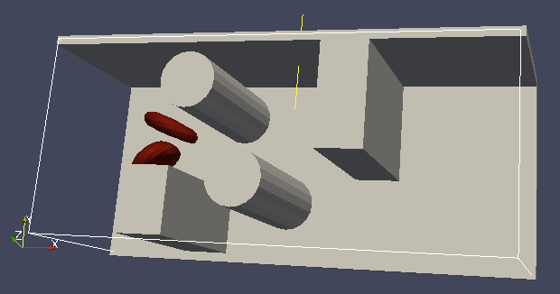
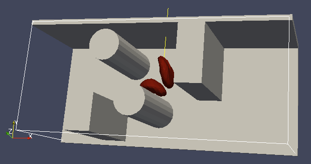
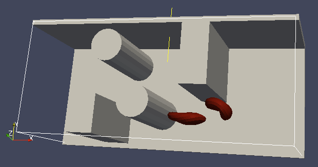
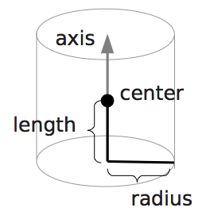
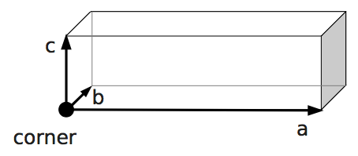
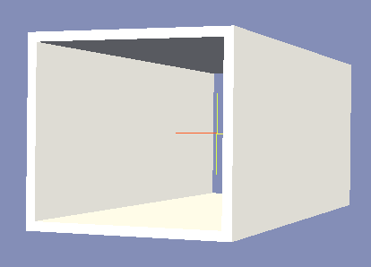
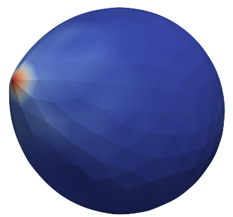
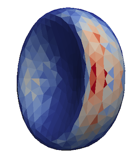
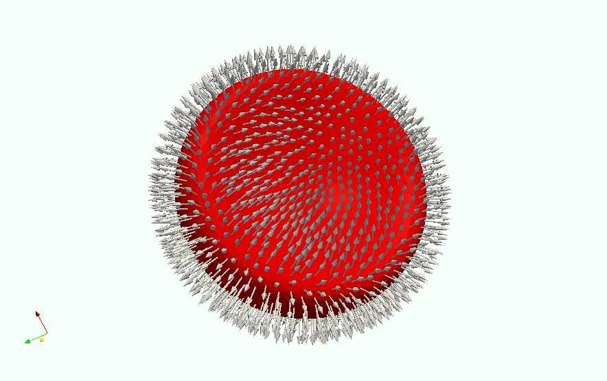

.. _Electrokinetics:

Electrokinetics
---------------

The electrokinetics setup in |es| allows for the description of
electro-hydrodynamic systems on the level of ion density distributions
coupled to a lattice-Boltzmann (LB) fluid. The ion density distributions
may also interact with explicit charged particles, which are
interpolated on the LB grid. In the following paragraph we briefly
explain the electrokinetic model implemented in |es|, before we come to the
description of the interface.

.. _Electrokinetic Equations:

Electrokinetic Equations
~~~~~~~~~~~~~~~~~~~~~~~~

In the electrokinetics code we solve the following system of coupled
continuity, diffusion-advection, Poisson, and Navier-Stokes equations:

.. math::

   \begin{aligned}
   \label{eq:ek-model-continuity} \frac{\partial n_k}{\partial t} & = & -\, \nabla \cdot \vec{j}_k \vphantom{\left(\frac{\partial}{\partial}\right)} ; \\
   \label{eq:ek-model-fluxes} \vec{j}_{k} & = & -D_k \nabla n_k - \nu_k \, q_k n_k\, \nabla \Phi + n_k \vec{v}_{\mathrm{fl}} \vphantom{\left(\frac{\partial}{\partial}\right)} + \sqrt{n_k}\vec{\mathcal{W}}_k; \\
   \label{eq:ek-model-poisson} \Delta \Phi & = & -4 \pi \, {l_\mathrm{B}}\, {k_\mathrm{B}T}\sum_k q_k n_k \vphantom{\left(\frac{\partial}{\partial}\right)}; \\
   \nonumber \left(\frac{\partial \vec{v}_{\mathrm{fl}}}{\partial t} + \vec{v}_{\mathrm{fl}} \cdot \vec{\nabla} \vec{v}_{\mathrm{fl}} \right) \rho_\mathrm{fl} & = & -{k_\mathrm{B}T}\, \nabla \rho_\mathrm{fl} - q_k n_k \nabla \Phi \\
   \label{eq:ek-model-velocity} & & +\, \eta \vec{\Delta} \vec{v}_{\mathrm{fl}} + (\eta / 3 + \eta_{\text{b}}) \nabla (\nabla \cdot \vec{v}_{\mathrm{fl}}) \vphantom{\left(\frac{\partial}{\partial}\right)} ; \\
   \label{eq:ek-model-continuity-fl} \frac{\partial \rho_\mathrm{fl}}{\partial t} & = & -\,\nabla\cdot\left( \rho_\mathrm{fl} \vec{v}_{\mathrm{fl}} \right) \vphantom{\left(\frac{\partial}{\partial}\right)} , \end{aligned}

which define relations between the following observables

:math:`n_k`
    the number density of the particles of species :math:`k`,

:math:`\vec{j}_k`
    the number density flux of the particles of species :math:`k`,

:math:`\Phi`
    the electrostatic potential,

:math:`\rho_{\mathrm{fl}}`
    the mass density of the fluid,

:math:`\vec{v}_{\mathrm{fl}}`
    the advective velocity of the fluid,

and input parameters

:math:`D_k`
    the diffusion constant of species :math:`k`,

:math:`\nu_k`
    the mobility of species :math:`k`,

:math:`\vec{\mathcal{W}}_k`
    the white-noise term for the fluctuations of species :math:`k`,

:math:`q_k`
    the charge of a single particle of species :math:`k`,

:math:`{l_\mathrm{B}}`
    the Bjerrum length,

:math:`{k_\mathrm{B}T}`
    | the thermal energy given by the product of Boltzmann's constant
      :math:`k_\text{B}`
    | and the temperature :math:`T`,

:math:`\eta`
    the dynamic viscosity of the fluid,

:math:`\eta_{\text{b}}`
    the bulk viscosity of the fluid.

The temperature :math:`T`, and diffusion constants :math:`D_k` and
mobilities :math:`\nu_k` of individual species are linked through the
Einstein-Smoluchowski relation :math:`D_k /
\nu_k = {k_\mathrm{B}T}`. This system of equations
combining diffusion-advection, electrostatics, and hydrodynamics is
conventionally referred to as the *Electrokinetic Equations*.

The electrokinetic equations have the following properties:

-  On the coarse time and length scale of the model, the dynamics of the
   particle species can be described in terms of smooth density
   distributions and potentials as opposed to the microscale where
   highly localized densities cause singularities in the potential.

   In most situations, this restricts the application of the model to
   species of monovalent ions, since ions of higher valency typically
   show strong condensation and correlation effects – the localization
   of individual ions in local potential minima and the subsequent
   correlated motion with the charges causing this minima.

-  Only the entropy of an ideal gas and electrostatic interactions are
   accounted for. In particular, there is no excluded volume.

   This restricts the application of the model to monovalent ions and
   moderate charge densities. At higher valencies or densities,
   overcharging and layering effects can occur, which lead to
   non-monotonic charge densities and potentials, that can not be
   covered by a mean-field model such as Poisson--Boltzmann or this one.

   Even in salt free systems containing only counter ions, the
   counter-ion densities close to highly charged objects can be
   overestimated when neglecting excluded volume effects. Decades of the
   application of Poisson--Boltzmann theory to systems of electrolytic
   solutions, however, show that those conditions are fulfilled for
   monovalent salt ions (such as sodium chloride or potassium chloride)
   at experimentally realizable concentrations.

-  Electrodynamic and magnetic effects play no role. Electrolytic
   solutions fulfill those conditions as long as they don't contain
   magnetic particles.

-  The diffusion coefficient is a scalar, which means there can not be
   any cross-diffusion. Additionally, the diffusive behavior has been
   deduced using a formalism relying on the notion of a local
   equilibrium. The resulting diffusion equation, however, is known to
   be valid also far from equilibrium.

-  The temperature is constant throughout the system.

-  The density fluxes instantaneously relax to their local equilibrium
   values. Obviously one can not extract information about processes on
   length and time scales not covered by the model, such as dielectric
   spectra at frequencies, high enough that they correspond to times
   faster than the diffusive time scales of the charged species.

.. _Setup:

Setup
~~~~~

.. _Initialization:

Initialization
^^^^^^^^^^^^^^
::

    import espressomd
    system = espressomd.System(box_l=[10.0, 10.0, 10.0])
    system.time_step = 0.0
    system.cell_system.skin = 0.4
    ek = espressomd.electrokinetics.Electrokinetics(agrid=1.0, lb_density=1.0,
        viscosity=1.0, friction=1.0, T=1.0, prefactor=1.0,
        stencil='linkcentered', advection=True, fluid_coupling='friction')
    system.actors.add(ek)

.. note:: Features ``ELECTROKINETICS`` and ``CUDA`` required

The above is a minimal example how to initialize the LB fluid, and
it is very similar to the lattice-Boltzmann command in set-up. We
therefore refer the reader to Chapter :ref:`Lattice-Boltzmann` for details on the
implementation of LB in |es| and describe only the major differences here.

The first major difference with the LB implementation is that the
electrokinetics set-up is a Graphics Processing Unit (GPU) only
implementation. There is no Central Processing Unit (CPU) version, and
at this time there are no plans to make a CPU version available in the
future. To use the electrokinetics features it is therefore imperative
that your computer contains a CUDA capable GPU which is sufficiently
modern.

To set up a proper LB fluid using this command one has to specify at
least the following options: ``agrid``, ``lb_density``, ``viscosity``, ``friction``, ``T``, and ``prefactor``. The other options can be
used to modify the behavior of the LB fluid. Note that the command does
not allow the user to set the time step parameter as is the case for the
lattice-Boltzmann command, this parameter is instead taken directly from the value set for
:attr:`espressomd.system.System.time_step`. The LB *mass density* is set independently from the
electrokinetic *number densities*, since the LB fluid serves only as a
medium through which hydrodynamic interactions are propagated, as will
be explained further in the next paragraph. If no ``lb_density`` is specified, then our
algorithm assumes ``lb_density= 1.0``. The two 'new' parameters are the temperature ``T`` at
which the diffusive species are simulated and the ``prefactor``
associated with the electrostatic properties of the medium. See the
above description of the electrokinetic equations for an explanation of
the introduction of a temperature, which does not come in directly via a
thermostat that produces thermal fluctuations.

``advection`` can be set to ``True`` or ``False``. It controls whether there should be an
advective contribution to the diffusive species' fluxes. Default is
``True``.

``fluid_coupling`` can be set to ``"friction"`` or ``"estatics"``. This option determines the force
term acting on the fluid. The former specifies the force term to be the
sum of the species fluxes divided by their respective mobilities while
the latter simply uses the electrostatic force density acting on all
species. Note that this switching is only possible for the linkcentered
stencil. For all other stencils, this choice is hardcoded. The default
is ``"friction"``.

``es_coupling`` enables the action of the electrostatic potential due to the
electrokinetics species and charged boundaries on the MD particles. The
forces on the particles are calculated by interpolation from the
electric field which is in turn calculated from the potential via finite
differences. This only includes interactions between the species and
boundaries and MD particles, not between MD particles and MD particles.
To get complete electrostatic interactions a particles Coulomb method
like Ewald or P3M has to be activated too.

The fluctuation of the EK species can be turned on by the flag ``fluctuations``.
This adds a white-noise term to the fluxes. The amplitude of this noise term
can be controlled by ``fluctuation_amplitude``. To circumvent that these fluctuations
lead to negative densities, they are modified by a smoothed Heaviside function,
which decreases the magnitude of the fluctuation for densities close to 0.
By default the fluctuations are turned off.

.. _Diffusive Species:

Diffusive Species
^^^^^^^^^^^^^^^^^
::

    species = electrokinetics.Species(density=density, D=D, valency=valency,
        ext_force_density=ext_force)

:class:`espressomd.electrokinetics.Species` is used to initialize a diffusive species. Here the
options specify: the number density ``density``, the diffusion coefficient ``D``, the
valency of the particles of that species ``valency``, and an optional external
(electric) force which is applied to the diffusive species. As mentioned
before, the LB density is completely decoupled from the electrokinetic
densities. This has the advantage that greater freedom can be achieved
in matching the internal parameters to an experimental system. Moreover,
it is possible to choose parameters for which the LB is more stable. The species can be added to a LB fluid::

    ek.add_species(species)

One can also add the species during the initialization step of the
:class:`espressomd.electrokinetics.Electrokinetics` by defining the list variable ``species``::

    ek = espressomd.electrokinetics.Electrokinetics(species=[species], ...)

The variables ``density``, ``D``, and
``valency`` must be set to properly initialize the diffusive species; the
``ext_force_density`` is optional.

.. _Boundaries:

Boundaries
^^^^^^^^^^
::

    ek_boundary = espressomd.electrokinetics.EKBoundary(charge_density=1.0, shape=my_shape)
    system.ekboundaries.add(ek_boundary)

.. note:: Feature ``EK_BOUNDARIES`` required

The EKBoundary command allows one to set up (internal or external) boundaries for
the electrokinetics algorithm in much the same way as the command is
used for the LB fluid. The major difference with the LB command is given
by the option ``charge_density``, with which a boundary can be endowed with a volume
charge density. To create a surface charge density, a combination of two
oppositely charged boundaries, one inside the other, can be used.
However, care should be taken to maintain the surface charge density when the value of ``agrid``
is changed. Examples for possible shapes are wall, sphere, ellipsoid, cylinder,
rhomboid and hollowcone. We refer to the documentation of the
:class:`espressomd.shapes` module for more possible shapes and information on
the options associated to these shapes. In order to properly set up the
boundaries, the ``charge_density`` and ``shape``
must be specified.

.. _Checkpointing:

Checkpointing
^^^^^^^^^^^^^
::

    ek.save_checkpoint(path)

Checkpointing in the EK works quite similar to checkpointing in the LB, because the density is not saved within the :class:`espressomd.checkpointing` object. However one should keep in mind, that the EK not only saves the density of the species but also saves the population of the LB fluid in a separate file. To load a checkpoint the :class:`espressomd.electrokinetics.Electrokinetics` should have the same name as in the script it was saved, but to use the species one need to extract them from the :class:`espressomd.electrokinetics.Electrokinetics` via ``species``.

::

    checkpoint.load(cpt_path)
    species = ek.get_params()['species']
    ek.load_checkpoint(path)

.. _Output:

Output
~~~~~~

.. _Fields:

Fields
^^^^^^

::

    ek.print_vtk_boundary(path)
    ek.print_vtk_density(path)
    ek.print_vtk_velocity(path)
    ek.print_vtk_potential(path)

A property of the fluid field can be exported into a
file in one go. Currently supported
are: density, velocity, potential and boundary, which give the LB fluid density, the LB fluid velocity,
the electrostatic potential, and the location and type of the
boundaries, respectively. The boundaries can only be printed when the
``EK_BOUNDARIES`` is compiled in. The output is a vtk-file, which is readable by
visualization software such as ParaView [5]_ and Mayavi2 [6]_.

::

    species.print_vtk_flux(path)
    species.print_vtk_density(path)

These commands are similar to the above. They enable the
export of diffusive species properties, namely: ``density`` and ``flux``, which specify the
number density and flux of species ``species``, respectively.

.. _Local Quantities:

Local Quantities
^^^^^^^^^^^^^^^^

::

    ek[0, 0, 0].velocity
    ek[0, 0, 0].potential
    ek[0, 0, 0].pressure

A single node can be addressed using three integer values
which run from 0 to ``dim_x/agrid``, ``dim_y/agrid``, and ``dim_z/agrid``, respectively. The
velocity, electrostatic potential and the pressure of a LB fluid node can be obtained this way.

The local ``density`` and ``flux`` of a species can be obtained in the same fashion:

::

    species[0, 0, 0].density
    species[0, 0, 0].flux

.. [5]
   https://www.paraview.org/
.. [6]
   http://code.enthought.com/projects/mayavi/

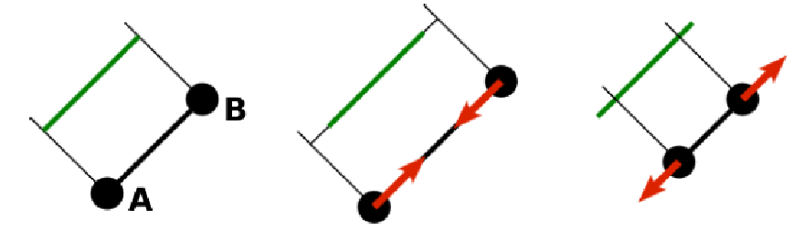
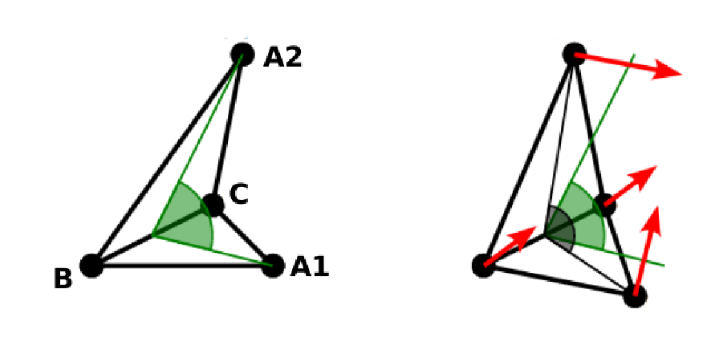
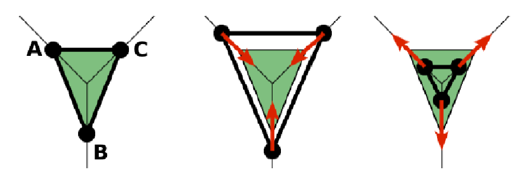
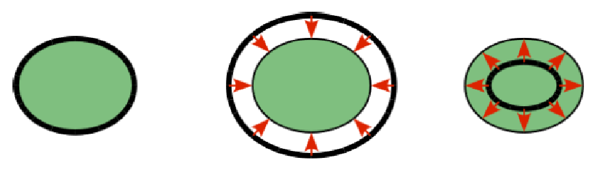

.. _Particle polarizability with thermalized cold Drude oscillators:

Particle polarizability with thermalized cold Drude oscillators
---------------------------------------------------------------

.. note::

    Requires features ``THOLE``, ``P3M``, ``LANGEVIN_PER_PARTICLE``.

.. note::

    Drude is only available for the P3M electrostatics solver and the Langevin thermostat.

**Thermalized cold Drude oscillators** can be used to simulate
polarizable particles.  The basic idea is to add a 'charge-on-a-spring' (Drude
charge) to a particle (Drude core) that mimics an electron cloud which can be
elongated to create a dynamically inducible dipole. The energetic minimum of
the Drude charge can be obtained self-consistently, which requires several
iterations of the system's electrostatics and is usually considered
computational expensive. However, with thermalized cold Drude oscillators, the
distance between Drude charge and core is coupled to a thermostat so that it
fluctuates around the SCF solution. This thermostat is kept at a low
temperature compared to the global temperature to minimize the heat flow into
the system. A second thermostat is applied on the centre of mass of the Drude
charge + core system to maintain the global temperature. The downside of this
approach is that usually a smaller time step has to be used to resolve the high
frequency oscillations of the spring to get a stable system.

In |es|, the basic ingredients to simulate such a system are split into three bonds:

1. A :ref:`Harmonic Bond` to account for the spring.
2. A :ref:`Thermalized distance bond` with a cold thermostat on the Drude-Core distance.
3. A :ref:`Subtract P3M short-range bond` to cancel the electrostatic interaction between Drude and core particles.

The system-wide thermostat has to be applied to the centre of mass and not to
the core particle directly. Therefore, the particles have to be excluded from
global thermostatting.  With ``LANGEVIN_PER_PARTICLE`` enabled, we set the
temperature and friction coefficient of the Drude complex to zero, which allows
to still use a global Langevin thermostat for non-polarizable particles.

As the Drude charge should not alter the *charge* or *mass* of the Drude
complex, both properties have to be subtracted from the core when adding the
Drude particle. In the following convention, we assume that the Drude charge is
**always negative**. It is calculated via the spring constant :math:`k` and
polarizability :math:`\alpha` (in units of inverse volume) with :math:`q_d =
-\sqrt{k \cdot \alpha}`.

The following helper method takes into account all the preceding considerations
and can be used to conveniently add a Drude particle to a given core particle.
As it also adds the first two bonds between Drude and core, these bonds have to
be created beforehand::

    from drude_functions import *
    add_drude_particle_to_core(<system>, <harmonic_bond>, <thermalized_bond>,
        <core particle>, <id drude>, <type drude>, <alpha>, <mass drude>,
        <coulomb_prefactor>, <thole damping>, <verbose>)

The arguments of the helper function are:
    * ``<system>``: The :class:`espressomd.System() <espressomd.system.System>`.
    * ``<harmonic_bond>``: The harmonic bond of the charge-on-a-spring. This is
      added between core and newly generated Drude particle
    * ``<thermalized_bond>``: The thermalized distance bond for the cold and hot
      thermostats.
    * ``<core particle>``: The core particle on which the Drude particle is added.
    * ``<id drude>``: The user-defined id of the Drude particle that is created.
    * ``<type drude>``: The user-defined type of the Drude particle.
      Each Drude particle of each complex should have an
      individual type (e.g. in an ionic system with Anions (type 0) and Cations
      (type 1), two new, individual Drude types have to be assigned).
    * ``<alpha>``: The polarizability volume.
    * ``<coulomb_prefactor>``: The Coulomb prefactor of the system. Used to
      calculate the Drude charge from the polarizability and the spring constant
      of the Drude bond.
    * ``<thole damping>``: (optional) An individual Thole damping parameter for the
      core-Drude pair. Only relevant if Thole damping is used (defaults to 2.6).
    * ``<verbose>``: (bool, optional) Prints out information about the added Drude
      particles (default: False)

What is still missing is the short-range exclusion bond between all Drude-core pairs.
One bond type of this kind is needed per Drude type. The above helper function also
tracks particle types, ids and charges of Drude and core particles, so a simple call of
another helper function::

    drude_helpers.setup_and_add_drude_exclusion_bonds(S)

will use this data to create a :ref:`Subtract P3M short-range bond` per Drude type
and set it up it between all Drude and core particles collected in calls of :meth:`~espressomd.drude_helpers.add_drude_particle_to_core`.

.. _Canceling intramolecular electrostatics:

Canceling intramolecular electrostatics
~~~~~~~~~~~~~~~~~~~~~~~~~~~~~~~~~~~~~~~

Note that for polarizable **molecules** (i.e. connected particles, coarse grained
models etc.) with partial charges on the molecule sites, the Drude charges will
have electrostatic interaction with other cores of the molecule. Often, this
is unwanted, as it might be already part of the force-field (via. partial
charges or parametrization of the covalent bonds). Without any further
measures, the elongation of the Drude particles will be greatly affected be the
close-by partial charges of the molecule. To prevent this, one has to cancel
the interaction of the Drude charge with the partial charges of the cores
within the molecule. This can be done with special bonds that subtracts the P3M
short-range interaction of the charge portion :math:`q_d q_{partial}`. This ensures
that only the *dipolar interaction* inside the molecule remains. It should be
considered that the error of this approximation increases with the share of the
long-range part of the electrostatic interaction. Two helper methods assist
with setting up this exclusion. If used, they have to be called
after all Drude particles are added to the system::

    setup_intramol_exclusion_bonds(<system>, <molecule drude types>,
        <molecule core types>, <molecule core partial charges>, <verbose>)

This function creates the requires number of bonds which are later added to the
particles. It has to be called only once. In a molecule with :math:`N` polarizable
sites, :math:`N \cdot (N-1)` bond types are needed to cover all the combinations.
Parameters are:

    * ``<system>``: The :class:`espressomd.System() <espressomd.system.System>`.
    * ``<molecule drude types>``: List of the Drude types within the molecule.
    * ``<molecule core types>``: List of the core types within the molecule that have partial charges.
    * ``<molecule core partial charges>``: List of the partial charges on the cores.
    * ``<verbose>``: (bool, optional) Prints out information about the created bonds (default: False)

After setting up the bonds, one has to add them to each molecule with the
following method::

    add_intramol_exclusion_bonds(<system>, <drude ids>, <core ids>, <verbose>)

This method has to be called for all molecules and needs the following parameters:

    * ``<system>``: The :class:`espressomd.System() <espressomd.system.System>`.
    * ``<drude ids>``: The ids of the Drude particles within one molecule.
    * ``<core ids>``: The ids of the core particles within one molecule.
    * ``<verbose>``: (bool, optional) Prints out information about the added bonds (default: ``False``)

Internally, this is done with the bond described in  :ref:`Subtract P3M short-range bond`, that
simply adds the p3m shortrange pair-force of scale :math:`- q_d q_{partial}` the to
bonded particles.

.. seealso::

    Often used in conjunction with Drude oscillators is the :ref:`Thole correction`
    to damp dipole-dipole interactions on short distances. It is available in |es|
    as a non-bonded interaction.

.. _Monte Carlo Methods:

Monte Carlo Methods
-------------------

.. note:: The whole Reaction Ensemble module uses Monte Carlo moves which require potential energies. Therefore the Reaction Ensemble requires support for energy calculations for all active interactions in the simulation. Please also note that Monte Carlo methods may create and delete particles from the system. This process can invalidate particle ids, in which case the particles are no longer numbered contiguously. Particle slices returned by ``system.part`` are still iterable, but the indices no longer match the particle ids.

.. _Reaction Ensemble:

Reaction Ensemble
~~~~~~~~~~~~~~~~~

The reaction ensemble :cite:`smith94c,turner2008simulation` allows to simulate
chemical reactions which can be represented by the general equation:

.. math::

   \mathrm{\nu_1 S_1 +\ \dots\  \nu_l S_l\ \rightleftharpoons\ \nu_m S_m +\ \dots\ \nu_z S_z }
       \label{general-eq}

where :math:`\nu_i` is the stoichiometric coefficient of species
:math:`S_i`. By convention, stoichiometric coefficients of the
species on the left-hand side of the reaction (*reactants*) attain
negative values, and those on the right-hand side (*products*) attain
positive values, so that the reaction can be equivalently written as

.. math::

   \mathrm{\sum_i \nu_i S_i = 0} \,.
       \label{general-eq-sum}

The equilibrium constant of the reaction is then given as

.. math::

   K = \exp(-\Delta_{\mathrm{r}}G^{\ominus} / k_B T)
       \quad\text{with}\quad
       \Delta_{\mathrm{r}}G^{\ominus} = \sum_i \nu_i \mu_i^{\ominus}\,.
       \label{Keq}

Here :math:`k_B` is the Boltzmann constant, :math:`T` is temperature,
:math:`\Delta_{\mathrm{r}}G^{\ominus}` standard Gibbs free energy change
of the reaction, and :math:`\mu_i^{\ominus}` the standard chemical
potential (per particle) of species :math:`i`. Note that thermodynamic equilibrium is
independent of the direction in which we write the reaction. If it is
written with left and right-hand side swapped,
both :math:`\Delta_{\mathrm{r}}G^{\ominus}` and the stoichiometric
coefficients attain opposite signs, and the equilibrium constant attains the inverse value.
Further, note that the equilibrium constant :math:`K` is the
dimensionless *thermodynamic, concentration-based* equilibrium constant,
defined as

.. math::

   K(c^{\ominus}) = (c^{\ominus})^{-\bar\nu} \prod_i (c_i)^{\nu_i}

where :math:`\bar\nu=\sum_i \nu_i`, and :math:`c^{\ominus}` is the reference concentration,
at which the standard chemical potential :math:`\Delta_{\mathrm{r}}G^{\ominus}` was determined.
In practice, this constant is often used with the dimension of :math:`(c^{\ominus})^{\bar\nu}`

.. math::

   K_c(c^{\ominus}) = K(c^{\ominus})\times (c^{\ominus})^{\bar\nu}

A simulation in
the reaction ensemble consists of two types of moves: the *reaction move*
and the *configuration move*. The configuration move changes the configuration
of the system. It is not performed by the Reaction Ensemble module, and can be
performed by a suitable molecular dynamics or a Monte Carlo scheme. The
``reactant_ensemble`` command takes care only of the reaction moves.
In the *forward* reaction, the appropriate number of reactants (given by
:math:`\nu_i`) is removed from the system, and the concomitant number of
products is inserted into the system. In the *backward* reaction,
reactants and products exchange their roles. The acceptance probability
:math:`P^{\xi}` for move from state :math:`o` to :math:`n` reaction
ensemble is given by the criterion :cite:`smith94c`

.. math::

   P^{\xi} = \text{min}\biggl(1,V^{\bar\nu\xi}\Gamma^{\xi}e^{-\beta\Delta E}\prod_{i=1}\frac{N_i^0!}{(N_i^0+\nu_{i}\xi)!}
       \label{eq:Pacc}
       \biggr),

where :math:`\Delta E=E_\mathrm{new}-E_\mathrm{old}` is the change in potential energy,
:math:`V` is the simulation box volume,
and :math:`\beta=1/k_\mathrm{B}T`.
The extent of reaction, :math:`\xi=1` for the forward, and
:math:`\xi=-1` for the backward direction.
The parameter :math:`\Gamma` proportional to the reaction constant. It is defined as

.. math::

   \Gamma = \prod_i \Bigl(\frac{\left<N_i\right>}{V} \Bigr)^{\bar\nu} = V^{-\bar\nu} \prod_i \left<N_i\right>^{\nu_i} = K_c(c^{\ominus}=1/\sigma^3)

where :math:`\left<N_i\right>/V` is the average number density of particles of type :math:`i`.
Note that the dimension of :math:`\Gamma` is :math:`V^{\bar\nu}`, therefore its
units must be consistent with the units in which |es| measures the box volume,
i.e. :math:`\sigma^3`.

It is often convenient, and in some cases even necessary, that some particles
representing reactants are not removed from or placed at randomly in the system
but their identity is changed to that of the products, or vice versa in the
backward direction.  A typical example is the ionization reaction of weak
polyelectrolytes, where the ionizable groups on the polymer have to remain on
the polymer chain after the reaction.  The replacement rule is that the identity of a given reactant type is
changed to the corresponding product type as long as the corresponding
coefficients allow for it.  Corresponding means having the same position (index) in
the python lists of reactants and products which are used to set up the
reaction.

Multiple reactions can be added to the same instance of the reaction ensemble.

An example script can be found here:

* `Reaction ensemble / constant pH ensemble <https://github.com/espressomd/espresso/blob/python/samples/reaction_ensemble.py>`_

For a description of the available methods, see :class:`espressomd.reaction_ensemble.ReactionEnsemble`.

.. _Converting tabulated reaction constants to internal units in ESPResSo:

Converting tabulated reaction constants to internal units in |es|
^^^^^^^^^^^^^^^^^^^^^^^^^^^^^^^^^^^^^^^^^^^^^^^^^^^^^^^^^^^^^^^^^

The implementation in |es| requires that the dimension of :math:`\Gamma`
is consistent with the internal unit of volume, :math:`\sigma^3`. The tabulated
values of equilibrium constants for reactions in solution, :math:`K_c`, typically use
:math:`c^{\ominus} = 1\,\mathrm{moldm^{-3}}` as the reference concentration,
and have the dimension of :math:`(c^{\ominus})^{\bar\nu}`. To be used with |es|, the
value of :math:`K_c` has to be converted as

.. math::

   \Gamma = K_c(c^{\ominus} = 1/\sigma^3) = K_c(c^{\ominus} = 1\,\mathrm{moldm^{-3}})
   \Bigl( N_{\mathrm{A}}\bigl(\frac{\sigma}{\mathrm{dm}}\bigr)^3\Bigr)^{\bar\nu}

where :math:`N_{\mathrm{A}}` is the Avogadro number.  For gas-phase reactions,
the pressure-based reaction constant, :math:`K_p` is often used, which can
be converted to :math:`K_c` as

.. math::

   K_p(p^{\ominus}=1\,\mathrm{atm}) = K_c(c^{\ominus} = 1\,\mathrm{moldm^{-3}}) \biggl(\frac{c^{\ominus}RT}{p^{\ominus}}\biggr)^{\bar\nu},

where :math:`p^{\ominus}=1\,\mathrm{atm}` is the standard pressure.
Consider using the python module pint for unit conversion.

.. _Wang-Landau Reaction Ensemble:

Wang-Landau Reaction Ensemble
~~~~~~~~~~~~~~~~~~~~~~~~~~~~~

Combination of the Reaction Ensemble with the Wang-Landau algorithm
:cite:`wang01a`. Allows for enhanced sampling of the reacting system
and for the determination of the density of states with respect
to the reaction coordinate or with respect to some other collective
variable :cite:`landsgesell17a`. Here the 1/t Wang-Landau
algorithm :cite:`belardinelli07a` is implemented since it
does not suffer from systematic errors.

Multiple reactions and multiple collective variables can be set.

An example script can be found here:

* `Wang-Landau reaction ensemble <https://github.com/espressomd/espresso/blob/python/samples/wang_landau_reaction_ensemble.py>`__

For a description of the available methods, see :class:`espressomd.reaction_ensemble.ReactionEnsemble`.

.. _Grand canonical ensemble simulation using the Reaction Ensemble:

Grand canonical ensemble simulation
~~~~~~~~~~~~~~~~~~~~~~~~~~~~~~~~~~~

As a special case, all stoichiometric coefficients on one side of the chemical
reaction can be set to zero. Such a reaction creates particles *ex nihilo*, and
is equivalent to exchanging particles with a reservoir. This type of simulation
in the reaction ensemble is equivalent to the grand canonical simulation.
Formally, this can be expressed by the reaction

.. math::

    \mathrm{\emptyset \rightleftharpoons\ \nu_A A  }  \,,

where, if :math:`\nu_A=1`, the reaction constant :math:`\Gamma` defines the chemical potential of species A.
However, if :math:`\nu_A\neq 1`, the statistics of the reaction ensemble becomes
equivalent to the grand canonical only in the limit of large average number of species A in the box.
If the reaction contains more than one product, then the reaction constant
:math:`\Gamma` defines only the sum of their chemical potentials but not the
chemical potential of each product alone.

Since the Reaction Ensemble acceptance transition probability can be
derived from the grand canonical acceptance transition probability, we
can use the reaction ensemble to implement grand canonical simulation
moves. This is done by adding reactions that only have reactants (for the
deletion of particles) or only have products (for the creation of
particles). There exists a one-to-one mapping of the expressions in the
grand canonical transition probabilities and the expressions in the
reaction ensemble transition probabilities.

.. _Constant pH simulation using the Reaction Ensemble:

Constant pH simulation
~~~~~~~~~~~~~~~~~~~~~~

As before in the Reaction Ensemble one can define multiple reactions (e.g. for an ampholytic system which contains an acid and a base) in one :class:`~espressomd.reaction_ensemble.ConstantpHEnsemble` instance:

.. code-block:: python

    cpH=reaction_ensemble.ConstantpHEnsemble(
        temperature=1, exclusion_radius=1, seed=77)
    cpH.add_reaction(gamma=K_diss, reactant_types=[0], reactant_coefficients=[1],
                    product_types=[1, 2], product_coefficients=[1, 1],
                    default_charges={0: 0, 1: -1, 2: +1})
    cpH.add_reaction(gamma=1/(10**-14/K_diss), reactant_types=[3], reactant_coefficients=[1], product_types=[0, 2], product_coefficients=[1, 1], default_charges={0:0, 2:1, 3:1} )

An example script can be found here:

* `Reaction ensemble / constant pH ensemble <https://github.com/espressomd/espresso/blob/python/samples/reaction_ensemble.py>`_

In the constant pH method due to Reed and Reed
:cite:`reed92a` it is possible to set the chemical potential
of :math:`H^{+}` ions, assuming that the simulated system is coupled to an
infinite reservoir. This value is the used to simulate dissociation
equilibrium of acids and bases. Under certain conditions, the constant
pH method can yield equivalent results as the reaction ensemble :cite:`landsgesell17b`. However, it
treats the chemical potential of :math:`H^{+}` ions and their actual
number in the simulation box as independent variables, which can lead to
serious artifacts.
The constant pH method can be used within the reaction ensemble module by
initializing the reactions with the standard commands of the reaction ensemble.

The dissociation constant, which is the input of the constant pH method, is the equilibrium
constant :math:`K_c` for the following reaction:

.. math::

   \mathrm{HA \rightleftharpoons\ H^+ + A^- } \,,

For a description of the available methods, see :class:`espressomd.reaction_ensemble.ConstantpHEnsemble`.

Widom Insertion (for homogeneous systems)
~~~~~~~~~~~~~~~~~~~~~~~~~~~~~~~~~~~~~~~~~

The Widom insertion method measures the change in excess free energy, i.e. the excess chemical potential due to the insertion of a new particle, or a group of particles:

.. math::

   \mu^\mathrm{ex}_B & :=\Delta F^\mathrm{ex} =F^\mathrm{ex}(N_B+1,V,T)-F^\mathrm{ex}(N_B,V,T)\\
   &=-kT \ln \left(\frac{1}{V} \int_V d^3r_{N_B+1} \langle \exp(-\beta \Delta E_\mathrm{pot}) \rangle_{N_B} \right)

For this one has to provide the following reaction to the Widom method:

.. code-block:: python

    type_B=1
    widom = reaction_ensemble.WidomInsertion(
        temperature=temperature, seed=77)
    widom.add_reaction(reactant_types=[],
    reactant_coefficients=[], product_types=[type_B],
    product_coefficients=[1], default_charges={1: 0})
    widom.measure_excess_chemical_potential(0)

The call of ``add_reaction`` define the insertion :math:`\mathrm{\emptyset \to type_B}` (which is the 0th defined reaction).
Multiple reactions for the insertions of different types can be added to the same ``WidomInsertion`` instance.
Measuring the excess chemical potential using the insertion method is done via calling ``widom.measure_excess_chemical_potential(0)``.
If another particle insertion is defined, then the excess chemical potential for this insertion can be measured by calling ``widom.measure_excess_chemical_potential(1)``.
Be aware that the implemented method only works for the canonical ensemble. If the numbers of particles fluctuate (i.e. in a semi grand canonical simulation) one has to adapt the formulas from which the excess chemical potential is calculated! This is not implemented. Also in a isobaric-isothermal simulation (NPT) the corresponding formulas for the excess chemical potentials need to be adapted. This is not implemented.

The implementation can also deal with the simultaneous insertion of multiple particles and can therefore measure the change of excess free energy of multiple particles like e.g.:

.. math::

   \mu^\mathrm{ex, pair}&:=\Delta F^\mathrm{ex, pair}:= F^\mathrm{ex}(N_1+1, N_2+1,V,T)-F^\mathrm{ex}(N_1, N_2 ,V,T)\\
   &=-kT \ln \left(\frac{1}{V^2} \int_V \int_V d^3r_{N_1+1} d^3 r_{N_2+1} \langle \exp(-\beta \Delta E_\mathrm{pot}) \rangle_{N_1, N_2} \right)

Note that the measurement involves three averages: the canonical ensemble average :math:`\langle \cdot \rangle_{N_1, N_2}` and the two averages over the position of particles :math:`N_1+1` and :math:`N_2+1`.
Since the averages over the position of the inserted particles are obtained via brute force sampling of the insertion positions it can be beneficial to have multiple insertion tries on the same configuration of the other particles.

One can measure the change in excess free energy due to the simultaneous insertions of particles of type 1 and 2 and the simultaneous removal of a particle of type 3:

.. math::

   \mu^\mathrm{ex}:=\Delta F^\mathrm{ex, }:= F^\mathrm{ex}(N_1+1, N_2+1, N_3-1,V,T)-F^\mathrm{ex}(N_1, N_2, N_3 ,V,T)

For this one has to provide the following reaction to the Widom method:

.. code-block:: python

    widom.add_reaction(reactant_types=[type_3],
    reactant_coefficients=[1], product_types=[type_1, type_2],
    product_coefficients=[1,1], default_charges={1: 0})
    widom.measure_excess_chemical_potential(0)

Be aware that in the current implementation, for MC moves which add and remove particles, the insertion of the new particle always takes place at the position where the last particle was removed. Be sure that this is the behaviour you want to have. Otherwise implement a new function ``WidomInsertion::make_reaction_attempt`` in the core.

An example script which demonstrates the usage for measuring the pair excess chemical potential for inserting an ion pair into a salt solution can be found here:

* `Widom Insertion <https://github.com/espressomd/espresso/blob/python/samples/widom_insertion.py>`_

For a description of the available methods, see :class:`espressomd.reaction_ensemble.WidomInsertion`.

