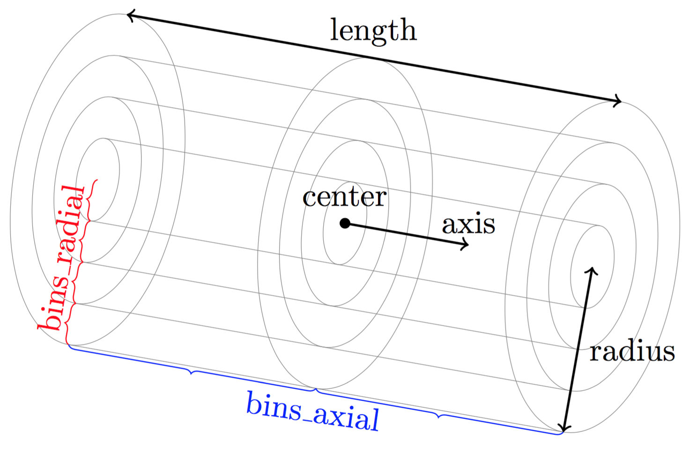
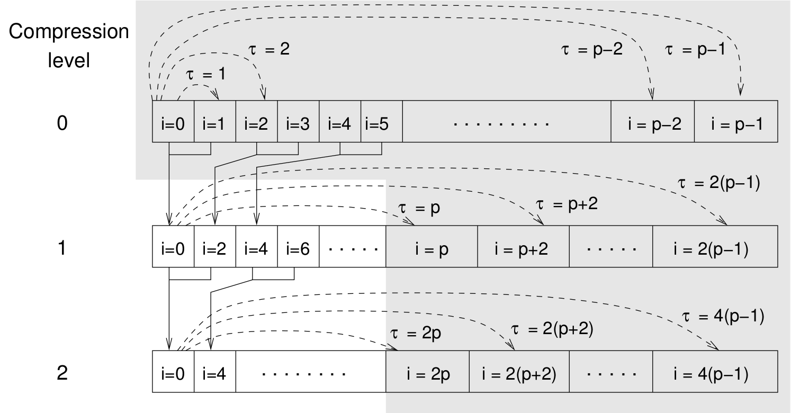

.. _Analysis:

Analysis
========

|es| provides two concepts of system analysis:

- :ref:`Direct analysis routines`: The :mod:`espressomd.analyze` module provides 
  online-calculation of specialized local and global observables with 
  calculation and data accumulation performed in the core.
- :ref:`Observables and correlators`: This provides a more flexible concept of 
  in-core analysis, where a certain observable (:ref:`Available observables`), 
  a rule for data accumulation (ref Accumulators) and/or correlation (:ref:`Correlations`) can be defined.

.. _Direct analysis routines:

Direct analysis routines
------------------------

The direct analysis commands can be classified into two types: 

- Instantaneous analysis routines, that only take into account the current configuration of the system:

    - :ref:`Energies`
    - :ref:`Pressure`
    - :ref:`Momentum of the System`
    - :ref:`Minimal distances between particles`
    - :ref:`Particles in the neighborhood`
    - :ref:`Particle distribution`
    - :ref:`Cylindrical Average`
    - :ref:`Radial distribution function` with ``rdf_type='rdf'``
    - :ref:`Structure factor`
    - :ref:`Center of mass`
    - :ref:`Moment of inertia matrix`
    - :ref:`Gyration tensor`
    - :ref:`Stress Tensor`
    - :ref:`Local Stress Tensor`

- Analysis on stored configurations, added by :meth:`espressomd.analyze.append()`:
    - :ref:`Radial distribution function` with ``rdf_type='<rdf>'``
    - :ref:`Chains`

.. _Energies:

Energies
~~~~~~~~
:meth:`espressomd.analyze.Analysis.energy`

Returns the energies of the system.
The the different energetic contributions to the total energy can also be obtained (kinetic, bonded,non-bonded, coublomb))

For example, ::

>>> energy = system.analysis.energy()
>>> print(energy["total"])
>>> print(energy["kinetic"])
>>> print(energy["bonded"])
>>> print(energy["non_bonded"])

.. _Momentum of the system:

Momentum of the System
~~~~~~~~~~~~~~~~~~~~~~
:meth:`espressomd.analyze.Analysis.analyze_linear_momentum`

This command returns the total linear momentum of the particles and the
lattice-Boltzmann (LB) fluid, if one exists. Giving the optional
parameters either causes the command to ignore the contribution of LB or
of the particles.

.. _Minimal distances between particles:

Minimal distances between particles
~~~~~~~~~~~~~~~~~~~~~~~~~~~~~~~~~~~

:meth:`espressomd.analyze.Analysis.min_dist`
Returns the minimal distance between all particles in the system.

When used with type-lists as arguments, then the minimal distance between particles of only those types is determined.

:meth:`espressomd.analyze.Analysis.dist_to()`

Returns the minimal distance of all particles to either a particle (when used with an argument `id`) 
or a position coordinate when used with a vector `pos`.

For example, ::

    >>> import espressomd
    >>> system = espressomd.System()
    >>> system.box_l = [100, 100, 100]
    >>> for i in range(10):
    >>>     system.part.add(id=i, pos=[1.0, 1.0, i**2], type=0)
    >>> system.analysis.dist_to(id=4)
    7.0
    >>> system.analysis.dist_to(pos=[0,0,0])
    1.4142135623730951
    >>> system.analysis.mindist()
    1.0
    

.. _Particles in the neighborhood:

Particles in the neighborhood
~~~~~~~~~~~~~~~~~~~~~~~~~~~~~~

:meth:`espressomd.analyze.Analysis.nbhood`
 
Returns a list of the particle ids of that fall within a given radius of a target position.
For example, ::

    idlist = system.analysis.nbhood(pos = system.box_l*0.5, r_catch=5.0)

.. _Particle distribution:

Particle distribution
~~~~~~~~~~~~~~~~~~~~~
:meth:`espressomd.analyze.Analysis.distribution`

Returns the distance distribution of particles
(probability of finding a particle of a certain type at a specified distance around
a particle of another specified type, disregarding the fact that a spherical shell of a
larger radius covers a larger volume). 
The distance is defined as the *minimal* distance between a particle of one group to any of the other
group.

Two arrays are returned corresponding to the normalized distribution and the bins midpoints, for example ::

    >>> system = espressomd.System()
    >>> box_l=10.
    >>> system.box_l = [box_l, box_l, box_l]
    >>> for i in range(5):
    >>>     system.part.add(id=i, pos=i*system.box_l, type=0)
    >>> bins, count=system.analysis.distribution(type_list_a=[0], type_list_b=[0], r_min=0.0, r_max = 10.0, r_bins=10)
    >>>
    >>> print(bins)
    [ 0.5  1.5  2.5  3.5  4.5  5.5  6.5  7.5  8.5  9.5]
    >>> print(count)
    [ 1.  0.  0.  0.  0.  0.  0.  0.  0.  0.]

..
    .. _Radial density map:

    Radial density map
    ~~~~~~~~~~~~~~~~~~
    .. todo:: This feature is not implemented

    analyze radial\_density\_map

    Returns the radial density of particles around a given axis. Parameters
    are:

    -  histogram bins in x direction.

    -  histogram bins in y direction.

    -  range for analysis in x direction.

    -  range for analysis in y direction.

    -  rotate around given axis. (x, y, or z)

    -  rotate around given point.

    -  only analyze beads of given types.

    -  histogram bins in angle theta.

    This command does not do what you might expect. Here is an overview of
    the currently identified properties.

    #. is the number of bins along the axis of rotation.

    #. is the number of bins in the radial direction.

    #. The center point () of the cylinder is located in the lower cap,
       i.e., is the height of the cylinder with respect to this center
       point.

    #. The bins are distributed along starting from 0 ().

    #. The seem to average with respect to the center of mass of the
       particles in the individual bins rather than with respect to the
       central axis, which one would think is natural.

.. _Cylindrical average:

Cylindrical Average
~~~~~~~~~~~~~~~~~~~

:meth:`espressomd.analyze.Analysis.cylindrical_average`

Calculates the particle distribution using cylindrical binning.

The volume considered is inside a cylinder defined by the parameters `center`, `axis`, `length` and  `radius`.

The geometrical details of the cylindrical binning is defined using ` bins_axial` and `bins_radial` which are the number bins in the axial and radial directions (respectively).
See figure :ref:`cylindrical_average` for a visual representation of the binning geometry.

.. _cylindrical_average:

   Geometry for the cylindrical binning

The command returns a list of lists. The outer list contains all data
combined whereas each inner list contains one line. Each lines stores a
different combination of the radial and axial index. The output might
look something like this

::

    [ [ 0 0 0.05 -0.25 0.0314159 0 0 0 0 0 0 ]
      [ 0 1 0.05 0.25 0.0314159 31.831 1.41421 1 0 0 0 ]
      ... ]

In this case two different particle types were present.
The columns of the respective lines are coded like this

=============    ============  ===========  ==========  =========  =======  ========   ========  =======  =========  =======
index_radial     index_axial   pos_radial   pos_axial   binvolume  density  v_radial   v_axial   density  v_radial   v_axial 
=============    ============  ===========  ==========  =========  =======  ========   ========  =======  =========  =======
0                0             0.05         -0.25       0.0314159  0        0          0         0        0          0      
0                1             0.05         0.25        0.0314159  31.831   1.41421    1         0        0          0      
=============    ============  ===========  ==========  =========  =======  ========   ========  =======  =========  =======

As one can see the columns `density`, `v_radial` and `v_axial` appear twice.
The order of appearance corresponds to the order of the types in the argument `types`.
For example if was set to `types=[0, 1]` then the first triple is associated to type 0 and
the second triple to type 1.

..
	.. _Vkappa:

	Vkappa
	~~~~~~
	:meth:`espressomd.analyze.Analysis.v_kappa`

	.. todo:: Implementation appears to be incomplete

	Calculates the compressibility :math:`V \times \kappa_T` through the
	Volume fluctuations
	:math:`V \times \kappa_T = \beta \left(\langle V^2\rangle - \langle V \rangle^2\right)`
	:cite:`kolb99a`. Given no arguments this function calculates
	and returns the current value of the running average for the volume
	fluctuations.The `mode=reset` argument clears the currently stored values. With `mode=read` the
	cumulative mean volume, cumulative mean squared volume and how many
	samples were used can be retrieved. Likewise the option `mode=set` enables you to
	set those.

.. _Radial distribution function:

Radial distribution function
~~~~~~~~~~~~~~~~~~~~~~~~~~~~
:meth:`espressomd.analyze.Analysis.rdf`

Calculates a radial distribution function for given particle type and binning.
The `rdf_type` defines if the analysis is performed on the current configuration (`rdf_type='rdf'`)
or on averaged configurations stored with `analyze.append()` (`rdf_type='<rdf>'`).

For example, ::

	rdf_bins = 100
	r_min  = 0.0
	r_max  = system.box_l[0]/2.0
	r, rdf_01 = S.analysis.rdf(rdf_type='<rdf>', type_list_a=[0], type_list_b=[1], r_min=r_min, r_max=r_max, r_bins=rdf_bins)
	rdf_fp = open("rdf.dat", 'w')
	for i in range(rdf_bins):
		rdf_fp.write("%1.5e %1.5e %1.5e %1.5e\n" % (r[i], rdf_01[i]))
	rdf_fp.close()

.. _Structure factor:

Structure factor
~~~~~~~~~~~~~~~~
:meth:`espressomd.analyze.Analysis.structure_factor`

Calculate the structure factor for given types.

Returns the spherically averaged structure factor :math:`S(q)` of
particles specified in . :math:`S(q)` is calculated for all possible
wave vectors, :math:`\frac{2\pi}{L} <= q <= \frac{2\pi}{L}` `order`.

..
    .. _Van-Hove autocorrelation function:

    Van-Hove autocorrelation function :math:`G(r,t)`
    ~~~~~~~~~~~~~~~~~~~~~~~~~~~~~~~~~~~~~~~~~~~~~~~~
    .. todo:: This feature is not implemented

    analyze vanhove

    Returns the van Hove auto correlation function :math:`G(r,t)` and the
    mean square displacement :math:`msd(t)` for particles of type for the
    configurations stored in the array configs. This tool assumes that the
    configurations stored with (see section ) are stored at equidistant time
    intervals. :math:`G(r,t)` is calculated for each multiple of this time
    intervals. For each time t the distribution of particle displacements is
    calculated according to the specification given by , and . Optional
    argument defines the maximum value of :math:`t` for which :math:`G(r,t)`
    is calculated. If it is omitted or set to zero, maximum possible value
    is used. If the particles perform a random walk (a normal diffusion
    process) :math:`G(r,t)/r^2` is a Gaussian distribution for all times.
    Deviations of this behavior hint on another diffusion process or on the
    fact that your system has not reached the diffusive regime. In this case
    it is also very questionable to calculate a diffusion constant from the
    mean square displacement via the Stokes-Einstein relation.

    The output corresponds to the blockfile format (see section ):

    { msd { …} } { vanhove { { …} { …} } }

    The :math:`G(r,t)` are normalized such that the integral over space
    always yields :math:`1`.

.. _Center of mass:

Center of mass
~~~~~~~~~~~~~~
:meth:`espressomd.analyze.Analysis.center_of_mass`

Returns the center of mass of particles of the given type given by `part_type`.

.. _Moment of inertia matrix:

Moment of inertia matrix
~~~~~~~~~~~~~~~~~~~~~~~~
:meth:`espressomd.analyze.Analysis.moment_of_inertia_matrix`

Returns the 3x3 moment of inertia matrix for particles of a given type.

.. _Gyration tensor:

Gyration tensor
~~~~~~~~~~~~~~~
:meth:`espressomd.analyze.Analysis.gyration_tensor`

Analyze the gyration tensor of particles of a given type, or of all particles in the system if no type is given. Returns a dictionary containing the squared radius of gyration, three shape descriptors (asphericity, acylindricity, and relative shape anisotropy), eigenvalues of the gyration tensor and their corresponding eigenvectors. The eigenvalues are sorted in descending order.

..
    .. _Aggregation:

    Aggregation
    ~~~~~~~~~~~
    .. todo:: This feature is not implemented

    analyze aggregation

    Returns the aggregate size distribution for the molecules in the
    molecule id range to . If any monomers in two different molecules are
    closer than they are considered to be in the same aggregate. One can use
    the optional parameter to specify a minimum number of contacts such that
    only molecules having at least contacts will be considered to be in the
    same aggregate. The second optional parameter enables one to consider
    aggregation state of only oppositely charged particles.

    .. _Finding holes:

    Finding holes
    ~~~~~~~~~~~~~
    .. todo:: This feature is not implemented

    analyze holes

    Function for the calculation of the unoccupied volume (often also called
    free volume) in a system. Details can be found in
    :cite:`schmitz00a`. It identifies free space in the
    simulation box via a mesh based cluster algorithm. Free space is defined
    via a probe particle and its interactions with other particles which
    have to be defined through LJ interactions with the other existing
    particle types via the inter command before calling this routine. A
    point of the mesh is counted as free space if the distance of the point
    is larger than LJ\_cut+LJ\_offset to any particle as defined by the LJ
    interaction parameters between the probe particle type and other
    particle types.How to use this function: Define interactions between all
    (or the ones you are interested in) particle types in your system and a
    fictitious particle type. Practically one uses the van der Waals radius
    of the particles plus the size of the probe you want to use as the
    Lennard Jones cutoff. The mesh spacing is the box length divided by the
    .

    { { } { } { } }

    A hole is defined as a continuous cluster of mesh elements that belong
    to the unoccupied volume. Since the function is quite rudimentary it
    gives back the whole information suitable for further processing on the
    script level. and are given in number of mesh points, which means you
    have to calculate the actual size via the corresponding volume or
    surface elements yourself. The complete information is given in the
    element\_lists for each hole. The element numbers give the position of a
    mesh point in the linear representation of the 3D grid (coordinates are
    in the order x, y, z). Attention: the algorithm assumes a cubic box.
    Surface results have not been tested. .

	.. _Temperature of the lb fluid:

	Temperature of the LB fluid
	~~~~~~~~~~~~~~~~~~~~~~~~~~~
	.. todo:: This feature is not implemented

	This command returns the temperature of the lattice-Boltzmann (LB)
	fluid, see Chapter [sec:lb], by averaging over the fluid nodes. In case
	or are compiled in and boundaries are defined, only the available fluid
	volume is taken into account.

.. _Pressure:

Pressure
~~~~~~~~

:meth:`espressomd.analyze.Analysis.pressure`

Computes the instantaneous virial pressure for an isotropic and homogeneous system. It
returns all the contributions to the total pressure as well as the total pressure (see :meth:`espressomd.analyze.Analysis.pressure`).

The instantaneous pressure is calculated (if there are no electrostatic interactions)
by the volume averaged, direction averaged instantaneous virial pressure

.. math::
     p = \frac{2E_{kinetic}}{Vf} + \frac{\sum_{j>i} {F_{ij}r_{ij}}}{3V}
     :label: eqptens

where :math:`f=3` is the number of translational degrees of freedom of
each particle, :math:`V` is the volume of the system,
:math:`E_{kinetic}` is the kinetic energy, :math:`F_{ij}` the force
between particles i and j, and :math:`r_{ij}` is the distance between
them. The kinetic energy divided by the degrees of freedom is

.. math:: \frac{2E_{kinetic}}{f} = \frac{1}{3}\sum_{i} {m_{i}v_{i}^{2}}.

Note that Equation :eq:`eqptens` can only be applied to pair potentials and
central forces. Description of how contributions from other interactions
are calculated is beyond the scope of this manual. Three body potentials
are implemented following the procedure in
Ref. :cite:`thompson09a`. A different formula is used to
calculate contribution from electrostatic interactions. For
electrostatic interactions in P3M, the :math:`k`-space contribution is implemented according to :cite:`essmann1995smooth`. 
The implementation of the Coulomb P3M pressure is tested against LAMMPS. 

Four-body dihedral potentials are not included. Except of 
VIRTUAL\_SITES\_RELATIVE constraints all other
constraints of any kind are not currently accounted for in the pressure
calculations. The pressure is no longer correct, e.g., when particles
are confined to a plane.

Note: The different contributions which are returned are the summands that arise from force splitting :math:`\vec{F}_{i,j}={\vec{F}_{i,j}}_\text{bonded}+{\vec{F}_{i,j}}_\text{nonbonded}+...` in the virial pressure formula. Later when the user calculates the ensemble average via e.g. :math:`\langle p \rangle \approx 1/N \sum_{i=1}^N p_i` however the ensemble average with all interactions present is performed. That means the contributions are not easy to interpret! Those are the contributions to the stress/pressure in a system where all interactions are present and therefore in a coupled system.

.. _Stress Tensor:

Stress Tensor
~~~~~~~~~~~~~
:meth:`espressomd.analyze.Analysis.stress_tensor`

Computes the volume averaged instantaneous stress tensor of the system with options which are
described by in :meth: espressomd.System.analysis.stress_tensor. It is called a stress tensor but the sign convention follows that of a pressure tensor.
In general do only use it for (on average) homogeneous systems. For inhomogeneous systems you need to use the local stress tensor.

The instantaneous virial stress tensor is calculated by

.. math:: p_{(k,l)} = \frac{\sum_{i} {m_{i}v_{i}^{(k)}v_{i}^{(l)}}}{V} + \frac{\sum_{j>i}{F_{ij}^{(k)}r_{ij}^{(l)}}}{V}

where the notation is the same as for the pressure. The superscripts :math:`k`
and :math:`l` correspond to the components in the tensors and vectors.

If electrostatic interactions are present then also the coulombic parts of the stress tensor need to be calculated. If P3M is present, then the instantaneous stress tensor is added to the above equation in accordance with :cite:`essmann1995smooth` :

.. math :: p^\text{Coulomb, P3M}_{(k,l)} =p^\text{Coulomb, P3M, dir}_{(k,l)} + p^\text{Coulomb, P3M, rec}_{(k,l)},

where the first summand is the short ranged part and the second summand is the long ranged part.

The short ranged part is given by:

.. math :: p^\text{Coulomb, P3M, dir}_{(k,l)}= \frac{1}{4\pi \epsilon_0 \epsilon_r} \frac{1}{2V} \sum_{\vec{n}}^* \sum_{i,j=1}^N q_i q_j \left( \frac{ \mathrm{erfc}(\beta |\vec{r}_j-\vec{r}_i+\vec{n}|)}{|\vec{r}_j-\vec{r}_i+\vec{n}|^3} +\frac{2\beta \pi^{-1/2} \exp(-(\beta |\vec{r}_j-\vec{r}_i+\vec{n}|)^2)}{|\vec{r}_j-\vec{r}_i+\vec{n}|^2} \right) (\vec{r}_j-\vec{r}_i+\vec{n})_k (\vec{r}_j-\vec{r}_i+\vec{n})_l,

where :math:`\beta` is the P3M splitting parameter, :math:`\vec{n}` identifies the periodic images, the asterix denotes that terms with :math:`\vec{n}=\vec{0}` and i=j are omitted.
The long ranged (kspace) part is given by:

.. math :: p^\text{Coulomb, P3M, rec}_{(k,l)}= \frac{1}{4\pi \epsilon_0 \epsilon_r} \frac{1}{2 \pi V^2} \sum_{\vec{k} \neq \vec{0}} \frac{\exp(-\pi^2 \vec{k}^2/\beta^2)}{\vec{k}^2} |S(\vec{k})|^2 \cdot (\delta_{k,l}-2\frac{1+\pi^2\vec{k}^2/\beta^2}{\vec{k}^2} \vec{k}_k \vec{k}_l),

where :math:`S(\vec{k})` is the fourier transformed charge density. Compared to Essmann we do not have a the contribution :math:`p^\text{corr}_{k,l}` since we want to calculate the pressure that arises from all particles in the system.

Note: The different contributions which are returned are the summands that arise from force splitting :math:`\vec{F}_{i,j}={\vec{F}_{i,j}}_\text{bonded}+{\vec{F}_{i,j}}_\text{nonbonded}+...` in the virial stress tensor formula.
Later when the user calculates the stress tensor via :math:`\langle p_{(k,l)}\rangle  \approx 1/N \sum_{i=1}^N p_{k,l}` however the ensemble average with all interactions present is performed.
That means the contributions are not easy to interpret! Those are the contributions to the stress/pressure in a system where all interactions are present and therefore in a coupled system.

Note that the angular velocities of the particles are not included in
the calculation of the stress tensor.

.. _Local Stress Tensor:

Local Stress Tensor
~~~~~~~~~~~~~~~~~~~

.. todo:: This feature is not tested.

:meth:`espressomd.analyze.Analysis.local_stress_tensor`

A cuboid is defined in the system and divided into bins.
For each of these bins an instantaneous stress tensor is calculated using the Irving Kirkwood method.
That is, a given interaction contributes towards the stress tensor in a bin proportional to the fraction of the line connecting the two particles that is within the bin.

If the P3M and MMM1D electrostatic methods are used, these interactions
are not included in the local stress tensor. The DH and RF methods, in
contrast, are included. Concerning bonded interactions only two body
interactions (FENE, Harmonic) are included (angular and dihedral are
not). For all electrostatic interactions only the real space part is
included.

Care should be taken when using constraints of any kind, since these are
not accounted for in the local stress tensor calculations.

The command is implemented in parallel.

{ { LocalStressTensor } { { } { } } }

specifying the local pressure tensor in each bin.

.. _Chains:

Chains
~~~~~~

All analysis functions in this section require the topology of the chains to be set correctly.
The above set of functions is designed to facilitate analysis of molecules.
Molecules are expected to be a group of particles comprising a contiguous range of particle IDs.
Each molecule is a set of consecutively numbered particles and all molecules are supposed to consist of the same number of particles.

Some functions in this group require that the particles constituting a molecule are connected into
linear chains (particle :math:`n` is connected to :math:`n+1` and so on)
while others are applicable to molecules of whatever topology.

.. _End to end distance:

End-to-end distance
^^^^^^^^^^^^^^^^^^^
:meth:`espressomd.analyze.Analysis.calc_re`

Returns the quadratic end-to-end-distance and its root averaged over all chains.

.. _Radius of gyration:

Radius of gyration
^^^^^^^^^^^^^^^^^^
:meth:`espressomd.analyze.Analysis.calc_rg`

Returns the radius of gyration averaged over all chains.
It is a radius of a sphere, which would have the same moment of inertia as the
molecule, defined as

.. math::

   \label{eq:Rg}
   R_{\mathrm G}^2 = \frac{1}{N} \sum\limits_{i=1}^{N} \left(\vec r_i - \vec r_{\mathrm{cm}}\right)^2\,,

where :math:`\vec r_i` are position vectors of individual particles
constituting a molecule and :math:`\vec r_{\mathrm{cm}}` is the position
vector of its center of mass. The sum runs over all :math:`N` particles
comprising the molecule. For more information see any polymer science
book, e.g. :cite:`rubinstein03a`.

.. _Hydrodynamic radius:

Hydrodynamic radius
^^^^^^^^^^^^^^^^^^^
:meth:`espressomd.analyze.Analysis.calc_rh`

Returns the hydrodynamic radius averaged over all chains.
The following formula is used for the computation:

.. math::

   \label{eq:Rh}
   \frac{1}{R_{\mathrm H}} = \frac{2}{N(N-1)} \sum\limits_{i=1}^{N} \sum\limits_{j<i}^{N} \frac{1}{|\vec r_i - \vec r_j|}\,,

The above-mentioned formula is only valid under certain assumptions. For
more information, see Chapter 4 and equation 4.102
in :cite:`doi86a`.
Note that the hydrodynamic radius is sometimes defined in a similar fashion but with a denominator of :math:`N^2` instead of :math:`N(N-1)` in the prefactor.
Both versions are equivalent in the :math:`N\rightarrow \infty` limit but give numerically different values for finite polymers.

..
	.. _Internal distances:

	Internal distances
	^^^^^^^^^^^^^^^^^^
	.. todo:: This feature is not implemented

	analyze

	Returns the averaged internal distances within the chains (over all
	pairs of particles). If is used, the values are averaged over all stored
	configurations (see section ).

	{ … }

	The index corresponds to the number of beads between the two monomers
	considered (0 = next neighbors, 1 = one monomer in between, …).

	.. _Internal distances II (specific monomer):

	Internal distances II (specific monomer)
	^^^^^^^^^^^^^^^^^^^^^^^^^^^^^^^^^^^^^^^^
	.. todo:: This feature is not implemented

	analyze

	In contrast to , it does not average over the whole chain, but rather
	takes the chain monomer at position (default: :math:`0`, the first
	monomer on the chain) to be the reference point to which all internal
	distances are calculated. If is used, the values will be averaged over
	all stored configurations (see section ).

	{ … }

	.. _Bond lengths:

	Bond lengths
	^^^^^^^^^^^^
	.. todo:: This feature is not implemented

	analyze

	Analyzes the bond lengths of the chains in the system. Returns its
	average, the standard deviation, the maximum and the minimum. If you
	want to look only at specific chains, use the optional arguments,
	:math:`\var{chain\_start} =
	2*\var{MPC}` and :math:`\var{n\_chains} = 1` to only include the third
	chain’s monomers. If is used, the value will be averaged over all stored
	configurations (see section ). This function assumes linear chain
	topology and does not check if the bonds really exist!

	{ }

	.. _Form factor:

	Form factor
	^^^^^^^^^^^
	.. todo:: This feature is not implemented

	| analyze

	Computes the spherically averaged form factor of a single chain, which
	is defined by

	.. math::

	   S(q) = \frac{1}{\var{chain\_length}} \sum_{i,j=1}^{\var{chain\_length}}
		 \frac{\sin(q r_{ij})}{q r_{ij}}

	of a single chain, averaged over all chains for :math:`\var{qbin}+1`
	logarithmically spaced q-vectors :math:`\var{qmin}, \dots ,\var{qmax}`
	where :math:`\var{qmin}>0` and :math:`\var{qmax}>\var{qmin}`. If is
	used, the form factor will be averaged over all stored configurations
	(see section ).

	{ { } }

	with :math:`q \in \{\var{qmin},\dots,\var{qmax}\}`.

.. _Chain radial distribution function:

Chain radial distribution function
^^^^^^^^^^^^^^^^^^^^^^^^^^^^^^^^^^

:meth:`espressomd.analyze.Analysis.rdf_chain`

Returns three radial distribution functions (rdf) for the chains.
The first rdf is calculated for monomers belonging to different chains,
the second rdf is for the centers of mass of the chains and 
the third one is the distribution of the closest distances between the chains (the
shortest monomer-monomer distances).

.. _Observables and correlators:

Observables and correlators
---------------------------

Analysis in the core is a new concept introduced in since version 3.1.
It was motivated by the fact, that sometimes it is desirable that the
analysis functions do more than just return a value to the scripting
interface. For some observables it is desirable to be sampled every few
integration steps. In addition, it should be possible to pass the
observable values to other functions which compute history-dependent
quantities, such as correlation functions. All this should be done
without the need to interrupt the integration by passing the control to
the script level and back, which produces a significant overhead when
performed too often.

Some observables in the core have their corresponding counterparts in
the :mod:`espressomd.analysis` module. However, only the core-observables can be used
on the fly with the toolbox of the correlator and on the fly analysis of
time series. 
Similarly, some special cases of using the correlator have
their redundant counterparts in :mod:`espressomd.analysis`,
but the correlator provides a general and
versatile toolbox which can be used with any implemented
core-observables. 

The first step of the core analysis is to create an observable.
An observable in the sense of the core analysis can be considered as a
rule how to compute a certain set of numbers from a given state of the
system or a role how to collect data from other observables. Any
observable is represented as a single array of double values. Any more
complex shape (tensor, complex number, …) must be compatible to this
prerequisite. Every observable however documents the storage order.

The observables can be used in parallel simulations. However,
not all observables carry out their calculations in parallel. 
Instead, the entire particle configuration is collected on the head node, and the calculations are carried out there.
This is only performance-relevant if the number of processor cores is large and/or interactions are calculated very frequently.

.. _Creating an observable:

Creating an observable
~~~~~~~~~~~~~~~~~~~~~~

The observables are represented as Python classes derived from :class:`espressomd.observables.Observable`. They are contained in
the ``espressomd.observables`` module. An observable is instanced as
follows

::

    from espressomd.observables import ParticlePositions
    part_pos=ParticlePositions(ids=(1,2,3,4,5))

Here, the keyword argument ``ids`` specifies the ids of the particles,
which the observable should take into account.

The current value of an observable can be obtained using its calculate()-method::
    
    print(par_pos.calculate())

.. _Available observables:

Available observables
~~~~~~~~~~~~~~~~~~~~~

The following observables are available:

- Observables working on a given set of particles specified as follows

   - ParticlePositions: Positions of the particles, in the format
     :math:`x_1,\ y_1,\ z_1,\ x_2,\ y_2,\ z_2,\ \dots\ x_n,\ y_n,\ z_n`.
     The particles are ordered according to the list of ids passed to the observable.
   - ParticleVelocities: Velocities of the particles in the form
     :math:`v_{x1},\ v_{y1},\ v_{z1},\ v_{x2},\ v_{y2},\ v_{z2},\ \dots\ v_{xn},\ v_{yn},\ v_{zn}`.
     The particles are ordered according to the list of ids passed to the observable.
   - ParticleForces: Forces on the particles in the form
     :math:`f_{x1},\ f_{y1},\ f_{z1},\ f_{x2},\ f_{y2},\ f_{z2},\ \dots\ f_{xn},\ f_{yn},\ f_{zn}`.
   - ParticleBodyVelocities: the particles' velocities in their respective body-fixed frames (as per their orientation in space stored in their quaternions).
     :math:`v_{x1},\ v_{y1},\ v_{z1},\ v_{x2},\ v_{y2},\ v_{z2},\ \dots\ v_{xn},\ v_{yn},\ v_{zn}`.
     The particles are ordered according to the list of ids passed to the observable.
   - ParticleAngularVelocities: The particles' angular velocities in the space-fixed frame
     :math:`\omega^x_1,\ \omega^y_1,\ \omega^z_1,\ \omega^x_2,\ \omega^y_2,\ \omega^z_2, \dots\ \omega^x_n,\ \omega^y_n,\ \omega^z_n`. 
     The particles are ordered according to the list of ids passed to the observable.
   - ParticleBodyAngularVelocities: As above, but in the particles' body-fixed frame.
   - ParticleCurrent: Product of the particles' velocity and charge
     :math:`m_1 v^x_1, m_1 v^y_1, m_1 v^z_1, \ldots` 
     The particles are ordered according to the list of ids passed to the observable.
   - Current: Total current of the system
     :math:`\sum_i m_i v^x_i, \sum_i m_i v^y_i, \sum_i m_i v^z_i, \ldots` 
   - DipoleMoment: Total electric dipole moment of the system obtained based on unfolded positions
     :math:`\sum_i q_i r^x_i, \sum_i q_i r^y_i, \sum_i q_i r^z_i` 
   - MagneticDipoleMoment: Total magnetic dipole moment of the system based on the :attr:`espressomd.particle_data.ParticleHandle.dip` property.
     :math:`\sum_i \mu^x_i, \sum_i \mu^y_i, \sum_i \mu^z_i` 
   - ComPosition: The system's center of mass based on unfolded coordinates
     :math:`\frac{1}{\sum_i m_i} \left( \sum_i m_i r^x_i, \sum_i m_i r^y_i, \sum_i m_i r^z_i\right)` 
   - ComVelocity: Velocity of the center of mass
     :math:`\frac{1}{\sum_i m_i} \left( \sum_i m_i v^x_i, \sum_i m_i v^y_i, \sum_i m_i v^z_i\right)` 
   - ComForce: Sum of the forces on the particles
     :math:`\sum_i f^x_i, \sum_i f^y_i, \sum_i f^z_i` 

- Profile observables sampling the spacial profile of various quantities

   -  DensityProfile

   -  FluxDensityProfile

   -  ForceDensityProfile

   -  LBVelocityProfile

- System-wide observables
  StressTensor: Total stress tensor (see :ref:`stress tensor`)

.. _Correlations:

Correlations
~~~~~~~~~~~~

Time correlation functions are ubiquitous in statistical mechanics and
molecular simulations when dynamical properties of many-body systems are
concerned. A prominent example is the velocity autocorrelation function,
:math:`\left< \mathbf{v}(t) \cdot \mathbf{v}(t+\tau) \right>` which is
used in the Green-Kubo relations. In general, time correlation functions
are of the form

.. math::

   C(\tau) = \left<A\left(t\right) \otimes B\left(t+\tau\right)\right>\,,
   \label{eq:corr.def}

where :math:`t` is time, :math:`\tau` is the lag time (time difference)
between the measurements of (vector) observables :math:`A` and
:math:`B`, and :math:`\otimes` is an operator which produces the vector
quantity :math:`C` from :math:`A` and :math:`B`. The ensemble average
:math:`\left< \cdot \right>` is taken over all time origins \ :math:`t`.
Correlation functions describing dynamics of large and complex molecules
such as polymers span many orders of magnitude, ranging from MD time
step up to the total simulation time.

A correlator takes one or two observables, obtains values from them during the simulation and 
finally uses a fast correlation algorithm which enables efficient computation 
of correlation functions spanning many orders of magnitude in the lag time.

The implementation for computing averages and error estimates of a time series
of observables relies on estimates of autocorrelation functions and the
respective autocorrelation times. The correlator provides the same
functionality as a by-product of computing the correlation function.

An example of the usage of observables and correlations is provided in
the script ``samples/observables_correlators.py``.

.. _Creating a correlation:

Creating a correlation
^^^^^^^^^^^^^^^^^^^^^^

Each correlator is represented by an instance of the :class:`espressomd.accumulators.Correlator`. Please see its documentation for an explanation of the arguments that have to be passed to the constructor.

Correlators can be registered for automatic updating during the
integration by adding them to :attr:`espressomd.system.System.auto_update_accumulators`.

::

    system.auto_update_accumulators.add(corr)

Alternatively, an update can triggered by calling the update()-method of the correlator instance. In that case, one has to make sure to call the update in the correct time intervals.

The current on-the-fly correlation result can of a correlator can be obtained using its result()-method.
The final result (including the latest data in the buffers) is obtained using the finalize()-method. After this, no further update of the correlator is possible.

.. _Example\: Calculating a particle's diffusion coefficient:

Example: Calculating a particle's diffusion coefficient
^^^^^^^^^^^^^^^^^^^^^^^^^^^^^^^^^^^^^^^^^^^^^^^^^^^^^^^

For setting up an observable and correlator to obtain the mean square displacement of particle 0, use::

    pos_obs=ParticlePositions(ids=(0,))
    c_pos = Correlator(obs1=pos_obs, tau_lin=16, tau_max=100., delta_N=10,
        corr_operation="square_distance_componentwise", compress1="discard1")

To obtain the velocity auto-correlation function of particle 0, use::

    obs=ParticleVelocities(ids=(0,))
    c_vel = Correlator(obs1=vel_obs, tau_lin=16, tau_max=20., delta_N=1,
        corr_operation="scalar_product", compress1="discard1")

The full example can be found in ``samples/diffusion_coefficient.py``.

.. _Details of the multiple tau correlation algorithm:

Details of the multiple tau correlation algorithm
~~~~~~~~~~~~~~~~~~~~~~~~~~~~~~~~~~~~~~~~~~~~~~~~~

Here we briefly describe the multiple tau correlator which is
implemented in |es|. For a more detailed description and discussion of its
behavior with respect to statistical and systematic errors, please read
the cited literature. This type of correlator has been in use for years
in the analysis of dynamic light
scattering :cite:`schatzel88a`. About a decade later it
found its way to the Fluorescence Correlation Spectroscopy
(FCS) :cite:`magatti01a`. The book of Frenkel and
Smit :cite:`frenkel02b` describes its application for the
special case of the velocity autocorrelation function.

   Schematic representation of buffers in the correlator.

Let us consider a set of :math:`N` observable values as schematically
shown in figure [fig:dataSet], where a value of index :math:`i` was
measured in time :math:`i\delta t`. We are interested in computing the
correlation function according to equation  for a range lag times
:math:`\tau = (i-j)\delta t` between the measurements :math:`i` and
:math:`j`. To simplify the notation, we further drop :math:`\delta t`
when referring to observables and lag times.

The trivial implementation takes all possible pairs of values
corresponding to lag times
:math:`\tau \in [{\tau_{\mathrm{min}}}:{\tau_{\mathrm{max}}}]`. Without
loss of generality, let us further consider
:math:`{\tau_{\mathrm{min}}}=0`. The computational effort for such an
algorithm scales as
:math:`{\cal O} \bigl({\tau_{\mathrm{max}}}^2\bigr)`. As a rule of
thumb, this is feasible if :math:`{\tau_{\mathrm{max}}}< 10^3`. The
multiple tau correlator provides a solution to compute the correlation
functions for arbitrary range of the lag times by coarse-graining the
high :math:`\tau` values. It applies the naive algorithm to a relatively
small range of lag times :math:`\tau \in [0:p-1]`. This we refer to as
compression level 0. To compute the correlations for lag times
:math:`\tau \in [p:2(p-1)]`, the original data are first coarse-grained,
so that :math:`m` values of the original data are compressed to produce
a single data point in the higher compression level. Thus the lag time
between the neighboring values in the higher compression level
increases by a factor of :math:`m`, while the number of stored values
decreases by the same factor and the number of correlation operations at
this level reduces by a factor of :math:`m^2`. Correlations for lag
times :math:`\tau \in [2p:4(p-1)]` are computed at compression level 2,
which is created in an analogous manner from level 1. This can continue
hierarchically up to an arbitrary level for which enough data is
available. Due to the hierarchical reduction of the data, the algorithm
scales as
:math:`{\cal O} \bigl( p^2 \log({\tau_{\mathrm{max}}}) \bigr)`. Thus an
additional order of magnitude in :math:`{\tau_{\mathrm{max}}}` costs
just a constant extra effort.

The speedup is gained at the expense of statistical accuracy. The loss
of accuracy occurs at the compression step. In principle one can use any
value of :math:`m` and :math:`p` to tune the algorithm performance.
However, it turns out that using a high :math:`m` dilutes the data at
high :math:`\tau`. Therefore :math:`m=2` is hard-coded in the correlator
and cannot be modified by user. The value of :math:`p` remains an
adjustable parameter which can be modified by user by setting when
defining a correlation. In general, one should choose :math:`p \gg m` to
avoid loss of statistical accuracy. Choosing :math:`p=16` seems to be
safe but it may depend on the properties of the analyzed correlation
functions. A detailed analysis has been performed in
Ref. :cite:`ramirez10a`.

The choice of the compression function also influences the statistical
accuracy and can even lead to systematic errors. The default compression
function is which discards the second for the compressed values and
pushes the first one to the higher level. This is robust and can be
applied universally to any combination of observables and correlation
operation. On the other hand, it reduces the statistical accuracy as the
compression level increases. In many cases, the compression operation
can be applied, which averages the two neighboring values and the
average then enters the higher level, preserving almost the full
statistical accuracy of the original data. In general, if averaging can
be safely used or not, depends on the properties of the difference

.. math::

   \frac{1}{2} (A_i \otimes B_{i+p} + A_{i+1} \otimes B_{i+p+1} ) - 
   \frac{1}{2} (A_i + A_{i+1} ) \otimes \frac{1}{2} (B_{i+p} +  B_{i+p+1})
   \label{eq:difference}

For example in the case of velocity autocorrelation function, the
above-mentioned difference has a small value and a random sign,  
different contributions cancel each other. On the other hand, in the of
the case of mean square displacement the difference is always positive,
resulting in a non-negligible systematic error. A more general
discussion is presented in Ref. :cite:`ramirez10a`.

.. _Accumulators:

Accumulators
------------

.. _Mean-variance calculator:

Mean-variance calculator
~~~~~~~~~~~~~~~~~~~~~~~~

In order to calculate the running mean and variance of an observable
:class:`espressomd.accumulators.MeanVarianceCalculator` can be used::

    import espressomd
    import espressomd.observables
    import espressomd.accumulators

    system = espressomd.System(box_l=[10.0, 10.0, 10.0])
    system.cell_system.skin = 0.4
    system.time_step = 0.01
    system.part.add(id=0, pos=[5.0, 5.0, 5.0])
    position_observable = espressomd.observables.ParticlePositions(ids=(0,))
    accumulator = espressomd.accumulators.MeanVarianceCalculator(obs=position_observable, delta_N=1)
    system.auto_update_accumulators.add(accumulator)
    # Perform integration (not shown)
    print accumulator.get_mean()
    print accumulator.get_variance()

In the example above the automatic update of the accumulator is used. However, 
it's also possible to manually update the accumulator by calling
:meth:`espressomd.accumulators.MeanVarianceCalculator.update`.

Cluster analysis
----------------

|es| provides support for online cluster analysis. Here, a cluster is a group of particles, such that you can get from any particle to any second particle by at least one path of neighboring particles.
I.e., if particle B is a neighbor of particle A, particle C is a neighbor of A and particle D is a neighbor of particle B, all four particles are part of the same cluster.
The cluster analysis is available in parallel simulations, but the analysis is carried out on the head node, only.

Whether or not two particles are neighbors is defined by a pair criterion. The available criteria can be found in :mod:`espressomd.pair_criteria`.
For example, a distance criterion which will consider particles as neighbors if they are closer than 0.11 is created as follows::

    from espressomd.pair_criteria import DistanceCriterion
    dc=DistanceCriterion(cut_off=0.11)
    
To obtain the cluster structure of a system, an instance of :class:`espressomd.cluster_analysis.ClusterStructure` has to be created.
To to create a cluster structure with above criterion:::

    from espressomd.cluster_analysis import ClusterStructure
    cs=ClusterStructure(distance_criterion=dc)

In most cases, the cluster analysis is carried out by calling the :any:`espressomd.cluster_analysis.ClusterStructure.run_for_all_pairs` method. When the pair criterion is purely based on bonds,  :any:`espressomd.cluster_analysis.ClusterStructure.run_for_bonded_particles` can be used.

The results can be accessed via ClusterStructure.clusters, which is an instance of
:any:`espressomd.cluster_analysis.Clusters`.

Individual clusters are represented by instances of  
:any:`espressomd.cluster_analysis.Cluster`, which provides access to the particles contained in a cluster as well as per-cluster analysis routines such as radius of gyration, center of mass and longest distance.
Note that the cluster objects do not contain copies of the particles, but refer to the particles in the simulation. Hence, the objects become outdated if the simulation system changes. On the other hand, it is possible to directly manipulate the particles contained in a cluster.

