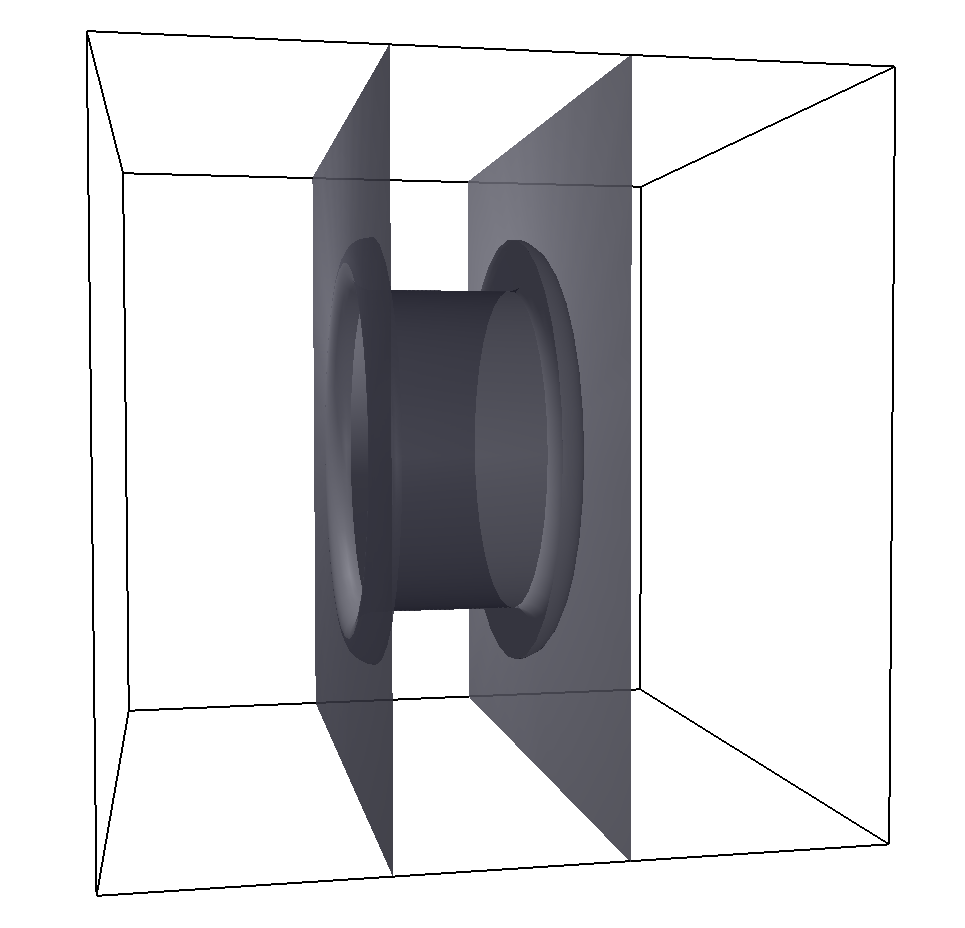

.. _Single particle forces (constraints):

Single particle forces (constraints)
====================================

:class:`espressomd.constraints.Constraint`

A Constraint is an immobile surface which can interact with particles via a
non-bonded potential, where the distance between the two particles is
replaced by the distance of the center of the particle to the surface.

The constraints are identified like a particle via its type ``particle_type`` for the
non-bonded interaction. After a type is defined for each constraint one
has to define the interaction of all different particle types with the
constraint using the  :class:`espressomd.interactions.NonBondedInteractions` class.

.. _Shaped-based constraints:

Shaped-based constraints
------------------------

In order to use shapes you first have to import the :mod:`espressomd.shapes`
module. This module provides classes for the different available shapes::

    import espressomd.shapes

Shapes define geometries which can be used in |es| either as
constraints in particle interactions or as a boundary for a
lattice-Boltzmann fluid.

To avoid unexpected behavior make sure all parts of your shape are
within the central box since the distance to the shape is calculated only
within the central box. If parts of the shape are placed
outside of the central box these parts are truncated by the box boundaries. This may
or may not be desired as for example in the case of a cylinder without or with cylinder cover.

A shape is instantiated by calling its constructor. If you wanted to
create a wall shape you could do::

    wall = espressomd.shapes.Wall()

Available shapes are listed below.

    - :class:`espressomd.shapes.Wall`
    - :class:`espressomd.shapes.Cylinder`
    - :class:`espressomd.shapes.Ellipsoid`
    - :class:`espressomd.shapes.Rhomboid`
    - :class:`espressomd.shapes.SimplePore`
    - :class:`espressomd.shapes.Slitpore`
    - :class:`espressomd.shapes.Sphere`
    - :class:`espressomd.shapes.SpheroCylinder`
    - :class:`espressomd.shapes.Stomatocyte`
    - :class:`espressomd.shapes.HollowConicalFrustum`
    - :class:`espressomd.shapes.Union`

.. _Adding shape-based constraints to the system:

Adding shape-based constraints to the system
^^^^^^^^^^^^^^^^^^^^^^^^^^^^^^^^^^^^^^^^^^^^

Usually you want to use constraints based on a shape.
The module :mod:`espressomd.constraints` provides the class
:class:`espressomd.constraints.ShapeBasedConstraint`::

    shape_constraint = espressomd.constraints.ShapeBasedConstraint(shape=my_shape)

In order to add the constraint to the system
invoke the :meth:`~espressomd.constraints.Constraints.add` method::

    system.constraints.add(shape_constraint)

All previously listed shapes can be added to the system constraints
by passing an initialized shape object to :meth:`~espressomd.constraints.Constraints.add`, returning a constraint object ::

    misshaped = Wall(dist=20, normal=[0.1, 0.0, 1])
    myConstraint = system.constraints.add(shape=myShape, particle_type=p_type)

The extra argument ``particle_type`` specifies the non-bonded interaction to be used with
that constraint.

There are two additional optional parameters
to fine-tune the behavior of the constraint. If ``penetrable`` is set to
``True`` then particles can move through the constraint. In this case the
other option ``only_positive`` controls where the particle is subjected to the
interaction potential (see :ref:`Available options`).
If the ``penetrable`` option is ignored or is set to ``False``, the
constraint cannot be violated, i.e. no
particle can go through the constraint surface (|es| will exit if any does).
If we wanted to add a non-penetrable pore constraint to our simulation,
we could do the following::

    pore = espressomd.shapes.SimplePore(
        axis=[1, 0, 0], length=2, pos=[15, 15, 15], radius=1, smoothing_radius=0.5)
    pore_constraint = espressomd.constraints.ShapeBasedConstraint(
        shape=pore, penetrable=False, particle_type=1)
    system.constraints.add(pore_constraint)

Interactions between the pore and other particles are then defined
as usual (:ref:`Non-bonded interactions`) to prevent particles from crossing
the shape surface.

.. _Deleting a constraint:

Deleting a constraint
^^^^^^^^^^^^^^^^^^^^^

Constraints can be removed in a similar fashion using :meth:`espressomd.constraints.Constraints.remove` ::

    system.constraints.remove(myConstraint)

This command will delete the specified constraint.

.. _Getting the currently defined constraints:

Getting the currently defined constraints
^^^^^^^^^^^^^^^^^^^^^^^^^^^^^^^^^^^^^^^^^

One can iterate through constraints, for example ::

    >>> for c in system.constraints:
    ...     print(c.shape)

will print the shape information for all defined constraints.

.. _Getting the force on a constraint:

Getting the force on a constraint
^^^^^^^^^^^^^^^^^^^^^^^^^^^^^^^^^

:meth:`espressomd.constraints.ShapeBasedConstraint.total_force`

Returns the force acting on the constraint. Note, however, that this is
only due to forces from interactions with particles, not with other
constraints. Also, these forces still do not mean that the constraints
move, they are just the negative of the sum of forces acting on all
particles due to this constraint. Similarly, the total energy does not
contain constraint-constraint contributions.

For example the pressure from wall ::

    >>> p = system.constraints[0].total_force()
    >>> print(p)

.. _Getting the minimal distance to a constraint:

Getting the minimal distance to a constraint
^^^^^^^^^^^^^^^^^^^^^^^^^^^^^^^^^^^^^^^^^^^^

:meth:`espressomd.constraints.ShapeBasedConstraint.min_dist`

Calculates the smallest distance to all interacting
constraints that can be repulsive (wall, cylinder, sphere, rhomboid,
pore, slitpore). Negative distances mean that the position is
within the area that particles should not access. Helpful to find
initial configurations.

.. _Available shapes:

Available shapes
^^^^^^^^^^^^^^^^

:class:`espressomd.shapes`

Python syntax::

    import espressomd from espressomd.shapes import <SHAPE>
    system = espressomd.System()

``<SHAPE>`` can be any of the available shapes.

The surface's geometry is defined via a few available shapes.
The following shapes can be used as constraints.

.. warning::
   When using shapes with concave edges and corners, the fact that a particle
   only interacts with the closest point on the constraint surface leads to discontinuous
   force fields acting on the particles. This breaks energy conservation in otherwise
   symplectic integrators. Often, the total energy of the system increases exponentially.

Wall
""""

:class:`espressomd.shapes.Wall`

An infinite plane defined by the normal vector ``normal``
and the distance ``dist`` from the origin (in the direction of the normal vector).
The force acts in the direction of the normal.
Note that ``dist`` describes the distance from the origin in units of the normal
vector so that the product of ``dist`` and ``normal`` is a point on the surface.
Therefore negative distances are quite common!

.. figure:: figures/shape-wall.png
   :alt: Example constraint with a ``Wall`` shape.
   :align: center
   :height: 6.00000cm

Pictured is an example constraint with a ``Wall`` shape created with ::

    wall = Wall(dist=20, normal=[0.1, 0.0, 1])
    system.constraints.add(shape=wall, particle_type=0)

For penetrable walls, if the ``only_positive`` flag is set to ``True``, interactions
are only calculated if the particle is on the side of the wall in which the
normal vector is pointing.

Sphere
""""""

:class:`espressomd.shapes.Sphere`

A sphere with center ``center`` and radius ``radius``.
The direction ``direction`` determines the force direction, ``-1`` for inward
and ``+1`` for outward.

.. _shape-sphere:

.. figure:: figures/shape-sphere.png
   :alt: Example constraint with a ``Sphere`` shape.
   :align: center
   :height: 6.00000cm

Pictured is an example constraint with a ``Sphere`` shape created with ::

    sphere = Sphere(center=[25, 25, 25], radius=15, direction=1)
    system.constraints.add(shape=sphere, particle_type=0)

Ellipsoid
"""""""""

:class:`espressomd.shapes.Ellipsoid`

An ellipsoid with center ``center``, semiaxis ``a`` along the symmetry axis and
equatorial semiaxes ``b``. The symmetry axis is aligned parallel to the x-axis.
The direction ``direction`` determines the force direction, ``-1`` for inward and ``+1`` for outward.
The distance to the surface is determined iteratively via Newton's method.

.. _shape-ellipsoid:

.. figure:: figures/shape-ellipsoid.png
   :alt: Example constraint with an ``Ellipsoid`` shape.
   :align: center
   :height: 6.00000cm

Pictured is an example constraint with an ``Ellipsoid`` shape created with ::

    ellipsoid = Ellipsoid(center=[25, 25, 25], a=25, b=15)
    system.constraints.add(shape=ellipsoid, particle_type=0)

Cylinder
""""""""

:class:`espressomd.shapes.Cylinder`

A cylinder with center ``center``, radius ``radius`` and length ``length``.
The ``axis`` parameter is a vector along the cylinder axis, which is normalized in the program.
The direction ``direction`` determines the force direction, ``-1`` for inward and ``+1`` for outward.

Pictured is an example constraint with a ``Cylinder`` shape created with ::

    cylinder = Cylinder(center=[25, 25, 25],
                        axis=[1, 0, 0],
                        direction=1,
                        radius=10,
                        length=30)
    system.constraints.add(shape=cylinder, particle_type=0)

Rhomboid
""""""""

:class:`espressomd.shapes.Rhomboid`

A rhomboid or parallelepiped, defined by one corner located at ``corner``
and three adjacent edges, defined by the three vectors connecting the
corner ``corner`` with its three neighboring corners: ``a``, ``b`` and ``c``.
The direction ``direction`` determines the force direction, ``-1`` for inward and ``+1`` for outward.

::

    rhomboid = Rhomboid(corner=[5.0, 5.0, 5.0],
                        a=[1.0, 1.0, 0.0],
                        b=[0.0, 0.0, 1.0],
                        c=[0.0, 1.0, 0.0],
                        direction=1)
    system.constraints.add(shape=rhomboid, particle_type=0, penetrable=True)

creates a rhomboid defined by one corner located at ``[5.0, 5.0, 5.0]`` and three
adjacent edges, defined by the three vectors connecting the corner with its three neighboring corners, ``(1,1,0)`` , ``(0,0,1)`` and ``(0,1,0)``.

SimplePore
""""""""""

:class:`espressomd.shapes.SimplePore`

Two parallel infinite planes, connected by a cylindrical orifice. The cylinder
is connected to the planes by torus segments with an adjustable radius.

Length and radius of the cylindrical pore can be set via the corresponding parameters
(``length`` and ``radius``). The parameter ``center`` defines the central point of the pore.
The orientation of the pore is given by the vector ``axis``, which points along the cylinder's symmetry axis.
The pore openings are smoothed with torus segments, the radius of which can be set using the parameter ``smoothing_radius``.
In the OpenGL visualizer, these torus segments are rendered as a half-torus instead of a quarter-torus.
You can safely ignore this visual artifact, in the force/energy calculation, only a quarter-torus is used.

Pictured is an example constraint with a ``SimplePore`` shape created with ::

    pore = SimplePore(axis=[1, 0, 0],
                      length=15,
                      radius=12.5,
                      smoothing_radius=2,
                      center=[25, 25, 25])
    system.constraints.add(shape=pore, particle_type=0, penetrable=True)

Stomatocyte
"""""""""""

:class:`espressomd.shapes.Stomatocyte`

A stomatocyte-shaped boundary surface.
This command should be used with care.
The position can be any point in the simulation box and is set via the (3,) array_like parameter ``center``.
The orientation of the (cylindrically symmetric) stomatocyte is given by an ``axis`` (a (3,) array_like of :obj:`float`),
which points in the direction of the symmetry axis and does not need to be normalized.
The parameters: ``outer_radius``, ``inner_radius``, and ``layer_width``, specify the shape of the stomatocyte.
Here inappropriate choices of these parameters can yield undesired results.
The width ``layer_width`` is used as a scaling parameter.
That is, a stomatocyte given by ``outer_radius:inner_radius:layer_width`` = 7:3:1
is half the size of the stomatocyte given by 7:3:2.
Not all choices of the parameters give reasonable values for the shape of the stomatocyte,
but the combination 7:3:1 is a good point to start from when trying to modify the shape.

.. figure:: figures/shape-stomatocyte1.png
   :alt: Example constraint with a ``Stomatocyte`` shape.
   :align: center
   :height: 6.00000cm

.. figure:: figures/shape-stomatocyte2.png
   :alt: Close-up of the internal ``Stomatocyte`` structure.
   :align: center
   :height: 6.00000cm

Pictured is an example constraint with a ``Stomatocyte`` shape (with a closeup of the internal structure) created with ::

    stomatocyte = Stomatocyte(inner_radius=3,
                              outer_radius=7,
                              axis=[1.0, 0.0, 0.0],
                              center=[25, 25, 25],
                              layer_width=3,
                              direction=1)
    system.constraints.add(shape=stomatocyte, particle_type=0, penetrable=True)

Slitpore
""""""""

:class:`espressomd.shapes.Slitpore`

A T-shaped channel that extends in the *z*-direction.
The cross sectional geometry is depicted in Fig. :ref:`schematic <figure-slitpore>`.
It is translationally invariant in y direction.

The region is described as a pore (lower vertical part of the "T"-shape) and a channel (upper horizontal part of the "T"-shape).

.. _figure-slitpore:

The parameter ``channel_width`` specifies the distance between the top and the plateau edge.
The parameter ``pore_length`` specifies the distance between the bottom and the plateau edge.
The parameter ``pore_width`` specifies the distance between the two plateau edges, it is the space between the left and right walls of the pore region.
The parameter ``pore_mouth`` specifies the location (z-coordinate) of the pore opening (center). It is always centered in the x-direction.
The parameter ``dividing_plane`` specifies the location (z-coordinate) of the middle between the two walls.

All the edges  are smoothed via the parameters ``upper_smoothing_radius`` (for the concave corner at the edge of the plateau region) and ``lower_smoothing_radius`` (for the convex corner at the bottom of the pore region).
The meaning of the geometrical parameters can be inferred from the schematic in Fig. :ref:`slitpore <figure-slitpore>`.

.. figure:: figures/shape-slitpore.png
   :alt: Example constraint with a ``Slitpore`` shape.
   :align: center
   :height: 6.00000cm

Pictured is an example constraint with a ``Slitpore`` shape created with ::

    slitpore = Slitpore(channel_width=15,
                        lower_smoothing_radius=1.5,
                        upper_smoothing_radius=2,
                        pore_length=20,
                        pore_mouth=30,
                        pore_width=5,
                        dividing_plane=40)

    system.constraints.add(shape=slitpore, particle_type=0, penetrable=True)

SpheroCylinder
""""""""""""""

:class:`espressomd.shapes.SpheroCylinder`

A cylinder capped by hemispheres on both ends. Generates a capsule, pill, or spherocylinder depending on the choice of parameters.
Similar to :class:`espressomd.shapes.Cylinder`, it is positioned at ``center`` and has a radius ``radius``.
The ``length`` parameter is the cylinder length, and does not include the contribution from the hemispherical ends.
The ``axis`` parameter is a vector along the cylinder axis, which is normalized in the program.
The direction ``direction`` determines the force direction, ``-1`` for inward and ``+1`` for outward.

.. figure:: figures/shape-spherocylinder.png
   :alt: Example constraint with a ``SpheroCylinder`` shape.
   :align: center
   :height: 6.00000cm

Pictured is an example constraint with a ``SpheroCylinder`` shape created with ::

    spherocylinder = SpheroCylinder(center=[25, 25, 25],
                                    axis=[1, 0, 0],
                                    direction=1,
                                    radius=10,
                                    length=30)
    system.constraints.add(shape=spherocylinder, particle_type=0)

HollowConicalFrustum
""""""""""""""""""""

:class:`espressomd.shapes.HollowConicalFrustum`

A hollow cone with round corners. The specific parameters
are described in the shape's class :class:`espressomd.shapes.HollowConicalFrustum`.

Union
"""""

:class:`espressomd.shapes.Union`

A meta-shape which is the union of given shapes. Note that only the regions where
all shapes have a "positive distance" (see :ref:`Available options`) can be used for the
union. The distance to the union is defined as the minimum distance to any contained shape.

.. _Available options:

Available options
^^^^^^^^^^^^^^^^^

There are some options to help control the behaviour of shaped-based
constraints. Some of the options, like ``direction`` need to be specified for
the shape :class:`espressomd.shapes`, and some options are specified for the
constraint  :class:`espressomd.constraints.ShapeBasedConstraint`. We will
discuss them together in this section in the context of a specific example.

The ``direction`` option typically specifies which volumes are inside versus
outside the shape. Consider a constraint based on the sphere shape. If one
wishes to place particles inside the sphere, one would usually use
``direction=-1``, if one wishes to place particles outside, one would use
``direction=1``. In this example, we place a sphere centre at position
(25,0,0). A particle is continuously displaced on the x-axis in order to probe
the effect of different options. For this, we need to first define a repulsive
interaction between the probe and the constraint.

The plot below demonstrates how the distance between the probe and the
constraint surface is calculated when the ``distance`` option is toggled
between ``direction=1`` and ``direction=-1``. In the plot, a schematic of a
circle centered at x=25 is used to represent the spherical constraint.

.. figure:: figures/constraint-distance.png
   :alt: Distance measure from an example spherical constraint.
   :align: center
   :height: 8.00000cm

When the option ``direction=1`` is used for the sphere shape, positive
distances are measured whenever the particle is outside the sphere and negative
distances are measured whenever the particle is inside the sphere. Conversely,
when the option ``direction=-1`` is used for the sphere shape, negative
distances are measured whenever the particle is outside the sphere and positive
distances are measured whenever the particle is inside the sphere. In other
words, this option helps defines the sign of the normal surface vector.

For now, this may not sound useful but it can be practical when used with
together with constraint options such as ``penetrable`` or ``only_positive``.
In the former case, using non-penetrable surfaces with ``penetrable=False`` will
cause |es| to throw an error is any distances between interacting particles and
constraints are found to be negative. This can be used to stop a simulation if
for one reason or another particles end up in an unwanted location.

The ``only_positive`` constraint option is used to define if a force should be
applied to a particle that has a negative distance. For example, consider the
same probe particle as in the previous case. The plot below shows the particle
force with ``only_positive=True``. Notice that when the distance is negative,
forces are not applied at all to the particle. Thus the constraint surface is
either purely radially outwards (when ``direction=1``) or radially inwards
(when ``direction=-1``). Note that in both cases the constraint was set to be
penetrable with ``penetrable=True`` or else the simulation would crash whenever
the particle was found in any location that yields a negative distance.

.. figure:: figures/constraint-force.png
   :alt: Force measure from an example spherical constraint.
   :align: center
   :height: 8.00000cm

The next figure shows what happens if we turn off the ``only_positive`` flag by
setting ``only_positive=False``. In this case the particle is pushed radially
inward if it is inside the sphere and radially outward if it is outside. As
with the previous example, the constraint was set to be penetrable for this to
make sense.

.. figure:: figures/constraint-force_only_positive.png
   :alt: Force measure from an example spherical constraint.
   :align: center
   :height: 8.00000cm

Most shapes have a clear interpretation of what is inside versus outside with
the exception of a planar wall. For this, there is no ``direction`` option, but
the ``normal`` vector of the wall points in the direction that is considered to
yield positive distances.  Outside their use in constraints, shapes can also be
used as a way to define LB boundary nodes. In this case, negative distances
define nodes which are part of a boundary (please refer to :ref:`Using shapes
as lattice-Boltzmann boundary`).

.. _External Fields:

External Fields
---------------

There is a variety of external fields, which differ by how their
values are obtained and how they couple to particles.

Constant fields
^^^^^^^^^^^^^^^

These are fields that are constant in space or simple linear functions
of the position.  The available fields are:

* :class:`espressomd.constraints.HomogeneousMagneticField`
* :class:`espressomd.constraints.ElectricPlaneWave`
* :class:`espressomd.constraints.LinearElectricPotential`
* :class:`espressomd.constraints.HomogeneousFlowField`
* :class:`espressomd.constraints.Gravity`

A detailed description can be found in the class documentation.

Please be aware of the fact that a constant per-particle force can be
set via the ``ext_force`` property of the particles and is not provided
here.

Interpolated Force and Potential fields
^^^^^^^^^^^^^^^^^^^^^^^^^^^^^^^^^^^^^^^

The values of these fields are obtained by interpolating table data,
which has to be provided by the user. The fields differ by how
they couple to particles, for a detailed description see their respective
class documentation.

* :class:`espressomd.constraints.ForceField`
* :class:`espressomd.constraints.PotentialField`
* :class:`espressomd.constraints.ElectricPotential`
* :class:`espressomd.constraints.FlowField`

