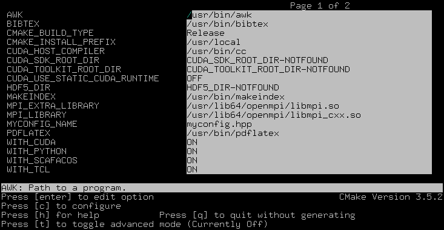

.. _Installation:

Installation 
============

This chapter will describe how to get, compile and run the software.

|es| releases are available as source code packages from the homepage [1]_.
This is where new users should get the code. The code within release packages
is tested and known to run on a number of platforms.
Alternatively, people that want to use the newest features of |es| or that
want to start contributing to the software can instead obtain the
current development code via the version control system software  [2]_
from |es| ’s project page at Github  [3]_. This code might be not as well
tested and documented as the release code; it is recommended to use this
code only if you have already gained some experience in using |es|.

Unlike most other software, no binary distributions of |es| are available,
and the software is usually not installed globally for all users.
Instead, users of |es| should compile the software themselves. The reason for
this is that it is possible to activate and deactivate various features
before compiling the code. Some of these features are not compatible
with each other, and some of the features have a profound impact on the
performance of the code. Therefore it is not possible to build a single
binary that can satisfy all needs. For performance reasons a user
should always activate only those features that are actually needed.
This means, however, that learning how to compile is a necessary evil.
The build system of |es| uses `cmake` [4]_ to compile
software easily on a wide range of platforms.

.. _Requirements:

Requirements
------------

The following tools libraries, including header files, are required to be able
to compile and use ESPResSo:

CMake
    The build system is based on CMake

C++ Compiler
    C++11 capable C++ compiler (e.g., Gcc 4.8.1 or later)

Boost
    A number of advanced C++ features used by ESPResSo is provided by Boost.

FFTW
    For some algorithms (P:math:`^3`\ M), ESPResSo needs the FFTW library
    version 3 or later  [5]_ for Fourier transforms, including header
    files.

MPI
    Because ESPResSo is parallelized with MPI, you need a working MPI
    environment that implements the MPI standard version 1.2.

Python
    ESPResSo's main user interface is via the Python scripting interface. Both, Python 2 and 3 are supported.

Cython
    Cython is used for connecting the C++ core to Python

.. _Installing Requirements on Ubuntu 16.04 LTS:

Installing Requirements on Ubuntu 16.04 LTS
~~~~~~~~~~~~~~~~~~~~~~~~~~~~~~~~~~~~~~~~~~~

To make ESPResSo run on Ubuntu 16.04 LTS, its dependencies can be
installed with:

.. code-block:: bash

    sudo apt install build-essential cmake cython python-numpy \
    libboost-all-dev openmpi-common

Optionally the ccmake utility can be installed for easier configuration:

.. code-block:: bash

    $ sudo apt install cmake-curses-gui

.. _Installing Requirements on Mac OS X:

Installing Requirements on Mac OS X
~~~~~~~~~~~~~~~~~~~~~~~~~~~~~~~~~~~

To make |es| run on Mac OS X 10.9 or higher, its dependencies can be
installed using MacPorts. First, download the installer package
appropriate for your Mac OS X version from
https://www.macports.org/install.php and install it. Then, run the
following commands:

.. code-block:: bash

    sudo xcode-select --install
    sudo xcodebuild -license accept
    sudo port selfupdate
    sudo port install cmake python27 py27-cython py27-numpy \
    openmpi-default fftw-3 +openmpi boost +openmpi +python27
    sudo port select --set cython cython27
    sudo port select --set python python27
    sudo port select --set mpi openmpi-mp-fortran

Alternatively, you can use Homebrew.

.. code-block:: bash

    sudo xcode-select --install
    sudo xcodebuild -license accept
    /usr/bin/ruby -e "$(curl -fsSL https://raw.githubusercontent.com/Homebrew/install/master/install)"
    brew install cmake python@3 cython boost boost-mpi fftw
    brew install numpy --without-python@2
    ln -s /usr/local/bin/python2 /usr/local/bin/python

Note: If both MacPorts and Homebrew are installed, you will not be able to
run |es|. Therefore, if you have both installed, please uninstall one
or the other by running one of the following two commands:

.. code-block:: bash

    sudo port -f uninstall installed && rm -r /opt/local
    ruby -e "$(curl -fsSL https://raw.githubusercontent.com/Homebrew/install/master/uninstall)"

.. _Installing python dependencies:

Installing python dependencies
~~~~~~~~~~~~~~~~~~~~~~~~~~~~~~

There are a few python packages needed to e.g. build the documentation.
To install the required packages as a non-root user execute the following
command in |es| 's source directory:

.. code-block:: bash

    pip install -r requirements.txt --user --upgrade

Please note that on some systems, `pip` has to be replaced by `pip2` to install Python 2 versions of the packages.

.. _Quick installation:

Quick installation
------------------

If you have installed the requirements (see section :ref:`Requirements
<requirements>` ) in standard locations, to compile, it is usually enough to
create a build directory and call ``cmake`` and ``make`` (optional steps 
which modify the build process are commented out):

.. code-block:: bash

    mkdir build
    cd build
    #cp myconfig-default.hpp myconfig.hpp # use the default configuration as template
    #nano myconfig.hpp                    # edit to add/remove features as desired
    cmake ..
    #ccmake . // in order to add/remove features like SCAFACOS or CUDA
    make

This will build |es| with a default feature set, namely
:file:`src/core/myconfig-default.hpp`. This file is a ``c++`` header file, 
which defines the features that should be compiled in.
You may want to adjust the feature set to your needs. This can be easily done
by copying the `myconfig-sample.hpp` which has been created in the build 
directory to `myconfig.hpp` and only uncomment the features you want to use in your simulation.

The ``cmake`` command looks for libraries and tools needed by |es|. So |es| 
can only be built if ``cmake`` reports no errors.

The command ``make`` will compile the source code. Depending on the
options passed to the program, ``make`` can also be used for a number of
other things:

*  It can install and uninstall the program to some other directories.
   However, normally it is not necessary to actually *install* to run
   it: ``make install``

*  It can invoke code checks: ``make check`` 

*  It can build this documentation: ``make sphinx``

When these steps have successfully completed, |es| can be started with the
command::

    ./pypresso <SCRIPT>

where is ``<SCRIPT>`` is a ``python`` script which has to
be written by the user. You can find some examples in the :file:`samples`
folder of the source code directory. If you want to run in parallel, you should
have compiled with *Open MPI*, and need to tell MPI to run in parallel. The actual
invocation is implementation dependent, but in many cases, such as
*Open MPI*, you can use

::

    mpirun -n <N> ./pypresso <SCRIPT>

where ``<N>`` is the number of processors to be used.

.. _Configuring:

Configuring
-----------

.. _myconfig.hpp\: Activating and deactivating features:

``myconfig.hpp``: Activating and deactivating features
~~~~~~~~~~~~~~~~~~~~~~~~~~~~~~~~~~~~~~~~~~~~~~~~~~~~~~

|es| has a large number of features that can be compiled into the binary.
However, it is not recommended to actually compile in all possible
features, as this will slow down significantly. Instead, compile in only
the features that are actually required. A strong gain in speed can be
achieved, by disabling all non-bonded interactions except for a single
one, e.g. . For the developers, it is also possible to turn on or off a
number of debugging messages. The features and debug messages can be
controlled via a configuration header file that contains C-preprocessor
declarations. Appendix lists and describes all available features. The
file ``myconfig-sample.hpp`` that configure will generate in the build
directory contains a list of all possible features that can be copied
into your own configuration file. When no configuration header is
provided by the user, a default header, found in
``src/core/myconfig-default.hpp``, will be used that turns on the
default features.

When you distinguish between the build and the source directory, the
configuration header can be put in either of these. Note, however, that
when a configuration header is found in both directories, the one in the
build directory will be used.

By default, the configuration header is called ``myconfig.hpp``.
The configuration header can be used to compile different binary
versions of with a different set of features from the same source
directory. Suppose that you have a source directory ``$srcdir`` and two
build directories ``$builddir1`` and ``$builddir2`` that contain
different configuration headers:

*  ``$builddir1/myconfig.hpp``:

.. code-block:: c

    #define ELECTROSTATICS
    #define LENNARD-JONES

*  ``$builddir2/myconfig.hpp``:

.. code-block:: c

   #define LJCOS

Then you can simply compile two different versions of via::

    cd builddir1
    cmake ..
    make

    cd builddir2
    cmake ..
    make

To see, what features were activated in myconfig.hpp, run:::

    ./pypresso

and then in the Python interpreter::

    import espressomd
    print(espressomd.features())

.. _Features:

Features
~~~~~~~~

This chapter describes the features that can be activated in |es|. Even if
possible, it is not recommended to activate all features, because this
will negatively effect |es| ’s performance.

Features can be activated in the configuration header ``myconfig.hpp`` (see
section :ref:`myconfig.hpp\: Activating and deactivating features`). To
activate ``FEATURE``, add the following line to the header file:

::

    #define FEATURE

.. _General features:

General features
^^^^^^^^^^^^^^^^

-  ``PARTIAL_PERIODIC`` By default, all coordinates in |es| are periodic. With
   ``PARTIAL_PERIODIC`` turned on, the |es| global variable ``periodic``
   controls the periodicity of the individual coordinates.

   .. note:: This slows the integrator down by around :math:`10-30\%`.

   .. seealso:: :ref:`Setting global variables in Python`

-  ``ELECTROSTATICS`` This enables the use of the various electrostatics algorithms, such as P3M.

   .. seealso:: :ref:`Electrostatics`

-  ``INTER_RF``

-  ``MMM1D_GPU``

-  ``_P3M_GPU_FLOAT``

-  ``DIPOLES`` This activates the dipole-moment property of particles; In addition,
   the various magnetostatics algorithms, such as P3M are switched on.

   .. seealso:: 
   
       :ref:`Magnetostatics / Dipolar interactions`
       :ref:`Electrostatics`

-  ``SCAFACOS_DIPOLES``

-  ``ROTATION`` Switch on rotational degrees of freedom for the particles, as well as
   the corresponding quaternion integrator. 
   
   .. seealso:: :ref:`Setting up particles`

   .. note:: 
      Note, that when the feature is activated, every particle has three
      additional degrees of freedom, which for example means that the
      kinetic energy changes at constant temperature is twice as large.

-  ``LANGEVIN_PER_PARTICLE`` Allows to choose the Langevin temperature and friction coefficient
   per particle.

-  ``ROTATIONAL_INERTIA``

-  ``EXTERNAL_FORCES`` Allows to define an arbitrary constant force for each particle
   individually. Also allows to fix individual coordinates of particles,
   keep them at a fixed position or within a plane.

-  ``CONSTRAINTS`` Turns on various spatial constraints such as spherical compartments
   or walls. This constraints interact with the particles through
   regular short ranged potentials such as the Lennard–Jones potential.
   See section for possible constraint forms.

-  ``MASS`` Allows particles to have individual masses. Note that some analysis
   procedures have not yet been adapted to take the masses into account
   correctly.

   .. seealso:: :attr:`espressomd.particle_data.ParticleHandle.mass`

-  ``EXCLUSIONS`` Allows to exclude specific short ranged interactions within
   molecules.

   .. seealso:: :attr:`espressomd.particle_data.ParticleHandle.exclude`

-  ``COMFIXED`` Allows to fix the center of mass of all particles of a certain type.

-  ``MOLFORCES`` (EXPERIMENTAL)

-  ``BOND_CONSTRAINT`` Turns on the RATTLE integrator which allows for fixed lengths bonds
   between particles.

-  ``VIRTUAL_SITES_COM`` Virtual sites are particles, the position and velocity of which is
   not obtained by integrating equations of motion. Rather, they are
   placed using the position (and orientation) of other particles. The
   feature allows to place a virtual particle into the center of mass of
   a set of other particles.
   
   .. seealso:: :ref:`Virtual sites` 

-  ``VIRTUAL_SITES_RELATIVE`` Virtual sites are particles, the position and velocity of which is
   not obtained by integrating equations of motion. Rather, they are
   placed using the position (and orientation) of other particles. The
   feature allows for rigid arrangements of particles.

   .. seealso:: :ref:`Virtual sites` 

-  ``METADYNAMICS``

-  ``SWIMMER_REACTIONS`` Allows the user to define three particle types to be reactant,
   catalyzer, and product. Reactants get converted into products in the
   vicinity of a catalyst according to a used-defined reaction rate
   constant. It is also possible to set up a chemical equilibrium
   reaction between the reactants and products, with another rate
   constant. Be careful the model makes usage of the word catalyst. This usage of the word cannot be brought into agreement with the correct usage of the word catalyst.
   
   .. seealso:: :ref:`Swimmer reactions`

-  ``OVERLAPPED``

-  ``COLLISION_DETECTION`` Allows particles to be bound on collision.

-  ``H5MD`` Allows to write data to H5MD formatted hdf5 files.

   .. seealso:: :ref:`Writing H5MD-Files`

In addition, there are switches that enable additional features in the
integrator or thermostat:

..
    -  ``NEMD`` Enables the non-equilbrium (shear) MD support.

       .. seealso:: :ref:`\`\`nemd\`\`\: Setting up non-equilibrium MD`

-  ``NPT`` Enables an on–the–fly NPT integration scheme.
   
   .. seealso:: :ref:`Isotropic NPT thermostat`

-  ``MEMBRANE_COLLISION``

-  ``REACTION_ENSEMBLE``

-  ``GHMC``

-  ``MULTI_TIMESTEP`` (experimental)

-  ``ENGINE``

-  ``PARTICLE_ANISOTROPY``

.. _Fluid dynamics and fluid structure interaction:

Fluid dynamics and fluid structure interaction
^^^^^^^^^^^^^^^^^^^^^^^^^^^^^^^^^^^^^^^^^^^^^^

-  ``DPD`` Enables the dissipative particle dynamics thermostat and interaction.

   .. seealso:: :ref:`DPD interaction`

-  ``LB`` Enables the lattice-Boltzmann fluid code.

   .. seealso:: :attr:`espressomd.lb`, :ref:`Lattice-Boltzmann`

-  ``LB_GPU`` Enables the lattice-Boltzmann fluid code support for GPU.

   .. seealso:: :attr:`espressomd.lb`, :ref:`Lattice-Boltzmann`

-  ``LB_BOUNDARIES``

-  ``LB_BOUNDARIES_GPU``

-  ``SHANCHEN`` (experimental) Enables the Shan Chen bicomponent fluid code on the GPU.

-  ``AFFINITY``

-  ``LB_ELECTROHYDRODYNAMICS`` Enables the implicit calculation of electro-hydrodynamics for charged
   particles and salt ions in an electric field.

-  ``ELECTROKINETICS``

-  ``EK_BOUNDARIES``

-  ``EK_ELECTROSTATIC_COUPLING``

-  ``EK_DEBUG``

-  ``EK_DOUBLE_PREC``

-  ``IMMERSED_BOUNDARY`` Immersed-Boundary Bayreuth version.

-  ``OIF_LOCAL_FORCES``

-  ``OIF_GLOBAL_FORCES``

.. _Interaction features:

Interaction features
^^^^^^^^^^^^^^^^^^^^

The following switches turn on various short ranged interactions (see
section :ref:`Isotropic non-bonded interactions`):

-  ``TABULATED`` Enable support for user–defined interactions.

-  ``LENNARD_JONES`` Enable the Lennard–Jones potential.

-  ``LENNARD_JONES_GENERIC`` Enable the generic Lennard–Jones potential with configurable
   exponents and individual prefactors for the two terms.

-  ``LJCOS`` Enable the Lennard–Jones potential with a cosine–tail.

-  ``LJCOS2`` Same as LJCOS, but using a slightly different way of smoothing the
   connection to 0.

-  ``GAY_BERNE`` (experimental)

-  ``HERTZIAN``

-  ``NO_INTRA_NB``

-  ``MORSE`` Enable the Morse potential.

-  ``BUCKINGHAM`` Enable the Buckingham potential.

-  ``SOFT_SPHERE`` Enable the soft sphere potential.

-  ``SMOOTH_STEP`` Enable the smooth step potential, a step potential with two length
   scales.

-  ``BMHTF_NACL`` Enable the Born-Meyer-Huggins-Tosi-Fumi potential, which can be used
   to model salt melts.

Some of the short range interactions have additional features:

-  ``LJ_WARN_WHEN_CLOSE`` This adds an additional check to the Lennard–Jones potentials that
   prints a warning if particles come too close so that the simulation
   becomes unphysical.

-  ``OLD_DIHEDRAL`` Switch the interface of the dihedral potential to its old, less
   flexible form. Use this for older scripts that are not yet adapted to
   the new interface of the dihedral potential.

If you want to use bond-angle potentials (see section :ref:`Bond-angle interactions`), you need the
following features.

-  ``BOND_ANGLE``

-  ``BOND_ANGLEDIST``

-  ``BOND_ANGLEDIST_HARMONIC``

-  ``LJGEN_SOFTCORE``

-  ``COS2``

-  ``GAUSSIAN``

-  ``HAT``

-  ``UMBRELLA`` (experimental)

.. _DNA Model:

DNA Model
^^^^^^^^^

-  ``CG_DNA``

-  ``TWIST_STACK``

-  ``HYDROGEN_BOND``

-  ``COULOMB_DEBYE_HUECKEL``

.. _Miscellaneous:

Miscellaneous
^^^^^^^^^^^^^

-  ``FLATNOISE`` Shape of the noise in ther (LB) thermostat.

-  ``GAUSSRANDOM`` Shape of the noise in ther (LB) thermostat.

-  ``GAUSSRANDOMCUT`` Shape of the noise in ther (LB) thermostat.

.. _Debug messages:

Debug messages
^^^^^^^^^^^^^^

Finally, there are a number of flags for debugging. The most important
one are

-  ``ADDITIONAL_CHECKS`` Enables numerous additional checks which can detect inconsistencies
   especially in the cell systems. This checks are however too slow to
   be enabled in production runs.

The following flags control the debug output of various sections of
|es|. You will however understand the output very often only by
looking directly at the code.

-  ``COMM_DEBUG`` Output from the asynchronous communication code.

-  ``EVENT_DEBUG`` Notifications for event calls, i. e. the ``on_...`` functions in
   ``initialize.c``. Useful if some module does not correctly respond to
   changes of e. g. global variables.

-  ``INTEG_DEBUG`` Integrator output.

-  ``CELL_DEBUG`` Cellsystem output.

-  ``GHOST_DEBUG`` Cellsystem output specific to the handling of ghost cells and the
   ghost cell communication.

-  ``GHOST_FORCE_DEBUG``

-  ``VERLET_DEBUG`` Debugging of the Verlet list code of the domain decomposition cell
   system.

-  ``LATTICE_DEBUG`` Universal lattice structure debugging.

-  ``HALO_DEBUG``

-  ``GRID_DEBUG``

-  ``PARTICLE_DEBUG`` Output from the particle handling code.

-  ``P3M_DEBUG``

-  ``ESR_DEBUG`` debugging of P\ :math:`^3`\ Ms real space part.

-  ``ESK_DEBUG`` debugging of P\ :math:`^3`\ Ms :math:`k` –space part.

-  ``FFT_DEBUG`` Output from the unified FFT code.

-  ``MAGGS_DEBUG``

-  ``RANDOM_DEBUG``

-  ``FORCE_DEBUG`` Output from the force calculation loops.

-  ``PTENSOR_DEBUG`` Output from the pressure tensor calculation loops.

-  ``THERMO_DEBUG`` Output from the thermostats.

-  ``LJ_DEBUG`` Output from the Lennard–Jones code.

-  ``MORSE_DEBUG`` Output from the Morse code.

-  ``FENE_DEBUG``

-  ``ONEPART_DEBUG`` Define to a number of a particle to obtain output on the forces
   calculated for this particle.

-  ``STAT_DEBUG``

-  ``POLY_DEBUG``

-  ``MOLFORCES_DEBUG``

-  ``LB_DEBUG`` Output from the lattice–Boltzmann code.

-  ``VIRTUAL_SITES_DEBUG``

-  ``ASYNC_BARRIER`` Introduce a barrier after each asynchronous command completion. Helps
   in detection of mismatching communication.

-  ``FORCE_CORE`` Causes |es| to try to provoke a core dump when exiting unexpectedly.

-  ``MPI_CORE`` Causes |es| to try this even with MPI errors.

-  ``ESIF_DEBUG``

-  ``LE_DEBUG``

-  ``SD_DEBUG``

-  ``CUDA_DEBUG``

-  ``H5MD_DEBUG``

-  ``ONEPART_DEBUG_ID`` Use this define to supply a particle ID for which to output debug messages. For example: ``#define ONEPART_DEBUG_ID 13``

Features marked as experimental
~~~~~~~~~~~~~~~~~~~~~~~~~~~~~~~
Some of the above features are marked as EXPERIMENTAL. Activating these features can have unexpected side effects and some of them have known issues. If you activate any of these features, you should understand the corresponding source code and do extensive testing. Furthermore, it is necessary to define `EXPERIMENTAL_FEATURES` in myconfig.hpp.

.. _cmake:

cmake
~~~~~

In order to build the first step is to create a build directory in which
cmake can be executed. In cmake, the *source directory* (that contains
all the source files) is completely separated from the *build directory*
(where the files created by the build process are put). `cmake` is
designed to *not* be executed in the source directory. `cmake` will
determine how to use and where to find the compiler, as well as the
different libraries and tools required by the compilation process. By
having multiple build directories you can build several variants of |es|,
each variant having different activated features, and for as many
platforms as you want.

**Example:**

When the source directory is ``srcdir`` (the files where unpacked to this
directory), then the user can create a build directory ``build`` below that
path by calling ``mkdir srcdir/build``. In the build directory `cmake` is to be
executed, followed by a call of make. None of the files in the source directory
is ever modified when by the build process.

.. code-block:: bash

    $ cd build 
    $ cmake .. 
    $ make

Afterwards Espresso can be run via calling ``./pypresso`` from the command
line.

.. _ccmake:

ccmake
~~~~~~

Optionally and for easier use the curses interface to cmake can be used
to configure |es| interactively.

**Example:**

Alternatively to the previous example instead of , the executable is
called in the build directory to configure ESPResSo previous to its
compilation followed by a call of make:

.. code-block:: bash

    $ cd build 
    $ ccmake .. 
    $ make

Fig. :ref:`ccmake-figure` shows the interactive ccmake UI.

.. _ccmake-figure:

   ccmake interface

.. _Options and Variables:

Options and Variables
^^^^^^^^^^^^^^^^^^^^^

The behavior of |es| can be controlled by the means of options and variables
in the CMakeLists.txt file. Also options are defined there. The following
options are available:

* WITH\_CUDA: Build with GPU support

* WITH\_HDF5: Build with HDF5

* WITH\_TESTS: Enable tests

* WITH\_SCAFACOS: Build with Scafacos support

* WITH\_VALGRIND\_INSTRUMENTATION: Build with valgrind instrumentation
  markers

When the value in the CMakeLists.txt file is set to ON the corresponding
option is created if the value of the option is set to OFF the
corresponding option is not created. These options can also be modified
by calling cmake with the command line argument ``-D``::

    cmake -D WITH_HDF5=OFF srcdir

In the rare event when working with cmake and you want to have a totally
clean build (for example because you switched the compiler), remove the
build directory and create a new one.

.. _make\: Compiling, testing and installing:

``make``: Compiling, testing and installing 
--------------------------------------------

The command ``make`` is mainly used to compile the source code, but it
can do a number of other things. The generic syntax of the ``make``
command is:

.. code-block:: bash

    $ make [options] [target] [variable=value]

When no target is given, the target ``all`` is used. The following
targets are available:

``all``
    Compiles the complete source code. The variable can be used to
    specify the name of the configuration header to be used.

``check``
    Runs the testsuite. By default, all available tests will be run on
    1, 2, 3, 4, 6, or 8 processors.
    
``clean``
    Deletes all files that were created during the compilation.

``install``
    Install |es|. 
    Use ``make DESTDIR=/home/john install`` to install to a 
    specific directory.

``doxygen``
    Creates the Doxygen code documentation in the ``doc/doxygen``
    subdirectory.

``sphinx``
    Creates the `sphinx` code documentation in the ``doc/sphinx``
    subdirectory.

``tutorials``
    Creates the tutorials in the ``doc/tutorials`` subdirectory.

``doc``
    Creates all documentation in the ``doc`` subdirectory (only when
    using the development sources).

A number of options are available when calling ``make``. The most
interesting option is probably ``-j num_jobs``, which can be used for
parallel compilation on computers that have more than one CPU or core.
*num\_jobs* specifies the maximal number of jobs that will be run.
Setting *num\_jobs* to the number of available processors speeds up the
compilation process significantly.

.. _Running es:

Running |es|
------------

|es| is implemented as a Python module. This means that you need to write a
python script for any task you want to perform with . In this chapter,
the basic structure of the interface will be explained. For a practical
introduction, see the tutorials, which are also part of the
distribution. To use , you need to import the espressomd module in your
Python script. To this end, the folder containing the python module
needs to be in the Python search path. The module is located in the
src/python folder under the build directory. A convenient way to run
python with the correct path is to use the pypresso script located in
the build directory.

::

    ./pypresso simulation.py

The ``pypresso`` script is just a wrapper in order to expose our
self built python modules to the systems python interpreter by
modifying the  ``PYTHONPATH``.
Please see the following chapters describing how to actually write
a simulation script for |es|.

.. _Debugging es:

Debugging |es|
--------------

Exceptional situations occur in every program.  If |es| crashes with a
segmentation fault that means that there was a memory fault in the
simulation core which requires running the program in a debugger.  The
`pypresso` executable file is actually not a program but a script
which sets the Python path appropriately and starts the Python
interpreter with your arguments.  Thus it is not possible to directly
run `pypresso` in a debugger.  However, we provide some useful
commandline options for the most common tools.

.. code-block:: bash

     ./pypresso --tool <args>

where ``--tool`` can be any from the following table.  You can only
use one tool at a time.
  
+---------------------+----------------------------------------------+
| Tool                | Effect                                       |
+=====================+==============================================+
| ``--gdb``           | ``gdb --args python <args>``                 |
+---------------------+----------------------------------------------+
| ``--lldb``          | ``lldb -- python <args>``                    |
+---------------------+----------------------------------------------+
| ``--valgrind``      | ``valgrind --leak-check=full python <args>`` |
+---------------------+----------------------------------------------+
| ``--cuda-gdb``      | ``cuda-gdb --args python <args>``            |
+---------------------+----------------------------------------------+
| ``--cuda-memcheck`` | ``cuda-memcheck python <args>``              |
+---------------------+----------------------------------------------+

.. [1]
   http://espressomd.org

.. [2]
   http://git.org

.. [3]
   https://github.com/espressomd/espresso

.. [4]
   https://cmake.org/

.. [5]
   http://www.fftw.org/
