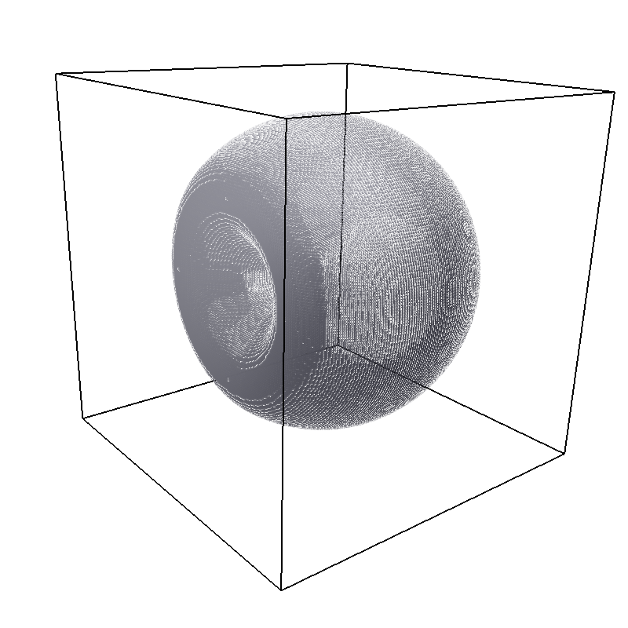

.. _Setting up interactions:

Setting up interactions
=======================

In |es|, interactions are set up and investigated by the ``interactions`` module. There are
mainly two types of interactions: non-bonded and bonded interactions.

Non-bonded interactions only depend on the *type* of the two particles
involved. This also applies to the electrostatic interaction; however,
due to its long-ranged nature, it requires special care and |es| handles it
separately with a number of state-of-the-art algorithms. To specify particle
type and charge see :ref:`Setting up particles`.

A bonded interaction defines an interaction between a number of specific
particles; it only applies to the set of particles for which it has been
explicitly set. A bonded interaction between a set of particles has to
be specified explicitly by the command, while the command is used to
define the interaction parameters.

.. todo::
    IMPLEMENT: print interaction list

.. _Isotropic non-bonded interactions:

Isotropic non-bonded interactions
---------------------------------
Non-bonded interaction are configured via the :class:`espressomd.interactions.NonBondedInteraction` class, which is a member of :class:`espressomd.system.System`::

    system.non_bonded_inter[type1, type2]

This command defines an interaction between all particles of type *type1* and
*type2*. Possible interaction types and their parameters are
listed below. 

.. todo::
    Implement this functionality:
    If the interaction is omitted, the command returns the
    currently defined interaction between the two types using the syntax to
    define the interaction

For many non-bonded interactions, it is possible to artificially cap the
forces, which often allows to equilibrate the system much faster. See
the subsection :ref:`Capping the force during warmup` for more details.

.. _Tabulated interaction:

Tabulated interaction
~~~~~~~~~~~~~~~~~~~~~

.. note ::

    `Feature TABULATED required.`

The interface for tabulated interactions are implemented 
:class:`espressomd.interactions.TabulatedNonBonded` class. They can be configured
via the following syntax::

    system.non_bonded_inter[type1, type2].tabulated.set_params(filename='filename')

This defines an interaction between particles of the types *type1* and *type2* according
to an arbitrary tabulated pair potential. *filename* specifies a file which
contains the tabulated forces and energies as a function of the
separation distance. The tabulated potential allows capping the force, see
section :ref:`Capping the force during warmup`.

At present the required file format is simply an ordered list separated
by whitespaces. The data reader first looks for a ``#`` character and
begins reading from that point in the file. Anything before the ``#``
will be ignored.

The first three parameters after the ``#`` specify the number of data
points :math:`N_\mathrm{points}` and the minimal and maximal tabulated
separation distances :math:`r_\mathrm{min}` and :math:`r_\mathrm{max}`.
The number of data points has to be given as an integer, the two others
can be arbitrary positive floating-point numbers. Take care when choosing the number of
points, since a copy of each lookup table is kept on each node and must
be referenced very frequently. The maximal tabulated separation distance
also acts as the effective cutoff value for the potential.

The remaining data in the file should consist of :math:`N_\mathrm{points}` data triples
:math:`r`, :math:`F(r)` and :math:`V(r)`. :math:`r` gives the particle
separation, :math:`V(r)` specifies the interaction potential, and
:math:`F(r)= -V'(r)/r` the force (note the factor :math:`r^{-1}`!). The
values of :math:`r` are assumed to be equally distributed between
:math:`r_\mathrm{min}` and :math:`r_\mathrm{max}` with a fixed distance
of :math:`(r_\mathrm{max}-r_\mathrm{min})/(N_\mathrm{points}-1)`; the
distance values :math:`r` in the file are ignored and only included for
human readability.

.. _Lennard-Jones interaction:

Lennard-Jones interaction
~~~~~~~~~~~~~~~~~~~~~~~~~

.. note::
    `Feature LENNARD_JONES required.`

The interface for the Lennard-Jones interaction is implemented in 
:class:`espressomd.interactions.LennardJonesInteraction`. The Lennard-Jones parameters
can be set via::

    system.non_bonded_inter[type1, type2].lennard_jones.set_params(**kwargs)

This command defines the traditional (12-6)-Lennard-Jones interaction
between particles of the types *type1* and *type2*. For a description of the input arguments
see :class:`espressomd.interactions.LennardJonesInteraction`. The potential is defined by

.. math::

   \label{eq:lj}
     V_\mathrm{LJ}(r) =
       \begin{cases}
         4 \epsilon \left[ \left(\frac{\sigma}{r-r_\mathrm{off}}\right)^{12}
         - \left(\frac{\sigma}{r-r_\mathrm{off}}\right)^6+c_\mathrm{shift}\right]
         & \mathrm{if~} r_\mathrm{min}+r_\mathrm{off} < r < r_\mathrm{cut}+r_\mathrm{off}\\
         0 
         & \mathrm{otherwise}
       \end{cases}.

The traditional Lennard-Jones potential is the “work-horse” potential of
particle--particle interactions in coarse-grained simulations. It is a
simple model for the van-der-Waals interaction, and is attractive at
large distance, but strongly repulsive at short distances.
:math:`r_\mathrm{off} + \sigma` corresponds to the sum of
the radii of the interaction particles. At this distance, the potential is
:math:`V_\mathrm{LJ}(r_\mathrm{off} + \sigma) = 4 \epsilon c_\mathrm{shift}`.
The minimum of the potential is at
:math:`V_\mathrm{LJ}(r_\mathrm{off} +
2^\frac{1}{6}\sigma) = 
-\epsilon + 4 \epsilon c_\mathrm{shift}`. Beyond this value the interaction is attractive.
Beyond the distance :math:`r_\mathrm{cut}` the potential is cut off and the interaction force is zero.

If :math:`c_\mathrm{shift}` is not set or it is set to the string *auto*, the shift will be
automatically computed such that the potential is continuous at the
cutoff radius. If is not set, it is set to :math:`0`.

The net force on a particle can be capped by using force capping , see
section :ref:`Capping the force during warmup`

An optional additional parameter can be used to restrict the interaction
from a *minimal* distance :math:`r_\mathrm{min}`. This is an
optional parameter, set to :math:`0` by default.

A special case of the Lennard-Jones potential is the
Weeks-Chandler-Andersen (WCA) potential, which one obtains by putting
the cutoff into the minimum, choosing
:math:`r_\mathrm{cut}=2^\frac{1}{6}\sigma`. The WCA
potential is purely repulsive, and is often used to mimic hard sphere
repulsion.

When coupling particles to a Shan-Chen fluid, if the *affinity* interaction is set,
the Lennard-Jones potential is multiplied by the function

.. math::

   \label{eq:lj-affinity}
     A(r) =
       \begin{cases}
         \frac{(1-\alpha_1)}{2} \left[1+\tanh(2\phi)\right]  +  \frac{(1-\alpha_2)}{2} \left[1+\tanh(-2\phi)\right]
         & \mathrm{if~}  r > r_\mathrm{cut}+2^{\frac{1}{6}}\sigma \\
         1
         & \mathrm{otherwise}
       \end{cases}\ ,

where :math:`\alpha_i` is the affinity to the :math:`i`-th fluid
component (see :ref:`Affinity interaction`), and the order parameter :math:`\phi` is
calculated from the fluid component local density as
:math:`\phi=\frac{\rho_1 -
\rho_2}{\rho_1+\rho_2}`. For example, if the affinities are chosen so
that the first component is a good solvent (:math:`\alpha_1=1`) and the
second one is a bad solvent (:math:`\alpha_2=0`), then, if the two
particles are both in a region rich in the first component, then
:math:`\phi\simeq1`, and :math:`A(r)\simeq0` for
:math:`r>r_\mathrm{cut}+2^{\frac{1}{6}}\sigma`. Therefore, the
interaction potential will be very close to the WCA one. Conversely, if
both particles are in a region rich in the second component, then
:math:`\phi\simeq-1`, and :math:`A(r)\simeq 1`, so that the potential
will be very close to the full LJ one. If the cutoff has been set large
enough, the particle will experience the attractive part of the
potential, mimicking the effective attraction induced by the bad solvent.

.. _Generic Lennard-Jones interaction:

Generic Lennard-Jones interaction
~~~~~~~~~~~~~~~~~~~~~~~~~~~~~~~~~

.. note::
    Feature LENNARD_JONES_GENERIC required.

The interface for the generic Lennard-Jones interactions is implemented in 
:class:`espressomd.interactions.GenericLennardJonesInteraction`. They
are configured via the syntax::

    system.non_bonded_inter[type1, type2].generic_lennard_jones.set_params(**kwargs)

This command defines a generalized version of the Lennard-Jones
interaction (see :ref:`Lennard-Jones interaction`) between particles of the
types *type1* and *type2*. The potential is defined by

.. math::

   \label{eq:lj-generic}
     V_\mathrm{LJ}(r) =
       \begin{cases}
         \epsilon\left[b_1\left(\frac{\sigma}{r-r_\mathrm{off}}\right)^{e_1}
         -b_2\left(\frac{\sigma}{r-r_\mathrm{off}}\right)^{e_2}+c_\mathrm{shift}\right]
         & \mathrm{if~} r_\mathrm{min}+r_\mathrm{off} < r < r_\mathrm{cut}+r_\mathrm{off}\\
         0 
         & \mathrm{otherwise}
       \end{cases}\ .

Note that the prefactor 4 of the standard LJ potential is missing, so
the normal LJ potential is recovered for :math:`b_1=b_2=4`,
:math:`e_1=12` and :math:`e_2=6`.

The net force on a particle can be capped by using force capping , see
section :ref:`Capping the force during warmup`

The optional ``LJGEN_SOFTCORE`` feature activates a softcore version of
the potential, where the following transformations apply:
:math:`\epsilon \rightarrow \lambda \epsilon` and
:math:`r-r_\mathrm{off} \rightarrow \sqrt{(r-r_\mathrm{off})^2 +
(1-\lambda) \delta \sigma^2}`. :math:`\lambda` allows to tune the strength of the
interaction, while :math:`\delta` varies how smoothly the potential goes to zero as
:math:`\lambda\rightarrow 0`. Such a feature allows one to perform
alchemical transformations, where a group of atoms can be slowly turned
on/off during a simulation.

Lennard-Jones cosine interaction
~~~~~~~~~~~~~~~~~~~~~~~~~~~~~~~~

.. todo::
    
    Not implemented yet.

inter lj-cos inter lj-cos2

specifies a Lennard-Jones interaction with cosine
tail :cite:`soddeman01a` between particles of the types and
. The first variant behaves as follows: Until the minimum of the
Lennard-Jones potential at
:math:`r_\mathrm{min} = r_\mathrm{off} +
2^{\frac{1}{6}}\sigma`, it behaves identical to the unshifted
Lennard-Jones potential (:math:`c_\mathrm{shift}=0`). Between and
, a cosine is used to smoothly connect the potential to 0,

.. math:: V(r)=\frac{1}{2}\epsilon\left(cos\left[\alpha(r - r_\mathrm{off})^2 + \beta\right]-1\right),

where
:math:`\alpha = \pi\left[(r_\mathrm{cut} - r_\mathrm{off})^2-(r_\mathrm{min} - r_\mathrm{off})^2\right]^{-1}`
and
:math:`\beta = \pi - \left(r_\mathrm{min} - r_\mathrm{off}\right)^2\alpha`.

In the second variant, the cutoff radius is
:math:`r_\mathrm{cut}=r_\mathrm{min} + \omega`, where
:math:`r_\mathrm{min} =  r_\mathrm{off} +
2^{\frac{1}{6}}\sigma` as in the first variant. The potential between
:math:`r_\mathrm{min}` and :math:`r_\mathrm{cut}` is given
by

.. math:: V(r)=\epsilon\cos^2\left[\frac{\pi}{2\omega}(r - r_\mathrm{min})\right].

For :math:`r < r_\mathrm{min}`, :math:`V(r)` is implemented
as normal Lennard-Jones potential, see equation [eq:lj] with
:math:`c_\mathrm{shift} = 0`.

The net force on a particle can be capped by using force capping, see
section :ref:`Capping the force during warmup`

Smooth step interaction
~~~~~~~~~~~~~~~~~~~~~~~

.. todo::
    
    Not implemented yet.

inter smooth-step

This defines a smooth step interaction between particles of the types
and , for which the potential is

.. math:: V(r)= \left(\sigma_1/d\right)^n + \epsilon/(1 + \exp\left[2k_0 (r - \sigma_2)\right])

for :math:`r<r_\mathrm{cut}`, and :math:`V(r)=0` elsewhere. With
:math:`n` around 10, the first term creates a short range repulsion
similar to the Lennard-Jones potential, while the second term provides a
much softer repulsion. This potential therefore introduces two length
scales, the range of the first term, :math:`\sigma_1`, and the range of
the second one, :math:`\sigma_2`, where in general
:math:`\sigma_1<\sigma_2`.

BMHTF potential
~~~~~~~~~~~~~~~

.. todo::
    
    Not implemented yet.

inter bmhtf-nacl

This defines an interaction with the *short-ranged part* of the
Born-Meyer-Huggins-Tosi-Fumi potential between particles of the types
and , which is often used to simulate NaCl crystals. The potential is
defined by:

.. math::

   V(r)= A\exp\left[B(\sigma - r)\right] -
     C r^{-6} - D r^{-8} + \epsilon_\mathrm{shift},

where :math:`\epsilon_\mathrm{shift}` is chosen such that
:math:`V(r_\mathrm{cut})=0`. For
:math:`r\ge r_\mathrm{cut}`, the :math:`V(r)=0`.

For NaCl, the parameters should be chosen as follows:

+---------+-----------+-----------------------------+--------------------------+------------------------+---------+
| types   | ()        | (:math:`\unit{\AA^{-1}}`)   | (:math:`\unit{\AA^6}`)   | :math:`\unit{\AA^8}`   | ()      |
+=========+===========+=============================+==========================+========================+=========+
| Na-Na   | 25.4435   | 3.1546                      | 101.1719                 | 48.1771                | 2.34    |
+---------+-----------+-----------------------------+--------------------------+------------------------+---------+
| Na-Cl   | 20.3548   | 3.1546                      | 674.4793                 | 837.0770               | 2.755   |
+---------+-----------+-----------------------------+--------------------------+------------------------+---------+
| Cl-Cl   | 15.2661   | 3.1546                      | 6985.6786                | 14031.5785             | 3.170   |
+---------+-----------+-----------------------------+--------------------------+------------------------+---------+

The cutoff can be chosen relatively freely because the potential decays
fast; a value around 10 seems reasonable.

In addition to this short ranged interaction, one needs to add a
Coulombic, long-ranged part. If one uses elementary charges, a charge of
:math:`q=+1` for the Na-particles, and :math:`q=-1` for the
Cl-particles, the corresponding prefactor of the Coulomb interaction is
:math:`\approx 1389.3549 \AA\,kJ/mol`.

Morse interaction
~~~~~~~~~~~~~~~~~

.. todo::
    
    Not implemented yet.

inter morse

This defines an interaction using the Morse potential between particles
of the types and . It serves similar purposes as the Lennard-Jones
potential, but has a deeper minimum, around which it is harmonic. This
models the potential energy in a diatomic molecule. 

For :math:`r < r_\mathrm{cut}`, this potential is given by

.. math::

   V(r)=\epsilon\left(\exp\left[-2 \alpha \left(r - r_\mathrm{min}\right)\right]
       - 2\exp\left[-\alpha\left(r - r_\mathrm{min}\right)\right]\right) -
     \epsilon_\mathrm{shift},

where is again chosen such that :math:`V(r_\mathrm{cut})=0`. For
:math:`r\ge r_\mathrm{cut}`, the :math:`V(r)=0`.

Buckingham interaction
~~~~~~~~~~~~~~~~~~~~~~

.. todo::
    
    Not implemented yet.

inter buckingham

This defines a Buckingham interaction between particles of the types and
, for which the potential is given by

.. math:: V(r)= A\exp(-B r) - Cr^{-6} - Dr^{-4} + \epsilon_\mathrm{shift}

for :math:`r_\mathrm{discont} < r < r_\mathrm{cut}`. Below ,
the potential is linearly continued towards :math:`r=0`, similarly to
force capping, see below. Above :math:`r=r_\mathrm{cut}`, the
potential is :math:`0`.

Soft-sphere interaction
~~~~~~~~~~~~~~~~~~~~~~~

.. todo::
    
    Not implemented yet.

inter soft-sphere

This defines a soft sphere interaction between particles of the types
and , which is defined by a single power law:

.. math:: V(r)=a\left(r-r_\mathrm{offset}\right)^{-n}

for :math:`r<r_\mathrm{cut}`, and :math:`V(r)=0` above. There is
no shift implemented currently, which means that the potential is
discontinuous at :math:`r=r_\mathrm{cut}`. Therefore energy
calculations should be used with great caution.

Membrane-collision interaction
~~~~~~~~~~~~~~~~~~~~~~~~~~~~~~

.. todo::
    
    Not implemented yet.

inter membrane

This defines a membrane collision interaction between particles of the
types and , where particle of belongs to one OIF or OIF-like object and
particle of belongs to another such object.

It is very similar to soft-sphere interaction, but it takes into account
the local outward normal vectors on the surfaces of the two objects to
determine the direction for repulsion of objects (i.e. determine whether
the two membranes are intersected). It is inversely proportional to the
distance of nodes of membranes that are not crossed and saturating with
growing distance of nodes of crossed membranes.

In order to work with the OIF objects, both of them need to be created
using templates with keyword , because this implicitly sets up the
bonded out-direction interaction, which computes the outward normal
vector.

The membrane-collision interaction for non-intersected membranes is then
defined by:

.. math:: V(d)= a\frac{1}{1+e^{n\left(d-d_\mathrm{offset}\right)}},

for :math:`d<d_\mathrm{cut}` and :math:`V(d)=0` above. For
intersected membranes, it is defined as :math:`V(-d)`. There is no shift
implemented currently, which means that the potential is discontinuous
at :math:`d=d_\mathrm{cut}`. Therefore energy calculations should
be used with great caution.

.. _Hat interaction:

Hat interaction
~~~~~~~~~~~~~~~

.. note::
    `Feature HAT required.`

The interface for the Lennard-Jones interaction is implemented in 
:class:`espressomd.interactions.HatInteraction`. The hat parameters
can be set via::

    system.non_bonded_inter[type1, type2].hat.set_params(**kwargs)

This defines a simple force ramp between particles of two types.
The maximal force acts at zero distance and zero force is applied at
distances :math:`r_c` and bigger. For distances smaller than :math:`r_c`,
the force is given by

.. math:: F(r)=F_{\text{max}} \cdot \left( 1 - \frac{r}{r_c} \right),

for distances exceeding :math:`r_c`, the force is zero.

The potential energy is given by

.. math:: V(r)=F_{\text{max}} \cdot (r-r_c) \cdot \left( \frac{r+r_c}{2r_c} - 1 \right),

which is zero for distances bigger than :math:`r_c` and continuous at distance :math:`0`.

This is the standard conservative DPD potential and can be used in
combination with :ref:`Dissipative Particle Dynamics (DPD)`.

Hertzian interaction
~~~~~~~~~~~~~~~~~~~~

.. todo::
    
    Not implemented yet.

inter hertzian

This defines an interaction according to the Hertzian potential between
particles of the types and . The Hertzian potential is defined by

.. math::

   V(r)=
     \begin{cases} \epsilon\left(1-\frac{r}{\sigma}\right)^{5/2} & r < \sigma\\
       0 & r \ge \sigma.
     \end{cases}

The potential has no singularity and is defined everywhere; the
potential has nondifferentiable maximum at :math:`r=0`, where the force
is undefined.

Gaussian
~~~~~~~~

.. todo::
    
    Not implemented yet.

inter gaussian

This defines an interaction according to the Gaussian potential between
particles of the typers and . The Gaussian potential is defined by

.. math::

   V(r) = 
     \begin{cases} \epsilon\,e^{-\frac{1}{2}\left(\frac{r}{\sigma}\right)^{2}}
       & r < r_\mathrm{cut}\\
     0 & r \ge r_\mathrm{cut}
     \end{cases}

The Gaussian potential is smooth except at the cutoff, and has a finite
overlap energy of :math:`\epsilon`. It can be used to model overlapping
polymer coils.

Currently, there is no shift implemented, which means that the potential
is discontinuous at :math:`r=r_\mathrm{cut}`. Therefore use
caution when performing energy calculations. However, you can often
choose the cutoff such that the energy difference at the cutoff is less
than a desired accuracy, since the potential decays very rapidly.

Anisotropic non-bonded interactions
-----------------------------------
.. todo::
    
    Not implemented yet.

Directional Lennard-Jones interaction
~~~~~~~~~~~~~~~~~~~~~~~~~~~~~~~~~~~~~

.. todo::
    
    Not implemented yet.

inter lj-angle

o|image1|

Specifies a 12-10 Lennard-Jones interaction with angular dependence
between particles of the types and . These two particles need two bonded
partners oriented in a symmetric way. They define an orientation for the
central particle. The purpose of using bonded partners is to avoid
dealing with torques, therefore the interaction does *not* need the
ROTATION feature. The angular part of the potential minimizes the system
when the two central beads are oriented along the vector formed by these
two particles. The shaded beads on the image are virtual particles that
are formed from the orientation of the bonded partners, connected to the
central beads. They are used to define angles. The potential is of the
form

.. math::

   U(r_{ik},\theta_{jik},\theta_{ikn})=
     \epsilon\left[5\left(\frac{\sigma}r\right)^{12} - 
       6\left(\frac{\sigma}{r}\right)^{10}\right]
     \cos^2\theta_{jik}\cos^2\theta_{ikn},

where :math:`r_{ik}` is the distance between the two central beads, and
each angle defines the orientation between the direction of a central
bead (determined from the two bonded partners) and the vector
:math:`\mathbf{r_{ik}}`. Note that the potential is turned off if one of
the angle is more than :math:`\pi/2`. This way we don’t end up creating
a minimum for an anti-parallel configuration.

Unfortunately, the bonded partners are not sought dynamically. One has
to keep track of the relative positions of the particle IDs. This can be
done by setting the parameters , , , and . Say the first bead has
particle ID , then one should set the simulation such as its two bonded
partners have particle IDs and , respectively. On a linear chain, for
example, one would typically have and such that the central bead and its
two bonded partners have position IDs , , and , respectively. This is
surely not optimized, but once the simulation is set correctly the
algorithm is very fast.

It might turn out to be useful in some
cases to keep force capping during the whole simulation. This is due to
the very sharp angular dependence for small distance, compared to
:math:`\sigma`. Two beads might come very close to each other while
having unfavorable angles such that the interaction is turned off. Then
a change in the angle might suddenly turn on the interaction and the
system will blow up (the potential is so steep that one would need
extremely small time steps to deal with it, which is not very clever for
such rare events).

For instance, when modeling hydrogen bonds (N-H...O=C), one can avoid
simulating hydrogens and oxygens by using this potential. This comes
down to implementing a HBond potential between N and C atoms.

The four other optional
parameters (, , , ) describe a different interaction strength for a
subset of the simulation box. The box is divided through the plane in
two different regions: region 1 which creates an interaction with
strength , region 2 with interaction strength . The 2nd region is
defined by its -midplane , its total thickness , and the interface width
. Therefore, the interaction strength is everywhere except for the
region of the box :math:`z_0-\delta z/2<z<z_0+\delta z/2`. The interface
width smoothly interpolates between the two regions to avoid
discontinuities. As an example, one can think of modeling hydrogen bonds
in two different environments: water, where the interaction is rather
weak, and in a lipid bilayer, where it is comparatively stronger.

Gay-Berne interaction
~~~~~~~~~~~~~~~~~~~~~

The interface for a Gay-Berne interaction is provided by the :class:`espressomd.interactions.GayBerneInteraction` class. Interaction parameters can be set via::

    system.non_bonded_inter[type1, type2].gay_berne.set_params(**kwargs)

This defines a Gay-Berne potential for prolate and oblate particles
between particles types *type1* and *type2*. The Gay-Berne potential is an
anisotropic version of the classic Lennard-Jones potential, with
orientational dependence of the range :math:`\sigma_0` and the well-depth :math:`\epsilon_0`.

Assume two particles with orientations given by the unit vectors
:math:`\mathbf{\hat{u}}_i` and :math:`\mathbf{\hat{u}}_j` and
intermolecular vector :math:`\mathbf{r} = r\mathbf{\hat{r}}`. If
:math:`r<r_\mathrm{cut}`, then the interaction between these two
particles is given by

.. math::

   V(\mathbf{r}_{ij}, \mathbf{\hat{u}}_i, \mathbf{\hat{u}}_j) = 4
     \epsilon(\mathbf{\hat{r}}_{ij}, \mathbf{\hat{u}}_i,
     \mathbf{\hat{u}}_j) \left( \tilde{r}_{ij}^{-12}-\tilde{r}_{ij}^{-6}
     \right),

otherwise :math:`V(r)=0`. The reduced radius is

.. math::

   \tilde{r}=\frac{r - \sigma(\mathbf{\hat{r}},
       \mathbf{\hat{u}}_i, \mathbf{\hat{u}}_j)+\sigma_0}{\sigma_0},

where

.. math::

   \sigma( \mathbf{\hat{r}}, \mathbf{\hat{u}}_i,
     \mathbf{\hat{u}}_j) = \sigma_{0} \left\{ 1 - \frac{1}{2} \chi \left[
         \frac{ \left( \mathbf{\hat{r}} \cdot \mathbf{\hat{u}}_i +
             \mathbf{\hat{r}} \cdot \mathbf{\hat{u}}_j \right)^{2} }
         {1 + \chi \mathbf{\hat{u}}_i \cdot \mathbf{\hat{u}}_j } +
         \frac{ \left( \mathbf{\hat{r}} \cdot \mathbf{\hat{u}}_i -
             \mathbf{\hat{r}} \cdot \mathbf{\hat{u}}_j \right)^{2} }
         {1 - \chi \mathbf{\hat{u}}_i \cdot \mathbf{\hat{u}}_j}
       \right] \right\}^{-\frac{1}{2}}

and

.. math::

   \begin{gathered}
     \epsilon(\mathbf{\hat{r}}, \mathbf{\hat{u}}_i,
     \mathbf{\hat{u}}_j) = \\
     \epsilon_0 \left( 1- \chi^{2}(\mathbf{\hat{u}}_i
       \cdot \mathbf{\hat{u}}_j) \right)^{-\frac {\nu}{2}} \left[1-\frac
       {\chi'}{2} \left( \frac { (\mathbf{\hat{r}} \cdot
           \mathbf{\hat{u}}_i+ \mathbf{\hat{r}} \cdot
           \mathbf{\hat{u}}_j)^{2}} {1+\chi' \, \mathbf{\hat{u}}_i \cdot
           \mathbf{\hat{u}}_j }+ \frac {(\mathbf{\hat{r}} \cdot
           \mathbf{\hat{u}}_i-\mathbf{\hat{r}} \cdot
           \mathbf{\hat{u}}_j)^{2}} {1-\chi' \, \mathbf{\hat{u}}_i \cdot
           \mathbf{\hat{u}}_j } \right) \right]^{\mu}.\end{gathered}

The parameters :math:`\chi = \left(k_1^{2} - 1\right)/\left(k_1^{2} + 1\right)` 
and :math:`\chi' = \left(k_2^{1/\mu} -  1\right)/\left(k_2^{1/\mu} + 1\right)` 
are responsible for the degree of anisotropy of the molecular properties. :math:`k_1` is
the molecular elongation, and :math:`k_2` is the ratio of the potential well depths for the
side-by-side and end-to-end configurations. The exponents and are adjustable
parameters of the potential. Several Gay-Berne parametrizations exist, the
original one being :math:`k_1 = 3`, :math:`k_2 = 5`,
:math:`\mu = 2` and :math:`\nu = 1`.

.. _Affinity interaction:

Affinity interaction
~~~~~~~~~~~~~~~~~~~~

.. todo::
    
    Not implemented yet.

inter affinity

Instead of defining a new interaction, this command acts as a modifier
for existing interactions, so that the conditions of good/bad solvent
associated to the two components of a Shan-Chen fluid. The two types
must match those of the interaction that one wants to modify, and the
two affinity values and are values between 0 and 1. A value of 1 (of 0)
indicates that the component acts as a good (bad) solvent. The specific
functional form depends on the interaction type and is listed in the
interaction section. So far, only the standard Lennard-Jones interaction
is modified by the interaction.

.. _Bonded interactions:

Bonded interactions
-------------------

Bonded interactions are configured by the 
:class:`espressomd.interactions.BondedInteractions` class, which is
a member of :class:`espressomd.system.System`. Generally, one may use 
the following syntax to activate and assign a bonded interaction::

    system.bonded_inter.add(bond)
    system.part[pid1].add_bond((bond, pid2...))

In general, one instantiates an interaction object *bond* and subsequently passes it 
to :meth:`espressomd.interactions.BondedInteractions.add`. This will enable the
bonded interaction and allows the user to assign bonds between particle ids *pidX*. 
Bonded interactions are identified by either their *bondid* or their appropriate object.

Defining a bond between two particles always involves three steps:
defining the interaction, adding it to the system and applying it to the particles.
To illustrate this, assume that three particles with ids 42, 43 and 12 already exist.
One could for example create FENE bonds (more information about the FENE bond
is provided in subsection :ref:`FENE bond`) between them using::

    fene = FeneBond(k=1, d_r_max=1)
    system.bonded_inter.add(fene)
    system.part[42].add_bond((fene, 43), (fene, 12))
    system.part[12].add_bond((fene, 43))

This will set up a FENE bond between particles 42 and 43, 42 and 12, and 12 and 43.
Note that the *fene* object specifies the type of bond and its parameters,
the specific bonds are stored within the particles. you can find more 
information regarding particle properties in :ref:`Setting up particles`.

.. _FENE bond:

FENE bond
~~~~~~~~~

A FENE (finite extension nonlinear elastic) bond can be instantiated via
:class:`espressomd.interactions.FeneBond`::
    
    from espressomd.interactions import FeneBond
    fene = FeneBond(k = <float>, d_r_max = <float>, r_0 = <float>)

This command creates a bond type identifier with a FENE
interaction. The FENE potential

.. math::

   V(r) = -\frac{1}{2} K \Delta r_\mathrm{max}^2\ln \left[ 1 - \left(
         \frac{r-r_0}{\Delta r_\mathrm{max}} \right)^2 \right]

models a rubber-band-like, symmetric interaction between two particles with magnitude 
:math:`K`, maximal stretching length :math:`\Delta r_0` and equilibrium bond length
:math:`r_0`. The bond potential diverges at a particle distance
:math:`r=r_0-\Delta r_\mathrm{max}` and :math:`r=r_0+\Delta r_\mathrm{max}`.

Harmonic bond
~~~~~~~~~~~~~

A harmonic bond can be instantiated via
:class:`espressomd.interactions.HarmonicBond`::
    
    from espressomd.interactions import HarmonicBond
    hb = HarmonicBond(k = <float>, r_0 = <float>, r_cut = <float>)

This creates a bond type identifier with a classical harmonic
potential. It is a symmetric interaction between two particles. With the 
equilibrium length :math:`r_0` and the magnitude :math:`k`. It is given by

.. math:: V(r) = \frac{1}{2} k \left( r - r_0 \right)^2

The third, optional parameter defines a cutoff radius. Whenever a
harmonic bond gets longer than :math:`r_\mathrm{cut}`, the bond will be reported as broken,
and a background error will be raised.

Harmonic Dumbbell Bond
~~~~~~~~~~~~~~~~~~~~~~

.. note::

    Requires ROTATION feature.

A harmonic bond can be instantiated via
:class:`espressomd.interactions.HarmonicDumbbellBond`::
    
    from espressomd.interactions import HarmonicDumbbellBond
    hdb = HarmonicDumbbellBond(k1 = <float>, k2 = <float>, r_0 = <float>, r_cut = <float>)

This bond is similar to the normal harmonic bond in such a way that it
sets up a harmonic potential, i.e. a spring, between the two particles.
Additionally the orientation of the first particle in the bond will be aligned along
the distance vector between both particles. This alignment can be
controlled by the second harmonic constant :math:`k2`. Keep in mind that orientation will
oscillate around the distance vector and some kind of
friction needs to be present for it to relax.

The roles of the parameters :math:`k1, r_0, r_\mathrm{cut}` are exactly the same as for the
harmonic bond.

Quartic bond
~~~~~~~~~~~~

.. todo::
    Not implemented.

inter quartic

This creates a bond type with identificator with a quartic potential.
The potential is minimal at particle distance :math:`r=R`. It is given
by

.. math:: V(r) = \frac{1}{2} K_0 \left( r - R \right)^2 + \frac{1}{4} K_1 \left( r - R \right)^4

The fourth, optional, parameter defines a cutoff radius. Whenever a
quartic bond gets longer than , the bond will be reported as broken, and
a background error will be raised.

Bonded coulomb
~~~~~~~~~~~~~~

.. todo::
    Not implemented.

inter bonded_coulomb

This creates a bond type with identificator with a coulomb pair
potential. It is given by

.. math:: V(r) = \frac{\alpha q_1 q_2}{r},

where and are the charges of the bound particles. There is no cutoff,
the Bjerrum length of other coulomb interactions is not taken into
account.

Subtracted Lennard-Jones bond
~~~~~~~~~~~~~~~~~~~~~~~~~~~~~

.. todo::
    Not implemented.

inter subt_lj

This creates a "bond” type with identificator , which acts between two
particles and actually subtracts the Lennard-Jones interaction between
the involved particles. The first parameter, is a dummy just kept for
compatibility reasons. The second parameter, , is used as a check: if
any bond length in the system exceeds this value, the program
terminates. When using this interaction, it is worthwhile to consider
capping the Lennard-Jones potential appropriately so that round-off
errors can be avoided.

This interaction is useful when using other bond potentials which
already include the short-ranged repulsion. This often the case for
force fields or in general tabulated potentials.

Rigid bonds
~~~~~~~~~~~

.. note::

    required BOND_CONSTRAINT feature.

A rigid bond can be instantiated via
:class:`espressomd.interactions.RigidBond`::
    
    from espressomd.interactions import RigidBond
    rig = RigidBond(r = <float>, ptol = <float>, vtol = <float> )

To simulate rigid bonds, |es| uses the Rattle Shake algorithm which satisfies
internal constraints for molecular models with internal constraints,
using Lagrange multipliers.:cite:`andersen83a` The constrained bond distance 
is named :math:`r`, the positional tolerance is named :math:`ptol` and the velocity tolerance
is named :math:`vtol`.

Tabulated bond interactions
~~~~~~~~~~~~~~~~~~~~~~~~~~~

.. note::
    
    required TABULATED feature.

A tabulated bond can be instantiated via
:class:`espressomd.interactions.Tabulated`::
    
    from espressomd.interactions import Tabulated
    tab = Tabulated(type = <str>, filename = <filename> )

This creates a bond type identifier with a two-body bond length, 
three-body angle or four-body dihedral 
tabulated potential. The tabulated forces and energies have to be
provided in a file which is formatted identically as the files for
non-bonded tabulated potentials (see :ref:`Tabulated interaction`).

The bonded interaction can be based on a distance, a bond angle or a
dihedral angle. This is determined by the ``type`` argument, which can
be one of ``distance``, ``angle`` or ``dihedral``. The data is read from
the file given by the ``filename`` argument.

Calculation of the force and energy
^^^^^^^^^^^^^^^^^^^^^^^^^^^^^^^^^^^

The potential is calculated as follows:

-  ``type=distance``: is a two body interaction
   depending on the distance of two particles. The force acts in the
   direction of the connecting vector between the particles. The bond
   breaks above the tabulated range, but for distances smaller than the
   tabulated range, a linear extrapolation based on the first two
   tabulated force values is used.

-  ``type=angle``: is a three-body angle
   interaction similar to the bond angle potential.
   It is assumed that the potential is tabulated
   for all angles between 0 and :math:`\pi`, where 0 corresponds to a
   stretched polymer, and just as for the tabulated pair potential, the
   forces are scaled with the inverse length of the connecting vectors.
   The force on the extremities acts perpendicular 
   to the connecting vector
   between the corresponding particle and the center particle, in the plane
   defined by the three particles. The force on the center particle
   :math:`p_2` balances the other two forces.

-  ``type=dihedral``: tabulates a torsional
   dihedral angle potential. It is assumed
   that the potential is tabulated for all angles between 0 and
   :math:`2\pi`. *This potential is not tested yet! Use on own risk, and
   please report your findings and eventually necessary fixes.*

Virtual bonds
~~~~~~~~~~~~~

.. note::
    
    requires BOND_VIRTUAL feature.

A virtual bond can be instantiated via
:class:`espressomd.interactions.Virtual`::
    
    from espressomd.interactions import Virtual
    tab = Virtual()

This creates a virtual bond type identifier for a pair bond
without associated potential or force. It can be used to specify topologies
and for some analysis that rely on bonds, or for bonds that should be
displayed in VMD.

Object-in-fluid interactions
----------------------------

Please cite :cite:`cimrak` when using the interactions in this section in order to
simulate extended objects embedded in a LB fluid. For more details also
see the documentation at http://cell-in-fluid.fri.uniza.sk/oif-documentation.

The following interactions are implemented in order to mimic the
mechanics of elastic or rigid objects immersed in the LB fluid flow.
Their mathematical formulations were inspired by
:cite:`dupin07`. Details on how the bonds can be used for
modeling objects are described in section :ref:`Object-in-fluid`.

OIF local forces
~~~~~~~~~~~~~~~~

OIF local forces are available through the :class:`espressomd.interactions.Oif_Local_Forces` class.

This type of interaction is available for closed 3D immersed objects as
well as for 2D sheet flowing in the 3D flow.

This interaction comprises three different concepts. The local
elasticity of biological membranes can be captured by three different
elastic moduli. Stretching of the membrane, bending of the membrane and
local preservation of the surface area. Parameters
:math:`{L^0_{AB}},\ {k_s},\ {k_{slin}}` define the stretching,
parameters :math:`\phi,\ k_b` define the bending, and
:math:`A_1,\ A_2,\ k_{al}` define the preservation of local area. They
can be used all together, or, by setting any of
:math:`k_s, k_{slin}, k_b, k_{al}` to zero, the corresponding modulus
can be turned off.

Stretching
^^^^^^^^^^

For each edge of the mesh, :math:`L_{AB}` is the current distance between point :math:`A` and
point :math:`B`. :math:`L^0_{AB}` is the distance between these points in the relaxed state, that
is if the current edge has the length exactly , then no forces are
added. :math:`\Delta L_{AB}` is the deviation from the relaxed
state, that is :math:`\Delta L_{AB} = L_{AB} - L_{AB}^0`. The
stretching force between :math:`A` and :math:`B` is calculated using

.. math:: F_s(A,B) = (k_s\kappa(\lambda_{AB}) + k_{s,\mathrm{lin}})\Delta L_{AB}n_{AB}.

Here, :math:`n_{AB}` is the unit vector pointing from :math:`A` to :math:`B`, `k_s` is the
constant for nonlinear stretching, :math:`k_{s,\mathrm{lin}}` is the constant for 
linear stretching, :math:`\lambda_{AB} = L_{AB}/L_{AB}^0`, and :math:`\kappa`
is a nonlinear function that resembles neo-Hookean behavior

.. math::

   \kappa(\lambda_{AB}) = \frac{\lambda_{AB}^{0.5} + \lambda_{AB}^{-2.5}}
   {\lambda_{AB} + \lambda_{AB}^{-3}}.

Typically, one wants either nonlinear or linear behavior and therefore
one of :math:`k_s, k_{s,\mathrm{lin}}` is zero. Nonetheless the interaction will work if
both constants are non-zero.

|image2|

Bending
^^^^^^^

The tendency of an elastic object to maintain the resting shape is
achieved by prescribing the preferred angles between neighboring
triangles of the mesh.

Denote the angle between two triangles in the resting shape by
:math:`\theta^0`. For closed immersed objects, one always has to set the
inner angle. The deviation of this angle
:math:`\Delta \theta = \theta - \theta^0` defines two bending forces for
two triangles :math:`A_1BC` and :math:`A_2BC`

.. math:: F_{bi}(A_iBC) = k_b\frac{\Delta \theta}{\theta^0} n_{A_iBC}

Here, :math:`n_{A_iBC}` is the unit normal vector to the triangle :math:`A_iBC`.
The force :math:`F_{bi}(A_iBC)` is assigned
to the vertex not belonging to the common edge. The opposite force
divided by two is assigned to the two vertices lying on the common edge.
This procedure is done twice, for :math:`i=1` and for
:math:`i=2`.

|image3|

Local area conservation
^^^^^^^^^^^^^^^^^^^^^^^

This interaction conserves the area of the triangles in the
triangulation.

The deviation of the triangle surface :math:`S_{ABC}` is computed from the triangle
surface in the resting shape
:math:`\Delta S_{ABC} = S_{ABC} - S_{ABC}^0`. The area
constraint assigns the following shrinking/expanding force to every
vertex

.. math:: F_{al}(A) = -k_{al}\frac{\Delta S_{ABC}}{\sqrt{S_{ABC}}}w_{A}

where :math:`k_{al}` is the area constraint coefficient, and :math:`w_{A}` is the unit vector
pointing from the centroid of triangle :math:`ABC` to the vertex :math:`A`. Similarly the
analogical forces are assigned to :math:`B` and :math:`C`.

.. todo:: Rest of this section is still Tcl syntax

OIF local force is asymmetric. After creating the interaction

::

    inter 33 oif_local_force 1.0 0.5 0.0 1.7 0.6 0.2 0.3 1.1

it is important how the bond is created. Particles need to be mentioned
in the correct order. Command

::

    part 0 bond 33 1 2 3

creates a bond related to the triangles 012 and 123. The particle 0
corresponds to point A1, particle 1 to C, particle 2 to B and particle 3
to A2. There are two rules that need to be fulfilled:

-  there has to be an edge between particles 1 and 2

-  orientation of the triangle 012, that is the normal vector defined as
   a vector product :math:`01 \times 02`, must point to the inside of
   the immersed object.

Then the stretching force is applied to particles 1 and 2, with the
relaxed length being 1.0. The bending force is applied to preserve the
angle between triangles 012 and 123 with relaxed angle 1.7 and finally,
local area force is applied to both triangles 012 and 123 with relaxed
area of triangle 012 being 0.2 and relaxed area of triangle 123 being
0.3.

Notice that also concave objects can be defined. If :math:`\theta_0` is
larger than :math:`\pi`, then the inner angle is concave.

OIF global forces
~~~~~~~~~~~~~~~~~

OIF global forces are available through the
:class:`espressomd.interactions.Oif_Global_Forces` class.

This type of interaction is available solely for closed 3D immersed
objects.

It comprises two concepts: preservation of global surface
and of volume of the object. The parameters :math:`S^0, k_{ag}`
define preservation of the surface while parameters
:math:`V^0, k_{v}` define volume preservation. They can be
used together, or, by setting either :math:`k_{ag}` or :math:`k_{v}` to
zero, the corresponding modulus can be turned off.

Global area conservation
^^^^^^^^^^^^^^^^^^^^^^^^

The global area conservation force is defined as

.. math:: F_{ag}(A) = - k_{ag}\frac{\Delta S}{S}w_{A},

where :math:`S` denotes the current surface of the immersed object, :math:`S_0` the surface in
the relaxed state and :math:`\Delta S = S - S_0`.

Here, the above mentioned force divided by 3 is added to all three
particles.

|image3|

Volume conservation
^^^^^^^^^^^^^^^^^^^

The deviation of the objects volume :math:`V` is computed from the volume in the
resting shape :math:`\Delta V = V - V^0`. For each
triangle the following force is computed

.. math:: F_v(ABC) = -k_v\frac{\Delta V}{V^0} S_{ABC} n_{ABC}

where :math:`S_{ABC}` is the area of triangle :math:`ABC`, :math:`n_{ABC}` is the
normal unit vector of the plane spanned by :math:`ABC`, and :math:`k_v`
is the volume constraint coefficient. The volume of one immersed object
is computed from

.. math:: V = \sum_{ABC}S_{ABC}\ n_{ABC}\cdot h_{ABC},

where the sum is computed over all triangles of the mesh and :math:`h_{ABC}` is the
normal vector from the centroid of triangle :math:`ABC` to any plane which does not
cross the cell. The force :math:`F_v(ABC)` is equally distributed to all three vertices
:math:`A, B, C.`

|image4|

.. todo:: Rest of section still Tcl syntax

This interaction is symmetric. After the definition of the interaction
by

::

    inter 22 oif_global_force 65.3 3.0 57.0 2.0

the order of vertices is crucial. By the following command the bonds are
defined

::

    part 0 bond 22 1 2

Triangle 012 must have correct orientation, that is the normal vector
defined by a vector product :math:`01\times02`. The orientation must
point inside the immersed object.

Out direction
~~~~~~~~~~~~~

inter oif_out_direction

This type of interaction is primarily for closed 3D immersed objects to
compute the input for membrane collision. After creating the interaction

::

    inter 66 oif_out_direction

it is important how the bond is created. Particles need to be mentioned
in the correct order. Command

::

    part 0 bond 66 1 2 3

calculates the outward normal vector of triangle defined by particles 1,
2, 3 (these should be selected in such a way that particle 0 lies
approximately at its centroid - for OIF objects, this is automatically
handled by oif_create_template command, see Section
[ssec:oif-create-template]). In order for the direction to be outward
with respect to the underlying object, the triangle 123 needs to be
properly oriented (as explained in the section on volume in
oif_global_forces interaction).

.. _Bond-angle interactions:

Bond-angle interactions
-----------------------
..  note::
    `Feature BOND_ANGLE required.`

Bond-angle interactions involve three particles forming the angle :math:`\phi`, as shown in the schematic below.

.. _inter_angle:
.. figure:: figures/inter_angle.png
   :alt: Bond-angle interactions
   :align: center
   :height: 12.00cm

This allows for a bond type having an angle dependent potential.
This potential is defined between three particles.
The particle for which the bond is created, is the central particle, and the
angle :math:`\phi` between the vectors from this particle to the two
others determines the interaction.

Similar to other bonded interactions, these are defined for every particle triad and and must be added to a particle (see :attr:`espressomd.particle_data.ParticleHandle.bonds`).
For example, for the schematic with particles ``id=0``, ``1`` and ``2`` the bond was defined using ::

    >>> system.part[1].add_bond((bond_angle, 0, 2))

The parameter ``bond_angle`` is a bond type identifier of three possible bond-angle classes, described below.

:class:`espressomd.interactions.Angle_Harmonic`
    A classical harmonic potential of the form: 
    
    .. math:: V(\phi) = \frac{K}{2} \left(\phi - \phi_0\right)^2.

    :math:`K` is the bending constant,
    and the optional parameter :math:`\phi_0` is the equilibirum bond angle in
    radians ranging from 0 to :math:`\pi`.

    If this parameter is not given, it defaults to :math:`\phi_0 = \pi`,
    which corresponds to a stretched conformation.

    Unlike the two other variants, this potential has a kink at
    :math:`\phi=\phi_0+\pi` and accordingly a discontinuity in the
    force, and should therefore be used with caution.

    example ::
        >>> angle_harmonic=Angle_Harmonic(bend=1.0, phi0=np.pi)
        >>> system.bonded_inter.add(angle_harmonic)
        >>> system.part[1].add_bond((angle_harmonic, 0, 2))

:class:`espressomd.interactions.Angle_Cosine`

    Cosine bond angle potential of the form:

    .. math:: V(\phi) = K \left[1 - \cos(\phi - \phi0)\right]

    :math:`K` is the bending constant,
    and the optional parameter :math:`\phi_0` is the equilibirum bond angle in
    radians ranging from 0 to :math:`\pi`.

    If this parameter is not given, it defaults to :math:`\phi_0 = \pi`,
    which corresponds to a stretched conformation.

    Around :math:`\phi_0`, this potential is close to a harmonic one
    (both are :math:`1/2(\phi-\phi_0)^2` in leading order), but it is
    periodic and smooth for all angles :math:`\phi`.

    example ::
        >>> angle_cosine=Angle_Cosine(bend=1.0, phi0=np.pi)
        >>> system.bonded_inter.add(angle_cosine)
        >>> system.part[1].add_bond((angle_cosine, 0, 2))

:class:`espressomd.interactions.Angle_Cossquare`

    Cosine square bond angle potential of the form:

    .. math:: V(\phi) = \frac{K}{2} \left[\cos(\phi) - \cos(\phi_0)\right]^2

    This form is used for example in the GROMOS96 force field. The
    potential is :math:`1/8(\phi-\phi_0)^4` around :math:`\phi_0`, and
    therefore much flatter than the two potentials before.

    example ::
        >>> angle_cossquare=Angle_Cossquare(bend=1.0, phi0=np.pi)
        >>> system.bonded_inter.add(angle_cossquare)
        >>> system.part[1].add_bond((angle_cossquare, 0, 2))

Dihedral interactions
---------------------

Dihedral interactions are available through the :class:`espressomd.interactions.Dihedral` class.

This creates a bond type with identificator with a dihedral potential, a
four-body-potential. In the following, let the particle for which the
bond is created be particle :math:`p_2`, and the other bond partners
:math:`p_1`, :math:`p_3`, :math:`p_4`, in this order. Then, the
dihedral potential is given by

.. math:: V(\phi) = K\left[1 - \cos(n\phi - p)\right],

where :math:`n` is the multiplicity of the potential (number of minima) and can
take any integer value (typically from 1 to 6), :math:`p` is a phase
parameter and :math:`K` is the bending constant of the potential. :math:`\phi` is
the dihedral angle between the particles defined by the particle
quadrupel :math:`p_1`, :math:`p_2`, :math:`p_3` and :math:`p_4`, the
angle between the planes defined by the particle triples :math:`p_1`,
:math:`p_2` and :math:`p_3` and :math:`p_2`, :math:`p_3` and
:math:`p_4`:

|image5|

Together with appropriate Lennard-Jones interactions, this potential can
mimic a large number of atomic torsion potentials.

.. _Coulomb interaction:

Coulomb interaction
-------------------

The Coulomb (or electrostatic) interaction is defined as
follows. For a pair of particles at distance :math:`r` with charges
:math:`q_1` and :math:`q_2`, the interaction is given by

.. math:: U_C(r)=l_B k_B T\frac{q_1 q_2}{r}.

where :math:`l_B = e_o^2 / (4 \pi \epsilon k_B T)` denotes the Bjerrum
length, which measures the strength of the electrostatic interaction. As
a special case, when the thermostat is switched off, the value of
Bjerrum length you enter is treated as :math:`l_B k_B T` rather than
:math:`l_B`. This is used to perform an NVE integration (see also
section :ref:`\`\`thermostat\`\`\: Setting up the thermostat`).

Computing electrostatic interactions is computationally very expensive.
|es| features some state-of-the-art algorithms to deal with these
interactions as efficiently as possible, but almost all of them require
some knowledge to use them properly. Uneducated use can result in
completely unphysical simulations.

Coulomb interactions have to be added to the actors of the system to become
active. This prevents the simultaneous use of multiple electrostatic solvers.

.. todo:: Document missing implementation for actor.remove()

Note that using the electrostatic interaction also requires assigning charges to
the particles via the particle property
:py:attr:`espressomd.particle_data.ParticleHandle.q`.

This example shows the general usage of an electrostatic method ``<SOLVER>``.
All of them need the Bjerrum length and a set of other required parameters.
First, an instance of the solver is created and only after adding it to the actors
list, it is activated. Internally the method calls a tuning routine on
activation to achieve the given accuracy::

    import espressomd
    from espressomd import electrostatics
    
    system = espressomd.System()
    solver = electrostatics.<SOLVER>(bjerrum_length = 1.0, <ADDITIONAL REQUIRED PARAMETERS>)
    system.actors.add(solver)

Coulomb P3M
~~~~~~~~~~~

:class:`espressomd.electrostatics.P3M`

Required parameters:
    * bjerrum_length
    * accuracy

For this feature to work, you need to have the ``fftw3`` library
installed on your system. In , you can check if it is compiled in by
checking for the feature ``FFTW`` with ``espressomd.features()``
P3M requires full periodicity (1 1 1). Make sure that you know the relevance of the
P3M parameters before using P3M! If you are not sure, read the following
references
:cite:`ewald21,hockney88,kolafa92,deserno98,deserno98a,deserno00,deserno00a,cerda08a`.

Tuning Coulomb P3M
^^^^^^^^^^^^^^^^^^

The tuning method is called when the handle of the Coulomb P3M is added to the
actor list. At this point, the system should already contain the charged
particles. Set parameters are fixed and not changed by the tuning algorithm.
This can be useful to speed up the tuning during testing or if the parameters
are already known.

To prevent the automatic tuning, set the ``tune`` parameter to ``False``.
To manually tune or retune P3M, call :meth:`espresso.electrostatics.P3M.Tune`.
Note, however, that this is a method the P3M object inherited from
:attr:`espressomd.electrostatics.ElectrostaticInteraction`. 
All parameters passed to the method are fixed in the tuning routine. If not
specified in the ``Tune()`` method, the parameters ``bjerrum_length`` and
``accuracy`` are reused.

It is not easy to calculate the various parameters of the P3M method
such that the method provides the desired accuracy at maximum speed. To
simplify this, it provides a function to automatically tune the algorithm.
Note that for this function to work properly, your system should already
contain an initial configuration of charges and the correct initial box
size. Also note that the provided tuning algorithms works very well on
homogeneous charge distributions, but might not achieve the requested
precision for highly inhomogeneous or symmetric systems. For example,
because of the nature of the P3M algorithm, systems are problematic
where most charges are placed in one plane, one small region, or on a
regular grid.

The function employs the analytical expression of the error estimate for
the P3M method :cite:`hockney88` and its real space error :cite:`kolafa92` to
obtain sets of parameters that yield the desired accuracy, then it measures how
long it takes to compute the coulomb interaction using these parameter sets and
chooses the set with the shortest run time.

After execution the tuning routines report the tested parameter sets,
the corresponding k-space and real-space errors and the timings needed
for force calculations. In the output, the timings are given in units of
milliseconds, length scales are in units of inverse box lengths.

Coulomb P3M on GPU
^^^^^^^^^^^^^^^^^^

:class:`espressomd.electrostatics.P3M_GPU`

Required parameters:
    * bjerrum_length
    * accuracy

The GPU implementation of P3M calculates the far field portion on the GPU. 
It uses the same parameters and interface functionality as the CPU version of
the solver. It should be noted that this does not always provide significant
increase in performance.  Furthermore it computes the far field interactions
with only single precision which limits the maximum precision. The algorithm
does not work in combination with the electrostatic extensions :ref:`ICC` and
:ref:`ELC`.

.. todo:: Check P3M_GPU for non-cubic boxes, and also for cubic.

Coulomb Ewald GPU
~~~~~~~~~~~~~~~~~

Required parameters:
    * bjerrum_length
    * accuracy
    * precision
    * K_max

This uses the Ewald method to compute the electrostatic interactions between
charged particles. The far field is computed by the GPU with single precision
and the near field by the CPU with double precision. It only works for the case
of cubic boxes. See :attr:`espressomd.electrostatics.EwaldGpu` for detailed parameter list.

.. todo::

    * Check python interface:
        * Clean up parameters
        * missing tunealpha method (from usersguide)
        * Test automatic / manual tuning

    * Add to coulomb_cloud_wall testcase
    

Tuning Ewald GPU
^^^^^^^^^^^^^^^^

The tuning algorithm first computes the optimal and for every between one and as
described in :cite:`kolafa92`. Then the performance for all those  (``K_cut,
r_cut, alpha``) triplets will be measured via a short test simulation and the
fastest will be chosen.

Tuning Alpha Ewald GPU
^^^^^^^^^^^^^^^^^^^^^^

inter coulomb ewaldgpu tunealpha

If and are given by the user, then computes the optimal with the chosen
as described in :cite:`kolafa92`. But in general tune should be
chosen for tuning.

.. _Debye-Hückel potential:

Debye-Hückel potential
~~~~~~~~~~~~~~~~~~~~~~

.. todo:: FINISH DOCUMENTATION/TESTING/INTERFACE BELOW

For a list of all parameters see :attr:`espressomd.electrostatics.DH` or :attr:`espressomd.electrostatics.CDH`.

Uses the Debye-Hückel electrostatic potential defined by

  .. math:: U^{C-DH} = l_B k_B T \frac{q_1 q_2 exp(-\kappa r)}{r}\quad \mathrm{for}\quad r<r_{\mathrm{cut}}

The Debye-Hückel potential is an approximate method for calculating
electrostatic interactions, but technically it is treated as other
short-ranged non-bonding potentials. For :math:`r>r_{\mathrm cut}` it is
set to zero which introduces a step in energy. Therefore, it introduces
fluctuations in energy.

For :math:`\kappa = 0`, this corresponds to the plain coulomb potential.

The second variant combines the coulomb interaction for charges that are
closer than :math:`r_0` with the Debye-Hueckel approximation for charges
that are further apart than :math:`r_1` in a continuous way. The used potential
introduces three new parameters :math:`\varepsilon_\mathrm{int}`,
:math:`\varepsilon_\mathrm{ext}` and :math:`\alpha` and reads:

.. math::

   U(r)^{C-DHC} = 
     \begin{cases} 
       \frac{l_B k_B T q_1 q_2}{\varepsilon_{\text{int}} r} & \text{if } r < r_0, \\ 
       \frac{l_B k_B T q_1 q_2 e^{-\alpha (r - r_0)}}{\varepsilon_{\text{int}} r} & \text{if } r_0 < r < r_1,  \\
       \frac{l_B k_B T q_1 q_2 e^{-\kappa r}}{\varepsilon_{\text{ext}} r} & \text{if } r_{\text{cut}} > r > r_1,  \\
       0 & \text{if } r > r_{\text{cut}}.
     \end{cases}

The parameter :math:`\alpha` that controls the transition from Coulomb-
to Debye-Hückel potential should be chosen such that the force is
continuous. 

.. note:: The two variants are mutually exclusive. If “COULOMB_DEBYE_HUECKEL”
    is defined in the configuration file, variant (DH) would not work. However, both methods
    require the feature "ELECTROSTATICS" do be defined.

.. _mmm1d_guide:

MMM1D
~~~~~

.. note::
    Required features: ELECTROSTATICS, PARTIAL_PERIODIC for MMM1D, the GPU version additionally needs
    the features CUDA and MMM1D_GPU.

:: 

    from espressomd.electrostatics import MMM1D
    from espressomd.electrostatics import MMM1D_GPU

Please cite :cite:`mmm1d`  when using MMM1D.

See :attr:`espressomd.electrostatics.MMM1D` or
:attr:`espressomd.electrostatics.MMM1D_GPU` for the list of available
parameters.

::

    mmm1d = MMM1D(bjerrum_length=lb, far_switch_radius = fr, maxPWerror=err, tune=False, bessel_cutoff=bc)
    mmm1d = MMM1D(bjerrum_length=lb, maxPWerror=err)

MMM1D coulomb method for systems with periodicity 0 0 1. Needs the
nsquared cell system (see section :ref:`cellsystem`). The first form sets parameters
manually. The switch radius determines at which xy-distance the force
calculation switches from the near to the far formula. The Bessel cutoff
does not need to be specified as it is automatically determined from the
particle distances and maximal pairwise error. The second tuning form
just takes the maximal pairwise error and tries out a lot of switching
radii to find out the fastest one. If this takes too long, you can
change the value of the setmd variable ``timings``, which controls the number of
test force calculations.

::

    mmm1d_gpu = MMM1D_GPU(bjerrum_length=lb, far_switch_radius = fr, maxPWerror=err, tune=False, bessel_cutoff=bc)
    mmm1d_gpu = MMM1D_GPU(bjerrum_length=lb, maxPWerror=err)

MMM1D is also available in a GPU implementation. Unlike its CPU
counterpart, it does not need the nsquared cell system. The first form
sets parameters manually. The switch radius determines at which
xy-distance the force calculation switches from the near to the far
formula. If the Bessel cutoff is not explicitly given, it is determined
from the maximal pairwise error, otherwise this error only counts for
the near formula. The second tuning form just takes the maximal pairwise
error and tries out a lot of switching radii to find out the fastest
one.

For details on the MMM family of algorithms, refer to appendix :ref:`mmm_appendix`.

.. _mmm2d_guide:

MMM2D
~~~~~

.. note::
    Required features: ELECTROSTATICS, PARTIAL_PERIODIC.

MMM2D is an electrostatics solver for explicit 2D periodic systems.
It can account for different dielectric jumps on both sides of the 
nonperiodic direction. MMM2D coulomb method needs periodicity 1 1 0 and the
layered cell system. The performance of the method depends on the number of
slices of the cell system, which has to be tuned manually. It is
automatically ensured that the maximal pairwise error is smaller than
the given bound. Note thate the user has to take care that the particles don't
leave the box in the nonperiodic z-direction e.g. with constraints. By default,
no dielectric contrast is set and it is used as::

	mmm2d = electrostatics.MMM2D(bjerrum_length = 1.0, maxPWerror = 1e-3)
	system.actors.add(mmm2d)

For a detailed list of parameters see :attr:`espressomd.electrostatics.MMM2D`. 
The last two, mutually exclusive parameters `dielectric` and
`dielectric_constants_on` allow to specify dielectric contrasts at the
upper and lower boundaries of the simulation box. The first form
specifies the respective dielectric constants in the media, which
however is only used to calculate the contrasts. That is, specifying
:math:`\epsilon_t=\epsilon_m=\epsilon_b=\text{const}` is always
identical to :math:`\epsilon_t=\epsilon_m=\epsilon_b=1`::

	mmm2d = electrostatics.MMM2D(bjerrum_length = 1.0, maxPWerror = 1e-3, dielectric = 1, top = 1, mid = 1, bot = 1)

The second form specifies only the dielectric contrasts at the boundaries,
that is :math:`\Delta_t=\frac{\epsilon_m-\epsilon_t}{\epsilon_m+\epsilon_t}`
and :math:`\Delta_b=\frac{\epsilon_m-\epsilon_b}{\epsilon_m+\epsilon_b}`.
Using this form allows to choose :math:`\Delta_{t/b}=-1`, corresponding
to metallic boundary conditions::

	mmm2d = electrostatics.MMM2D(bjerrum_length = 1.0, maxPWerror = 1e-3, dielectric_contrast_on = 1, delta_mid_top = -1, delta_mid_bot = -1)

Using `capacitor` allows to maintain a constant electric potential difference
between the xy-planes at :math:`z=0` and :math:`z=L`, where :math:`L`
denotes the box length in :math:`z`-direction::
	
	mmm2d = electrostatics.MMM2D(bjerrum_length = 100.0, maxPWerror = 1e-3, capacitor = 1, pot_diff = 100.0)

This is done by countering the total dipol moment of the system with the
electric field :math:`E_{induced}` and superposing a homogeneous electric field
:math:`E_{applied} = \frac{U}{L}` to retain :math:`U`. This mimics the
induction of surface charges :math:`\pm\sigma = E_{induced} \cdot \epsilon_0`
for planar electrodes at :math:`z=0` and :math:`z=L` in a capacitor connected
to a battery with voltage `pot_diff`. Using 0 is equivalent to
:math:`\Delta_{t/b}=-1`.

Finally, the far cutoff setting should only be used for testing reasons,
otherwise you are more safe with the automatic tuning. If you even don’t know
what it is, do not even think of touching the far cutoff. For details on the
MMM family of algorithms, refer to appendix :ref:`mmm_appendix`. Please cite
:cite:`mmm2d` when using MMM2D.

A complete (but unphysical) sample script for a plate capacitor simulated with MMM2D
can be found in `/samples/visualiztion_mmm2d.py`.

.. _ELC:

Electrostatic Layer Correction (ELC)
~~~~~~~~~~~~~~~~~~~~~~~~~~~~~~~~~~~~

*ELC* can be used to simulate charged system with 2D periodicity. In more
detail, is a special procedure that converts a 3D electrostatic method to a 2D
method in computational order N. Currently, it only supports P3M. This means,
that you will first have to set up the P3M algorithm before using ELC. The
algorithm is definitely faster than MMM2D for larger numbers of particles
(:math:`>400` at reasonable accuracy requirements). The periodicity has to be
set to ``1 1 1`` still, and the 3D method has to be set to epsilon metallic,
i.e. metallic boundary conditions.  Make sure that you read the papers on ELC
(:cite:`arnold02c,icelc`) before using it. ELC  is an |es| actor and is used
with::

    elc = electrostatic_extensions.ELC(gap_size = box_l*0.2, maxPWerror = 1e-3)
    system.actors.add(elc)

Parameters are:
    * gap_size:
        The gap size gives the height of the empty region between the system box
        and the neighboring artificial images. |es| does not
        make sure that the gap is actually empty, this is the users
        responsibility. The method will compute fine if the condition is not
        fulfilled, however, the error bound will not be reached. Therefore you
        should really make sure that the gap region is empty (e.g. by constraints).
    * maxPWerror:
		The maximal pairwise error sets the LUB error of the force between any
		two charges without prefactors (see the papers). The algorithm tries to find
		parameters to meet this LUB requirements or will throw an error if there are
		none.
    * far_cut:
        The setting of the far cutoff is only intended for testing and allows to
        directly set the cutoff. In this case, the maximal pairwise error is
        ignored.     
    * neutralize:
		By default, ELC just as P3M adds a homogeneous neutralizing background
		to the system in case of a net charge. However, unlike in three dimensions,
		this background adds a parabolic potential across the
		slab :cite:`ballenegger09a`. Therefore, under normal circumstance, you will
		probably want to disable the neutralization.  This corresponds then to a formal
		regularization of the forces and energies :cite:`ballenegger09a`. Also, if you
		add neutralizing walls explicitely as constraints, you have to disable the
		neutralization.

.. _ICC:

Dielectric interfaces with the ICC\ :math:`\star` algorithm
~~~~~~~~~~~~~~~~~~~~~~~~~~~~~~~~~~~~~~~~~~~~~~~~~~~~~~~~~~~

The ICC\ :math:`\star` algorithm allows to take into account arbitrarily shaped
dielectric interfaces and dynamic charge induction. For instance, it can be
used to simulate a curved metallic boundary. This is done by iterating the
charge on a set of spatially fixed *ICC particles* until they correctly
represent the influence of the dielectric discontinuity. All *ICC particles*
need a certain area, normal vector and dielectric constant to specify the
surface. ICC relies on a coulomb solver that is already initialized. So far, it
is implemented and well tested with the Coulomb solver P3M. ICC is an |es|
actor and can be activated via::

	icc=ICC(<See the following list of ICC parameters>)
	system.actors.add(icc)

Paremters are:

	* first_id: 
		ID of the first ICC Particle.
	* n_icc: 
		Total number of ICC Particles.
	* convergence:
		Abort criteria of the iteration. It corresponds to the maximum relative
		change of any of the interface particle’s charge.
	* relaxation:
		SOR relaxation parameter.
	* ext_field:
		Homogeneous electric field added to the calculation of dielectric boundary forces.
	* max_iterations:
		Maximal number of iterations.
	* eps_out:
		Relative permittivity of the outer region (where the particles are).
	* normals:
		List of size `n_icc` with normal vectors pointing into the outer region. 
	* areas 
		List of size `n_icc` with areas of the discretized surface. 
	* sigmas 
		List of size `n_icc` with an additional surface charge density in
		absence of any charge induction
	* epsilons
		List of size `n_icc` with the dielectric constant associated to the area. 

The ICC particles are setup as normal |es| particles. Note that they should be
fixed in space and need an initial nonzero charge. The following usage example
sets up parallel metallic plates and activates ICC::

	# Set the ICC line density and calculate the number of
	# ICC particles according to the box size
	l = 3.2
	nicc =int(box_l / l)
	nicc_per_electrode = nicc * nicc
	nicc_tot = 2 * nicc_per_electrode
	iccArea = box_l * box_l / nicc_per_electrode
	l=box_l / nicc

	# Lists to collect required parameters
	iccNormals=[]
	iccAreas=[]
	iccSigmas=[]
	iccEpsilons=[]

	# Add the fixed ICC particles:

	# Left electrode (normal [0,0,1])
	for xi in xrange(nicc):
		for yi in xrange(nicc):
			system.part.add(pos=[l * xi, l * yi, 0], q = -0.0001, fix = [1, 1, 1], type = icc_type)
	iccNormals.extend([0, 0, 1] * nicc_per_electrode)

	# Right electrode (normal [0,0,-1])
	for xi in xrange(nicc):
		for yi in xrange(nicc):
			system.part.add(pos=[l * xi, l * yi, box_l], q = 0.0001, fix = [1, 1, 1], type = icc_type)
	iccNormals.extend([0, 0, -1] * nicc_per_electrode)

	# Common area, sigma and metallic epsilon
	iccAreas.extend([iccArea] * nicc_tot)
	iccSigmas.extend([0] * nicc_tot)
	iccEpsilons.extend([100000] * nicc_tot)
	
	icc=ICC(first_id=0, 
			n_icc=nicc_tot, 
			convergence=1e-4, 
			relaxation=0.75,
			ext_field=[0,0,0], 
			max_iterations=100, 
			eps_out = 1.0,
			normals=iccNormals, 
			areas=iccAreas, 
			sigmas=iccSigmas, 
			epsilons=iccEpsilons)

	system.actors.add(icc)

With each iteration, ICC has to solve electrostatics which can severely slow
down the integration. The performance can be improved by using multiple cores, 
a minimal set of ICC particles and convergence and relaxation parameters that
result in a minimal number of iterations. Also please make sure to read the
corresponding articles, mainly :cite:`espresso2,tyagi10a,kesselheim11a` before
using it.

Maxwell Equation Molecular Dynamics (MEMD)
~~~~~~~~~~~~~~~~~~~~~~~~~~~~~~~~~~~~~~~~~~

.. todo:: NOT IMPLEMENTED IN PYTHON

inter coulomb memd

This is an implementation of the instantaneous 1/r Coulomb interaction

.. math:: U = l_B k_B T \frac{q_1 q_2}{r}

as the potential of mean force between charges which are dynamically
coupled to a local electromagnetic field.

The algorithm currently works with the following constraints:

-  cellsystem has to be domain decomposition but *without* Verlet lists!

-  system has to be periodic in three dimensions.

is the mass of the field degree of freedom and equals to the square root
of the inverted speed of light.

is the number of mesh points for the interpolation of the
electromagnetic field in one dimension.

is the background dielectric permittivity at infinity. This defaults to
metallic boundary conditions, to match the results of P3M.

The arising self-interactions are treated with a modified version of the
exact solution of the lattice Green’s function for the problem.

Currently, forces have large errors for two particles within the same
lattice cube. This may be fixed in future development, but right now
leads to the following rule of thumb for the parameter choices:

-  The lattice should be of the size of your particle size (i.e. the
   lennard jones epsilon). That means: 
   :math:`\text{mesh} \approx \text{box_l} / \text{lj_sigma}`

-  The integration timestep should be in a range where no particle moves
   more than one lattice box (i.e. lennard jones sigma) per timestep.

-  The speed of light should satisfy the stability criterion
   :math:`c\ll a/dt`, where :math:`a` is the lattice spacing and
   :math:`dt` is the timestep. For the second parameter, this means
   :math:`\text{f_mass} \gg dt^2/a^2`.

The main error of the MEMD algorithm stems from the lattice
interpolation and is proportional to the lattice size in three
dimensions, which means :math:`\Delta_\text{lattice} \propto a^3`.

Without derivation here, the algorithms error is proportional to
:math:`1/c^2`, where :math:`c` is the adjustable speed of light. From
the stability criterion, this yields

.. math::

   \Delta_\text{maggs} = A\cdot a^3 + B\cdot dt^2/a^2
   %\label{eq:maggserror}

This means that increasing the lattice will help the algorithmic error,
as we can tune the speed of light to a higher value. At the same time,
it increases the interpolation error at an even higher rate. Therefore,
momentarily it is advisable to choose the lattice with a rather fine
mesh of the size of the particles. As a rule of thumb, the error will
then be less than :math:`10^{-5}` for the particle force.

For a more detailed description of the algorithm, see appendix  or the
publications :cite:`maggs02a,pasichnyk04a`.

Spatially varying dielectrics with MEMD
^^^^^^^^^^^^^^^^^^^^^^^^^^^^^^^^^^^^^^^

[sec:dielectric-memd]

Since MEMD is a purely local algorithm, one can apply local changes to
some properties and the propagation of the Coulomb force is still valid.
In particular, it is possible to arbitrarily select the dielectric
permittivity on each site of the interpolating lattice.

inter coulomb memd localeps node dir eps

The keyword after the command offers the possibility to assign any value
of :math:`\varepsilon` to any lattice site.

is the Bjerrum length of the background. It defines the reference value
:math:`\varepsilon_\text{bg}` via the formula . This is a global
variable.

is the index of the node in :math:`x` direction that should be changed

is the index of the node in :math:`y` direction that should be changed

is the index of the node in :math:`z` direction that should be changed

is the direction in which the lattice site to be changed is pointing.
Has to be one of the three (X, Y or Z).

is the relative permittivity change in respect to the background
permittivity set by the parameter .

The permittivity on each lattice site is set relatively. By defining the
(global) Bjerrum length of the system, the reference
permittivity \ :math:`\varepsilon` is fixed via the formula

.. math::

   l_B = e^2 / (4 \pi \varepsilon k_B T)
   \label{eq:bjerrum-length}

The local changes of :math:`\varepsilon` are in reference to this value
and can be seen as a spatially dependent prefactor to this epsilon. If
left unchanged, this prefactor is :math:`1.0` for every site by default.

Adaptive permittivity with MEMD
^^^^^^^^^^^^^^^^^^^^^^^^^^^^^^^

In addition to setting the local permittivity manually as described in
section [sec:dielectric-memd], MEMD is capable of adapting the local
permittivity at each lattice site, dependent on the concentration of
surrounding charges. More information on this can be found in
article :cite:`fahrenberger15b`, which you should cite if
you use this algorithm.

To achieve this, the local salt concentration around each lattice cell
is measured and then mapped to an according dielectric permittivity
using the empirical formula

.. math::

   \varepsilon = \frac{78.5}{1+0.278\cdot C},
       \label{eq:salt-map}

where :math:`C` is the concentration in molar [M], or moles per liter
[mol/l]. The algorithm averages over a volume of :math:`7^3` lattice
cubes and expects a concentration in molar within the simulation. In
more MD-friendly units, this would mean that the units expected by the
formula correspond to a lattice size of roughly :math:`0.6` nanometers
for MEMD. Any other length unit is possible but needs to be scaled by a
prefactor. This is perfectly reasonable and will not break the
algorithm, since the permittivity :math:`\varepsilon` is dimensionless.
The scaling factor :math:`S_\text{adaptive}` is thus defined via the
used MEMD lattice spacing :math:`a_\text{used}`:

.. math::

   S_\text{adaptive} \times a_\text{used} = 0.6\,\text{nm}
       \label{eq:adaptive-scaling}

To use MEMD with adaptive permittivity to calculate Coulomb interactions
in the system, use the following command.

inter coulomb memd adaptive parameters

The keyword after the command will use the implementation with
dielectric permittivity dependent on the local salt concentration.

is the Bjerrum length of the background. It defines the reference value
:math:`\varepsilon_\text{bg}` via the formula . Since the permittivity
in this case is set adaptively, it essentially determined the
temperature for the Coulomb interaction. This is a global variable and
for this particular algorithm should most likely be set as the
permittivity of pure water.

is the scaling of the used length unit to match the expected unit
system. For more details see equation [eq:adaptive-scaling] and the
paragraph before.

is the mass of the field degree of freedom and equals to the square root
of the inverted speed of light.

is the number of mesh points for the interpolation of the
electromagnetic field in one dimension.

It should be mentioned that this algorithm is not a black box and should
be understood to a degree if used. Small changes in the parameters,
especially the mesh size, can quickly lead to unphysical results. This
is not only because of the retarded electrodynamics solution offered by
the MEMD algorithm in general, but because of the sensitivity of the
dielectric response to the volume over which the local salt
concentration is sampled. If this volume is set too small, harsh changes
in the local dielectric properties can occur and the algorithm may
become unstable, or worse, produce incorrect electrostatic forces.

The calculation of local permittivity will for the same parameters --
depending on your computer -- run roughly a factor of :math:`2` to
:math:`4` longer than MEMD without temporally varying dielectric
properties.

Scafacos Electrostatics
~~~~~~~~~~~~~~~~~~~~~~~

Espresso can use the electrostatics methods from the SCAFACOS *Scalable
fast Coulomb solvers* library. The specific methods available depend on the compile-time options of the library, and can be queried using :attr:`espressomd.scafacos.available_methods()`

To use SCAFACOS, create an instance of :attr:`espressomd.electrostatics.Scafacos` and add it to the list of active actors. Three parameters have to be specified:
* method_name: name of the SCAFACOS method being used.
* method_params: dictionary containing the method-specific parameters
* bjerrum_length
The method-specific parameters are described in the SCAFACOS manual.
Additionally, methods supporting tuning have the parameter ``tolerance_field`` which sets the desired root mean square accuracy for the electric field 

To use the, e.g.,  ``ewald`` solver from SCAFACOS as electrostatics solver for your system, set its
cutoff to :math:`1.5` and tune the other parameters for an accuracy of
:math:`10^{-3}`, use::

  from espressomd.electrostatics import Scafacos
  scafacos=Scafacos(bjerrum_length=1,method_name="ewald", 
    method_params={"ewald_r_cut":1.5, "tolerance_field":1e-3})
  system.actors.add(scafacos)
  

For details of the various methods and their parameters please refer to
the SCAFACOS manual. To use this feature, SCAFACOS has to be built as a shared library. SCAFACOS can be used only once, either for coulomb or for dipolar interactions.

Dipolar interaction
-------------------

inter magnetic 0.0 inter magnetic inter magnetic

These commands can be used to set up magnetostatic interactions, which
is defined as follows:

.. math::

   U^{D-P3M}(\vec{r}) = l_{B} k_B T \left( \frac{(\vec{\mu}_i \cdot \vec{\mu}_j)}{r^3} 
     - \frac{3  (\vec{\mu}_i \cdot \vec{r})  (\vec{\mu}_j \cdot \vec{r}) }{r^5} \right)

where :math:`r=|\vec{r}|`.

:math:`l_{B}` is a dimensionless parameter similar to the Bjerrum length
in electrostatics which helps to tune the effect of the medium on the
magnetic interaction between two magnetic dipoles.

Computing magnetostatic interactions is computationally very expensive.
features some state-of-the-art algorithms to deal with these
interactions as efficiently as possible, but almost all of them require
some knowledge to use them properly. Uneducated use can result in
completely unphysical simulations.

The commands above work as their counterparts for the electrostatic
interactions (see section ). Variant disables dipolar interactions.
Variant returns the current parameters of the dipolar interaction as a
Tcl-list using the same syntax as used to setup the method,

coulomb 1.0 p3m 7.75 8 5 0.1138 0.0 coulomb epsilon 0.1 n_interpol
32768 mesh_off 0.5 0.5 0.5

Variant is the generic syntax to set up a specific method or its
parameters, the details of which are described in the following
subsections. Note that using the magnetostatic interaction also requires
assigning dipole moments to the particles. This is done using the
``part`` command to set the dipole moment ``dip``,

inter coulomb 1.0 p3m tune accuracy 1e-4 part 0 dip 1 0 0; part 1 dip 0
0 1

Dipolar P3M
~~~~~~~~~~~

inter magnetic p3m

This command activates the P3M method to compute the dipolar
interactions between charged particles. The different parameters are
described in more detail in :cite:`cerda08a`.

    The real space cutoff as a positive floating point number.

    The number of mesh points, as a single positive integer.

    The *charge-assignment order*, an integer between :math:`0` and
    :math:`7`.

    The Ewald parameter as a positive floating point number.

Make sure that you know the relevance of the P3M parameters before using
P3M! If you are not sure, read the following references
:cite:`ewald21,hockney88,kolafa92,deserno98,deserno98a,deserno00,deserno00a`.

Note that dipolar P3M does not work with non-cubic boxes.

Tuning dipolar P3M
^^^^^^^^^^^^^^^^^^

| inter magnetic p3m accuracy

Tuning dipolar P3M works exactly as tuning Coulomb P3M. Therefore, for
details on how to tune the algorithm, refer to the documentation of
Coulomb P3M (see section ).

For the magnetic case, the expressions of the error estimate are given
in :cite:`cerda08a`.

Dipolar Layer Correction (DLC)
~~~~~~~~~~~~~~~~~~~~~~~~~~~~~~

inter magnetic mdlc

Like ELC but applied to the case of magnetic dipoles, but here the
accuracy is the one you wish for computing the energy. is set to a value
that, assuming all dipoles to be as larger as the largest of the dipoles
in the system, the error for the energy would be smaller than the value
given by accuracy. At this moment you cannot compute the accuracy for
the forces, or torques, nonetheless, usually you will have an error for
forces and torques smaller than for energies. Thus, the error for the
energies is an upper boundary to all errors in the calculations.

At present, the program assumes that the gap without particles is along
the z-direction. The gap-size is the length along the z-direction of the
volume where particles are not allowed to enter.

As a reference for the DLC method, see :cite:`brodka04a`.

Dipolar all-with-all and no replicas (DAWAANR)
~~~~~~~~~~~~~~~~~~~~~~~~~~~~~~~~~~~~~~~~~~~~~~

inter magnetic dawaanr

This interaction calculates energies and forces between dipoles by
explicitly summing over all pairs. For the directions in which the
system is periodic (as defined by ``setmd periodic``), it applies the
minimum image convention, i.e. the interaction is effectively cut off at
half a box length.

In periodic systems, this method should only be used if it is not
possible to use dipolar P3M or DLC, because those methods have a far
better accuracy and are much faster. In a non-periodic system, the
DAWAANR-method gives the exact result.

Magnetic Dipolar Direct Sum (MDDS) on CPU
~~~~~~~~~~~~~~~~~~~~~~~~~~~~~~~~~~~~~~~~~

inter magnetic mdds n_cut

The command enables the “magnetic dipolar direct sum”. The dipole-dipole
interaction is computed by explicitly summing over all pairs. If the
system is periodic in one or more directions, the interactions with
further replicas of the system in all periodic directions is explicitly
computed.

As it is very slow, this method is not intended to do simulations, but
rather to check the results you get from more efficient methods like
P3M.

Dipolar direct sum on gpu
~~~~~~~~~~~~~~~~~~~~~~~~~

This interaction calculates energies and forces between dipoles by
explicitly summing over all pairs. For the directions in which the
system is periodic (as defined by ``setmd periodic``), it applies the
minimum image convention, i.e. the interaction is effectively cut off at
half a box length.

The calculations are performed on the gpu in single precision. The
implementation is optimized for large systems of several thousand
particles. It makes use of one thread per particle. When there are fewer
particles than the number of threads the gpu can execute simultaneously,
the rest of the gpu remains idle. Hence, the method will perform poorly
for small systems.

To use the method, create an instance of :attr:`espressomd.magnetostatics.DipolarDirectSumGpu` and add it to the system's list of active actors. The only required parameter is the Bjerrum length::
  
  from espressomd.magnetostatics import DipolarDirectSumGpu
  dds=DipolarDirectSumGpu(bjerrum_length=1)
  system.actors.add(dds)

Scafacos Magnetostatics
~~~~~~~~~~~~~~~~~~~~~~~

Espresso can use the methods from the Scafacos *Scalable fast Coulomb
solvers* library for dipoles, if the methods support dipolar
calculations. The feature SCAFACOS_DIPOLES has to be added to
myconfig.hpp to activate this feature. At the time of this writing (May
2017) dipolar calculations are only included in the ``dipolar`` branch of the Scafacos code.

To use SCAFACOS, create an instance of :attr:`espressomd.magnetostatics.Scafacos` and add it to the list of active actors. Three parameters have to be specified:
* method_name: name of the SCAFACOS method being used.
* method_params: dictionary containing the method-specific parameters
* bjerrum_length
The method-specific parameters are described in the SCAFACOS manual.
Additionally, methods supporting tuning have the parameter ``tolerance_field`` which sets the desired root mean square accuracy for the electric field 

For details of the various methods and their parameters please refer to
the SCAFACOS manual. To use this feature, SCAFACOS has to be built as a shared library. SCAFACOS can be used only once, either for coulomb or for dipolar interactions.

Special interaction commands
----------------------------

.. _DPD interaction:

DPD interaction
~~~~~~~~~~~~~~~

.. note::
    `Feature DPD required.`

This is a special interaction that is to be used in conjunction with the
`Dissipative Particle Dynamics (DPD)` thermostat, for a genral description
of the algorithm see there. The parameters can be set via::

    system.non_bonded_inter[type1, type2].dpd.set_params(**kwargs)

This command defines a velocity dependent interaction
between particles of the types *type1* and *type2*. For a description of the input arguments
see :class:`espressomd.interactions.DPDInteraction`. The interaction
only has an effect if the DPD thermostat activated, and acts according to the
temperature of the thermostat.

The interaction consists of a dissipative force :math:`\vec{F}_{ij}^{D}` and
a random force :math:`\vec{F}_{ij}^R`, and is decomposed into a component
parallel and perpendicular to the distance vector of the particle pair :math:`\vec{F}_{ij}`.
The parameters for the two parts can be chosen independently.
The force contributions of the parallel part are

.. math:: \vec{F}_{ij}^{D} = -\zeta w^D (r_{ij}) (\hat{r}_{ij} \cdot \vec{v}_{ij}) \hat{r}_{ij}

for the dissipative force and

.. math:: \vec{F}_{ij}^R = \sigma w^R (r_{ij}) \Theta_{ij} \hat{r}_{ij}

for the random force. Here :math:`w^D` and :math:`w^R` are weight functions that
can be specified via the weight_function parameter of the interaction. The dissipative
and random weight function are related by the dissipation-fluctuation theorem:

.. math:: (\sigma w^R (r_{ij}))^2=\zeta w^D (r_{ij}) \text{k}_\text{B} T

The possible values for weight_function are 0 and 1, correcpoding to the
order of :math:`w^D`:

.. math::

   w^D (r_{ij}) = ( w^R (r_{ij})) ^2 = 
      \left\{
   \begin{array}{clcr}
                1                      & , \; \text{weight_function} = 0 \\
                {( 1 - \frac{r_{ij}}{r_c}} )^2 & , \; \text{weight_function} = 1
      \end{array}
      \right.

For the perpendicular part, the dissipative force is calculated by

.. math:: \vec{F}_{ij}^{D} = -\zeta w^D (r_{ij}) (I-\hat{r}_{ij}\otimes\hat{r}_{ij}) \cdot \vec{v}_{ij}

The random force by

.. math:: \vec{F}_{ij}^R = \sigma w^R (r_{ij}) (I-\hat{r}_{ij}\otimes\hat{r}_{ij}) \cdot \vec{\Theta}_{ij}

The parameters define the strength of the friction and the cutoff in the
same way as above. Note: This interaction does *not* conserve angular
momentum.

Fixing the center of mass
~~~~~~~~~~~~~~~~~~~~~~~~~

inter comfixed

This interaction type applies a constraint on particles of type such
that during the integration the center of mass of these particles is
fixed. This is accomplished as follows: The sum of all the forces acting
on particles of type are calculated. These include all the forces due to
other interaction types and also the thermostat. Next a force equal in
magnitude, but in the opposite direction is applied to all the
particles. This force is divided on the particles of type relative to
their respective mass. Under periodic boundary conditions, this fixes
the itinerant center of mass, that is, the one obtained from the
unfolded coordinates.

Note that the syntax of the declaration of comfixed interaction requires
the same particle type to be input twice. If different particle types
are given in the input, the program exits with an error message. can be
set to 1 (which turns on the interaction) or 0 (to turn off the
interaction).

Since the necessary communication is lacking at present, this
interaction only works on a single node.

.. _Capping the force during warmup:

Capping the force during warmup
~~~~~~~~~~~~~~~~~~~~~~~~~~~~~~~

Non-bonded interactions are often used to model the hard core repulsion
between particles. Most of the potentials in the section are therefore
singular at zero distance, and forces usually become very large for
distances below the particle size. This is not a problem during the
simulation, as particles will simply avoid overlapping. However,
creating an initial dense random configuration without overlap is often
difficult. By artificially capping the forces, it is possible to simulate a system
with overlaps. By gradually raising the cap value, possible overlaps
become unfavorable, and the system equilibrates to a overlap free
configuration.

Force capping can be activated via  :class:`espressomd.system.System`::

    system.force_cap = F_max

This command will limit the magnitude of the force to :math:`r F_\mathrm{max}`.
Enegies are not affected by the capping, so the energy can be used to
identify the remaining overlap. The force capping is switched off by setting
:math:`F_\mathrm{max}=0`.

.. |image1| image:: figures/hbond.pdf
.. |image2| image:: figures/stretching.png
.. |image3| image:: figures/bending.png
.. |image4| image:: figures/arealocal.png
.. |image5| image:: figures/volume.png
.. |image6| image:: figures/dihedral-angle.pdf

``constraint``: Setting up constraints
--------------------------------------

:class:`espressomd.constraints.Constraint`

A Constraint is an immobile surface which can interact with particles via a
nonbonded potential, where the distance between the two particles is
replaced by the distance of the center of the particle to the surface.

The constraints are identified like a particle via its type ``particle_type`` for the
non-bonded interaction. After a type is defined for each constraint one
has to define the interaction of all different particle types with the
constraint using the  :class:`espressomd.interactions.NonBondedInteractions` class.

      

Shapes
~~~~~~~
:class:`espressomd.shapes`

Python Syntax::

    import espressomd from espressomd.shapes import <SHAPE>
    system=espressomd.System()

``<SHAPE>`` can be any of the available shapes.

The surface's geometry is defined via a few available shapes.
The following shapes can be used as constraints.

.. warning::
   When using shapes with concave edges and corners, the fact that a particle
   only interacts with the closest point on the constraint surface leads to discontinuous
   force fields acting on the particles. This breaks energy conservation in otherwise
   symplectic integrators. Often, the total energy of the system increases exponentially.

:class:`espressomd.shapes.Wall`
    An infinite plane`.

The resulting surface is a plane defined by the normal vector ``normal`` 
and the distance ``dist`` from the origin (in the direction of the normal vector).
The force acts in direction of the normal. 
Note that ``dist`` describes the distance from the origin in units of the normal 
vector so that the product of ``dist`` and ``normal`` is a point on the surface.
Therefore negative distances are quite common!

.. figure:: figures/shape-wall.png
   :alt: Example constraint with a ``Wall`` shape.
   :align: center
   :height: 6.00000cm
   
Pictured is an example cosntraint with a ``Wall`` shape created with ::

    wall = Wall( dist=20, normal=[0.1,0.0,1] )
    system.constraints.add(shape=wall, particle_type=0)
    
In variant (1) if the only_positive flag is set to 1, interactions are only calculated if
the particle is on the side of the wall in which the normal vector is
pointing.
This has only an effect for penetrable walls. If the flag is
set to 1, then slip boundary interactions apply that are essential for
microchannel flows like the Plane Poiseuille or Plane Couette Flow.
Youalso need to use the tunable\_slip interaction (see [sec:tunableSlip])
for this too work.

:class:`espressomd.shapes.Sphere`
    A sphere.

The resulting surface is a sphere with center ``center`` and radius ``radius``. 
The direction ``direction`` determines the force direction, ``-1`` or for inward and ``+1`` for outward.

.. _shape-sphere:

.. figure:: figures/shape-sphere.png
   :alt: Example constraint with a ``Sphere`` shape.
   :align: center
   :height: 6.00000cm
   
Pictured is an example cosntraint with a ``Sphere`` shape created with ::
  
    sphere = Sphere(center=[25,25,25], radius = 15, direction = 1 )
    system.constraints.add(shape=sphere, particle_type=0)

:class:`espressomd.shapes.Cylinder`
    A cylinder

The resulting surface is a cylinder with center ``center`` and radius ``radius``.
The ``length`` parameter is **half** of the cylinder length.
The ``axis`` parameter is a vector along the cylinder axis, which is normalized in the program.
The direction ``direction`` determines the force direction, ``-1`` or for inward and ``+1`` for outward.

.. figure:: figures/shape-cylinder.png
   :alt: Example constraint with a ``Cylinder`` shape.
   :align: center
   :height: 6.00000cm
   
Pictured is an example constraint with a ``Cylinder`` shape created with ::

    cylinder=Cylinder(center=[25, 25, 25], axis = [1, 0, 0], direction = 1, radius = 10, length = 30)
    system.constraints.add(shape=cylinder, particle_type = 0)

:class:`espressomd.shapes.Rhomboid`
    A rhomboid or parallelpiped.

:todo: `This shape is currently broken. Please do not use.`

The resulting surface is a rhomboid, defined by one corner located at ``corner`` 
and three adjacent edges, defined by the three vectors connecting the 
corner ``corner`` with it’s three neighboring corners:
``a`` ``[ax ay az ]``; ``b`` ``[bx by bz]`` and ``c`` ``[cx cy cz]``.
The direction ``direction`` determines the force direction, ``-1`` or for inward and ``+1`` for outward.

 ::

    rhomboid = Rhomboid(pos=[5.0, 5.0, 5.0], a=[1.0, 1.0, 0.0], b=[0.0, 0.0, 1.0], c=[0.0, 1.0, 0.0], direction=1)

creates a rhomboid defined by one corner located at ``[5.0, 5.0, 5.0]`` and three
adjacent edges, defined by the three vectors connecting the corner with its three neighboring corners, ``(1,1,0)`` , ``(0,0,1)`` and ``(0,1,0)``.

:class:`espressomd.shapes.Maze`
    Spherical cavities on a regular grid that are connected by tubes.

The resulting surface is ``nsphere`` spheres of radius ``sphrad`` along each dimension, connected by cylinders of radius ``cylrad``.
The sphere grid have simple cubic symmetry.
The spheres are distributed evenly by dividing the boxl by ``nsphere``.
Dimension of the maze can be controlled by ``dim``: 0 for one dimensional, 1 for two dimensional and 2 for three dimensional maze.

.. figure:: figures/shape-maze.png
   :alt: Example constraint with a ``Maze`` shape.
   :align: center
   :height: 6.00000cm

Pictured is an example constraint with a ``Maze`` shape created with ::

    maze=Maze(cylrad = 2, dim = 2, nsphere = 5, sphrad = 6)
    system.constraints.add(shape=maze, particle_type = 0, penetrable = 1)

:class:`espressomd.shapes.Pore`
    A cylinder with a conical pore between the faces.
  
:todo: `This shape is currently broken. Please do not use.`
    
The pore openings are smoothed with torus segment. The outer radius can be chosen such that it is bigger than the box, to get a wall with a pore. The resulting surface is a cylindrical pore similar to :class:`espressomd.shapes::Cylinder` with a center ``center`` and radius ``radius``.

The ``length`` parameter is half of the cylinder length.
The parameter ``axis`` is a vector along the cylinder axis, which is normalized in the program.
Optionally the outer radius ``outer_rad_left`` and ``outer_rad_right`` of the pore can be specified.
By default these are (numerical) infinity and thus results in an infinite wall with one pore.
The argument radius ``radius`` can be replaced by the argument ``rad_left`` and ``rad_right`` 
to obtain a pore with a conical shape and corresponding opening radii. 
The first radius ``radius_left`` is in the direction opposite to the axis vector.
The same applies for ``outer_radius`` which can be replaced with ``outer_rad_left`` and ``outer_rad_right``.
Per default sharp edges are replaced by circles of unit radius.
The radius of this smoothing can be set with the optional keyword ``smoothing_radius``.

.. figure:: figures/shape-pore1.png
   :alt: Example constraint with a ``Pore`` shape.
   :align: center
   :height: 6.00000cm

Pictured is an example constraint with a ``Pore`` shape created with ::

    pore=Pore(axis = [1,0,0], length = 70, outer_rad_left = 20, outer_rad_right = 30, pos = [50,50,50], rad_left = 10, rad_right = 20, smoothing_radius = 5)
    system.constraints.add(shape=pore, particle_type = 0, penetrable  = 1)

    
:class:`espressomd.shapes.Stomatocyte`
    A stomatocyte.

The resulting surface is a stomatocyte shaped boundary. 
This command should be used with care. 
The position can be any point in the simulation box, 
and the orientation of the (cylindrically symmetric) stomatocyte is given by a vector, 
which points in the direction of the symmetry axis, 
it does not need to be normalized. 
The parameters: ``outer_radius``, ``inner_radius``, and ``layer_width``, specify the shape of the stomatocyte.
Here inappropriate choices of these parameters can yield undersired results. 
The width ``layer_width`` is used as a scaling parameter.
That is, a stomatocyte given by ``outer_radius``:``inner_radius``:``layer_width`` = 7:3:1 
is half the size of the stomatocyte given by 7:3:2. 
Not all choices of the parameters give reasonable values for the shape of the stomatocyte, 
but the combination 7:3:1 is a good point to start from when trying to modify the shape.

.. figure:: figures/shape-stomatocyte2.png
   :alt: Close-up of the internal ``Stomatocyte`` structure.
   :align: center
   :height: 6.00000cm

   
Pictured is an example constraint with a ``Stomatocyte`` shape (with a closeup of the internal structure) created with ::
  
    stomatocyte=Stomatocyte(inner_radius = 3, outer_radius = 7, orientation_x = 1.0, orientation_y = 0.0,orientation_z = 0.0, position_x = 25, position_y = 25, position_z = 25, layer_width = 3,    direction = 1)
    system.constraints.add(shape=stomatocyte, particle_type = 0, penetrable = 1)

    

:class:`espressomd.shapes.Slitpore`
   Channel-like surface

The resulting surface is T-shape channel that extends in the z-direction.
The cross sectional geometry is depicted in Fig.[fig:slitpore].
It is translationally invariant in y direction.

The region is described as a pore (lower vertical part of the "T"-shape) and a channel (upper horizontal part of the "T"-shape).

.. figure:: figures/slitpore.pdf
   :alt: Schematic for the slitpore shape showing geometrical parameters
   :align: center
   :height: 6.00000cm
   
The parameter ``channel_width`` specifies the distance between the top and the the plateau edge.
The parameter ``pore_length`` specifies the distance between the bottom and the plateau edge.
The parameter ``pore_width`` specifies the distance between the two plateau edges, it is the space between the left and right walls of the pore region.
The parameter ``pore_mouth`` specifies the location (z-coordinate) of the pore opening (centre). It is always centered in the x-direction.

All the edges  are smoothed via the parameters ``upper_smoothing_radius`` (for the concave corner at the edge of the plateau region) and ``lower_smoothing_radius`` (for the convex corner at the bottom of the pore region).
The meaning of the geometrical parameters can be inferred from the shcematic in fig. [fig:slitpore].

.. figure:: figures/shape-slitpore.png
   :alt: Example constraint with a ``Slitpore`` shape.
   :align: center
   :height: 6.00000cm

  
Pictured is an example constraint with a ``Slitpore`` shape created with ::
  
    slitpore=Slitpore(Slitpore(channel_width = 30, lower_smoothing_radius = 3, upper_smoothing_radius = 3, pore_length = 40, pore_mouth = 60, pore_width = 10)
    system.constraints.add(shape=slitpore, particle_type = 0, penetrable = 1)

:class:`espressomd.shapes.SpheroCylinder`
    A capsule, pill, or spherocylinder.
    
The resulting surface is a cylinder capped by hemispheres on both ends.
Similar to `espressomd.shapes::Cylinder`, it is positioned at ``center`` and has a radius ``radius``.
The ``length`` parameter is **half** of the cylinder length, and does not include the contribution from the hemispherical ends.
The ``axis`` parameter is a vector along the cylinder axis, which is normalized in the program.
The direction ``direction`` determines the force direction, ``-1`` or for inward and ``+1`` for outward.

.. figure:: figures/shape-spherocylinder.png
   :alt: Example constraint with a ``SpheroCylinder`` shape.
   :align: center
   :height: 6.00000cm
   
Pictured is an example constraint with a ``SpheroCylinder`` shape created with ::

    spherocylinder = SpheroCylinder(center=[25, 25, 25], axis = [1, 0, 0], direction = 1, radius = 10, length = 30)
    system.constraints.add(shape=spherocylinder, particle_type = 0)

:class:`espressomd.shapes.Hollowcone`
   A hollow cone.

The resulting surface is a section of a hollow cone.
The parameters ``inner_radius`` and ``outer_radius`` specifies the two radii .
The parameter ``opening_angle`` specifies the opening angle of the cone (in radians, between 0 and:math:`\pi/2` ), and thus also determines the length.

The orientation of the (cylindrically symmetric) codne is specified with the parameters ``orientation_x``, ``orientation_y`` and ``orientation_z``. It points in the direction of the symmetry axis, and does not need to be normalized.

The position is specified with ``position_x``, ``position_y`` and ``position_z`` can be any point in the simulation box.

The ``width`` specifies the width.
This shape supports the ``direction`` parameter, +1 the normal points out of the mantel, -1 for when points inward.

.. figure:: figures/shape-hollowcone.png
   :alt:  Example constraint with a  ``Hollowcone`` shape.
   :align: center
   :height: 6.00000cm

Pictured is an example constraint with a ``Hollowcone`` shape created with ::
  
    hollowcone=Hollowcone(HollowCone(inner_radius = 5, outer_radius = 20, opening_angle = np.pi/4.0, orientation_x = 1.0, orientation_y = 0.0, orientation_z = 0.0, position_x = 25, position_y = 25, positi    on_z = 25, width = 2,direction = 1)
    system.constraints.add(shape=hollowcone, particle_type = 0, penetrable = 1)

For the shapes ``wall``; ``sphere``; ``cylinder``; ``rhomboid``; ``maze``; ``pore`` and ``stomacyte``, constraints are able to be penetrated if ``penetrable`` is set to ``True``.
Otherwise, when the ``penetrable`` option is
ignored or is set to `False`, the constraint cannot be violated, i.e. no
particle can go through the constraint surface (|es| will exit if it does).

In variants ``wall``; ``sphere``; ``cylinder``; ``rhomboid`` and ``stomacyte`` it is
also possible to specify a flag indicating if the constraints should be
reflecting. The flags can equal 1 or 2. The flag 1 corresponds to a
reflection process where the normal component of the velocity is
reflected and the tangential component remains unchanged. If the flag is
2, also the tangential component is turned around, so that a bounce back
motion is performed. The second variant is useful for boundaries of DPD.
The reflection property is only activated if an interaction is defined
between a particular particle and the constraint! This will usually be a
lennard-jones interaction with :math:`\epsilon=0`, but finite
interaction range.

Adding a shape-based constraint
~~~~~~~~~~~~~~~~~~~~~~~~~~~~~~~

All previosly listed shapes can be added to the system's constraints by passing a initialized shape object to :meth:`system.constraints.add`  ::
  
    myShape = Wall( dist=20, normal=[0.1, 0.0, 1] )
    myConstraint = system.constraints.add(shape = myShape, particle_type=p_type)

      
The extra argument ``particle_type`` specifies the nonbonded interaction to be used with
that constraint.
      
There are two further optional parameters and that can
be used to fine tune the behavior of the constraint. If ``penetrable`` is
set to ``True`` then particles can move through the constraint in this case the
other option ``only_positive`` controls whether the particle is subject to the interaction
potential of the wall. If set to then the constraint will only act in
the direction of the normal vector.

Deleting a constraint
~~~~~~~~~~~~~~~~~~~~~

Constraints can be removed in a similar fashion using :meth:`espressomd.system.constraints.remove` ::

    system.constraints.remove(myConstraint)

This command will delete the specified constraint.

Getting the currently defined constraints
~~~~~~~~~~~~~~~~~~~~~~~~~~~~~~~~~~~~~~~~~

One can interate through constraints, for example ::
  
    >>> for c in system.constraints:
    >>>    print(c.shape)

will print the shape information for all defined constraints.

Getting the force on a constraint
~~~~~~~~~~~~~~~~~~~~~~~~~~~~~~~~~
:meth:`espressomd.system.constraints.total_force`

Returns the force acting on the a constraint. Note, however, that this
are only forces due to interactions with particles, not with other
constraints. Also, these forces still do not mean that the constraints
move, they are just the negative of the sum of forces acting on all
particles due to this constraint. Similarly, the total energy does not
contain constraint-constraint contributions.

For example the pressure from wall ::
    >>> p = system.constraints[0].total_force()
    >>> print(p)

Getting the minimal distance to a constraint
~~~~~~~~~~~~~~~~~~~~~~~~~~~~~~~~~~~~~~~~~~~~
:todo: `This feature is not yet implemented .`

calculates the smallest distance to all non-penetrable
constraints, that can be repulsive (wall, cylinder, sphere, rhomboid,
maze, pore, slitpore). Negative distances mean that the position is
within the area that particles should not access. Helpful to find
initial configurations.)

``harmonic_well``: Creating a harmonic trap
~~~~~~~~~~~~~~~~~~~~~~~~~~~~~~~~~~~~~~~~~~~
:todo: `This feature is not yet implemented .`

Calculates a spring force for all particles, where the equilibrium
position of the spring is at and its force constant is . A more
flexible trap can be constructed with constraints, but this one runs on
the GPU.

``Homogeneous Magnetic Field``: 
~~~~~~~~~~~~~~~~~~~~~~~~~~~~~~~
:class:`espressomd.Constraints::HomogeneousMagneticField`

This does not define a surface but is based on magnetic dipolar
interaction with an external magnetic field. It applies to all particles
with a dipole moment.

