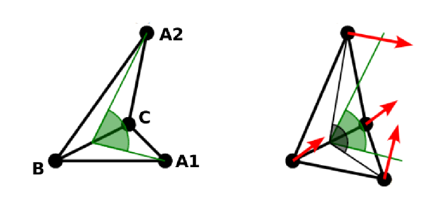

.. _Bonded interactions:

Bonded interactions
===================

Bonded interactions are configured by the
:class:`espressomd.interactions.BondedInteractions` class, which is
a member of :class:`espressomd.system.System`. Generally, one may use
the following syntax to activate and assign a bonded interaction::

    system.bonded_inter.add(bond)
    system.part[pid1].add_bond((bond, pid2...))

In general, one instantiates an interaction object ``bond`` and subsequently passes it
to :meth:`espressomd.interactions.BondedInteractions.add`. This will enable the
bonded interaction and allows the user to assign bonds between particle ids *pidX*.
Bonded interactions are identified by either their *bondid* or their appropriate object.

Defining a bond between two particles always involves three steps:
defining the interaction, adding it to the system and applying it to the particles.
To illustrate this, assume that three particles with ids 42, 43 and 12 already exist.
One could for example create FENE bonds (more information about the FENE bond
is provided in subsection :ref:`FENE bond`) between them using::

    fene = FeneBond(k=1, d_r_max=1)
    system.bonded_inter.add(fene)
    system.part[42].add_bond((fene, 43), (fene, 12))
    system.part[12].add_bond((fene, 43))

This will set up a FENE bond between particles 42 and 43, 42 and 12, and 12 and 43.
Note that the ``fene`` object specifies the type of bond and its parameters,
the specific bonds are stored within the particles. You can find more
information regarding particle properties in :ref:`Setting up particles`.

To delete the FENE bond between particles 12 and 43::

    system.part[12].delete_bond((fene, 43))

.. _Distance-dependent bonds:

Distance-dependent bonds
------------------------

.. _FENE bond:

FENE bond
~~~~~~~~~

A FENE (finite extension nonlinear elastic) bond can be instantiated via
:class:`espressomd.interactions.FeneBond`::

    from espressomd.interactions import FeneBond
    fene = FeneBond(k=<float>, d_r_max=<float>, r_0=<float>)

This command creates a bond type identifier with a FENE
interaction. The FENE potential

.. math::

   V(r) = -\frac{1}{2} K \Delta r_\mathrm{max}^2\ln \left[ 1 - \left(
         \frac{r-r_0}{\Delta r_\mathrm{max}} \right)^2 \right]

models a rubber-band-like, symmetric interaction between two particles with magnitude
:math:`K`, maximal stretching length :math:`\Delta r_0` and equilibrium bond length
:math:`r_0`. The bond potential diverges at a particle distance
:math:`r=r_0-\Delta r_\mathrm{max}` and :math:`r=r_0+\Delta r_\mathrm{max}`.

.. _Harmonic bond:

Harmonic bond
~~~~~~~~~~~~~

A harmonic bond can be instantiated via
:class:`espressomd.interactions.HarmonicBond`::

    from espressomd.interactions import HarmonicBond
    hb = HarmonicBond(k=<float>, r_0=<float>, r_cut=<float>)

This creates a bond type identifier with a classical harmonic
potential. It is a symmetric interaction between two particles. With the
equilibrium length :math:`r_0` and the magnitude :math:`k`. It is given by

.. math:: V(r) = \frac{1}{2} k \left( r - r_0 \right)^2

The third, optional parameter defines a cutoff radius. Whenever a
harmonic bond gets longer than :math:`r_\mathrm{cut}`, the bond will be reported as broken,
and a background error will be raised.

.. _Harmonic Dumbbell Bond:

Harmonic Dumbbell Bond
~~~~~~~~~~~~~~~~~~~~~~

.. note::

    Requires ``ROTATION`` feature.

A harmonic Dumbbell bond can be instantiated via
:class:`espressomd.interactions.HarmonicDumbbellBond`::

    from espressomd.interactions import HarmonicDumbbellBond
    hdb = HarmonicDumbbellBond(k1=<float>, k2=<float>, r_0=<float>, r_cut=<float>)

This bond is similar to the normal harmonic bond in such a way that it
sets up a harmonic potential, i.e. a spring, between the two particles.
Additionally the orientation of the first particle in the bond will be aligned along
the distance vector between both particles. This alignment can be
controlled by the second harmonic constant :math:`k_2`. Keep in mind that orientation will
oscillate around the distance vector and some kind of
friction needs to be present for it to relax.

The roles of the parameters :math:`k_1, r_0, r_\mathrm{cut}` are exactly the same as for the
harmonic bond.

.. _Quartic bond:

Quartic bond
~~~~~~~~~~~~

A quartic bond can be instantiated via
:class:`espressomd.interactions.QuarticBond`.

The potential is minimal at particle distance :math:`r=R`. It is given by

.. math:: V(r) = \frac{1}{2} K_0 \left( r - R \right)^2 + \frac{1}{4} K_1 \left( r - R \right)^4

The fourth, optional, parameter defines a cutoff radius. Whenever a
quartic bond gets longer than ``r_cut``, the bond will be reported as broken, and
a background error will be raised.

.. _Bonded Coulomb:

Bonded Coulomb
~~~~~~~~~~~~~~

.. note::

    Requires ``ELECTROSTATICS`` feature.

A pairwise Coulomb interaction can be instantiated via
:class:`espressomd.interactions.BondedCoulomb`::

    bonded_coulomb = espressomd.interactions.BondedCoulomb(prefactor=1.0)
    system.bonded_inter.add(bonded_coulomb)
    system.part[0].add_bond((bonded_coulomb, 1))

This creates a bond with a Coulomb pair potential between particles ``0`` and ``1``.
It is given by

.. math:: V(r) = \alpha \frac{q_1 q_2}{r},

where :math:`q_1` and :math:`q_2` are the charges of the bound particles and :math:`\alpha` is the
Coulomb prefactor. This interaction has no cutoff and acts independently of other
Coulomb interactions.

.. _Subtract P3M short-range bond:

Subtract P3M short-range bond
~~~~~~~~~~~~~~~~~~~~~~~~~~~~~

.. note::

    Requires the ``P3M`` feature.

This bond can be instantiated via
:class:`espressomd.interactions.BondedCoulombSRBond`::

    from espressomd.interactions import BondedCoulombSRBond
    subtr_p3m_sr = BondedCoulombSRBond(q1q2=<float>)

The parameter ``q1q2`` sets the charge factor of the short-range P3M interaction.
It can differ from the actual particle charges.  This specialized bond can be
used to cancel or add **only the short-range** electrostatic part
of the P3M solver. A use case is described in :ref:`Particle polarizability with
thermalized cold Drude oscillators`.

.. _Rigid bonds:

Rigid bonds
~~~~~~~~~~~

.. note::

    Requires ``BOND_CONSTRAINT`` feature.

A rigid bond can be instantiated via
:class:`espressomd.interactions.RigidBond`::

    from espressomd.interactions import RigidBond
    rig = RigidBond(r=<float>, ptol=<float>, vtol=<float> )

To simulate rigid bonds, |es| uses the Rattle Shake algorithm which satisfies
internal constraints for molecular models with internal constraints,
using Lagrange multipliers.\ :cite:`andersen83a` The constrained bond distance
is named ``r``, the positional tolerance is named ``ptol`` and the velocity tolerance
is named ``vtol``.

.. _Thermalized distance bond:

Thermalized distance bond
~~~~~~~~~~~~~~~~~~~~~~~~~

A thermalized bond can be instantiated via
:class:`espressomd.interactions.ThermalizedBond`::

    from espressomd.interactions import ThermalizedBond
    thermalized_bond = ThermalizedBond(temp_com=<float>, gamma_com=<float>,
                                       temp_distance=<float>, gamma_distance=<float>,
                                       r_cut=<float>, seed=<int>)
    system.bonded_inter.add(thermalized_bond)

This bond can be used to apply Langevin thermalization on the centre of mass
and the distance of a particle pair.  Each thermostat can have its own
temperature and friction coefficient.

The bond is closely related to simulating :ref:`Particle polarizability with
thermalized cold Drude oscillators`.

.. _Tabulated distance:

Tabulated distance
~~~~~~~~~~~~~~~~~~

A tabulated bond length can be instantiated via
:class:`espressomd.interactions.TabulatedDistance`::

    from espressomd.interactions import TabulatedDistance
    tab_dist = TabulatedDistance(min=<min>, max=<max>,
                                 energy=<energy>, force=<force>)
    system.bonded_inter.add(tab_dist)
    system.part[0].add_bond((tab_dist, 1))

This creates a bond type identifier with a tabulated potential. The force acts
in the direction of the connecting vector between the particles. The bond breaks
above the tabulated range, but for distances smaller than the tabulated range,
a linear extrapolation based on the first two tabulated force values is used.
For details of the interpolation, see :ref:`Tabulated interaction`.

.. _Virtual bonds:

Virtual bonds
~~~~~~~~~~~~~

A virtual bond can be instantiated via
:class:`espressomd.interactions.Virtual`::

    from espressomd.interactions import Virtual
    tab = Virtual()

This creates a virtual bond type identifier for a pair bond
without associated potential or force. It can be used to specify topologies
and for some analysis that rely on bonds, or for bonds that should be
displayed in the visualization.

.. _Bond-angle interactions:

Bond-angle interactions
-----------------------

Bond-angle interactions involve three particles forming the angle :math:`\phi`, as shown in the schematic below.

.. _inter_angle:
.. figure:: figures/inter_angle.png
   :alt: Bond-angle interactions
   :align: center
   :height: 12.00cm

This allows for a bond type having an angle-dependent potential. This potential
is defined between three particles and depends on the angle :math:`\phi`
between the vectors from the central particle to the two other particles.

Similar to other bonded interactions, these are defined for every particle triplet and must be added to a particle (see :attr:`espressomd.particle_data.ParticleHandle.bonds`), in this case the central one.
For example, for the schematic with particles ``id=0``, ``1`` (central particle) and ``2`` the bond was defined using ::

    >>> system.part[1].add_bond((bond_angle, 0, 2))

The parameter ``bond_angle`` is an instance of one of four possible bond-angle
classes, described below.

Harmonic angle potential
~~~~~~~~~~~~~~~~~~~~~~~~

:class:`espressomd.interactions.AngleHarmonic`

Equation:

.. math:: V(\phi) = \frac{K}{2} \left(\phi - \phi_0\right)^2.

:math:`K` is the bending constant and :math:`\phi_0` is the equilibrium bond
angle in radians ranging from 0 to :math:`\pi`.

Example::

    >>> angle_harmonic = AngleHarmonic(bend=1.0, phi0=2 * np.pi / 3)
    >>> system.bonded_inter.add(angle_harmonic)
    >>> system.part[1].add_bond((angle_harmonic, 0, 2))

Cosine angle potential
~~~~~~~~~~~~~~~~~~~~~~

:class:`espressomd.interactions.AngleCosine`

Equation:

.. math:: V(\phi) = K \left[1 - \cos(\phi - \phi_0)\right]

:math:`K` is the bending constant and :math:`\phi_0` is the equilibrium bond
angle in radians ranging from 0 to :math:`\pi`.

Around :math:`\phi_0`, this potential is close to a harmonic one
(both are :math:`1/2(\phi-\phi_0)^2` in leading order), but it is
periodic and smooth for all angles :math:`\phi`.

Example::

    >>> angle_cosine = AngleCosine(bend=1.0, phi0=2 * np.pi / 3)
    >>> system.bonded_inter.add(angle_cosine)
    >>> system.part[1].add_bond((angle_cosine, 0, 2))

Harmonic cosine potential
~~~~~~~~~~~~~~~~~~~~~~~~~

:class:`espressomd.interactions.AngleCossquare`

Equation:

.. math:: V(\phi) = \frac{K}{2} \left[\cos(\phi) - \cos(\phi_0)\right]^2

:math:`K` is the bending constant and :math:`\phi_0` is the equilibrium bond
angle in radians ranging from 0 to :math:`\pi`.

This form is used for example in the GROMOS96 force field. The
potential is :math:`1/8(\phi-\phi_0)^4` around :math:`\phi_0`, and
therefore much flatter than the two aforementioned potentials.

Example::

    >>> angle_cossquare = AngleCossquare(bend=1.0, phi0=2 * np.pi / 3)
    >>> system.bonded_inter.add(angle_cossquare)
    >>> system.part[1].add_bond((angle_cossquare, 0, 2))

Tabulated angle potential
~~~~~~~~~~~~~~~~~~~~~~~~~

A tabulated bond angle can be instantiated via
:class:`espressomd.interactions.TabulatedAngle`::

    from espressomd.interactions import TabulatedAngle
    theta = np.linspace(0, np.pi, num=91, endpoint=True)
    angle_tab = TabulatedAngle(energy=10 * (theta - 2 * np.pi / 3)**2,
                               force=10 * (theta - 2 * np.pi / 3) / 2)
    system.bonded_inter.add(angle_tab)
    system.part[1].add_bond((angle_tab, 0, 2))

The energy and force tables must be sampled from :math:`0` to :math:`\pi`,
where :math:`\pi` corresponds to a flat angle. The forces are scaled with the
inverse length of the connecting vectors. The force on the extremities acts
perpendicular to the connecting vector between the corresponding particle and
the center particle, in the plane defined by the three particles. The force on
the center particle balances the other two forces.
For details of the interpolation, see :ref:`Tabulated interaction`.

.. _Dihedral interactions:

Dihedral interactions
---------------------

Dihedral potential with phase shift
~~~~~~~~~~~~~~~~~~~~~~~~~~~~~~~~~~~

Dihedral interactions are available through the :class:`espressomd.interactions.Dihedral` class::

    from espressomd.interactions import Dihedral
    dihedral = Dihedral(bend=<K>, mult=<n>, phase=<phi_0>)
    system.bonded_inter.add(dihedral)
    system.part[1].add_bond((dihedral, 0, 2, 3))

This creates a bond type identifier with a dihedral potential, a
four-body-potential. In the following, let the particle for which the
bond is created be particle :math:`p_2`, and the other bond partners
:math:`p_1`, :math:`p_3`, :math:`p_4`, in this order. Then, the
dihedral potential is given by

.. math:: V(\phi) = K\left[1 - \cos(n\phi - \phi_0)\right],

where :math:`n` is the multiplicity of the potential (number of minima) and can
take any integer value (typically from 1 to 6), :math:`\phi_0` is a phase
parameter and :math:`K` is the bending constant of the potential. :math:`\phi` is
the dihedral angle between the particles defined by the particle
quadruple :math:`p_1`, :math:`p_2`, :math:`p_3` and :math:`p_4`, the
angle between the planes defined by the particle triples :math:`p_1`,
:math:`p_2` and :math:`p_3` and :math:`p_2`, :math:`p_3` and
:math:`p_4`:

.. _inter_dihedral:
.. figure:: figures/dihedral-angle.pdf
   :alt: Dihedral interaction
   :align: center
   :height: 12.00cm

Together with appropriate Lennard-Jones interactions, this potential can
mimic a large number of atomic torsion potentials.

Tabulated dihedral potential
~~~~~~~~~~~~~~~~~~~~~~~~~~~~

A tabulated dihedral interaction can be instantiated via
:class:`espressomd.interactions.TabulatedDihedral`::

    from espressomd.interactions import TabulatedDihedral
    dihedral_tab = TabulatedDihedral(energy=<energy>, force=<force>)
    system.bonded_inter.add(dihedral_tab)
    system.part[1].add_bond((dihedral_tab, 0, 2, 3))

The energy and force tables must be sampled from :math:`0` to :math:`2\pi`.
For details of the interpolation, see :ref:`Tabulated interaction`.

Object-in-fluid interactions
----------------------------

Please cite :cite:`Cimrak2014` when using the interactions in this section in
order to simulate extended objects embedded in a LB fluid. For more details
please consult the dedicated OIF documentation available at
`http://cell-in-fluid.fri.uniza.sk/en/content/oif-espresso
<https://web.archive.org/web/20180719231829/http://cell-in-fluid.fri.uniza.sk/en/content/oif-espresso>`_.

The following interactions are implemented in order to mimic the
mechanics of elastic or rigid objects immersed in the LB fluid flow.
Their mathematical formulations were inspired by
:cite:`dupin07`. Details on how the bonds can be used for
modeling objects are described in section :ref:`Object-in-fluid`.

OIF local forces
~~~~~~~~~~~~~~~~

OIF local forces are available through the :class:`espressomd.interactions.OifLocalForces` class.

This type of interaction is available for closed 3D immersed objects flowing in the LB flow.

This interaction comprises three different concepts. The local
elasticity of biological membranes can be captured by three different
elastic moduli. Stretching of the membrane, bending of the membrane and
local preservation of the surface area. Parameters
:math:`{L^0_{AB}},\ {k_s},\ {k_{slin}}` define the stretching,
parameters :math:`\phi,\ k_b` define the bending, and
:math:`A_1,\ A_2,\ k_{al}` define the preservation of local area. They
can be used all together, or, by setting any of
:math:`k_s, k_{slin}, k_b, k_{al}` to zero, the corresponding modulus
can be turned off.

Stretching
^^^^^^^^^^

For each edge of the mesh, :math:`L_{AB}` is the current distance between point :math:`A` and
point :math:`B`. :math:`L^0_{AB}` is the distance between these points in the relaxed state, that
is if the current edge has the length exactly , then no forces are
added. :math:`\Delta L_{AB}` is the deviation from the relaxed
state, that is :math:`\Delta L_{AB} = L_{AB} - L_{AB}^0`. The
stretching force between :math:`A` and :math:`B` is calculated using

.. math:: F_s(A,B) = (k_s\kappa(\lambda_{AB}) + k_{s,\mathrm{lin}})\Delta L_{AB}n_{AB}.

Here, :math:`n_{AB}` is the unit vector pointing from :math:`A` to :math:`B`, :math:`k_s` is the
constant for nonlinear stretching, :math:`k_{s,\mathrm{lin}}` is the constant for
linear stretching, :math:`\lambda_{AB} = L_{AB}/L_{AB}^0`, and :math:`\kappa`
is a nonlinear function that resembles neo-Hookean behavior

.. math::

   \kappa(\lambda_{AB}) = \frac{\lambda_{AB}^{0.5} + \lambda_{AB}^{-2.5}}
   {\lambda_{AB} + \lambda_{AB}^{-3}}.

Typically, one wants either nonlinear or linear behavior and therefore
one of :math:`k_s, k_{s,\mathrm{lin}}` is zero. Nonetheless the interaction will work if
both constants are non-zero.

|image2|

.. |image2| image:: figures/stretching.png

Bending
^^^^^^^

The tendency of an elastic object to maintain the resting shape is
achieved by prescribing the preferred angles between neighboring
triangles of the mesh.

Denote the angle between two triangles in the resting shape by
:math:`\theta^0`. For closed immersed objects, one always has to set the
inner angle. The deviation of this angle
:math:`\Delta \theta = \theta - \theta^0` defines two bending forces for
two triangles :math:`A_1BC` and :math:`A_2BC`

.. math:: F_{bi}(A_iBC) = k_b \Delta \theta  n_{A_iBC}

Here, :math:`n_{A_iBC}` is the unit normal vector to the triangle :math:`A_iBC`.
The force :math:`F_{bi}(A_iBC)` is assigned
to the vertex not belonging to the common edge. The opposite force
divided by two is assigned to the two vertices lying on the common edge.
This procedure is done twice, for :math:`i=1` and for
:math:`i=2`.

|image3|

Local area conservation
^^^^^^^^^^^^^^^^^^^^^^^

This interaction conserves the area of the triangles in the
triangulation. The area constraint assigns the following shrinking/expanding force to
vertex :math:`A`

.. math:: F_{AT} = k_{al} \vec{AT}\frac{\Delta S_\triangle}{t_a^2 + t_b^2 + t_c^2}

where :math:`\Delta S_\triangle` is the difference between current :math:`S_\triangle` and area :math:`S^0` of the triangle in relaxed state, :math:`T` is the centroid of the triangle, and :math:`t_a, t_b, t_c` are the lengths of segments :math:`AT, BT, CT`, respectively. Similarly the
analogical forces are assigned to :math:`B` and :math:`C`.

OIF local force is asymmetric. After creating the interaction

::

    local_inter = OifLocalForces(r0=1.0, ks=0.5, kslin=0.0, phi0=1.7, kb=0.6, A01=0.2,
                                 A02=0.3, kal=1.1, kvisc=0.7)

it is important how the bond is created. Particles need to be mentioned
in the correct order. Command

::

    p1.add_bond((local_inter, p0.part_id, p2.part_id, p3.part_id))

creates a bond related to the triangles 012 and 123. The particle 0
corresponds to point A1, particle 1 to C, particle 2 to B and particle 3
to A2. There are two rules that need to be fulfilled:

-  there has to be an edge between particles 1 and 2

-  orientation of the triangle 012, that is the normal vector defined as
   a vector product :math:`01 \times 02`, must point to the inside of
   the immersed object.

Then the stretching force is applied to particles 1 and 2, with the
relaxed length being 1.0. The bending force is applied to preserve the
angle between triangles 012 and 123 with relaxed angle 1.7 and finally,
local area force is applied to both triangles 012 and 123 with relaxed
area of triangle 012 being 0.2 and relaxed area of triangle 123 being
0.3.

Notice that also concave objects can be defined. If :math:`\theta_0` is
larger than :math:`\pi`, then the inner angle is concave.

|image4|

.. |image4| image:: figures/arealocal.png

OIF global forces
~~~~~~~~~~~~~~~~~

OIF global forces are available through the
:class:`espressomd.interactions.OifGlobalForces` class.

This type of interaction is available solely for closed 3D immersed
objects.

It comprises two concepts: preservation of global surface
and of volume of the object. The parameters :math:`S^0, k_{ag}`
define preservation of the surface while parameters
:math:`V^0, k_{v}` define volume preservation. They can be
used together, or, by setting either :math:`k_{ag}` or :math:`k_{v}` to
zero, the corresponding modulus can be turned off.

Global area conservation
^^^^^^^^^^^^^^^^^^^^^^^^

The global area conservation force is defined as

.. math:: F_{ag}(A) = k_{ag} \frac{S^{c} - S^{c}_0}{S^{c}_0} \cdot S_{ABC} \cdot \frac{t_{a}}{|t_a|^2 + |t_b|^2 + |t_c|^2},

where :math:`S^c` denotes the current surface of the immersed object, :math:`S^c_0` the surface in
the relaxed state, :math:`S_{ABC}` is the surface of the triangle, :math:`T` is the centroid of the triangle, and :math:`t_a, t_b, t_c` are the lengths of segments :math:`AT, BT, CT`, respectively.

Volume conservation
^^^^^^^^^^^^^^^^^^^

The deviation of the objects volume :math:`V` is computed from the volume in the
resting shape :math:`\Delta V = V - V^0`. For each
triangle the following force is computed

.. math:: F_v(ABC) = -k_v\frac{\Delta V}{V^0} S_{ABC} n_{ABC}

where :math:`S_{ABC}` is the area of triangle :math:`ABC`, :math:`n_{ABC}` is the
normal unit vector of the plane spanned by :math:`ABC`, and :math:`k_v`
is the volume constraint coefficient. The volume of one immersed object
is computed from

.. math:: V = \sum_{ABC}S_{ABC}\ n_{ABC}\cdot h_{ABC},

where the sum is computed over all triangles of the mesh and :math:`h_{ABC}` is the
normal vector from the centroid of triangle :math:`ABC` to any plane which does not
cross the cell. The force :math:`F_v(ABC)` is equally distributed to all three vertices
:math:`A, B, C.`

This interaction is symmetric. After the definition of the interaction
by

::

    global_force_interaction = OifGlobalForces(A0_g=65.3, ka_g=3.0, V0=57.0, kv=2.0)

the order of vertices is crucial. By the following command the bonds are
defined

::

    p0.add_bond((global_force_interaction, p1.part_id, p2.part_id))

Triangle 012 must have correct orientation, that is the normal vector
defined by a vector product :math:`01\times02`. The orientation must
point inside the immersed object.

