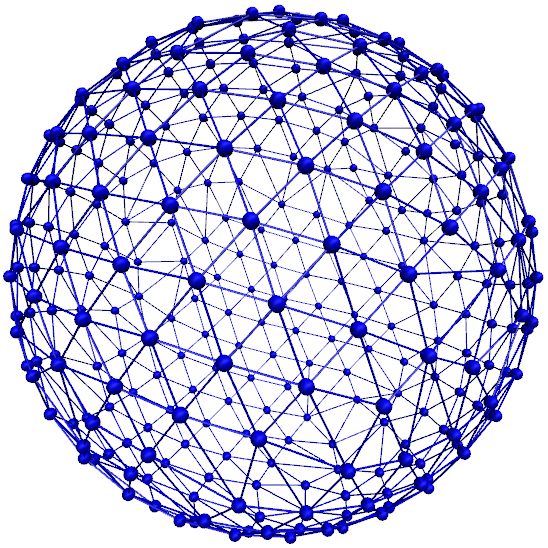

.. _Object-in-fluid:

Object-in-fluid
===============

Please cite  if you use the object-in-fluid implementation described
below. For more details also see the documentation at
http://cell-in-fluid.fri.uniza.sk/oif-documentation or contact the
Cell-in-fluid Research Group at University of Žilina.

Simulations using work mostly with objects (molecules, atoms, polymers,
colloids, crystals, …) that are physically composed of points linked
together with bonds. These objects are like skeletons, without inner or
outer volume.

The idea behind this module, is to use for objects that do have inner
volume, for example blood cells, magnetic beads, capsules, …The boundary
of an object is covered with triangular mesh. The vertices of the mesh
are declared in as particles. The edges of the mesh define elastic
forces keeping the shape of the object. The movement of object is
achieved by adding forces to the mesh points.

Modelled elastic or rigid objects are immersed in the LB fluid flow. The
fluid interacts with an elastic object resulting in its deformation;
this immediately generates forces acting back on the fluid. The aim is
to describe the immersed object using the notion of particles, and to
create bonds between these particles representing elastic or rigid
forces.

The objects are composed of a membrane encapsulating the fluid inside
the object. For now, the inside fluid must have the same density and
viscosity as the outside fluid. The object is represented by its
membrane (boundary), that is discretized using a triangulation. Such
triangulation defines interacting particles distributed on the surface
of the immersed object :cite:`dupin07`:

-  between two particles, corresponding to the edges in the
   triangulation (modelling the stretching of the membrane),

-  between three particles, corresponding to the triangles of the
   triangulation (local area, or local surface preservation of the
   membrane),

-  between four particles, corresponding to two triangles from the
   triangulation sharing a common edge (bending of the membrane).

The object immersed in the fluid moves under the influence of the
deforming forces, defined through the bonds, and under the influence of
the fluid motion. This interaction is based on the frictional force
between the fluid and the surface particles. Therefore the object moves
in the flow only if there is a nonzero difference between the fluid
velocity and the particle velocity. In other words, there has to be at
least small flow through the membrane, which is in most cases
unphysical. However, this unphysical flow through the membrane is
probably negligible in larger scales.

Membranes
---------

With this approach, it is easy to model also elastic sheets, or free
membranes that do not necessarily enclose a 3D object. In this case,
area\_force\_global and volume\_force interactions are not needed, since
these two interactions are meant for closed immersed objects.

Parameters
----------

There are several parameters involved in this model. All of them should
be calibrated according to the intended application.

-  Mass of the particles. Every particle has its mass, which influences
   the dynamics.

-  Friction coefficient. The main parameter describing the
   fluid-particle interaction is the ``riction \ parameter ``\ rom the
   command ``bf``\ uid .

-  Parameters of elastic moduli. Elastic behaviour can be described by
   five different elastic moduli: hyperelastic stretching, linear
   stretching, bending, local and global area preservation and volume
   preservation. Each of them has its own scaling parameter:
   :math:`k_s, ks_{lin}, k_b, k_{al}, k_{ag}, k_v`. Their mathematical
   formulations have been taken from :cite:`dupin07`.

The mass of the particles and the friction coefficient can be calibrated
using the drag coefficients of the ellipsoidal objects. These drag
coefficients have known analytical values and the mass and friction can
be calibrated to fit this values. More details about the calibration can
be found in :cite:`cimrak`.

The elastic parameters are specific to the immersed objects. They
correspond to their physical values. More details about their mechanical
and biological meaning is presented in :cite:`dao03`
specifically for red blood cells. However, the proper calibration to fit
the experimental data has been performed in :cite:`cimrak`.

Geometry
--------

The membrane of the immersed object is triangulated. In
doc/tutorials/03-object\_in\_fluid you can find an example using
deformable objects in the fluid.

|image|

Triangulation can be obtained using various software tools. Two files
are needed for mesh input:
``mesh-nodes.dat`` and ``mesh-triangles.dat``. The parameters of
the mesh are the number of particles on the surface of the immersed
object, denoted by ``mesh_nnode``, and the number of triangular faces
in the triangulation, denoted by ``mesh_ntriangle``. These parameters
are obtained automatically from ``mesh-nodes.dat`` and ``mesh-triangles.dat`` 
by counting the number of lines in respective files.

The ``mesh-nodes.dat`` thus contains ``mesh_nnode`` lines with three
real numbers separated by blank space, representing three coordinates of
the corresponding particle. The membrane is thus discretized into
``mesh_nnode`` particles with IDs starting from 0 to ``mesh_nnode-1``.
The IDs are assigned in the same order as in the ``mesh-nodes.dat``
file.

The ``mesh-triangles.dat`` contains ``mesh_ntriangle`` lines with three
nonnegative integers separated by blank space. Each line represents one
triangle in the triangulation. For algorithmic purposes it is crucial to
have defined a correct orientation of the triangle. The orientation is
defined using the normal vector associated with the triangle. The
important rule is that the normal vector of the triangle must point
inside the immersed object.

As an example, let us have one line in the file ``mesh-triangles.dat``
with numbers 4, 0 and 7. This means that particles with IDs 4, 0 and 7
form one triangular face of the triangulation. The orientation is
defined as follows: create two vectors :math:`v_1` and :math:`v_2`, such
that :math:`v_1` is pointing from particle 4 to particle 0, and
:math:`v_2` is pointing from particle 4 to particle 7. Be careful, the
order of vectors and particles matters!

The normal vector :math:`n` is computed as a vector product
:math:`v_1 \times v_2`. The direction of :math:`n` can be determined by
the rule of right hand: the thumb points in the :math:`v_1` direction,
the index finger in the :math:`v_2` direction and the middle finger in
the :math:`n` direction. Following this principle, all the lines in the
``mesh-triangles.dat`` files must be such that the normal vectors of the
corresponding triangles points inside the immersed object.

These two files are sufficient to describe the geometry and topology of
the triangulation. The following geometric entities are necessary for
the definition of bonded interactions: position of the particles, edges,
lengths of the edges, triangles, areas of triangles, angles between two
triangles sharing a common edge, surface of the immersed object, volume
of the immersed object. All these geometrical entities can be computed
using the information from the files ``mesh-nodes.dat`` and
``mesh-triangles.dat`` and the computation is done in the script
``scripts/object_in_fluid.tcl`` .

The script ``scripts/object_in_fluid.tcl`` reads both mesh files,
generates list of edges, and computes all geometrical entities needed
for definition of bonded interactions. It then executes commands
creating the particles, interactions and bonds.An example of ``part``
command is as follows:

::

     part 0 pos 3.0 3.0 6.0 type 1 mol 1 mass 1 

Note, the is feature ``mol`` that used for the particles. We use this
feature we distinguish between different objects. The upper limit for
the number of objects is 10000. However it can be increased by changing
the ``MAX_OBJECTS_IN_FLUID`` constant.

The following example shows an interaction.

::

     inter 106 oif_local_force 1.0 0.5 0.0 1.7 0.6 0.2 0.3 1.1 

This command (“invisible” for the user who executes the
``cript``/object\_in\_fluid.tcl  script) takes care of stretching,
bending and local area conservation all in one interaction with ID 106.
Detailed description of the available types of interactions is presented
in Section [sec:inter-bonded-oif].

Available commands
------------------

In order to use the object-in-fluid (OIF) commands and work with
immersed objects, the following features need to be compiled in:
``ASS, \ \verb EXTERNAL_FORCES . We do not specifically require \verb LB, \ \verb LB_BOUNDARIES, \ \verb CONSTRAINTS, \ \verb SOFT_SPHERE, \ \verb ``\ EMBRANE\_COLLISION,
 ``IF_L``\ CAL\_FORCES,  ``IF_GL``\ BAL\_FORCES.  They are most likely
to be used (for objects immersed in fluid and interacting with
boundaries and each other), but they are not necessary for the following
commands. For up-to-date overview of available oif commands see the OIF
user guide at cell-in-fluid.fri.uniza.sk/oif-documentation.

[ssec:oif-init]Initialisation
~~~~~~~~~~~~~~~~~~~~~~~~~~~~~

oif\_init

Must be used before any other OIF command, initializes all global
variables and lists, does not take any arguments.

[ssec:oif-info]Information about object-in-fluid structures
~~~~~~~~~~~~~~~~~~~~~~~~~~~~~~~~~~~~~~~~~~~~~~~~~~~~~~~~~~~

oif\_info

Prints information about whole framework, all global variables,
currently available templates and objects, etc. Does not take any
arguments.

[ssec:oif-create-template]Templates for objects
~~~~~~~~~~~~~~~~~~~~~~~~~~~~~~~~~~~~~~~~~~~~~~~

template-id nodes-file triangles-file

This command creates a template that will be used for all objects that
share the same elastic properties and have the same triangulation.

specifies a unique ID for each template. The first template has the ID
0. The following ones need to be be numbered consecutively.

input file, each line contains three real numbers. These are the
:math:`x, y, z` coordinates of individual surface mesh nodes of the
objects.

input file, each line contains three integers. These are the ID numbers
of the mesh nodes as they appear in . Note, the first node has ID 0.

coefficients by which the coordinates stored in will be stretched in the
:math:`x, y, z` direction. The default values are 1.0 1.0 1.0.

| whether the respective coordinate will be flipped around 0.
  Coefficients :math:`x, y, z` must be either 0 or 1. The reflection of
  only one coordinate is allowed so at most one number is 1, others are
  0. For example ``mirror`` *0 1 0* results in flipping the spatial
  point :math:`(x,y,z)` to :math:`(x,-y,z)`. The default value is 0 0 0.

elastic modulus for hyperelastic stretching forces

elastic modulus for linear stretching forces

elastic modulus for bending forces

elastic modulus for local area forces

elastic modulus for global area forces

elastic modulus for volume forces

switch to turn on the computation of local outward normal vectors

The four switches ``ks``, ``kslin``, ``kb`` and ``kal`` set elastic
parameters for local interactions - ``ks`` for hyperelastic edge
stiffness, ``kslin`` for linear edge stiffness, ``kb`` for angle
preservation stiffness and ``kal`` for triangle surface preservation
stiffness. This stiffness can be either uniform over the whole object,
or non-uniform. In case of stretching modulus, we can have spring
stiffness the same for all edges in the whole object, or we can choose
the value for every edge of the object separately. Analogically, for
``kslin``, for ``kal`` and ``kb``. Therefore, there are two options for
setting ``ks``, ``kslin``, ``kal`` and ``kb`` stiffness. Here is the
explanation for ``ks``:

-  **Uniform stiffness:** To set uniform hyperelastic stiffness for all
   edges in the object, use ``ks``

-  **Non-uniform stiffness:** To set non-uniform hyperelastic stiffness,
   prepare a file with number of lines equal to the number of edges of
   the triangulation. Each line should contain a real number between 0
   and 1, so called “weight”. Then call ``ks`` This command reads the
   weights :math:`weight_i` for each edge and the stiffness for that
   edge is set to

   .. math:: ks_i = ksMin * (1 - weight_i) + ksMax*(weight_i)

   For bending stiffness, must contain the same number of lines as there
   are edges in the object. However, for local area preservation, the
   stiffness constant is linked to triangles. Therefore, must contain
   the same number of lines as there are triangles in the object.

[ssec:oif-add-object]Elastic objects
~~~~~~~~~~~~~~~~~~~~~~~~~~~~~~~~~~~~

object-id template-id origin part-type

Using a previously defined template , this command creates a new object.
Features ``OIF_LOCAL_FORCES``, ``OIF_GLOBAL_FORCES``,
``OIF_MEMBRANE_COLLISION`` are needed, if the template used the
corresponding elastic moduli.

unique ID for each object, the first object has the ID 0. The following
ones should be numbered consecutively.

object will be created using nodes, triangle incidences, elasticity
parameters and initial stretching saved in this template.

center of the object will be at this point.

can be any integer starting at 0. All particles of one object have the
same ``part-type``. One can have more objects with the same type of
particles, but this is not recommended, because the interactions between
objects are set up using these types.

angles in radians, by which the object is initially rotated around the
:math:`x, y, z` axis. Default values are 0.0 0.0 0.0.

this parameter refers to the mass of one particle (one mesh point of the
triangulation). For the proper setting, the mass of the whole membrane
must be distributed to all mesh points. Default value is 1.0.

[ssec:oif-mesh-analyze]Mesh analysis
~~~~~~~~~~~~~~~~~~~~~~~~~~~~~~~~~~~~

oif\_mesh\_analyze nodes-file triangles-file

This command is useful for some preparatory work with mesh before it is
used for creating elastic objects.

- file with coordinates of the mesh nodes. The center of the object
  should be as close to (0,0,0) as possible.

- file with incidences for all triangles. Each line of this file
  contains three integer IDs (starting from 0) with indices of three
  vertices forming one triangle.

checks whether all triangles of the surface mesh are properly oriented.
For now, only works for convex (or almost convex) objects.

outputs the corrected file into . For now, only works for convex (or
almost convex) objects. needs to be set to 1.

subtracts 1 from all numbers in and saves a new file . This is useful,
if the mesh generating software starts numbering the particles from 1
instead of 0.

[ssec:oif-object-output]Output information about specific object
~~~~~~~~~~~~~~~~~~~~~~~~~~~~~~~~~~~~~~~~~~~~~~~~~~~~~~~~~~~~~~~~

object-id

This command is used to output information about the object that can be
used for visualisation or as input for other simulations.

- the id of the object

outputs the mesh of the object to the desired . Paraview can directly
visualize this file.

the same as the previous option, however the whole object is shift such
that it is visualized within the simulation box. This option is useful
for simulating periodical processes when objects flowing out on one side
of simulation box are transferred to the opposite side.

outputs affinity bonds that are currently activated. If no bonds are
present, the file will be generated anyway with no bonds to visualize.
Paraview can directly visualize this file.

outputs the positions of the mesh nodes to . In fact, this command
creates a new file that can be used by ``oif_object_set``. The center of
the object is located at point (0,0,0). This command is aimed to store
the deformed shape in order to be loaded later.

[ssec:oif-object-analyze]Descriptive information about specific object
~~~~~~~~~~~~~~~~~~~~~~~~~~~~~~~~~~~~~~~~~~~~~~~~~~~~~~~~~~~~~~~~~~~~~~

object-id

This command is used to output information about the properties of the
object. Some of these properties can also be visualized.

- the id of the object

- outputs the location of the center of the object

computes six extremal coordinates of the object. More precisely, runs
through the all mesh points and remembers the minimal and maximal
:math:`x`-coordinate, :math:`y`-coordinate and :math:`z`-coordinate. If
is one of these: *z-min, z-max, x-min, x-max, y-min, y-max* then the
procedure returns one number according to the value of . If is , then
the procedure returns a list of six numbers, namely *x-min, x-max,
y-min, y-max, z-min, z-max*.

- outputs the approximate location of the center of the object. It is
  computed as average of 6 mesh points that have extremal :math:`x`,
  :math:`y` and :math:`z` coordinates at the time of object loading.

- outputs the minimum, average and maximum edge length of the object and
  corresponding standard deviation

- outputs the current volume of the object

- outputs the current surface of the object

- outputs the current average velocity of the object. Runs over all mesh
  points and calculates their average velocity.

[ssec:oif-object-set]Setting properties for specific object
~~~~~~~~~~~~~~~~~~~~~~~~~~~~~~~~~~~~~~~~~~~~~~~~~~~~~~~~~~~

object-id

This command sets some properties of the object.

- the id of the object

- sets the force vector () to all mesh nodes of the object. Setting is
  done using command ``part $i set ext_force`` . Note, that this command
  sets the external force in each integrate step. So if you want to use
  the external force only in one iteration, you need to set zero external
  force in the following integrate step

- moves the object so that the origin has coordinates

- deforms the object such that its origin stays unchanged, however the
  relative positions of the mesh points are taken from file . The file
  should contain the coordinates of the mesh points with the origin’s
  location at (0,0,0). The procedure also checks whether number of lines
  in the file is the same as the number of triangulation nodes of the
  object.

- stops all the particles in the object (analogue to the ``part ``
  ``fix 1 1 1`` command for single particles).

- releases the particles in the object (analogue to the ``part ``
  `` unfix`` command for single particles).

