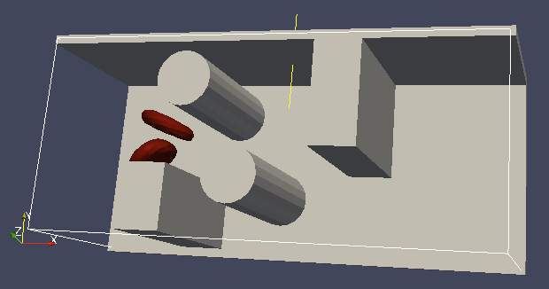
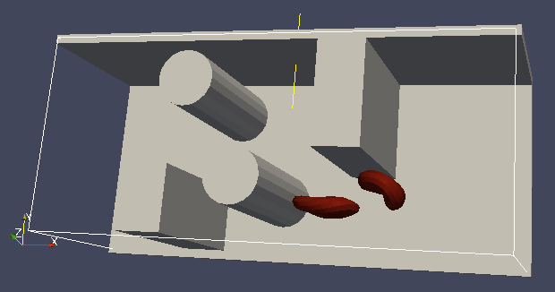
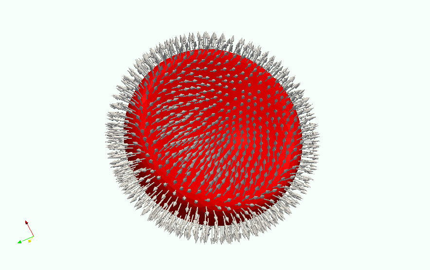

.. _Object-in-fluid:

Object-in-fluid
===============

| This documentation introduces the features of module Object-in-fluid
  (OIF). Even though was not primarily intended to work with closed
  objects, it is a flexible package and appears very suitable when one
  wants to model closed objects with elastic properties, especially if
  they are immersed in a moving fluid. Here we describe the module
  itself, offer some additional information to get you started with and
  provide a step by step tutorial that will show you how to use this
  module.
  
| The OIF module was developed for simulations of red blood cells
  flowing through microfluidic devices and therefore the elasticity
  features were designed with this application in mind. However, they
  are completely tunable and can be modified easily to allow the user
  model any elastic object moving in fluid flow.
  
  If using this module, please cite :cite:`Cimrak2014` (Bibtex key Cimrak2014 in doc/sphinx/zref.bib) and :cite:`Cimrak2012` (Bibtex key Cimrak2012 in doc/sphinx/zref.bib)
  
| If you still have questions after reading this document, please
  contact
| ivan.cimrak@fri.uniza.sk or iveta.jancigova@fri.uniza.sk.

|image1| |image2| |image3|

Configuring 
------------

| To enable various features of |es|, one has to modify myconfig.hpp file by
  uncommenting the desired features. This file should be placed into the
  build directory before running cmake.
  
| Note: Do not change the myconfig\_default.hpp in the source directory,
  since this file is created automatically by and is used only if no
  other myconfig file is found.

.. note:: 

    `The following features are required 
    LB, LB_BOUNDARIES, 
    EXTERNAL_FORCES, 
    MASS, CONSTRAINTS, OIF_LOCAL_FORCES, 
    OIF_GLOBAL_FORCES, SOFT_SPHERE, MEMBRANE_COLLISION`

To check, what features are currently compiled into your , use the
command::

    code_info.features()

in the simulation script.

Triangulations of elastic objects
---------------------------------

| To create an elastic object, we need a triangulation of the surface of
  this object. Sample triangulations are provided at
  http://cell-in-fluid.kst.fri.uniza.sk/en/content/oif-espresso. User
  can create her own in gmsh, salome or any other meshing software. The
  required format is as follows:
  
| The file ``some_nodes.dat`` should contain triplets of floats (one
  triplet per line), where each triplet represents the :math:`x, y` and
  :math:`z` coordinates of one node of the surface triangulation. No
  additional information should be written in this file, so this means
  that the number of lines equals the number of surface nodes. The
  coordinates of the nodes should be specified in such a way that the
  approximate center of mass of the object corresponds to the origin
  (0,0,0). This is for convenience when placing the objects at desired
  locations later.
  
| The file ``some_triangles.dat`` should also contain triplets of
  numbers, this time integers. These refer to the IDs of the nodes in
  the ``some_nodes.dat`` file and specify which three nodes form a
  triangle together. Please, note that the nodes’ IDs start at 0, i.e.
  the node written in the first line of ``some_nodes.dat`` has ID 0, the
  node in the second line, has ID 1, etc.

Description of sample script
-----------------------------

The script described in this section is available at
http://cell-in-fluid.kst.fri.uniza.sk/en/content/oif-espresso. 

In the first few lines, the script includes several imports related to
the red blood cell model, fluid, boundaries and interactions. Then we
have::

    system = espressomd.System() 
    system.time_step = 0.1 
    system.box_l = [22.0, 14.0, 15.0] 
    system.cell_system.skin = 0.2

Here we set up an system and its most important parameters. The ``skin``
depth tunes the system’s performance. The one important thing a user needs to know
about it is that it has to be strictly less than half the grid size.

``box_l`` sets up the dimensions of the 3D simulation box. You might
wonder what the units are. For now, you can think of them as
micrometers, we will return to them later.

``time_step`` is the time step that will be used in the simulation, for
the purposes here, in microseconds. It allows separate specification of
time step for the particles and for the fluid. This is useful when one
takes into account also thermal fluctuations relevant on molecular
level, however, for us, both of these time steps will mostly be
identical.

Specification of immersed objects
~~~~~~~~~~~~~~~~~~~~~~~~~~~~~~~~~
::

    cell_type = OifCellType(nodesfile=“input/rbc374nodes.dat”,
        trianglesfile=“input/rbc374triangles.dat”, system = system, 
        ks=0.02, kb=0.016, kal=0.02, kag=0.9, kv=0.5, resize=[2.0,2.0,2.0])

We do not create elastic objects directly but rather each one has to
correspond to a template, ``cell_type``, that has been created first.
The advantage of this approach is clear when creating many objects of
the same type that only differ by e.g. position or rotation, because in
such case it significantly speeds up the creation of objects that are
just copies of the same template.

The three mandatory arguments are ``nodes-file`` and ``triangles-file``
that specify input data files with desired triangulation and ``system``
that specifies the ESPResSo system. The relaxed mesh triangles should be
as close to equilateral as possible with average edge length
approximately equal to the space discretisation step :math:`\Delta x`.
While these lengths vary during the simulation, the connectivity of the
mesh nodes never changes. Basic meshes can be downloaded from our
website. This script assumes that the two necessary files are located
inside an ``input`` directory that resides in the same folder as the
simulation script.

All other arguments are optional. ``resize`` defines resizing in the
:math:`x, y, z` directions with respect to unit size of the object, so
in this case, the cell radius will be 2. ``ks``, ``kb``, ``kal``,
``kag``, ``kv`` specify the elastic properties: stretching, bending,
local area conservation, global area conservation and volume
conservation respectively.

The backslash allows the long command to continue over
multiple lines.

::

    cell = OifCell(cellType=cell_type, partType=0, origin=[5.0,5.0,3.0])

Next, an actual object is created and its initial position saved to a
*.vtk* file (the directory ``output/sim1`` needs to exist before the
script is run). Each object has to have a unique ID, specified using the
keyword ``partType``. The IDs have to start at 0 and increase
consecutively. The other two mandatory arguments are ``cellType`` and
``origin``. ``cellType`` specifies which previously defined cell type
will be used for this object. ``origin`` gives placement of object’s
center in the simulation box.

Specification of fluid and movement
~~~~~~~~~~~~~~~~~~~~~~~~~~~~~~~~~~~
::

    lbf = espressomd.lb.LBFluid(agrid = 1, dens = 1.0, visc = 1.5, 
        tau = time_step, fric = 1.5, ext_force = [0.002, 0.0, 0.0])
    system.actors.add(lbf)

This part of the script specifies the fluid that will get the system
moving. Here ``agrid`` :math:`=\Delta x` is the spatial discretisation
step, ``tau`` is the time step that will be the same as the time step
for particles, viscosity ``visc`` and density ``dens`` of the fluid are
physical parameters scaled to lattice units. ``fric`` is a
(non-physical) friction parameter that enters the fluid-object
interaction and has to be set carefully. Finally, ``ext_force`` sets the
force-per-unit-volume vector that drives the fluid. Another option to
add momentum to fluid is by specifying the velocity on the boundaries.

Here we achieved the movement of the fluid by applying external force.
It can also be done by setting the velocity of the individual
``lbnodes`` on one side of the channel and letting the flow develop, but
this is not a very convenient setup because it has to be done at every
integration step and the tcl-C communication slows down the computation.
Another alternative is to set up a wall/rhomboid with velocity. This
does not mean that the physical boundary is moving, but rather that it
transfers specified momentum onto the fluid.

Specification of boundaries
~~~~~~~~~~~~~~~~~~~~~~~~~~~

| To set up the geometry of the channels, we mostly use rhomboids and
  cylinders, but there are also other boundary types available in |es|. 
  The usage is described elsewhere.
  

|image4| |image5| |image6|

Each wall and obstacle has to be specified separately as a fluid
boundary and as a particle constraint. The former enters the simulation
as a boundary condition for the fluid, the latter serves for
particle-boundary interactions. Sample cylinder and rhomboid can then be
defined as follows. First we define the two shapes:

::

    boundary1 = shapes.Rhomboid(corner=[0.0,0.0,0.0], \
    a=[boxX,0.0,0.0], b=[0.0,boxY,0.0], c=[0.0,0.0,1.0], direction=1)
    boundary2 = shapes.Cylinder(center=[11.0,2.0,7.0], \
    axis=[0.0,0.0,1.0], length=7.0, radius=2.0, direction=1)

The ``direction 1`` determines that the fluid is on the *outside*. Next
we create boundaries for the fluid:

::

    system.lbboundaries.add(lbboundaries.LBBoundary(shape = boundary1))
    system.lbboundaries.add(lbboundaries.LBBoundary(shape = boundary2))

Followed by constraints for cells:

::

    system.constraints.add(shape=boundary1, particle_type=10)
    system.constraints.add(shape=boundary2, particle_type=10)

The ``particle_type=10`` will be important for specifying cell-wall
interactions later. And finally, we output the boundaries for
visualisation:

::

    output_vtk_rhomboid(corner=[0.0,0.0,0.0], a=[boxX,0.0,0.0], \ 
    b=[0.0,boxY,0.0], c=[0.0,0.0,1.0], out_file="output/sim1/wallBack.vtk")
    output_vtk_cylinder(center=[11.0,2.0,7.0], axis=[0.0,0.0,1.0], length=7.0, \
    radius=2.0, n=20, out_file="output/sim1/obstacle.vtk")

| Note that the method for cylinder output also has an argument ``n``.
  This specifies number of rectangular faces on the side.
  
| It is a good idea to output and visualize the boundaries and objects
  just prior to running the actual simulation, to make sure that the
  geometry is correct and no objects intersect with any boundaries.

Specification of interactions
~~~~~~~~~~~~~~~~~~~~~~~~~~~~~

Since we have two cells, we can also set up the cell-cell interactions
so that they *know* about each other:

::

    system.non_bonded_inter[0,1].membrane_collision.set_params( \
    membrane_a = 0.0001, membrane_n = 1.2, membrane_cut = 0.1, \
    membrane_offset = 0.0)

These interactions act *pointwise*, e.g. each particle of type 0 (all
mesh points of cell0) has a repulsive membrane collision interaction
with each particle of type 1 (all mesh points of cell1) once the pair
gets closer than ``membrane_cut``.

Similar interaction is defined with the boundaries:

::

    system.non_bonded_inter[0,10].soft_sphere.set_params( \ 
    soft_a = 0.0001, soft_n = 1.2, soft_cut = 0.1, soft_offset = 0.0)

These interactions are also *pointwise*, e.g. each particle of type 0
(that means all mesh points of cell) will have a repulsive soft-sphere
interaction with all boundaries of type 10 (here all boundaries) once it
gets closer than ``soft_cut``. The parameters ``soft_a`` and ``soft_n``
adjust how strong the interaction is and ``soft_offset`` is a distance
offset, which will always be zero for our purposes.

System integration
~~~~~~~~~~~~~~~~~~

And finally, the heart of this script is the integration loop at the
end:

::

    for i in range(1,101):
        system.integrator.run(steps=500)
        cell.output_vtk_pos_folded(filename="output/sim1/cell_" \
        + str(i) + ".vtk")
        print "time: ", str(i*time_step)
    print "Simulation completed."

This simulation runs for 100 cycles. In each cycle, 500 integration
steps are performed and output is saved into files
*output/sim1/cell\_i.vtk*. Note that they differ only by the number
before the *.vtk* extension (this variable changes due to the ``for``
loop) and this will allow us to animate them in the visualisation
software. ``str`` changes the type of ``i`` from integer to string, so
that it can be used in the filename. The strings can be joined together
by the + sign. Also, in each pass of the loop, the simulation time is
printed in the terminal window and when the integration is complete, we
should get a message about it.

| To sum up, the proper order of setting up a individual simulation
  parts is as follows:
| - cell types
| - cells
| - fluid
| - fluid boundaries
| - interactions
| If cell types and cells are specified after the fluid, the simulation
  is slower. Also, interactions can only be defined once both the
  objects and boundaries exist. Technically, the fluid boundaries can be
  specified before fluid, but it is really not recommended.
  
  

Running the simulation
~~~~~~~~~~~~~~~~~~~~~~

Make sure that the files *oif\_classes.py, oif\_utils.py* are located in
the same directory as your simulation script. The script can then be run
in terminal using

::

    ../pypresso script.py 

Here ``script.py`` is the name of the script we just went over and
``../pypresso`` should be replaced with the path to your executable.
This command assumes that we are currently in the same directory as the
script. Once the command is executed, messages should appear on the
terminal about the creation of cell type, cell and the integration
steps.

Writing out data
~~~~~~~~~~~~~~~~

In the script, we have used the commands such as

::

    cell.output_vtk_pos_folded(filename="output/sim1/cell_" + str(i) + ".vtk")

to output the information about cell in in every pass of the simulation
loop. These files can then be used for inspection in ParaView and
creation of animations. It is also possible to save a .vtk file for the
fluid. And obviously, one can save various types of other data into text
or data files for further processing and analysis.

Visualization in ParaView
-------------------------

| For visualization we suggest the free software ParaView. All .vtk
  files (boundaries, fluid, objects at all time steps) can be loaded at
  the same time. The loading is a two step process, because only after
  pressing the Apply button, are the files actually imported. Using the
  eye icon to the left of file names, one can turn on and off the
  individual objects and/or boundaries.
  
| Fluid can be visualized using Filters/Alphabetical/Glyph (or other
  options from this menu. Please, refer to the ParaView user’s guide for
  more details).
  
| Note, that ParaView does not automatically reload the data if they
  have been changed in the input folder, but a useful thing to know is
  that the created filters can be “recycled”. Once you delete the old
  data, load the new data and right-click on the existing filters, you
  can re-attach them to the new data.
  
| It is a good idea to output and visualize the boundaries and objects
  just prior to running the actual simulation, to make sure that the
  geometry is correct and no objects intersect with any boundaries. This
  would cause “particle out of range” error and crash the simulation.

File format
~~~~~~~~~~~

Paraview (download at http://www.paraview.org) accepts .vtk files. For
our cells we use the following format:

::

    # vtk DataFile Version 3.0
    Data
    ASCII
    DATASET POLYDATA
    POINTS 393 float
    p0x p0y p0z
    p1x p1y p1z
    ...
    p391x p391y p391z
    p392x p392y p392z
    TRIANGLE_STRIPS num_triang 4*num_triang
    3 p1 p2 p3
    3 p1 p3 p5
    ...
    3 p390 p391 p392

| where the cell has 393 surface nodes (particles). After initial
  specification, comes the list of points, with x, y, z coordinates for
  each. Then we write the triangulation, since that is how is our
  surface specified. We need to know the number of triangles
  (``num_triang``) and the each line/triangle is specified by 4 numbers
  (so we are telling paraview to expect 4 *  ``um_triang``  numbers in
  the following lines. Each lines begins with 3 (which stands for a
  triangle) and three point IDs that tell us which three points (from
  the order above) form this specific triangle.

Color coding of scalar data by surface points
~~~~~~~~~~~~~~~~~~~~~~~~~~~~~~~~~~~~~~~~~~~~~

It is possible to save (and visualize) data corresponding to individual
surface points. These data can be scalar or vector values associated
with all surface points. At the end of the .vtk file above, add the
following lines:

::

    POINT_DATA 393
    SCALARS sample_scalars float 1
    LOOKUP_TABLE default
    value-at-p0
    value-at-p1
    ...
    value-at-p392

| This says that data for each of 393 points are coming. Next line says
  that the data are scalar in this case, one float for each point. To
  color code the values in the visualization, a default (red-to-blue)
  table will be used. It is also possible to specify your own lookup
  table. As an example, we might want to see a force magnitude in each
  surface node

|image7| 

	Stretched sphere after some relaxation, showing magnitude
	of total stretching force in each node.

   
   
   
Color coding of scalar data by triangles
~~~~~~~~~~~~~~~~~~~~~~~~~~~~~~~~~~~~~~~~

It is also possible to save (and visualize) data corresponding to
individual triangles

|image8|
 
	Red blood cell showing
	which triangles (local surface areas) are under most strain in shear
	flow.
	
In such case, the keyword ``POINT_DATA`` is changed to ``CELL_DATA`` and the number of
triangles is given instead of number of mesh points.

::

    # vtk DataFile Version 3.0
    Data
    ASCII
    DATASET POLYDATA
    POINTS 4 float
    1 1 1
    3 1 1
    1 3 1
    1 1 3
    TRIANGLE_STRIPS 3 12
    3 0 1 2
    3 0 2 3
    3 0 1 3
    CELL_DATA 3
    SCALARS sample_scalars float 1
    LOOKUP_TABLE default
    0.0
    0.5
    1.0

| Note - it is also possible to save (and visualize) data corresponding
  to edges.

Multiple scalar data in one .vtk file
~~~~~~~~~~~~~~~~~~~~~~~~~~~~~~~~~~~~~

If one wants to switch between several types of scalar values
corresponding to mesh nodes, these are specifies consecutively in the
.vtk file, as follows. Their names (*scalars1* and *scalars2* in the
following example) appear in a drop-down menu in ParaView.

::

    POINT_DATA 393
    SCALARS scalars1 float 1
    LOOKUP_TABLE default
    value1-at-p0
    value1-at-p1
    ...
    value1-at-p392
    SCALARS scalars2 float 1
    LOOKUP_TABLE default
    value2-at-p0
    value2-at-p1
    ...
    value2-at-p392

Vector data for objects .vtk file
~~~~~~~~~~~~~~~~~~~~~~~~~~~~~~~~~

| If we want to observe some vector data (e.g. outward normal,
  fig. [fig:vectordata]) at points of the saved objects, we can use the
  following structure of the .vtk file, where the vector at one point is
  [v1, v2, v3]:

::

    POINT_DATA 393
    VECTORS vector_field float
    v1-at-p0 v2-at-p0 v3-at-p0
    v1-at-p1 v2-at-p1 v3-at-p1
    ...
    v1-at-p391 v2-at-p391 v3-at-p392

|image9|

   Example of vector data stored in points of the object

| More info on .vtk files and possible options:
| http://www.vtk.org/VTK/img/file-formats.pdf

Automatic loading
~~~~~~~~~~~~~~~~~

| Sometimes it is frustrating to reload data in ParaView: manually open
  all the files, click all the properties etc. This however, can be done
  automatically.
| Scenario:
| Load file *data.vtk* with the fluid velocity field.
| Add filter called *slice* to visualize the flow field on the
  cross-section.
| To do it automatically, ParaView has a feature for tracking steps. To
  record the steps that create the scenario above, first choose
  Tools/Start Trace. From that moment, all the steps done in ParaView
  will be recorded. Then you Tools/Stop Trace. Afterwards, a window
  appears with a python code with recorded steps. It needs to be saved
  as, e.g. *loading-script.py.*
| Next time you open ParaView with command
  ``paraview --script=loading-script.py`` and all the steps for creating
  that scenario will be executed and you end up with the velocity field
  visualized.

Available Object-in-fluid (OIF) classes
---------------------------------------

| Here we describe the currently available OIF classes and commands.
  Note that there are more still being added. We would be pleased to
  hear from you about any suggestions on further functionality.
  
| Notation: ``keywords``, *parameter values*, **vectors**
| The keywords do not have to be in a specific order.

class OifCellType
~~~~~~~~~~~~~~~~~

For those familiar with earlier version of object-in-fluid framework,
this class corresponds to the oif_emplate in tcl. It contains a “recipe”
for creating cells of the same type. These cells can then be placed at
different locations with different orientation, but their elasticity and
size is determined by the CellType. There are no actual particles
created at this stage. Also, while the interactions are defined, no
bonds are created here.

::

    OifCellType.print_info()
    OifCellType.mesh.output_mesh_triangles(filename)

| ``nodesfile=``\ *nodes.dat* - input file. Each line contains three
  real numbers. These are the :math:`x, y, z` coordinates of individual
  surface mesh nodes of the objects centered at [0,0,0] and normalized
  so that the “radius” of the object is 1.
  
| ``trianglesfile=``\ *triangles.dat* - input file. Each line contains
  three integers. These are the ID numbers of the mesh nodes as they
  appear in *nodes.dat*. Note that the first node has ID 0.

| ``system=``\ :math:`system` Particles of cells created using this
  template will be added to this system. Note that there can be only one
  system per simulation.

| ``ks=``\ *value* - elastic modulus for stretching forces.

| ``kslin=`` *value* - elastic modulus for linear stretching forces.

| ``kb=`` *value* - elastic modulus for bending forces.

| ``kal=`` *value* - elastic modulus for local area forces.

| The switches ``ks``, ``kb`` and ``kal`` set elastic parameters for
  local interactions: ``ks`` for edge stiffness, ``kb`` for angle
  preservation stiffness and ``kal`` for triangle area preservation
  stiffness. Currently, the stiffness is implemented to be uniform over
  the whole object, but with some tweaking, it is possible to have
  non-uniform local interactions.
  
| Note, the difference between stretching (``ks``) and linear stretching
  (``kslin``) - these two options cannot be used simultaneously:
  
| Linear stretching behaves like linear spring, where the stretching
  force is calculated as :math:`\mathbf{F}_s=k_s*\Delta L`, where
  :math:`\Delta L` is the prolongation of the given edge. By default,
  the stretching is non-linear (neo-Hookian).
  
| ``kvisc=``\ *value* - elastic modulus for viscosity of the membrane.
  Viscosity slows down the reaction of the membrane.
  
| ``kag=``\ *value* - elastic modulus for global area forces

| ``kv=``\ *value* - elastic modulus for volume forces

| Note: At least one of the elastic moduli should be set.

| ``resize=``\ (*x, y, z*) - coefficients, by which the coordinates
  stored in :math:`nodesfile` will be stretched in the :math:`x, y, z`
  direction. The default value is (1.0, 1.0, 1.0).

| ``mirror=``\ (*x, y, z*) - whether the respective coordinates should
  be flipped around 0. Arguments :math:`x, y, z` must be either 0 or 1.
  The reflection of only one coordinate is allowed so at most one
  argument is set to 1, others are 0. For example ``mirror=``\ (0, 1, 0)
  results in flipping the coordinates (*x, y, z*) to (*x, -y, z*). The
  default value is (0, 0, 0).

| ``normal`` - by default set to :math:`False`, however without this
  option enabled, the membrane collision (and thus cell-cell
  interactions) will not work.

| ``check_orientation`` - by default set to :math:`True`. This options
  performs a check, whether the supplied :math:`trianglesfile` contains
  triangles with correct orientation. If not, it corrects the
  orientation and created cells with corrected triangles. It is useful
  for new or unknown meshes, but not necessary for meshes that have
  already been tried out. Since it can take a few minutes for larger
  meshes (with thousands of nodes), it can be set to :math:`False`. In
  that case, the check is skipped when creating the ``CellType`` and a
  warning is displayed.

| The order of indices in *triangles.dat* is important. Normally, each
  triangle ABC should be oriented in such a way, that the normal vector
  computed as vector product ABxAC must point inside the object. For
  example, a sphere (or any other sufficiently convex object) contains
  such triangles that the normals of these triangles point towards the
  center of the sphere (almost).

| The check runs over all triangles, makes sure that they have the
  correct orientation and then calculates the volume of the object. If
  the result is negative, it flips the orientation of all triangles.

| Note, this methods tells the user about the correction it makes. If
  there are any, it might be useful to save the corrected triangulation
  for future simulations using the method
  ``CellType.mesh.OutputMeshTriangles``\ (:math:`filename`), so that the
  check does not have to be used repeatedly.

| ``CellType.mesh.output_mesh_triangles``\ (:math:`filename`) - this is
  useful after checking orientation, if any of the triangles where
  corrected. This method saves the current triangles into a file that
  can be used as input in the next simulations.

| ``CellType.print_info()`` - prints the information about the template.

class OifCell
~~~~~~~~~~~~~
::

    OifCell.set_origin([x,y,z])
    OifCell.get_origin()
    OifCell.get_origin_folded()
    OifCell.get_approx_origin()
    OifCell.get_approx_origin_folded()
    OifCell.get_velocity()
    OifCell.set_velocity([x,y,z])
    OifCell.pos_bounds()
    OifCell.surface()
    OifCell.volume()
    OifCell.get_diameter()
    OifCell.get_n_nodes()
    OifCell.set_force([x,y,z])
    OifCell.kill_motion()
    OifCell.unkill_motion()
    OifCell.output_vtk_pos(filename.vtk)
    OifCell.output_vtk_pos_folded(filename.vtk)
    OifCell.append_point_data_to_vtk(filename.vtk, dataname, data, firstAppend)
    OifCell.output_raw_data(filename, rawdata)
    OifCell.output_mesh_nodes(filename)
    OifCell.set_mesh_nodes(filename)
    OifCell.elastic_forces(elasticforces, fmetric, vtkfile, rawdatafile)
    OifCell.print_info()

| ``cell_type`` - object will be created using nodes, triangle
  incidences, elasticity parameters and initial stretching saved in this
  cellType.

| ``part_type``\ =\ *type* - must start at 0 for the first cell and
  increase consecutively for different cells. Volume calculation of
  individual objects and interactions between objects are set up using
  these types.

| ``origin``\ =(\ *x, y, z*) - center of the object will be at this
  point.

| ``rotate``\ =(\ *x, y, z*) - angles in radians, by which the object
  will be rotated about the :math:`x, y, z` axis. Default value is (0.0,
  0.0, 0.0). Value (:math:`\pi/2, 0.0, 0.0`) means that the object will
  be rotated by :math:`\pi/2` radians clockwise around the :math:`x`
  axis when looking in the positive direction of the axis.

| ``mass``\ =\ *m* - mass of one particle. Default value is 1.0.

| ``OifCell.set_origin``\ (**o**) - moves the object such that the origin
  has coordinates **o**\ =(\ *x, y, z*).

| ``OifCell.get_origin()`` - outputs the location of the center of the
  object.

| ``OifCell.get_origin_folded()`` - outputs the location of the center of
  the object. For periodical movements the coordinates are folded
  (always within the computational box).

| ``OifCell.get_approx_origin()`` - outputs the approximate location of
  the center of the object. It is computed as average of 6 mesh points
  that have extremal :math:`x, y` and :math:`z` coordinates at the time
  of object loading.

| ``OifCell.get_approx_origin_folded()`` - outputs the approximate location
  of the center of the object. It is computed as average of 6 mesh
  points that have extremal :math:`x, y` and :math:`z` coordinates at
  the time of object loading. For periodical movements the coordinates
  are folded (always within the computational box). TODO: this is not
  implemented yet, but it should be

| ``OifCell.get_velocity()`` - outputs the average velocity of the
  object. Runs over all mesh points and outputs their average velocity.

| ``OifCell.set_velocity``\ (**v**) - sets the velocities of all mesh
  points to **v**\ =(\ :math:`v_x`, :math:`v_y`, :math:`v_z`).

| ``OifCell.pos_bounds()`` - computes six extremal coordinates of the
  object. More precisely, runs through the all mesh points and returns
  the minimal and maximal :math:`x`-coordinate, :math:`y`-coordinate and
  :math:`z`-coordinate in the order (:math:`x_{max}`, :math:`x_{min}`,
  :math:`y_{max}`, :math:`y_{min}`, :math:`z_{max}`, :math:`z_{min}`).

| ``OifCell.surface()`` - outputs the surface of the object.

| ``OifCell.volume()`` - outputs the volume of the object.

| ``OifCell.get_diameter()`` - outputs the largest diameter of the
  object.

| ``OifCell.get_n_nodes()`` - returns the number of mesh nodes.

| ``OifCell.set_force``\ (**f**) - sets the external force vector
  **f**\ =(\ :math:`f_x`, :math:`f_y`, :math:`f_z`) to all mesh nodes of
  the object. Setting is done using command ``p.set_force``\ (**f**).
  Note, that this command sets the external force in each integration
  step. So if you want to use the external force only in one iteration,
  you need to set zero external force in the following integration step.

| ``OifCell.kill_motion()`` - stops all the particles in the object
  (analogue to the command ``p.kill_motion()``).

| ``OifCell.unkill_motion()`` - enables the movement of all the particles
  in the object (analogue to the command ``p.unkill_motion()``).

| ``OifCell.output_vtk_pos``\ (*filename.vtk*) - outputs the mesh of the
  object to the desired *filename.vtk*. ParaView can directly visualize
  this file.

| ``OifCell.output_vtk_pos_folded``\ (*filename.vtk*) - outputs the mesh of
  the object to the desired *filename.vtk*. ParaView can directly
  visualize this file. For periodical movements the coordinates are
  folded (always within the computational box).

| ``OifCell.append_point_data_to_vtk``\ (*filename.vtk*, *dataname*,
  **data**, *firstAppend*) - outputs the specified scalar **data** to an
  existing :math:`filename.vtk`. This is useful for ParaView
  visualisation of local velocity magnitudes, magnitudes of forces, etc.
  in the meshnodes and can be shown in ParaView by selecting the
  :math:`dataname` in the :math:`Properties` toolbar. It is possible to
  consecutively write multiple datasets into one :math:`filename.vtk`.
  For the first one, the :math:`firstAppend` parameter is set to
  :math:`True`, for the following datasets, it needs to be set to
  :math:`False`. This is to ensure the proper structure of the output
  file.

| ``OifCell.output_raw_data``\ (*filename*, **rawdata**) - outputs the
  vector **rawdata** about the object into the *filename*.

| ``OifCell.output_mesh_nodes``\ (*filename*) - outputs the positions of
  the mesh nodes to *filename*. In fact, this command creates a new
  *nodes.dat* file that can be used by the method
  ``OifCell.set_mesh_nodes``\ (*nodes.dat*). The center of the object is
  located at point (0.0, 0.0, 0.0). This command is aimed to store the
  deformed shape in order to be loaded later.

| ``OifCell.set_mesh_nodes``\ (*filename*) - deforms the object in such a
  way that its origin stays unchanged, however the relative positions of
  the mesh points are taken from file *filename*. The *filename* should
  contain the coordinates of the mesh points with the origin location at
  (0.0, 0.0, 0.0). The procedure also checks whether number of lines in
  the *filename* is the same as the corresponding value from
  ``OifCell.get_n_nodes()``.

| ``OifCell.elastic_forces``\ (**elasticforces**, **fmetric**, *vtkfile*,
  *rawdatafile*) - this method can be used in two different ways. One is
  to compute the elastic forces locally for each mesh node and the other
  is to compute the f-metric, which is an approximation of elastic
  energy.

| To compute the elastic forces, use the vector
  :math:`\mathbf{elasticforces}`. It is a sextuple of zeros and ones,
  e.g. :math:`\mathbf{elasticforces}=(1,0,0,1,0,0)`, where the ones
  denote the elastic forces to be computed. The order is (stretching,
  bending, local area, global area, volume, total). The output can be
  saved in two different ways: either by setting
  :math:`vtkfile = filename.vtk`, which saves a .vtk file that can be
  visualized using ParaView. If more than one elastic force was
  selected, they can be chosen in the Properties window in ParaView. The
  other type of output is :math:`rawdatafile=filename.dat`, which will
  save a datafile with the selected type of elastic force - one force
  per row, where each row corresponds to a single mesh node. Note that
  only one type of elastic force can be written this way at a time.
  Thus, if you need output for several elastic forces, this method
  should be called several times.

| To compute the f-metric, use the vector :math:`\mathbf{fmetric}`. It
  is again a sextuple of zeros and ones, e.g.
  :math:`\mathbf{fmetric}=(1,1,0,0,0,0)`, where the ones denote the
  elastic forces to be computed. The order is (stretching, bending,
  local area, global area, volume, total). The output is again a vector
  with six elements, each corresponding to the requested fmetric/“naive
  energy” computed as a sum of magnitudes of respective elastic forces
  over all nodes of the object.

| ``OifCell.print_info()`` - prints the information about the elastic
  object.

Short utility procedures
~~~~~~~~~~~~~~~~~~~~~~~~

| ``get_n_triangle``\ (:math:`\mathbf{a,b,c}`) - returns the normal **n**
  to the triangle given by points (**a, b, c**).

| ``norm``\ (:math:`\mathbf{v}`) - returns the norm of the vector **v**.

| ``distance``\ (:math:`\mathbf{a,b}`) - returns the distance between
  points **a** and **b**.

| ``area_triangle``\ (:math:`\mathbf{a,b,c}`) - returns the area of the
  given triangle (**a, b, c**).

| ``angle_btw_triangles``\ (:math:`\mathbf{p}_1`, :math:`\mathbf{p}_2`,
  :math:`\mathbf{p}_3`, :math:`\mathbf{p}_4` - returns the angle
  :math:`\phi` between two triangles: (:math:`\mathbf{p}_1`,
  :math:`\mathbf{p}_2`, :math:`\mathbf{p}_3`) and (:math:`\mathbf{p}_3`,
  :math:`\mathbf{p}_2`, :math:`\mathbf{p}_4`) that have a common edge
  (:math:`\mathbf{p}_2`, :math:`\mathbf{p}_3`).

| ``discard_epsilon``\ (:math:`x`) - needed for rotation; discards very
  small numbers *x*.

| ``oif_neo_hookean_nonlin``\ (:math:`\lambda`) - nonlinearity for neo-Hookean stretching

| ``calc_stretching_force``\ (:math:`k_s,\ \mathbf{p}_A,\ \mathbf{p}_B,\ dist_0,\ dist`)
  - computes the nonlinear stretching force with given :math:`k_s` for
  points :math:`\mathbf{p}_A` and :math:`\mathbf{p}_B` given by their
  coordinates, whose initial distance was *dist0* and current distance
  is *dist*.

| ``calc_linear_stretching_force``\ (:math:`k_s,\ \mathbf{p}_A,\ \mathbf{p}_B,\ dist_0,\ dist`)
  - computes the linear stretching force with given :math:`k_s` for
  points :math:`\mathbf{p}_A` and :math:`\mathbf{p}_B` given by their
  coordinates, whose initial distance was *dist0* and current distance
  is *dist*.

| ``calc_bending_force``\ (:math:`k_b,\ \mathbf{p}_A,\ \mathbf{p}_B,\ \mathbf{p}_C,\ \mathbf{p}_D,\ \phi_0,\ \phi`)
  - computes the bending force with given :math:`k_b` for points
  :math:`\mathbf{p}_A`, :math:`\mathbf{p}_B`, :math:`\mathbf{p}_C` and
  :math:`\mathbf{p}_D` (:math:`\triangle_1`\ =BAC;
  :math:`\triangle_2`\ =BCD) given by their coordinates; the initial
  angle for these two triangles was :math:`\phi_0`, the current angle is
  :math:`\phi`.

| ``calc_local_area_force``\ (:math:`k_{al},\ \mathbf{p}_A,\ \mathbf{p}_B,\ \mathbf{p}_C,\ A_0,\ A`)
  - computes the local area force with given :math:`k_{al}` for points
  :math:`\mathbf{p}_A`, :math:`\mathbf{p}_B` and :math:`\mathbf{p}_C`
  given by their coordinates; the initial area of triangle ABC was
  :math:`A_0`, the current area is :math:`A`.

| ``calc_global_area_force``\ (:math:`k_{ag},\ \mathbf{p}_A,\ \mathbf{p}_B,\ \mathbf{p}_C,\ A_{g0},\ A_g`)
  - computes the global area force with given :math:`k_{ag}` for points
  :math:`\mathbf{p}_A`, :math:`\mathbf{p}_B` and :math:`\mathbf{p}_C`
  given by their coordinates; the initial surface area of the object was
  :math:`A_{g0}`, the current surface area of the object is :math:`A_g`.

| ``calc_volume_force``\ (:math:`k_v,\ \mathbf{p}_A,\ \mathbf{p}_B,\ \mathbf{p}_C,\ V_0\ V`)
  - computes the volume force with given :math:`k_v` for points
  :math:`\mathbf{p}_A`, :math:`\mathbf{p}_B` and :math:`\mathbf{p}_C`
  given by their coordinates; the initial volume of the object was
  :math:`V_0`, the current volume of the object is :math:`V`.

| ``output_vtk_rhomboid``\ (:math:`\mathbf{corner}, \mathbf{a}, \mathbf{b}, \mathbf{c}, outFile.vtk`)
  - outputs rhomboid boundary for later visualisation in ParaView.

| ``output_vtk_cylinder``\ (:math:`\mathbf{center}, \mathbf{normal}, L, r, n, outFile.vtk`)
  - outputs cylinder boundary for later visualisation in ParaView.

| ``output_vtk_lines``\ (:math:`lines, outFile.vtk`) - outputs a set of
  line segments for later visualisation in ParaView.

Description of helper classes
~~~~~~~~~~~~~~~~~~~~~~~~~~~~~

Awareness of these classes is not necessary for a user of OIF module,
but is essential for developers who wish to modify it because it shows
how the object data are stored.

classes FixedPoint and PartPoint

Class PartPoint represents an particle. These particles are then used as
building blocks for edges, angles, triangles and ultimately the whole
object mesh. Since we use a two-step process to create the objects, it
is necessary to distinguish between a FixedPoint and PartPoint.
FixedPoint is a point used by template and does not correspond to
particle. The FixedPoints of one OifCellType form a mesh that is
centered around origin. Only after it is stretched and shifted to the
object origin are the PartPoints of the given object created.

classes Edge, Angle, Triangle, ThreeNeighbors

These classes represent the building blocks of a mesh. They are used to
compute the elastic interactions: Edge is for stretching, Angle for
bending, Triangle for local and global area and volume and ThreeNeigbors
for calculation of outward normal vector needed for cell-cell
interaction.

class Mesh

This class holds all the information about the geometry of the object,
including nodes, edges, angles, triangles and neighboring points. The
mesh of OifCellType is copied every time a new object (i.e. OifCell) of
this type is created. This saves computational time, since the data for
elastic interactions of the given object do not need to be recalculated
every time.

.. |image2| image:: figures/oif2.png
   :width: 4.20000cm

.. |image4| image:: figures/oifcylinder.png
   :width: 2.30000cm
.. |image5| image:: figures/oifrhomboid.png
   :width: 5.20000cm
.. |image6| image:: figures/oifchannel.png
   :width: 4.00000cm
.. |image7| image:: figures/oifstretched-sphere.png
   :width: 4.00000cm
.. |image8| image:: figures/oifcolored-triangles.png
   :width: 4.00000cm

