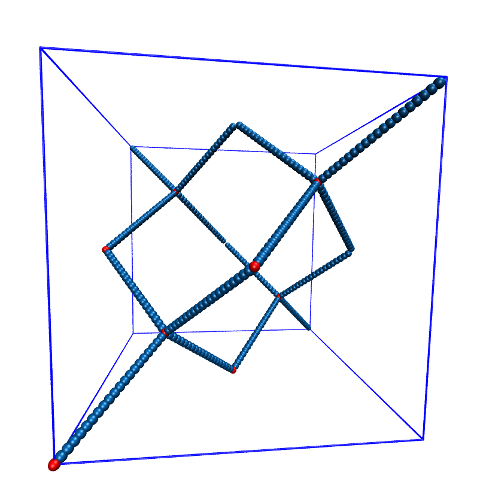
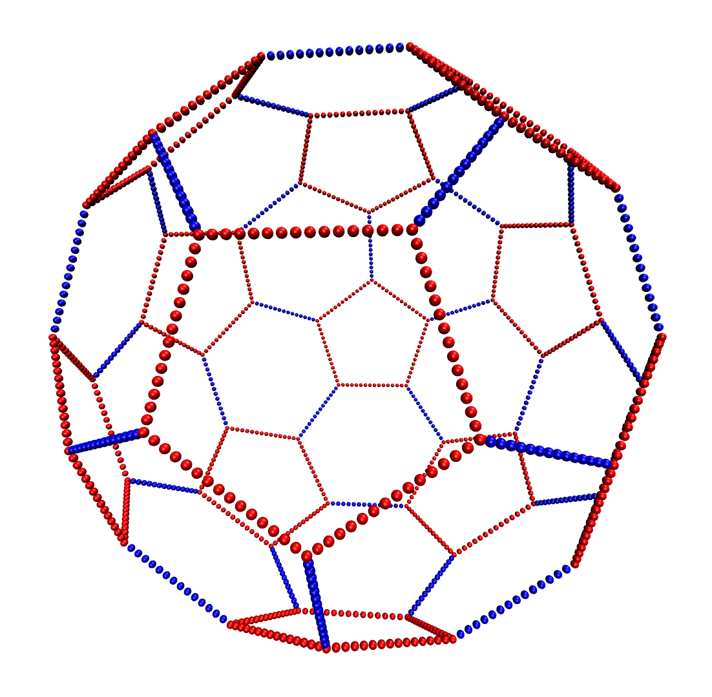

.. _Setting up particles:

====================
Setting up particles
====================

Overview of the relevant Python classes
---------------------------------------
For understanding this chapter, it is helpful to be aware of the Python classes provided by |es| to interact with particles:

* :class:`espressomd.particle_data.ParticleHandle` provides access to a single particle in the simulation.
* :class:`espressomd.particle_data.ParticleList` provides access to all particles in the simulation
* :class:`espressomd.particle_data.ParticleSlice` provides access to a subset of particles in the simulation identified by a list of ids.

in almost no case have these classes to be instanced explicitly by the user. 
Rather, access is provided via the :attr:`espressomd.system.System.part` attribute.
The details are explained in the following sections.

Adding particles
----------------
In order to add particles to the system, call
:meth:`espressomd.particle_data.ParticleList.add`::

    import espressomd
    system=espressomd.System()
    system.part.add(pos=[1.0, 1.0, 1.0], id=0, type=0)

This command adds a single particle to the system with properties given
as arguments. The pos property is required, the id can be omitted, in which case it is chosen automatically.
All available particle properties are members of :class:`espressomd.particle_data.ParticleHandle`.

It is also possible to add several particles at once:::

    import numpy as np
    system.part.add(pos=np.random.random((10,3)*box_length))

Furthermore, the :meth:`espressomd.particle_data.ParticleList.add` method returns the added particle(s):::

    tracer=system.part.add(pos=(0,0,0))
    print(tracer.pos)

Note that the instance of :class:`espressomd.particle_data.ParticleHandle` returned by :meth:`espressomd.particle_data.ParticleList.add` are handles for the live particles in the simulation, rather than offline copies. Changing their properties will affect the simulation.

Accessing particle properties
-----------------------------

Particle properties can be accessed like a class member.

To access property ``PROPERTY`` of the particle with index ``INDEX``::

    system.part[<INDEX>].<PROPERTY>

For example, to print the current position of the particle with index 0 in the system, call::

    print(system.part[0].pos)

Similarly, the position can be set::

    system.part[0].pos=(1,2.5,3)
    system.part[0].id=4

Note that the index and the property ID are not necessarily the same.

Vectorial properties
~~~~~~~~~~~~~~~~~~~~

For vectorial particle properties, component-wise manipulation like ``system.part[0].pos[0]
= 1`` or in-place operators like ``+=`` or ``*=`` are not allowed and result in an error.
This behavior is inherited, so the same applies to ``a`` after ``a =
system.part[0].pos``. If you want to use an vectorial property for further
calculations, you should explicity make a copy e.g. via
``a = numpy.copy(system.part[0].pos)``.

Interacting with groups of particles
------------------------------------

The :class:`espressomd.particle_data.ParticleList` support slicing similarly to lists and NumPy arrays. To access all existing particles, use a colon::

    print(sysstem.part[:].pos)
    system.part[:].q=0

To access particles with indices ranging from 0 to 9, use::
    
    system.part[0:10].pos

Note that, like in other cases in Python, the lower bound is inclusive and the upper bound is non-inclusive.
Setting slices can be done by 

- supplying a *single value* that is assigned to each entry of the slice, e.g.::

    system.part[0:10].ext_force = [1, 0, 0]

- supplying an *array of values* that matches the length of the slice which sets each entry individually, e.g.::

    system.part[0:3].ext_force = [[1, 0, 0], [2, 0, 0], [3, 0, 0]]

For list properties that have no fixed length like ``exculsions`` or ``bonds``, some care has to be taken.
There, *single value* assignment also accepts lists/tuples just like setting the property of an individual particle. For example::

    system.part[0].exclusions = [1, 2]

would both exclude short-range interactions of the particle pairs ``0 <-> 1`` and ``0 <-> 2``.
Similarly, a list can also be assigned to each entry of the slice::

    system.part[2:4].exclusions = [0, 1]

This would exclude interactions between ``2 <-> 0``, ``2 <-> 1``, ``3 <-> 0`` and ``3 <-> 1``.
Now when it is desired to supply an *array of values* with individual values for each slice entry, the distinction can no longer be done
by the length of the input, as slice length and input length can be equal. Here, the nesting level of the input is the distinctive criterion::

    system.part[2:4].exclusions = [[0, 1], [0, 1]]

The above code snippet would lead the the same exclusions as the one before.
The same accounts for the ``bonds`` property by interchanging the integer entries of the exclusion list with 
the tuple ``(bond, partners)``. 

Deleting particles
------------------

Particles can be easily deleted in Python using particle ids or ranges of particle ids.
For example, to delete all particles with particle index greater than 10, run::

    >>> system.part[10:].remove()

To delete all particles, use::

    system.part.clear()

Iterating over particles and pairs of particles
-----------------------------------------------
You can iterate over all particles or over a subset of particles as follows::

    for p in system.part:
        print(p.pos)
    
    for p in system.part[0:10]:
        print(p.pos)

You can iterate over all pairs of particles using::
    
    for pair in system.part.pairs():
        print(pair[1].id,pair[2].id)

        
Exclusions
----------

        :todo: `Perhaps this does not need its own section.`

Particles can have an exclusion list of all other particles where nonbonded interactions are ignored.
This is typically used in atomistic simulations, 
where nearest and next nearest neighbour interactions along the chain have to be omitted since they are included in the bonding potentials.
Be aware that currently, exclusions also remove the short range part of electrostatics and dipolar interactions. Hence, exclusions should not be applied to pairs of particles which are charged or carry a dipole.

  ::

    system.part[0].add_exclusion(1)

Create exclusions for particles pairs 0 and 1.

To delete the exclusion, simply use

  ::

    system.part[0].delete_exclusion(1)

See :attr:`espressomd.particle_data.ParticleHandle.exclusions`

Create particular particle configurations
-----------------------------------------

``polymer``: Setting up polymer chains
~~~~~~~~~~~~~~~~~~~~~~~~~~~~~~~~~~~~~~

::

    from espressomd.polymer import create_polymer

A function that allows to create a number of polymers and polyelectrolytes.
See :attr:`espressomd.polymer.create_polymer()` for a detailed list of
arguments.

The distance between adjacent monomers
during the course of the simulation depends on the applied potentials.
For fixed bond length please refer to the Rattle Shake
algorithm:raw-latex:`\cite{andersen83a}`. The algorithm is based on
Verlet algorithm and satisfy internal constraints for molecular models
with internal constraints, using Lagrange multipliers.

The polymer can be created using several different random walk modes (via the parameter ``modes``):

 (Random walk)
    ``mode = 1`` The monomers are randomly placed by a random walk with a
    steps size of ``bond_length``.

 (Pruned self-avoiding walk)
    ``mode = 2`` The position of a monomer is randomly chosen in a distance
    of to the previous monomer. If the position is closer to another
    particle than ``shield``, the attempt is repeated up to ``max_tries`` times. Note, that this
    is not a real self-avoiding random walk, as the particle
    distribution is not the same. If you want a real self-avoiding walk, use
    the mode 0. However, this mode is several orders of magnitude faster than a
    true self-avoiding random walk, especially for long chains.

 (Self-avoiding random walk)
    ``mode = 0`` The positions of the monomers are chosen as in the plain
    random walk. However, if this results in a chain that has a monomer
    that is closer to another particle than ``shield``, a new attempt of setting
    up the whole chain is done, up to ``max_tries`` times.

``diamond``: Setting up diamond polymer networks
~~~~~~~~~~~~~~~~~~~~~~~~~~~~~~~~~~~~~~~~~~~~~~~~
::

    from espressomd import Diamond

Creates a diamond-shaped polymer network with 8 tetra-functional nodes
connected by :math:`2*8` polymer chains of length (MPC) in a unit cell
of length :math:`a`. Chain monomers are placed at a mutual distance along the
vector connecting network nodes. The polymer is created starting from
particle ID 0. Nodes are assigned type 0, monomers (both charged and
uncharged) are type 1 and counterions type 2. For inter-particle bonds
interaction :math:`0` is taken which must be a two-particle bond.

.. _diamond:

   Diamond-like polymer network with MPC=15.

See :meth:`espressomd.diamond.Diamond` for more details.

``icosaeder``: Setting up an icosaeder
~~~~~~~~~~~~~~~~~~~~~~~~~~~~~~~~~~~~~~
:todo: `This feature is not yet implemented in Python.`

Creates a modified icosaeder to model a fullerene (or soccer ball). The
edges are modeled by polymer chains connected at the corners of the
icosaeder. For inter-particle bonds interaction :math:`0` is taken which
must be a two-particle bond. Two particle types are used for the
pentagons and the interconnecting links. For an example, see figure
[fullerene].

.. _fullerene:

   Icosaeder with =15.

Length of the links. Defines the size of the icosaeder.

Specifies the number of chain monomers along one edge.

Specifies the number of counterions to be placed into the system.

Set the charges of the monomers to and the charges of the counterions to
.

Specifies the distance between two charged monomer along the edge. If
:math:`d_\mathrm{charged} > 1` the remaining monomers are
uncharged.

``crosslink``: Cross-linking polymers
~~~~~~~~~~~~~~~~~~~~~~~~~~~~~~~~~~~~~

        :todo: `This is not implemented in Python` 

crosslink

Attempts to end-crosslink the current configuration of equally long
polymers with monomers each, returning how many ends are successfully
connected.

specifies the first monomer of the chains to be linked. It has to be
specified if the polymers do not start at id 0.

Set the radius around each monomer which is searched for possible new
monomers to connect to. defaults to :math:`1.9`.

The minimal distance of two interconnecting links. It defaults to
:math:`2`.

The minimal distance for an interconnection along the same chain. It
defaults to :math:`0`. If set to , no interchain connections are
created.

Sets the bond type for the connections to .

If not specified, defaults to :math:`30000`.

.. _Virtual sites:

Virtual sites
-------------

Virtual sites are particles, the positions and velocities of which are
not obtained by integrating an equation of motion. Rather, their
coordinates are obtained from the position (and orientation) of one or
more other particles. In this way, rigid arrangements of particles can
be constructed and a particle can be placed in the center of mass of a
set of other particles. Virtual sites can interact with other particles
in the system by means of interactions. Forces are added to them
according to their respective particle type. Before the next integration
step, the forces accumulated on a virtual site are distributed back to
those particles, from which the virtual site was derived.

There are different schemes for virtual sites, described in the
following sections.
To switch the active scheme, the attribute :attr:`espressomd.system.System.virtual_sites` of the system class can be used::

    import espressomd
    from espressomd.virtual_sites import VirtualSitesOff, VirtualSitesRelative

    s=espressomd.System()
    s.virtual_sites=VirtualSitesRelative(have_velocity=True)
    # or
    s.virtual_sites=VirtualSitesOff()

By default, :class:`espressomd.virtual_sites.VirtualSitesOff` is selected. This means that virtual particles are not touched during integration.
the `have_velocity` attribute determines, whether or not the velocity of virtual sites is calcualted, which carries a performance cost.

.. _Rigid arrangements of particles: 

Rigid arrangements of particles
~~~~~~~~~~~~~~~~~~~~~~~~~~~~~~~

The relative implementation of virtual sites allows for the simulation
of rigid arrangements of particles. It can be used, for extended
dipoles and raspberry-particles, but also for more complex
configurations. Position and velocity of a virtual site are obtained
from the position and orientation of exactly one non-virtual particle,
which has to be placed in the center of mass of the rigid body. Several
virtual sites can be related to one and the same non-virtual particle.
The position of the virtual site is given by

.. math:: \vec{x_v} =\vec{x_n} +O_n (O_v \vec{E_z}) d,

where :math:`\vec{x_n}` is the position of the non-virtual particle,
:math:`O_n` is the orientation of the non-virtual particle, :math:`O_v`
denotes the orientation of the vector :math:`\vec{x_v}-\vec{x_n}` with
respect to the non-virtual particles body fixed frame and :math:`d` the
distance between virtual and non-virtual particle. In words: The virtual
site is placed at a fixed distance from the non-virtual particle. When
the non-virtual particle rotates, the virtual sites rotates on an orbit
around the non-virtual particles center.

To use this implementation of virtual sites, activate the feature VIRTUAL_SITES_RELATIVE. Furthermore, an instance of :class:`espressomd.virtual_sites.VirtualSitesRelative` has to be set as the active virtual sites scheme (see above).
To set up a virtual site,

#. Place the particle to which the virtual site should be related. It
   needs to be in the center of mass of the rigid arrangement of
   particles you create. Let its particle id be n.

#. Place a particle at the desired relative position, make it virtual
   and relate it to the first particle::
       
       p=system.part.add(pos=(1,2,3))
       p.vs_auto_relate_to(<ID>)

   where <ID> is the id of the central particle. This will also set the :attr:`espressomd.particle_data.ParticleHandle.virtual` attribute on the particle to 1.
  
#. Repeat the previous step with more virtual sites, if desired.

#. To update the positions of all virtual sites, call

   system.integrator.run(0,recalc_forces=True)

Please note:

-  The relative position of the virtual site is defined by its distance
   from the non-virtual particle, the id of the non-virtual particle and
   a quaternion which defines the vector from non-virtual particle to
   virtual site in the non-virtual particles body-fixed frame. This
   information is saved in the virtual site's`espressomd.particle_data.ParticleHandle.vs_relative` attribute.
   Take care, not to overwrite it after using vs\_auto\_relate.

-  Virtual sites can not be placed relative to other virtual sites, as
   the order in which the positions of virtual sites are updated is not
   guaranteed. Always relate a virtual site to a non-virtual particle
   placed in the center of mass of the rigid arrangement of particles.

-  In case you know the correct quaternions, you can also setup a
   virtual site using its :attr:`espressomd.particle_data.ParticleHandle.vs_relative` and :attr:`espressomd.particle_data.ParticleHandle.virtual` attributes.

-  In a simulation on more than one CPU, the effective cell size needs
   to be larger than the largest distance between a non-virtual particle
   and its associated virtual sites. To this aim, you need to set the
   system's :attr:`espressomd.system.System.min_global_cut` attribute to this largest distance. issues a warning when
   creating a virtual site with and the cutoff is insufficient.

-  If the virtual sites represent actual particles carrying a mass, the
   inertia tensor of the non-virtual particle in the center of mass
   needs to be adapted.

-  The presence of rigid bodies constructed by means of virtual sites
   adds a contribution to the pressure and stress tensor.

Virtual sites in the center of mass of a molecule
~~~~~~~~~~~~~~~~~~~~~~~~~~~~~~~~~~~~~~~~~~~~~~~~~
:todo: `This is not implemented in Python, yet`

To activate this implementation, enable the feature VIRTUAL_SITES_COM in myconfig.hpp. Virtual sites are then placed in the center of mass of
a set of particles (as defined below). Their velocity will also be that
of the center of mass. Forces accumulating on the virtual sites are
distributed back to the particles which form the molecule. To place a
virtual site at the center of a molecule, perform the following steps in
that order

#. Create a particle of the desired type for each molecule. It should be
   placed at least roughly in the center of the molecule to make sure,
   its on the same node as the other particles forming the molecule, in
   a simulation with more than one CPU.

#. Make it a virtual site using

   part virtual 1

#. Declare the list of molecules and the particles they consist of:

   analyze set { ...} ...

   The lists of particles in a molecule comprise the non-virtual
   particles as well as the virtual site. The id of this molecule is its
   index in this list. For example,

   analyze set {0 1 2 3 4} {0 5 6 7 8} {1 9 10 11}

   declares three molecules, of which the first two consist of three
   particles and a virtual site each (particles 14 and 58,
   respectively). The third molecule has type 1 and consists of two
   particles and a virtual site. The virtual sites were determined
   before by setting the flag. You can choose freely one out of each
   molecule, for example particles 1, 5, and 9.

#. Assign to all particles that belong to the same molecule the
   molecules id

   part mol

   The molid is the index of the particle in the above list, so you
   would assign 0 to particles 1-4, 1 to particles 5-8 and 2 to
   particles 9-11. Alternatively, you can call

   analyze set topo\_part\_sync

   to set the s from the molecule declarations.

#. Update the position of all virtual particles (optional)

   integrate 0

The type of the molecule you can choose freely, it is only used in
certain analysis functions, namely ``energy_kinetic_mol``,
``pressure_mol`` and ``dipmom_mol``, which compute kinetic energy,
pressure and dipole moment per molecule type, respectively.

Additional features
~~~~~~~~~~~~~~~~~~~

The behaviour of virtual sites can be fine-tuned with the following
switches in ``myconfig.hpp``.

- VIRTUAL_SITES_NO_VELOCITY specifies that the velocity of virtual sites is not computed

- VIRTUAL_SITES_THERMOSTAT specifies that the Langevin thermostat should also act on virtual
   sites

- THERMOSTAT_IGNORE_NON_VIRTUAL specifies that the thermostat does not act on non-virtual particles

Grand canonical feature
-----------------------
:mod:`espressomd.grand_canonical`

For using conveniently in simulations in the grand canonical ensemble,
or other purposes, when particles of certain types are created and
deleted frequently. Particle ids can be stored in a map for each
individual type and so random ids of particles of a certain type can be
drawn.  ::

    import espressomd
    system=espressomd.System()
    system.setup_type_map([_type])
    system.find_particle(_type)
    system.number_of_particles(_type)

If you want to keep track of particle ids of a certain type you have to
initialize the method by calling  ::

    system.setup_type_map([_type])

After that will keep track of particle ids of that type. When using the
keyword ``find`` and a particle type, the command will return a randomly
chosen particle id, for a particle of the given type. The keyword
``status`` will return a list with all particles with the given type,
similarly giving ``number`` as argument will return the number of
particles which share the given type.

Self-propelled swimmers
-----------------------

.. note::

    If you are using this feature, please cite :cite:`degraaf16`.

.. seealso::

    :class:`espressomd.particle_data.ParticleHandle.swimming`

Langevin swimmers
~~~~~~~~~~~~~~~~~

::

    import espressomd

    system = espressomd.System()

    system.part.add(id=0, pos=[1,0,0], swimming={'f_swim':0.03})

This enables the particle to be self-propelled in the direction determined by
its quaternion. For setting the particle's quaternion see
:class:`espressomd.particle_data.ParticleHandle.quat`. The self-propulsion
speed will relax to a constant velocity, that is specified by ``v_swim``.
Alternatively it is possible to achieve a constant velocity by imposing a
constant force term ``f_swim`` that is balanced by friction of a (Langevin)
thermostat. The way the velocity of the particle decays to the constant
terminal velocity in either of these methods is completely determined by the
friction coefficient. You may only set one of the possibilities ``v_swim`` *or*
``f_swim`` as you cannot relax to constant force *and* constant velocity at the
same time. Note that there is no real difference between ``v_swim`` and
``f_swim``, since the latter may always be chosen such that the same terminal
velocity is achieved for a given friction coefficient.

Lattice-Boltzmann (LB) swimmers
~~~~~~~~~~~~~~~~~~~~~~~~~~~~~~~

::

    import espressomd

    system = espressomd.System()

    system.part.add(id=1, pos=[2,0,0], rotation=[1,1,1], swimming={
       'f_swim':0.01, 'mode':'pusher', 'dipole_length':2.0, 'rotational_friction':20})

For an explanation of the parameters ``v_swim`` and ``f_swim`` see the previous
item. In lattice-Boltzmann self-propulsion is less trivial than for regular MD,
because the self-propulsion is achieved by a force-free mechanism, which has
strong implications for the far-field hydrodynamic flow field induced by the
self-propelled particle. In |es| only the dipolar component of the flow field
of an active particle is taken into account. This flow field can be generated
by a *pushing* or a *pulling* mechanism, leading to change in the sign of the
dipolar flow field with respect to the direction of motion. You can specify the
nature of the particle's flow field by using one of the modes: ``pusher`` or
``puller``. You will also need to specify a ``dipole_length`` which determines
the distance of the source of propulsion from the particle's center. Note that
you should not put this distance to zero; |es| (currently) does not support
mathematical dipole flow fields. The key ``rotational_friction`` can be used to
set the friction that causes the orientation of the particle to change in shear
flow. The torque on the particle is determined by taking the cross product of
the difference between the fluid velocity at the center of the particle and at
the source point and the vector connecting the center and source.

You may ask: “Why are there two methods ``v_swim`` and ``f_swim`` for the
self-propulsion using the lattice-Boltzmann algorithm?” The answer is
straightforward. When a particle is accelerating, it has a monopolar flow-field
contribution which vanishes when it reaches its terminal velocity (for which
there will only be a dipolar flow field). The major difference between the
above two methods is that with ``v_swim`` the flow field *only* has a monopolar
moment and *only* while the particle is accelerating. As soon as the particle
reaches a constant speed (given by ``v_swim``) this monopolar moment is gone
and the flow field is zero! In contrast, ``f_swim`` always, i.e., while
accelerating *and* while swimming at constant force possesses a dipolar flow
field.

.. warning::

    Please note that even though swimming is interoperable with the
    CPU version of LB it is only supported on *one* Open MPI
    node, i.e. ``n_nodes`` = 1.

