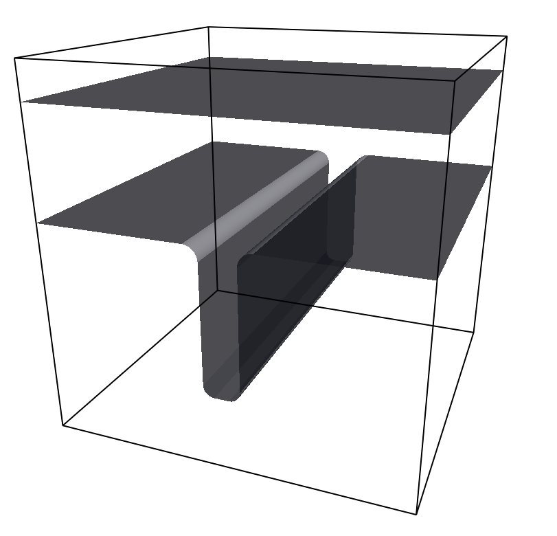

.. _Setting up particles:

====================
Setting up particles
====================

Creating single particles
=========================

Defining particle properties
----------------------------

The first step when writing a simulation script is to import the :mod:`espressomd`
module and to create a :class:`espressomd.system.System` instance::

    >>> import espressomd

    >>> system = espressomd.System()

In order to add particles to the system, call
:meth:`espressomd.particle_data.ParticleList.add`::

    >>> system.part.add(pos=[1.0, 1.0, 1.0], id=0, type=0)

This command adds a single particle to the system with properties given
as arguments. All available particle properties are members of
:class:`espressomd.particle_data.ParticleHandle` and are listed below.

    - :attr:`espressomd.particle_data.ParticleHandle.bonds`

        The bonds stored by this particle. Note that bonds are only stored by one partner.

    - :attr:`espressomd.particle_data.ParticleHandle.dip`

        The orientation of the dipole axis.

        ..  note::

            `Feature DIPOLES required.`

    - :attr:`espressomd.particle_data.ParticleHandle.dipm`

        The magnitude of the dipole moment.

        ..  note::

            `Feature DIPOLES required.`

    - :attr:`espressomd.particle_data.ParticleHandle.director`

        Particle director.

        ..  note::

            `Feature ROTATION required.`

    - :attr:`espressomd.particle_data.ParticleHandle.exclude`

        The exclusion list of particles where nonbonded interactions are ignored.

        ..  note::

            `Feature EXCLUSIONS required.`

    - :attr:`espressomd.particle_data.ParticleHandle.ext_force`

        An additional external force applied to the particle.

        ..  note::

            `Feature EXTERNAL_FORCE required.`

    - :attr:`espressomd.particle_data.ParticleHandle.ext_torque`

        An additional external torque is applied to the particle.

        ..  note::

            `Feature ROTATION and EXTERNAL_FORCE required.`

    - :attr:`espressomd.particle_data.ParticleHandle.f`

        The instantaneous force acting on this particle.

    - :attr:`espressomd.particle_data.ParticleHandle.fix`

        Fixes the particle motion in the specified cartesian directions.

        ..  note::

            `Feature EXTERNAL_FORCE required.`

    - :attr:`espressomd.particle_data.ParticleHandle.gamma`

        The particle translational frictional coefficient used in the Langevin thermostat.

        ..  note::

            `Feature LANGEVIN_PER_PARTICLE required.`

    - :attr:`espressomd.particle_data.ParticleHandle.gamma_rot`

        The particle rotational frictional coefficient used in the Langevin thermostat.

        ..  note::

            `Feature LANGEVIN_PER_PARTICLE, ROTATION and ROTATIONAL_INERTIA required.`

    - :attr:`espressomd.particle_data.ParticleHandle.type`

      The particle type for nonbonded interactions

    - :attr:`espressomd.particle_data.ParticleHandle.pos`

        The unwrapped (not folded into central box) particle position

    - :attr:`espressomd.particle_data.ParticleHandle.pos_folded`

        The wrapped (folded into central box) position vector of a Particle.

    - :attr:`espressomd.particle_data.ParticleHandle.mass`

        The particle mass.

        ..  note::

            `Feature MASS required.`

    - :attr:`espressomd.particle_data.ParticleHandle.omega_body`

        The particle angular velocity in the particle’s co-rotating (body) frame.

        ..  note::

            `Feature ROTATION required.`

    - :attr:`espressomd.particle_data.ParticleHandle.omega_lab`

        The particle angular velocity the lab frame.

        ..  note::

            `Feature ROTATION required.`

    - :attr:`espressomd.particle_data.ParticleHandle.q`

        Particle charge.

        ..  note::

            `Feature ELECTROSTATICS required.`

    - :attr:`espressomd.particle_data.ParticleHandle.quat`

        Particle quaternion representation.

        ..  note::

            `Feature ROTATION required.`

    - :attr:`espressomd.particle_data.ParticleHandle.rotation`

        The particle rotational degrees of freedom.

        ..  note::

            `Feature ROTATION required.`

    - :attr:`espressomd.particle_data.ParticleHandle.rinertia`

        The particle rotational inertia.

        ..  note::

            `Feature ROTATIONAL_INERTIA required.`

    - :attr:`espressomd.particle_data.ParticleHandle.smaller_timestep`

        Flag for smaller timestep.

        ..  note::

            `Feature MULTI_TIMESTEP required.`

    - :attr:`espressomd.particle_data.ParticleHandle.swimming`

        The particle swimming parameters.

        ..  note::

            `Feature ENGINE required.`

    - :attr:`espressomd.particle_data.ParticleHandle.temp`

        Particle's temperature in the Langevin thermostat.

        ..  note::

            `Feature LANGEVIN_PER_PARTICLE required.`

    - :attr:`espressomd.particle_data.ParticleHandle.torque_lab`

        The particle torque in the lab frame.

        ..  note::

            `Feature ROTATION required.`

    - :attr:`espressomd.particle_data.ParticleHandle.v`

        The particle velocity in the lab frame.

    - :attr:`espressomd.particle_data.ParticleHandle.virtual`

        Virtual flag.

        ..  note::

            `Feature VIRTUAL_SITES required.`

    - :attr:`espressomd.particle_data.ParticleHandle.vs_relative`

        Virtual sites relative parameters.
        
        ..  note::

            `Feature VIRTUAL_SITES required.`

Properties of already existing particles can be set using::

    >>> system.part[<ID>].<PROPERTY> = <SOME_VALUE>

This sets the property ``PROPERTY`` for the particle with id ``ID`` to
``SOME_VALUE``.

Getting particle properties
~~~~~~~~~~~~~~~~~~~~~~~~~~~

If a certain particle property is set, it can be accessed like a class
member. To access property ``PROPERTY`` of the particle with id ``ID``::

    system.part[<ID>].<PROPERTY>

For example, to print the current position of all particles in the system, call::

    >>> print(system.part[:].pos)
    [[ 3.77651228  2.74802277  7.8614655 ]
     [ 3.16587857  2.88714253  3.0495119 ]
     [ 3.13657179  6.26879849  1.1182947 ]
     ...,
     [ 1.42691672  8.39444662  7.61834009]
     [ 3.63801655  3.05804937  5.30344039]
     [ 8.13603676  3.91630721  2.70701524]]

Deleting particles
~~~~~~~~~~~~~~~~~~

Particles can be easily deleted in Python using particle ids or ranges of particle ids.
For example, to delete all particles with particle id greater than 10, run::

    >>> system.part[10:].remove()

Exclusions
~~~~~~~~~~

        :todo: `Perhaps this does not need its own section.`

Particles can have an exclusion list of all other particles where nonbonded interactions are ignored.
This is typically used in atomistic simulations, 
where nearest and next nearest neighbour interactions along the chain have to be omitted since they are included in the bonding potentials.

  ::

    system.part[0].add_exclusion(1)

Create exclusions for particles pairs 0 and 1.

To delete the exclusion, simply use

  ::

    system.part[0].delete_exclusion(1)

See :attr:`espressomd.particle_data.ParticleHandle.exclude`

Creating groups of particle
---------------------------

``polymer``: Setting up polymer chains
~~~~~~~~~~~~~~~~~~~~~~~~~~~~~~~~~~~~~~

::

    from espressomd.polymer import create_polymer

A function that allows to create a number of polymers and polyelectrolytes.
See :attr:`espressomd.polymer.create_polymer()` for a detailed list of
arguments.

The distance between adjacent monomers
during the course of the simulation depends on the applied potentials.
For fixed bond length please refer to the Rattle Shake
algorithm:raw-latex:`\cite{andersen83a}`. The algorithm is based on
Verlet algorithm and satisfy internal constraints for molecular models
with internal constraints, using Lagrange multipliers.

The polymer can be created using several different random walk modes (via the parameter ``modes``):

 (Random walk)
    ``mode = 1`` The monomers are randomly placed by a random walk with a
    steps size of ``bond_length``.

 (Pruned self-avoiding walk)
    ``mode = 2`` The position of a monomer is randomly chosen in a distance
    of to the previous monomer. If the position is closer to another
    particle than ``shield``, the attempt is repeated up to ``max_tries`` times. Note, that this
    is not a real self-avoiding random walk, as the particle
    distribution is not the same. If you want a real self-avoiding walk, use
    the mode 0. However, this mode is several orders of magnitude faster than a
    true self-avoiding random walk, especially for long chains.

 (Self-avoiding random walk)
    ``mode = 0`` The positions of the monomers are chosen as in the plain
    random walk. However, if this results in a chain that has a monomer
    that is closer to another particle than ``shield``, a new attempt of setting
    up the whole chain is done, up to ``max_tries`` times.

``diamond``: Setting up diamond polymer networks
~~~~~~~~~~~~~~~~~~~~~~~~~~~~~~~~~~~~~~~~~~~~~~~~
::

    from espressomd import Diamond

Creates a diamond-shaped polymer network with 8 tetra-functional nodes
connected by :math:`2*8` polymer chains of length (MPC) in a unit cell
of length :math:`a`. Chain monomers are placed at a mutual distance along the
vector connecting network nodes. The polymer is created starting from
particle ID 0. Nodes are assigned type 0, monomers (both charged and
uncharged) are type 1 and counterions type 2. For inter-particle bonds
interaction :math:`0` is taken which must be a two-particle bond.

.. _diamond:
.. figure:: figures/diamond.png
   :alt: Diamond-like polymer network with MPC=15.
   :align: center
   :height: 6.00000cm

   Diamond-like polymer network with MPC=15.

See :meth:`espressomd.diamond.Diamond` for more details.

``icosaeder``: Setting up an icosaeder
~~~~~~~~~~~~~~~~~~~~~~~~~~~~~~~~~~~~~~
:todo: `This feature is not yet implemented .`

Creates a modified icosaeder to model a fullerene (or soccer ball). The
edges are modeled by polymer chains connected at the corners of the
icosaeder. For inter-particle bonds interaction :math:`0` is taken which
must be a two-particle bond. Two particle types are used for the
pentagons and the interconnecting links. For an example, see figure
[fullerene].

.. _fullerene:
.. figure:: figures/fullerene.png
   :alt: Icosaeder with =15.
   :align: center
   :height: 6.00000cm

   Icosaeder with =15.

Length of the links. Defines the size of the icosaeder.

Specifies the number of chain monomers along one edge.

Specifies the number of counterions to be placed into the system.

Set the charges of the monomers to and the charges of the counterions to
.

Specifies the distance between two charged monomer along the edge. If
:math:`d_\mathrm{charged} > 1` the remaining monomers are
uncharged.

``crosslink``: Cross-linking polymers
~~~~~~~~~~~~~~~~~~~~~~~~~~~~~~~~~~~~~

        :todo: `Is this implemented?.`

crosslink

Attempts to end-crosslink the current configuration of equally long
polymers with monomers each, returning how many ends are successfully
connected.

specifies the first monomer of the chains to be linked. It has to be
specified if the polymers do not start at id 0.

Set the radius around each monomer which is searched for possible new
monomers to connect to. defaults to :math:`1.9`.

The minimal distance of two interconnecting links. It defaults to
:math:`2`.

The minimal distance for an interconnection along the same chain. It
defaults to :math:`0`. If set to , no interchain connections are
created.

Sets the bond type for the connections to .

If not specified, defaults to :math:`30000`.

``constraint``: Setting up constraints
--------------------------------------

:class:`espressomd.constraints.Constraint`

A Constraint is an immobile surface which can interact with particles via a
nonbonded potential, where the distance between the two particles is
replaced by the distance of the center of the particle to the surface.

The constraints are identified like a particle via its type ``particle_type`` for the
non-bonded interaction. After a type is defined for each constraint one
has to define the interaction of all different particle types with the
constraint using the  :class:`espressomd.interactions.NonBondedInteractions` class.

      

Shapes
~~~~~~~
:class:`espressomd.shapes`

Python Syntax::

    import espressomd from espressomd.shapes import <SHAPE>
    system=espressomd.System()

``<SHAPE>`` can be any of the available shapes.

The surface's geometry is defined via a few available shapes.
The following shapes can be used as constraints.

.. warning::
   When using shapes with concave edges and corners, the fact that a particle
   only interacts with the closest point on the constraint surface leads to discontinuous
   force fields acting on the particles. This breaks energy conservation in otherwise
   symplectic integrators. Often, the total energy of the system increases exponentially.

:class:`espressomd.shapes.Wall`
    An infinite plane`.

The resulting surface is a plane defined by the normal vector ``normal`` 
and the distance ``dist`` from the origin (in the direction of the normal vector).
The force acts in direction of the normal. 
Note that ``dist`` describes the distance from the origin in units of the normal 
vector so that the product of ``dist`` and ``normal`` is a point on the surface.
Therefore negative distances are quite common!

.. figure:: figures/shape-wall.png
   :alt: Example constraint with a ``Wall`` shape.
   :align: center
   :height: 6.00000cm
   
Pictured is an example cosntraint with a ``Wall`` shape created with ::

    wall = Wall( dist=20, normal=[0.1,0.0,1] )
    system.constraints.add(shape=wall, particle_type=0)
    
In variant (1) if the only_positive flag is set to 1, interactions are only calculated if
the particle is on the side of the wall in which the normal vector is
pointing.
This has only an effect for penetrable walls. If the flag is
set to 1, then slip boundary interactions apply that are essential for
microchannel flows like the Plane Poiseuille or Plane Couette Flow.
Youalso need to use the tunable\_slip interaction (see [sec:tunableSlip])
for this too work.

:class:`espressomd.shapes.Sphere`
    A sphere.

The resulting surface is a sphere with center ``center`` and radius ``radius``. 
The direction ``direction`` determines the force direction, ``-1`` or for inward and ``+1`` for outward.

.. _shape-sphere:

.. figure:: figures/shape-sphere.png
   :alt: Example constraint with a ``Sphere`` shape.
   :align: center
   :height: 6.00000cm
   
Pictured is an example cosntraint with a ``Sphere`` shape created with ::
  
    sphere = Sphere(center=[25,25,25], radius = 15, direction = 1 )
    system.constraints.add(shape=sphere, particle_type=0)

:class:`espressomd.shapes.Cylinder`
    A cylinder

The resulting surface is a cylinder with center ``center`` and radius ``radius``.
The ``length`` parameter is **half** of the cylinder length.
The ``axis`` parameter is a vector along the cylinder axis, which is normalized in the program.
The direction ``direction`` determines the force direction, ``-1`` or for inward and ``+1`` for outward.

.. figure:: figures/shape-cylinder.png
   :alt: Example constraint with a ``Cylinder`` shape.
   :align: center
   :height: 6.00000cm
   
Pictured is an example constraint with a ``Cylinder`` shape created with ::

    cylinder=Cylinder(center=[25, 25, 25], axis = [1, 0, 0], direction = 1, radius = 10, length = 30)
    system.constraints.add(shape=cylinder, particle_type = 0)

:class:`espressomd.shapes.Rhomboid`
    A rhomboid or parallelpiped.

:todo: `This shape is currently broken. Please do not use.`

The resulting surface is a rhomboid, defined by one corner located at ``corner`` 
and three adjacent edges, defined by the three vectors connecting the 
corner ``corner`` with it’s three neighboring corners:
``a`` ``[ax ay az ]``; ``b`` ``[bx by bz]`` and ``c`` ``[cx cy cz]``.
The direction ``direction`` determines the force direction, ``-1`` or for inward and ``+1`` for outward.

 ::

    rhomboid = Rhomboid(pos=[5.0, 5.0, 5.0], a=[1.0, 1.0, 0.0], b=[0.0, 0.0, 1.0], c=[0.0, 1.0, 0.0], direction=1)

creates a rhomboid defined by one corner located at ``[5.0, 5.0, 5.0]`` and three
adjacent edges, defined by the three vectors connecting the corner with its three neighboring corners, ``(1,1,0)`` , ``(0,0,1)`` and ``(0,1,0)``.

:class:`espressomd.shapes.Maze`
    Spherical cavities on a regular grid that are connected by tubes.

The resulting surface is ``nsphere`` spheres of radius ``sphrad`` along each dimension, connected by cylinders of radius ``cylrad``.
The sphere grid have simple cubic symmetry.
The spheres are distributed evenly by dividing the boxl by ``nsphere``.
Dimension of the maze can be controlled by ``dim``: 0 for one dimensional, 1 for two dimensional and 2 for three dimensional maze.

.. figure:: figures/shape-maze.png
   :alt: Example constraint with a ``Maze`` shape.
   :align: center
   :height: 6.00000cm

Pictured is an example constraint with a ``Maze`` shape created with ::

    maze=Maze(cylrad = 2, dim = 2, nsphere = 5, sphrad = 6)
    system.constraints.add(shape=maze, particle_type = 0, penetrable = 1)

:class:`espressomd.shapes.Pore`
    A cylinder with a conical pore between the faces.
  
:todo: `This shape is currently broken. Please do not use.`
    
The pore openings are smoothed with torus segment. The outer radius can be chosen such that it is bigger than the box, to get a wall with a pore. The resulting surface is a cylindrical pore similar to :class:`espressomd.shapes::Cylinder` with a center ``center`` and radius ``radius``.

The ``length`` parameter is half of the cylinder length.
The parameter ``axis`` is a vector along the cylinder axis, which is normalized in the program.
Optionally the outer radius ``outer_rad_left`` and ``outer_rad_right`` of the pore can be specified.
By default these are (numerical) infinity and thus results in an infinite wall with one pore.
The argument radius ``radius`` can be replaced by the argument ``rad_left`` and ``rad_right`` 
to obtain a pore with a conical shape and corresponding opening radii. 
The first radius ``radius_left`` is in the direction opposite to the axis vector.
The same applies for ``outer_radius`` which can be replaced with ``outer_rad_left`` and ``outer_rad_right``.
Per default sharp edges are replaced by circles of unit radius.
The radius of this smoothing can be set with the optional keyword ``smoothing_radius``.

.. figure:: figures/shape-pore1.png
   :alt: Example constraint with a ``Pore`` shape.
   :align: center
   :height: 6.00000cm

Pictured is an example constraint with a ``Pore`` shape created with ::

    pore=Pore(axis = [1,0,0], length = 70, outer_rad_left = 20, outer_rad_right = 30, pos = [50,50,50], rad_left = 10, rad_right = 20, smoothing_radius = 5)
    system.constraints.add(shape=pore, particle_type = 0, penetrable  = 1)

    
:class:`espressomd.shapes.Stomatocyte`
    A stomatocyte.

The resulting surface is a stomatocyte shaped boundary. 
This command should be used with care. 
The position can be any point in the simulation box, 
and the orientation of the (cylindrically symmetric) stomatocyte is given by a vector, 
which points in the direction of the symmetry axis, 
it does not need to be normalized. 
The parameters: ``outer_radius``, ``inner_radius``, and ``layer_width``, specify the shape of the stomatocyte.
Here inappropriate choices of these parameters can yield undersired results. 
The width ``layer_width`` is used as a scaling parameter.
That is, a stomatocyte given by ``outer_radius``:``inner_radius``:``layer_width`` = 7:3:1 
is half the size of the stomatocyte given by 7:3:2. 
Not all choices of the parameters give reasonable values for the shape of the stomatocyte, 
but the combination 7:3:1 is a good point to start from when trying to modify the shape.

.. figure:: figures/shape-stomatocyte1.png
   :alt: Example constraint with a ``Stomatocyte`` shape.
   :align: center
   :height: 6.00000cm

.. figure:: figures/shape-stomatocyte2.png
   :alt: Close-up of the internal ``Stomatocyte`` structure.
   :align: center
   :height: 6.00000cm

   
Pictured is an example constraint with a ``Stomatocyte`` shape (with a closeup of the internal structure) created with ::
  
    stomatocyte=Stomatocyte(inner_radius = 3, outer_radius = 7, orientation_x = 1.0, orientation_y = 0.0,orientation_z = 0.0, position_x = 25, position_y = 25, position_z = 25, layer_width = 3,    direction = 1)
    system.constraints.add(shape=stomatocyte, particle_type = 0, penetrable = 1)

    

:class:`espressomd.shapes.Slitpore`
   Channel-like surface

The resulting surface is T-shape channel that extends in the z-direction.
The cross sectional geometry is depicted in Fig.[fig:slitpore].
It is translationally invariant in y direction.

The region is described as a pore (lower vertical part of the "T"-shape) and a channel (upper horizontal part of the "T"-shape).

.. figure:: figures/slitpore.pdf
   :alt: Schematic for the slitpore shape showing geometrical parameters
   :align: center
   :height: 6.00000cm
   
The parameter ``channel_width`` specifies the distance between the top and the the plateau edge.
The parameter ``pore_length`` specifies the distance between the bottom and the plateau edge.
The parameter ``pore_width`` specifies the distance between the two plateau edges, it is the space between the left and right walls of the pore region.
The parameter ``pore_mouth`` specifies the location (z-coordinate) of the pore opening (centre). It is always centered in the x-direction.

All the edges  are smoothed via the parameters ``upper_smoothing_radius`` (for the concave corner at the edge of the plateau region) and ``lower_smoothing_radius`` (for the convex corner at the bottom of the pore region).
The meaning of the geometrical parameters can be inferred from the shcematic in fig. [fig:slitpore].

  
Pictured is an example constraint with a ``Slitpore`` shape created with ::
  
    slitpore=Slitpore(Slitpore(channel_width = 30, lower_smoothing_radius = 3, upper_smoothing_radius = 3, pore_length = 40, pore_mouth = 60, pore_width = 10)
    system.constraints.add(shape=slitpore, particle_type = 0, penetrable = 1)

:class:`espressomd.shapes.SpheroCylinder`
    A capsule, pill, or spherocylinder.
    
The resulting surface is a cylinder capped by hemispheres on both ends.
Similar to `espressomd.shapes::Cylinder`, it is positioned at ``center`` and has a radius ``radius``.
The ``length`` parameter is **half** of the cylinder length, and does not include the contribution from the hemispherical ends.
The ``axis`` parameter is a vector along the cylinder axis, which is normalized in the program.
The direction ``direction`` determines the force direction, ``-1`` or for inward and ``+1`` for outward.

.. figure:: figures/shape-spherocylinder.png
   :alt: Example constraint with a ``SpheroCylinder`` shape.
   :align: center
   :height: 6.00000cm
   
Pictured is an example constraint with a ``SpheroCylinder`` shape created with ::

    spherocylinder = SpheroCylinder(center=[25, 25, 25], axis = [1, 0, 0], direction = 1, radius = 10, length = 30)
    system.constraints.add(shape=spherocylinder, particle_type = 0)

:class:`espressomd.shapes.Hollowcone`
   A hollow cone.

The resulting surface is a section of a hollow cone.
The parameters ``inner_radius`` and ``outer_radius`` specifies the two radii .
The parameter ``opening_angle`` specifies the opening angle of the cone (in radians, between 0 and:math:`\pi/2` ), and thus also determines the length.

The orientation of the (cylindrically symmetric) codne is specified with the parameters ``orientation_x``, ``orientation_y`` and ``orientation_z``. It points in the direction of the symmetry axis, and does not need to be normalized.

The position is specified with ``position_x``, ``position_y`` and ``position_z`` can be any point in the simulation box.

The ``width`` specifies the width.
This shape supports the ``direction`` parameter, +1 the normal points out of the mantel, -1 for when points inward.

.. figure:: figures/shape-hollowcone.png
   :alt:  Example constraint with a  ``Hollowcone`` shape.
   :align: center
   :height: 6.00000cm

Pictured is an example constraint with a ``Hollowcone`` shape created with ::
  
    hollowcone=Hollowcone(HollowCone(inner_radius = 5, outer_radius = 20, opening_angle = np.pi/4.0, orientation_x = 1.0, orientation_y = 0.0, orientation_z = 0.0, position_x = 25, position_y = 25, positi    on_z = 25, width = 2,direction = 1)
    system.constraints.add(shape=hollowcone, particle_type = 0, penetrable = 1)

For the shapes ``wall``; ``sphere``; ``cylinder``; ``rhomboid``; ``maze``; ``pore`` and ``stomacyte``, constraints are able to be penetrated if ``penetrable`` is set to ``True``.
Otherwise, when the ``penetrable`` option is
ignored or is set to `False`, the constraint cannot be violated, i.e. no
particle can go through the constraint surface (|es| will exit if it does).

In variants ``wall``; ``sphere``; ``cylinder``; ``rhomboid`` and ``stomacyte`` it is
also possible to specify a flag indicating if the constraints should be
reflecting. The flags can equal 1 or 2. The flag 1 corresponds to a
reflection process where the normal component of the velocity is
reflected and the tangential component remains unchanged. If the flag is
2, also the tangential component is turned around, so that a bounce back
motion is performed. The second variant is useful for boundaries of DPD.
The reflection property is only activated if an interaction is defined
between a particular particle and the constraint! This will usually be a
lennard-jones interaction with :math:`\epsilon=0`, but finite
interaction range.

Adding a shape-based constraint
~~~~~~~~~~~~~~~~~~~~~~~~~~~~~~~

All previosly listed shapes can be added to the system's constraints by passing a initialized shape object to :meth:`system.constraints.add`  ::
  
    myShape = Wall( dist=20, normal=[0.1, 0.0, 1] )
    myConstraint = system.constraints.add(shape = myShape, particle_type=p_type)

      
The extra argument ``particle_type`` specifies the nonbonded interaction to be used with
that constraint.
      
There are two further optional parameters and that can
be used to fine tune the behavior of the constraint. If ``penetrable`` is
set to ``True`` then particles can move through the constraint in this case the
other option ``only_positive`` controls whether the particle is subject to the interaction
potential of the wall. If set to then the constraint will only act in
the direction of the normal vector.

Deleting a constraint
~~~~~~~~~~~~~~~~~~~~~

Constraints can be removed in a similar fashion using :meth:`espressomd.system.constraints.remove` ::

    system.constraints.remove(myConstraint)

This command will delete the specified constraint.

Getting the currently defined constraints
~~~~~~~~~~~~~~~~~~~~~~~~~~~~~~~~~~~~~~~~~

One can interate through constraints, for example ::
  
    >>> for c in system.constraints:
    >>>    print(c.shape)

will print the shape information for all defined constraints.

Getting the force on a constraint
~~~~~~~~~~~~~~~~~~~~~~~~~~~~~~~~~
:meth:`espressomd.system.constraints.total_force`

Returns the force acting on the a constraint. Note, however, that this
are only forces due to interactions with particles, not with other
constraints. Also, these forces still do not mean that the constraints
move, they are just the negative of the sum of forces acting on all
particles due to this constraint. Similarly, the total energy does not
contain constraint-constraint contributions.

For example the pressure from wall ::
    >>> p = system.constraints[0].total_force()
    >>> print(p)

Getting the minimal distance to a constraint
~~~~~~~~~~~~~~~~~~~~~~~~~~~~~~~~~~~~~~~~~~~~
:todo: `This feature is not yet implemented .`

calculates the smallest distance to all non-penetrable
constraints, that can be repulsive (wall, cylinder, sphere, rhomboid,
maze, pore, slitpore). Negative distances mean that the position is
within the area that particles should not access. Helpful to find
initial configurations.)

``harmonic_well``: Creating a harmonic trap
~~~~~~~~~~~~~~~~~~~~~~~~~~~~~~~~~~~~~~~~~~~
:todo: `This feature is not yet implemented .`

Calculates a spring force for all particles, where the equilibrium
position of the spring is at and its force constant is . A more
flexible trap can be constructed with constraints, but this one runs on
the GPU.

``Homogeneous Magnetic Field``: 
~~~~~~~~~~~~~~~~~~~~~~~~~~~~~~~
:class:`espressomd.Constraints::HomogeneousMagneticField`

This does not define a surface but is based on magnetic dipolar
interaction with an external magnetic field. It applies to all particles
with a dipole moment.

Virtual sites
-------------

Virtual sites are particles, the positions and velocities of which are
not obtained by integrating an equation of motion. Rather, their
coordinates are obtained from the position (and orientation) of one or
more other particles. In this way, rigid arrangements of particles can
be constructed and a particle can be placed in the center of mass of a
set of other particles. Virtual sites can interact with other particles
in the system by means of interactions. Forces are added to them
according to their respective particle type. Before the next integration
step, the forces accumulated on a virtual site are distributed back to
those particles, from which the virtual site was derived.

There are two distinct types of virtual sites, described in the
following.

Virtual sites in the center of mass of a molecule
~~~~~~~~~~~~~~~~~~~~~~~~~~~~~~~~~~~~~~~~~~~~~~~~~
:todo: `add description here`
:todo: `add description in particle_data.pyx`

To activate this implementation, enable the feature (sec.
[sec:myconfig]). Virtual sites are then placed in the center of mass of
a set of particles (as defined below). Their velocity will also be that
of the center of mass. Forces accumulating on the virtual sites are
distributed back to the particles which form the molecule. To place a
virtual site at the center of a molecule, perform the following steps in
that order

#. Create a particle of the desired type for each molecule. It should be
   placed at least roughly in the center of the molecule to make sure,
   its on the same node as the other particles forming the molecule, in
   a simulation with more than one cpu.

#. Make it a virtual site using

   part virtual 1

#. Declare the list of molecules and the particles they consist of:

   analyze set { ...} ...

   The lists of particles in a molecule comprise the non-virtual
   particles as well as the virtual site. The id of this molecule is its
   index in this list. For example,

   analyze set {0 1 2 3 4} {0 5 6 7 8} {1 9 10 11}

   declares three molecules, of which the first two consist of three
   particles and a virtual site each (particles 14 and 58,
   respectively). The third molecule has type 1 and consists of two
   particles and a virtual site. The virtual sites were determined
   before by setting the flag. You can choose freely one out of each
   molecule, for example particles 1, 5, and 9.

#. Assign to all particles that belong to the same molecule the
   molecules id

   part mol

   The molid is the index of the particle in the above list, so you
   would assign 0 to particles 1-4, 1 to particles 5-8 and 2 to
   particles 9-11. Alternatively, you can call

   analyze set topo\_part\_sync

   to set the s from the molecule declarations.

#. Update the position of all virtual particles (optional)

   integrate 0

Please note that the use of virtual sites requires that the particles
are numbered consecutively. I.e., the particle ids should go from zero
to :math:`N-1`, where :math:`N` is the number of particles.

The type of the molecule you can choose freely, it is only used in
certain analysis functions, namely ``energy_kinetic_mol``,
``pressure_mol`` and ``dipmom_mol``, which compute kinetic energy,
pressure and dipole moment per molecule type, respectively.

Rigid arrangements of particles
~~~~~~~~~~~~~~~~~~~~~~~~~~~~~~~

The relative implementation of virtual sites allows for the simulation
of rigid arrangements of particles. It can be used, , for extended
dipoles and raspberry-particles, but also for more complex
configurations. Position and velocity of a virtual site are obtained
from the position and orientation of exactly one non-virtual particle,
which has to be placed in the center of mass of the rigid body. Several
virtual sites can be related to one and the same non-virtual particle.
The position of the virtual site is given by

.. math:: \vec{x_v} =\vec{x_n} +O_n (O_v \vec{E_z}) d,

where :math:`\vec{x_n}` is the position of the non-virtual particle,
:math:`O_n` is the orientation of the non-virtual particle, :math:`O_v`
denotes the orientation of the vector :math:`\vec{x_v}-\vec{x_n}` with
respect to the non-virtual particles body fixed frame and :math:`d` the
distance between virtual and non-virtual particle. In words: The virtual
site is placed at a fixed distance from the non-virtual particle. When
the non-virtual particle rotates, the virtual sites rotates on an orbit
around the non-virtual particles center.

To use this implementation of virtual sites, activate the feature (see
sec. [sec:myconfig]). To set up a virtual site,

#. Place the particle to which the virtual site should be related. It
   needs to be in the center of mass of the rigid arrangement of
   particles you create. Let its particle id be n.

#. Place a particle at the desired relative position, make it virtual
   and relate it to the first particle

   part pos virtual 1 vs\_auto\_relate

#. Repeat the previous step with more virtual sites, if desired.

#. To update the positions of all virtual sites, call

   integrate 0

Please note:

-  The relative position of the virtual site is defined by its distance
   from the non-virtual particle, the id of the non-virtual particle and
   a quaternion which defines the vector from non-virtual particle to
   virtual site in the non-virtual particles body-fixed frame. This
   information is saved in the virtual sites vs\_relative-attribute.
   Take care, not to overwrite these after using vs\_auto\_relate.

-  Virtual sites can not be placed relative to other virtual sites, as
   the order in which the positions of virtual sites are updated is not
   guaranteed. Always relate a virtual site to a non-virtual particle
   placed in the center of mass of the rigid arrangement of particles.

-  Dont forget to declare the particle virtual in addition to calling
   vs\_auto\_relate

-  In case you know the correct quaternions, you can also setup a
   virtual site using

   part virtual 1 vs\_relative

   where n is the id of the non-virtual particle, d is its distance from
   the virtual site, and q are the quaternions.

-  In a simulation on more than one CPU, the effective cell size needs
   to be larger than the largest distance between a non-virtual particle
   and its associated virtual sites. To this aim, you need to set the
   global variable to this largest distance. issues a warning when
   creating a virtual site with and the cutoff is insufficient.

-  If the virtual sites represent actual particles carrying a mass, the
   inertia tensor of the non-virtual particle in the center of mass
   needs to be adapted.

-  The presence of rigid bodies constructed by means of virtual sites
   adds a contribution to the pressure and stress tensor.

-  The use of virtual sites requires that the particles are numbered
   consecutively, , the particle ids should go from zero to :math:`N-1`,
   where :math:`N` is the number of particles.

Additional features
~~~~~~~~~~~~~~~~~~~

The behaviour of virtual sites can be fine-tuned with the following
switches in ``myconfig.hpp`` (sec. [sec:myconfig])

-  specifies that the velocity of virtual sites is not computed

-  specifies that the Langevin thermostat should also act on virtual
   sites

-  specifies that the thermostat does not act on non-virtual particles

Grand canonical feature
-----------------------
:mod:`espressomd.grand_canonical`

For using conveniently for simulations in the grand canonical ensemble,
or other purposes, when particles of certain types are created and
deleted frequently. Particle ids can be stored in lists for each
individual type and so random ids of particles of a certain type can be
drawn.  ::

    from espressomd import grand_canonical grand_canonical.setup([_type])
    grand_canonical.delete_particles(_type)
    grand_canonical.find_particle(_type)
    grand_canonical.number_of_particles(_type)

If you want to keep track of particle ids of a certain type you have to
initialize the method by calling  ::

    grand_canonical.setup([_type])

After that will keep track of particle ids of that type. When using the
keyword ``find`` and a particle type, the command will return a randomly
chosen particle id, for a particle of the given type. The keyword
``status`` will return a list with all particles with the given type,
similarly giving ``number`` as argument will return the number of
particles which share the given type.
