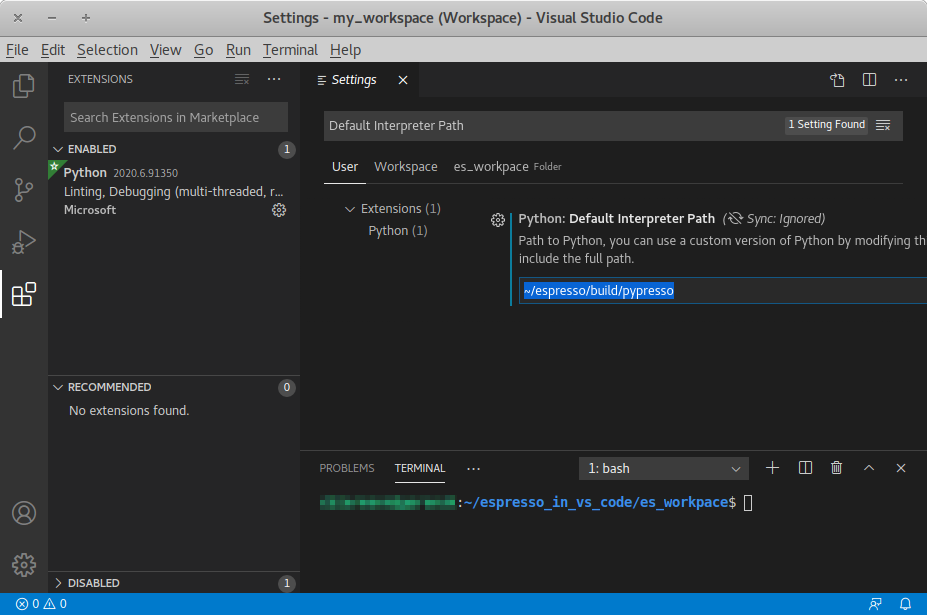

.. _Running a simulation:

Running a simulation
====================

|es| is implemented as a Python module. This means that you need to write a
python script for any task you want to perform with |es|. In this chapter,
the basic structure of the interface will be explained. For a practical
introduction, see the tutorials, which are also part of the
distribution.

.. _Running es:

Running |es|
------------

Running a script
~~~~~~~~~~~~~~~~

To use |es|, you need to import the ``espressomd`` module in your
Python script. To this end, the folder containing the python module
needs to be in the Python search path. The module is located in the
:file:`src/python` folder under the build directory.

A convenient way to run Python with the correct path is to use the
``pypresso`` script located in the build directory:

.. code-block:: bash

    ./pypresso simulation.py

The ``pypresso`` script is just a wrapper in order to expose the |es| python
module to the system's Python interpreter by modifying the ``$PYTHONPATH``.
If you have installed |es| from a Linux package manager that doesn't provide
the ``pypresso`` script, you will need to modify the ``$PYTHONPATH`` and
possibly the ``$LD_LIBRARY_PATH`` too, depending on which symbols are missing.

The next chapter, :ref:`Setting up the system`, will explain in more details
how to write a simulation script for |es|. If you don't have any script,
simply call one of the files listed in section :ref:`Sample scripts`.

Using the console
~~~~~~~~~~~~~~~~~

Since |es| can be manipulated like any other Python module, it is possible
to interact with it in a Python interpreter. Simply run the ``pypresso``
script without arguments to start a Python session:

.. code-block:: bash

    ./pypresso

Likewise, a Jupyter console can be started with the ``ipypresso`` script,
which is also located in the build directory:

.. code-block:: bash

    ./ipypresso console

The name comes from the IPython interpreter, today known as Jupyter.

Interactive notebooks
~~~~~~~~~~~~~~~~~~~~~

Tutorials are available as notebooks, i.e. they consist of a ``.ipynb``
file which contains both the source code and the corresponding explanations.
They can be viewed, changed and run interactively. To generate the tutorials
in the build folder, do:

.. code-block:: bash

    make tutorials

The tutorials contain solutions hidden with the ``exercise2`` NB extension.
Since this extension is only available for Jupyter Notebook, JupyterLab
users need to convert the tutorials:

.. code-block:: bash

    for f in doc/tutorials/*/*.ipynb; do
      ./pypresso doc/tutorials/convert.py exercise2 --to-jupyterlab ${f}
    done

Likewise, VS Code Jupyter users need to convert the tutorials:

.. code-block:: bash

    for f in doc/tutorials/*/*.ipynb; do
      ./pypresso doc/tutorials/convert.py exercise2 --to-vscode-jupyter ${f}
    done

To interact with notebooks, move to the directory containing the tutorials
and call the ``ipypresso`` script to start a local Jupyter session.

For Jupyter Notebook and IPython users:

.. code-block:: bash

    cd doc/tutorials
    ../../ipypresso notebook

For JupyterLab users:

.. code-block:: bash

    cd doc/tutorials
    ../../ipypresso lab

For VS Code Jupyter users, no action is needed if ``pypresso`` was set as
the interpreter path (see details in :ref:`Running inside an IDE`).

You may then browse through the different tutorial folders. Files whose name
ends with extension ``.ipynb`` can be opened in the browser. Click on the Run
button to execute the current block, or use the keyboard shortcut Shift+Enter.
If the current block is a code block, the ``In [ ]`` label to the left will
change to ``In [*]`` while the code is being executed, and become ``In [1]``
once the execution has completed. The number increments itself every time a
code cell is executed. This bookkeeping is extremely useful when modifying
previous code cells, as it shows which cells are out-of-date. It's also
possible to run all cells by clicking on the "Run" drop-down menu, then on
"Run All Below". This will change all labels to ``In [*]`` to show that the
first one is running, while the subsequent ones are awaiting execution.

You'll also see that many cells generate an output. When the output becomes
very long, Jupyter will automatically put it in a box with a vertical scrollbar.
The output may also contain static plots, dynamic plots and videos. It is also
possible to start a 3D visualizer in a new window, however closing the window
will exit the Python interpreter and Jupyter will notify you that the current
Python kernel stopped. If a cell takes too long to execute, you may interrupt
it with the stop button.

Solutions cells are created using the ``exercise2`` plugin from nbextensions.
To prevent solution code cells from running when clicking on "Run All", these
code cells need to be converted to Markdown cells and fenced with `````python``
and ```````.

To close the Jupyter session, go to the terminal where it was started and use
the keyboard shortcut Ctrl+C twice.

When starting a Jupyter session, you may see the following warning in the
terminal:

.. code-block:: none

    [TerminalIPythonApp] WARNING | Subcommand `ipython notebook` is deprecated and will be removed in future versions.
    [TerminalIPythonApp] WARNING | You likely want to use `jupyter notebook` in the future

This only means |es| was compiled with IPython instead of Jupyter. If Jupyter
is installed on your system, the notebook will automatically close IPython and
start Jupyter. To recompile |es| with Jupyter, provide ``cmake`` with the flag
``-D IPYTHON_EXECUTABLE=$(which jupyter)``.

You can find the official Jupyter documentation at
https://jupyter.readthedocs.io/en/latest/running.html

.. _Running inside an IDE:

Running inside an IDE
~~~~~~~~~~~~~~~~~~~~~

You can use an integrated development environment (IDE) to develop and run |es|
scripts. Suitable IDEs are e.g. *Visual Studio Code* and *Spyder*. They can
provide a workflow superior to that of a standard text editor as they offer
useful features such as advanced code completion, debugging and analysis tools
etc. The following example shows how to setup |es| in *Visual Studio Code* on
Linux (tested with version 1.46.1). The process should be similar for every
Python IDE, namely the Python interpreter needs to be replaced.

The ``pypresso`` executable can be set as a custom Python interpreter inside VS
Code. |es| scripts can then be executed just like any other python script.
Inside VS Code, the Python extension needs to be installed. Next, click the
gear at the bottom left and choose *Settings*. Search for
``Default Interpreter Path`` and change the setting to the path to your
``pypresso`` executable, e.g.

.. code-block:: none

    ~/espresso/build/pypresso

After that, you can open scripts and execute them with the keyboard shortcut
Ctrl+F5.

Fig. :ref:`vs-code-figure` shows the VS Code interface with the interpreter
path set to ``pypresso``.

.. note:: You may need to set the path relative to your home directory, i.e. ``~/path/to/pypresso``.

.. _vs-code-figure:



   Visual Studio Code interface

.. _Running in the cloud:

Running in the cloud
~~~~~~~~~~~~~~~~~~~~

A `Gitpod <https://gitpod.io>`__ config file is provided to automatically
build |es| in its default configuration (`direct link
<https://gitpod.io/#https://github.com/espressomd/espresso>`__), which is
sufficient to run most tutorials. The Gitpod workspace can be accessed from
the `terminal via SSH <https://www.gitpod.io/docs/configure/ssh>`__ or from
a `web browser <https://www.gitpod.io/docs/configure/browser-settings>`__,
which uses the VS Code IDE.

To execute the tutorials, choose a Jupyter backend:

* VS Code Jupyter: navigate to ``ESPRESSO/build/doc/tutorials`` in the
  project tree and open the notebook files; if the kernel drop-down menu
  doesn't offer ``build/pypresso`` as a kernel, restart the VS Code IDE:
  quit the workspace by closing the browser tab, re-open the tab and
  click ``espressomd-espresso-...`` in the popup to restart the IDE
  (don't click on the green button "New Workspace")

* Jupyter Notebook:

  .. code-block:: bash

      cd ${GITPOD_REPO_ROOT}/build/doc/tutorials
      ../../ipypresso notebook --NotebookApp.allow_origin="$(gp url 8888)" \
          --port=8888 --no-browser

* JupyterLab:

  .. code-block:: bash

      cd ${GITPOD_REPO_ROOT}/build/doc/tutorials
      ../../ipypresso lab --NotebookApp.allow_origin="$(gp url 8888)" \
          --port=8888 --no-browser

For both Jupyter Notebook and JupyterLab, a notification will appear and say
that a new port 8888 has been made available. Click the orange "Make public"
button to open that port and then Ctrl+click one of the urls in the terminal
output to open the Jupyter backed in a pop-up window.

To start a workspace from a specific branch, use a link in the following form:
``https://gitpod.io/#https://github.com/user_name/espresso/tree/branch_name``,
where ``user_name`` and ``branch_name`` need to be adapted.


.. _Debugging es:

Debugging |es|
--------------

Exceptional situations occur in every program.  If |es| crashes with a
segmentation fault, that means that there was a memory fault in the
simulation core which requires running the program in a debugger.  The
``pypresso`` executable file is actually not a program but a script
which sets the Python path appropriately and starts the Python
interpreter with your arguments.  Thus it is not possible to directly
run ``pypresso`` in a debugger.  However, we provide some useful
command line options for the most common tools.

.. code-block:: bash

     ./pypresso --tool <args>

where ``--tool`` can be any tool from the :ref:`table below <Debugging es with tools>`.
Only one tool can be used at a time. Some tools benefit from specific build
options, as outlined in the installation section :ref:`Troubleshooting`.
|es| can be debugged in MPI environments, as outlined in section
:ref:`Debugging parallel code`.

.. _Debugging es with tools:

.. table:: Tools for the Python wrapper to |es|.

    +---------------------+----------------------------------------------+
    | Tool                | Effect                                       |
    +=====================+==============================================+
    | ``--gdb``           | ``gdb --args python <args>``                 |
    +---------------------+----------------------------------------------+
    | ``--lldb``          | ``lldb -- python <args>``                    |
    +---------------------+----------------------------------------------+
    | ``--valgrind``      | ``valgrind --leak-check=full python <args>`` |
    +---------------------+----------------------------------------------+
    | ``--cuda-gdb``      | ``cuda-gdb --args python <args>``            |
    +---------------------+----------------------------------------------+
    | ``--cuda-memcheck`` | ``cuda-memcheck python <args>``              |
    +---------------------+----------------------------------------------+


.. _Parallel computing:

Parallel computing
------------------

Many algorithms in |es| are designed to work with multiple MPI ranks.
However, not all algorithms benefit from MPI parallelization equally.
Several algorithms only use MPI rank 0 (e.g. :ref:`Reaction methods`).
|es| should work with most MPI implementations on the market;
see the :term:`MPI installation requirements <MPI>` for details.

.. _General syntax:

General syntax
~~~~~~~~~~~~~~

To run a simulation on several MPI ranks, for example 4, simply invoke
the ``pypresso`` script with the following syntax:

.. code-block:: bash

    mpiexec -n 4 ./pypresso simulation.py

The cell system is automatically split among the MPI ranks, and data
is automatically gathered on the main rank, which means a regular |es|
script can be executed in an MPI environment out-of-the-box. The number
of MPI ranks can be accessed via the system ``n_nodes`` state property.
The simulation box partition is controlled by the cell system
:attr:`~espressomd.cell_system.CellSystem.node_grid` property.
By default, MPI ranks are assigned in decreasing order, e.g. on 6 MPI ranks
``node_grid`` is ``[3, 2, 1]``. It is possible to re-assign the ranks by
changing the value of the ``node_grid`` property, however a few algorithms
(such as FFT-based electrostatic methods) only work for the default
partitioning scheme where values must be arranged in decreasing order.

::

    # get the number of ranks
    print(system.cell_system.get_state()["n_nodes"])
    # re-assign the ranks
    system.cell_system.node_grid = [2, 1, 3]
    system.cell_system.node_grid = [6, 1, 1]

There are alternative ways to invoke MPI on ``pypresso``, but they share
similar options. The number after the ``-n`` option is the number of ranks,
which needs to be inferior or equal to the number of *physical* cores on the
workstation. Command ``nproc`` displays the number of *logical* cores on the
workstation. For architectures that support hyperthreading, the number of
logical cores is an integer multiple of the number of physical cores,
usually 2. Therefore on a hyperthreaded workstation with 32 cores,
at most 16 cores can be used without major performance loss, unless
extra arguments are passed to the ``mpiexec`` program.

On cluster computers, it might be necessary to load the MPI library with
``module load openmpi`` or similar.

.. _Performance gain:

Performance gain
~~~~~~~~~~~~~~~~

Simulations executed in parallel with run faster, however the runtime
won't decrease linearly with the number of MPI ranks. MPI-parallel
simulations introduce several sources of overhead and latency:

* overhead of serializing, communicating and deserializing data structures
* extra calculations in the LB halo
* extra calculations in the ghost shell
  (see section :ref:`Internal particle organization` for more details)
* latency due to blocking communication (i.e. a node remains idle
  while waiting for a message from another node)
* latency due to blocking data collection for GPU
  (only relevant for GPU methods)
* latency due to context switching
* latency due to memory bandwidth

While good performance can be achieved up to 32 MPI ranks, allocating more
than 32 ranks to a simulation will not always lead to significantly improved
run times. The performance gain is highly sensitive to the algorithms used
by the simulation, for example GPU methods rarely benefit from more than
8 MPI ranks. Performance is also affected by the number of features enabled
at compile time, even when these features are not used by the simulation;
do not hesitate to remove all features not required by the
simulation script and rebuild |es| for optimal performance.

Benchmarking is often the best way to determine the optimal number of MPI
ranks for a given simulation setup. Please refer to the wiki chapter on
`benchmarking <https://github.com/espressomd/espresso/wiki/Development#Benchmarking>`__
for more details.

Runtime speed-up is not the only appeal of MPI parallelization. Another
benefit is the possibility to distribute a calculation over multiple
compute nodes in clusters and high-performance environments, and therefore
split the data structures over multiple machines. This becomes necessary
when running simulations with millions of particles, as the memory
available on a single compute node would otherwise saturate.

.. _Communication model:

Communication model
~~~~~~~~~~~~~~~~~~~

|es| was originally designed for the "flat" model of communication:
each MPI rank binds to a logical CPU core. This communication model
doesn't fully leverage shared memory on recent CPUs, such as `NUMA
architectures <https://en.wikipedia.org/wiki/Non-uniform_memory_access>`__,
and |es| currently doesn't support the hybrid
MPI+\ `OpenMP <https://www.openmp.org>`__ programming model.

The MPI+CUDA programming model is supported, although only one GPU can be
used for the entire simulation. As a result, a blocking *gather* operation
is carried out to collect data from all ranks to the main rank, and a
blocking *scatter* operation is carried out to transfer the result of the
GPU calculation from the main rank back to all ranks. This latency limits
GPU-acceleration to simulations running on fewer than 8 MPI ranks.
For more details, see section :ref:`GPU acceleration`.

.. _The MPI callbacks framework:

The MPI callbacks framework
"""""""""""""""""""""""""""

When starting a simulation with :math:`n` MPI ranks, |es| will internally
use MPI rank :math:`0` as the head node (also referred to as the "main rank")
and MPI ranks :math:`1` to :math:`n-1` as worker nodes. The Python interface
interacts only with the head node, and the head node forwards the information
to the worker nodes.

To put it another way, all worker nodes are idle until the user calls
a function that is designed to run in parallel,
in which case the head node calls the corresponding core function
and sends a request on the worker nodes to call the same core function.
The request can be a simple collective call, or a collective call with a
reduction if the function returns a value. The reduction can either:

- combine the :math:`n` results via a mathematical operation
  (usually a summation or a multiplication)
- discard the result of the :math:`n-1` worker nodes; this is done when
  all ranks return the same value, or when the calculation can only be
  carried out on the main rank but requires data from the other ranks
- return the result of one rank when the calculation can only be carried out
  by a specific rank; this is achieved by returning an *optional*, which
  contains a value on the rank that has access to the information necessary
  to carry out the calculation, while the other :math:`n-1` ranks return
  an empty optional

For more details on this framework, please refer to the Doxygen documentation
of the the C++ core file :file:`MpiCallbacks.hpp`.

.. _Debugging parallel code:

Debugging parallel code
~~~~~~~~~~~~~~~~~~~~~~~

It is possible to debug an MPI-parallel simulation script with GDB.
Keep in mind that contrary to a textbook example MPI application, where
all ranks execute the ``main`` function, in |es| the worker nodes are idle
until the head node on MPI rank 0 delegates work to them. This means that
on MPI rank > 1, break points will only have an effect in code that can be
reached from a callback function whose pointer has been registered in the
:ref:`MPI callbacks framework <The MPI callbacks framework>`.

The following command runs a script with 2 MPI ranks and binds a terminal
to each rank:

.. code-block:: bash

    mpiexec -np 2 xterm -fa 'Monospace' -fs 12 -e ./pypresso --gdb simulation.py

It can also be done via ssh with X-window forwarding:

.. code-block:: bash

    ssh -X username@hostname
    mpiexec -n 2 -x DISPLAY="${DISPLAY}" xterm -fa 'Monospace' -fs 12 \
        -e ./pypresso --gdb simulation.py

The same syntax is used for C++ unit tests:

.. code-block:: bash

    mpiexec -np 2 xterm -fa 'Monospace' -fs 12 \
        -e gdb src/core/unit_tests/EspressoSystemStandAlone_test


.. _GPU acceleration:

GPU acceleration
----------------

.. _CUDA acceleration:

CUDA acceleration
~~~~~~~~~~~~~~~~~

.. note::
    Feature ``CUDA`` required

|es| is capable of delegating work to the GPU to speed up simulations.
Not every simulation method profits from GPU acceleration.
Refer to :ref:`Available simulation methods`
to check whether your desired method can be used on the GPU.
In order to use GPU acceleration you need a NVIDIA GPU
and it needs to have at least compute capability 2.0.
For more details, please refer to the installation section
:ref:`Nvidia GPU acceleration`.

For more information please check :class:`espressomd.cuda_init.CudaInitHandle`.

.. _List available devices:

List available devices
""""""""""""""""""""""

To list available CUDA devices, call
:meth:`espressomd.cuda_init.CudaInitHandle.list_devices`::

    >>> import espressomd
    >>> system = espressomd.System(box_l=[1, 1, 1])
    >>> print(system.cuda_init_handle.list_devices())
    {0: 'GeForce RTX 2080', 1: 'GeForce GT 730'}

This method returns a dictionary containing
the device id as key and the device name as its value.

To get more details on the CUDA devices for each MPI node, call
:meth:`espressomd.cuda_init.CudaInitHandle.list_devices_properties`::

    >>> import pprint
    >>> import espressomd
    >>> system = espressomd.System(box_l=[1, 1, 1])
    >>> pprint.pprint(system.cuda_init_handle.list_devices_properties())
    {'seraue': {0: {'name': 'GeForce RTX 2080',
                    'compute_capability': (7, 5),
                    'cores': 46,
                    'total_memory': 8370061312},
                1: {'name': 'GeForce GT 730',
                    'compute_capability': (3, 5),
                    'cores': 2,
                    'total_memory': 1014104064}}}

.. _Select a device:

Select a device
"""""""""""""""

When you start ``pypresso``, the first GPU should be selected.
If you wanted to use the second GPU, this can be done
by setting :attr:`espressomd.cuda_init.CudaInitHandle.device` as follows::

    >>> import espressomd
    >>> system = espressomd.System(box_l=[1, 1, 1])
    >>> system.cuda_init_handle.device = 1

Setting a device id outside the valid range or a device
which does not meet the minimum requirements will raise
an exception.
